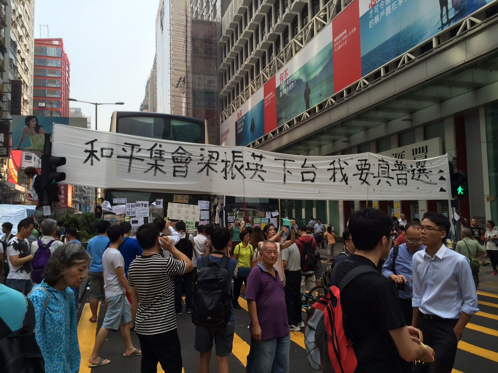
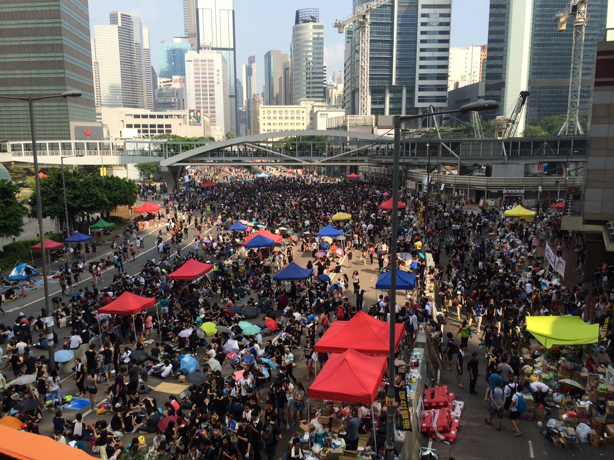
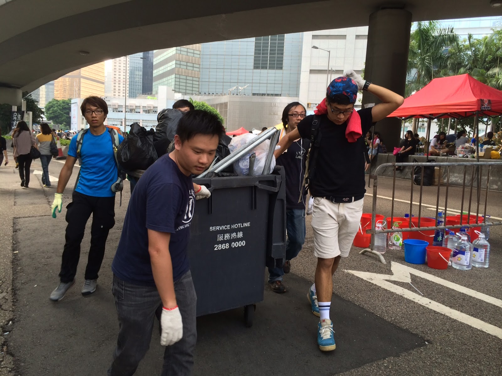
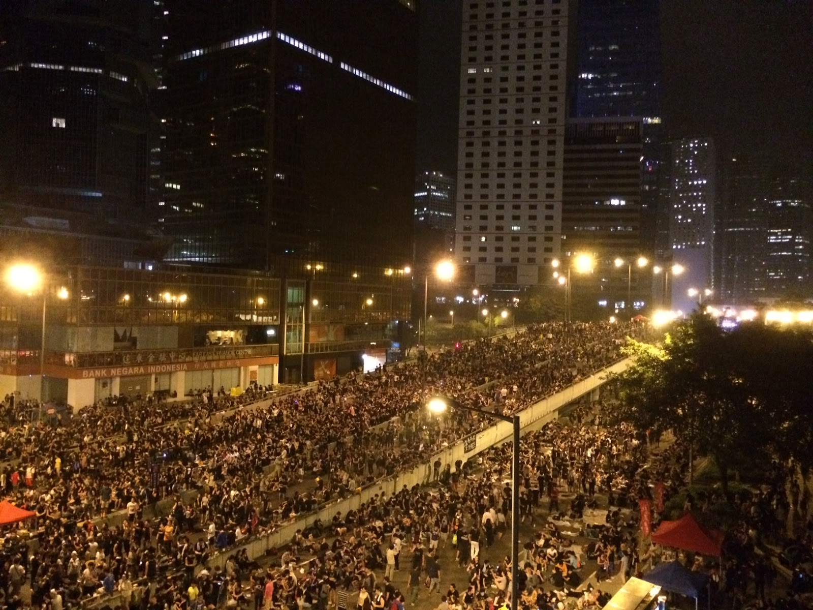
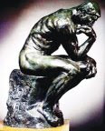

<meta content="text/html; charset=UTF-8" http-equiv="Content-Type">

<h1 class="post-title entry-title">
<a href="2014/10/weekly-share-74.md">每周转载：香港占中民主运动的外媒报道和【大量】照片（9-29至10-2）</a>
</h1>

<b style="font-size:120%;">文章目录</b>
<a href="#head-1">★背景知识</a> <a href="#head-2">★9.29（周一）——占中第2天</a> <a href="#head-3">★9.30（周二）——占中第3天</a> <a href="#head-4">★10.1（周三）——大陆沦陷日，占中第4天</a> <a href="#head-5">★10.2（周四）——占中第5天</a> 

　　由于照片太多，昨天先转载了<a href="2014/10/weekly-share-73.md">“09-22到09-28”的外媒报道和照片</a>。今天再发一篇涵盖“09-29到10-02”这个时间段。 
　　本文引用的照片，大都来自权威的境外媒体（为了尊重照片作者，都注明了引用链接）；还有少数照片是俺在网上搜的，不清楚原始出处。如果有人发现俺转载的照片侵犯其版权，欢迎到本文留言告知。谢谢！<!--program-think--> 
 
<h2>★背景知识</h2> 
　　和昨天一样，先放上相关的维基词条。不太清楚此次运动的网友，可以先了解一下相关的背景。 
 
<a href="https://zh.wikipedia.org/wiki/%E9%A6%99%E6%B8%AF%E7%89%B9%E5%88%A5%E8%A1%8C%E6%94%BF%E5%8D%80%E5%9F%BA%E6%9C%AC%E6%B3%95" target="_blank" rel="nofollow">香港特别行政区基本法 @ 维基百科</a> 
 
<a href="https://zh.wikipedia.org/wiki/%E9%A6%99%E6%B8%AF%E9%81%B8%E8%88%89%E5%88%B6%E5%BA%A6" target="_blank" rel="nofollow">香港选举制度 @ 维基百科</a> 
 
<a href="https://zh.wikipedia.org/wiki/2016%E5%B9%B4%E5%8F%8A2017%E5%B9%B4%E9%A6%99%E6%B8%AF%E6%94%BF%E6%B2%BB%E5%88%B6%E5%BA%A6%E6%94%B9%E9%9D%A9" target="_blank" rel="nofollow">2016年及2017年香港政治制度改革 @ 维基百科</a> 
 
<a href="https://zh.wikipedia.org/wiki/%E4%BD%94%E9%A0%98%E4%B8%AD%E7%92%B0" target="_blank" rel="nofollow">和平占领中环运动/占中运动 @ 维基百科</a> 
 
<a href="https://zh.wikipedia.org/wiki/622%E5%85%A8%E6%B0%91%E6%8A%95%E7%A5%A8" target="_blank" rel="nofollow">6-22 民间全民公投 @ 维基百科</a> 
 
<a href="https://zh.wikipedia.org/wiki/2014%E5%B9%B4%E9%A6%99%E6%B8%AF%E5%AD%B8%E7%95%8C%E5%A4%A7%E7%BD%B7%E8%AA%B2" target="_blank" rel="nofollow">9-22 学界大罢课 @ 维基百科</a> 
 
<a href="https://zh.wikipedia.org/wiki/%E9%9B%A8%E5%82%98%E9%9D%A9%E5%91%BD" target="_blank" rel="nofollow">雨伞革命/遮打革命/Umbrella Revolution @ 维基百科</a> 
 
<a href="https://zh.wikipedia.org/wiki/%E7%9C%9F%E6%99%AE%E9%81%B8%E8%81%AF%E7%9B%9F" target="_blank" rel="nofollow">真普选联盟/真普联 @ 维基百科</a> 
 
<a href="https://zh.wikipedia.org/wiki/%E9%A6%99%E6%B8%AF%E5%B0%88%E4%B8%8A%E5%AD%B8%E7%94%9F%E8%81%AF%E6%9C%83" target="_blank" rel="nofollow">香港学联 @ 维基百科</a> 
 
<a href="https://zh.wikipedia.org/wiki/%E5%AD%B8%E6%B0%91%E6%80%9D%E6%BD%AE" target="_blank" rel="nofollow">学民思潮 @ 维基百科</a> 
 
<h2>★9.29（周一）——占中第2天</h2> 
<b>由于前一天警方使用了催泪弹，激起公愤。第二天有更多香港市民上街抗议。 
尤其是当日夜间的集会场面很壮观。</b> 
 
<h3>◇《纽约时报》的报道和照片（洋文）</h3> 
以下照片转载自——<a href="http://www.nytimes.com/2014/09/30/world/asia/the-hong-kong-protests-what-you-should-know.md" target="_blank" rel="nofollow">Protests in Hong Kong Have Roots in China’s ‘Two Systems’ @ NYTimes</a> 
（编程随想注：这批照片的尺寸太大，考虑到大伙儿的翻墙流量不高，缩小一半放上来） 
 

 

 

 

 

 

 
<h3>◇德国之声的报道和照片</h3> 
以下照片转载自——<a href="http://www.dw.de/g-17961291" target="_blank" rel="nofollow">“占中”第二天</a> 
 

香港示威者周一继续其“占中”行动，成千上万的示威者不仅封锁了香港岛中心的金融区交通要道，抗议行动也扩展至了对面的九龙半岛。 
 

占中运动已经蔓延至旺角及铜锣湾，造成主要道路出现堵塞。 
 

为了表达抗议之情，香港金钟海富中心一处悬挂的中国国旗被人倒挂。 
 

集会现场 
 

有人在脸书上发起号召：在接下来的10月1日为香港佩戴黄丝带，支持香港争取真普选的活动 
（佩戴黄丝带代表香港人对普选的和平追求） 
 

街头的警察 
 
<a href="http://www.dw.de/a-17964321" target="_blank" rel="nofollow">胡椒喷雾取代真正的民主 @ 德国之声</a> 

 
<a href="http://www.dw.de/a-17961070" target="_blank" rel="nofollow">郑宇硕：我们不甘心作顺民 @ 德国之声</a> 

 
<h3>◇《芝加哥论坛报》的报道和照片</h3> 
以下照片转载自——<a href="http://www.chicagotribune.com/news/nationworld/chi-hong-kong-protests-20141002-story.md" target="_blank" rel="nofollow">Hong Kong leader refuses to resign but offers talks with protesters @ Chicago Tribune</a> 
（编程随想注：这篇报道有超过50张照片，俺挑选了其中一部分【可能是】29日夜间集会相关的照片） 
 

 

 

 

 

 
<h3>◇美国之音的报道和照片</h3> 
<a href="http://www.voachinese.com/content/us-media-hongkong-20140929/2466601.md" target="_blank" rel="nofollow">美国媒体看香港“占中” @ 美国之音/VOA</a> 

 
<a href="http://www.voachinese.com/content/media-watch-hk-protest-and-mainland-reaction-20140929/2466039.md" target="_blank" rel="nofollow">媒体观察——公民抗命，香港暴热，大陆冰冷 @ 美国之音/VOA</a> 

 
<a href="http://www.voachinese.com/media/video/voaweishi-20140929-voaconnects-haiyan/2465901.md" target="_blank" rel="nofollow">（视频）现场直击：香港占中扩大，群众集结各地 @ 美国之音/VOA</a> 
 
<h3>◇其它外媒报道</h3> 
<a href="http://cn.wsj.com/gb/20140929/bch075501.asp" target="_blank" rel="nofollow">香港抗议人群扩大 防暴警察撤离 @ 华尔街日报/WSJ</a> 

（周一，抗议人群堵塞了香港市中心的一条主干道） 
 
<a href="http://www.dw.de/a-17963686" target="_blank" rel="nofollow">香港占中——大卫与歌利亚之战 @ 德国之声</a> 
 
<a href="http://www.dw.de/a-17963798" target="_blank" rel="nofollow">面对香港占中的集体沉默 @ 德国之声</a> 
 
<a href="http://cn.wsj.com/gb/20140929/rlw172859.asp" target="_blank" rel="nofollow">香港动荡之际 Instagram内地服务中断 @ 华尔街日报/WSJ</a> 
 
<a href="http://www.chinese.rfi.fr/%E4%B8%AD%E5%9B%BD/20140929-%E9%A6%99%E6%B8%AF%E9%80%80%E4%BC%91%E8%AD%A6%E5%AF%9F%E6%95%A6%E4%BF%83%E6%89%A7%E5%8B%A4%E8%AD%A6%E5%AF%9F%E4%B8%8D%E8%A6%81%E6%8A%8A%E6%9E%AA%E5%8F%A3%E5%AF%B9%E5%87%86%E7%A4%BA%E5%A8%81%E6%B0%91%E4%BC%97" target="_blank" rel="nofollow">香港退休警察敦促执勤警察不要把枪口对准示威民众 @ 法广/RFI</a> 
 
<a href="http://cn.wsj.com/gb/20140929/rlw112805.asp" target="_blank" rel="nofollow">香港抗议活动受到台湾民众支持 @ 华尔街日报/WSJ</a> 
 
<h3>◇其它网络上找来的照片</h3> 

当晚在香港政府总部外的群众 
 

黑暗中的光点是民众挥舞手机当手电筒，表达民众诉求的照片 
 

同上 
 

同上 
 

标语中写着 Beyond 的歌词：风雨中抱紧自由 
 

示威民众高举特首梁振英的魔鬼面具 
 
<h2>★9.30（周二）——占中第3天</h2> 
<b>香港占领中环行动9月30日进入第三天，行动由金钟政总外一带，蔓延至铜锣湾、旺角等地方。 
各区估计有五千至数万名市民聚集。大批市民自发带备物资到集会场地。 
当日晚间下起暴雨，民众在风雨中坚守，正应了 Beyond《光辉岁月》的歌词——风雨中抱紧自由</b> 
 
<h3>◇德国之声的报道和照片</h3> 
以下照片转载自——<a href="http://www.dw.de/g-17965309" target="_blank" rel="nofollow">图说占中第三天 @ 德国之声</a> 
 

部分示威者构筑街垒，并囤积食物和饮水，为未来数天做准备。 
 

香港特首梁振英表示，“定调占中无法逼中央就范”，要求香港市民做好长期应对的心理准备。 
 

香港大学所做最新民调显示，特首梁振英最新评分为43.2，继续低于45分的警戒线。 
 

除了黄丝带之外，雨伞也成为香港抗议活动中的主要标志。 
 
<h3>◇自由亚洲电台的报道和照片</h3> 
以下照片转载自——<a href="http://www.rfa.org/mandarin/yataibaodao/gangtai/xl1-09302014103849.md" target="_blank" rel="nofollow">占中第三日 “三罢”持续 “十一”将迎来抗命高潮 @ 自由亚洲电台/RFA</a> 
 

通往政府总部的天桥挂满条幅标语 
 

旺角集会现场 
标语上写着：和平集会 梁振英下台 我要真普选 
 

金钟集会现场 
人潮已经由演艺学院的高速公路蔓延至中环。现场有广播呼吁，周三是国庆节，要提高警惕 
 

集会市民自发清理垃圾 
 

集会现场的夜景 
 
<h3>◇其它外媒报道</h3> 
<a href="http://www.chinese.rfi.fr/%E4%B8%AD%E5%9B%BD/20141001-%E5%8D%A0%E4%B8%AD%E7%AC%AC%E4%B8%89%E5%A4%A9%EF%BC%9A%E4%B9%A0%E6%80%BB%E7%A7%B0%E4%B8%80%E5%9B%BD%E4%B8%A4%E5%88%B6%E4%B8%8D%E5%8F%98%E3%80%81%E5%AD%A6%E7%94%9F%E6%9A%B4%E9%9B%A8%E4%B8%8B%E4%B8%8D%E6%92%A4%E3%80%81%E6%A2%81%E6%8C%AF%E8%8B%B1%E4%B8%8D%E9%80%80%E3%80%81%E6%B2%AA%E7%90%BC%E6%97%85%E6%B8%AF%E5%9B%A2%E4%B8%8D%E5%8A%9E" target="_blank" rel="nofollow">占中第三天：习总称一国两制不变、学生暴雨下不撤、梁振英不退、沪琼旅港团不办 @ 法广/RFI</a> 

（30日夜间，香港占中示威者冒着大雨坚守阵地） 
 
<a href="http://cn.nytimes.com/china/20140930/c30block/" target="_blank" rel="nofollow">中国官方对香港“占中”报道严加管控 @ 纽约时报</a> 
 
<a href="http://www.voachinese.com/content/hk-protest-echoed-in-china-20140930/2467597.md" target="_blank" rel="nofollow">大陆人士挺港遭禁 习近平面临抉择关口 @ 美国之音/VOA</a> 
 
<a href="http://minzhuzhongguo.org/ArtShow.aspx?AID=45141" target="_blank" rel="nofollow">香港占领中环第三天：民众雨中坚守 @ 民主中国</a> 

（暴雨降临金钟“占领区”，市民们纷纷举起了雨伞，并未离开） 
 
<a href="http://cn.nytimes.com/china/20140930/c30beijing/" target="_blank" rel="nofollow">香港民主示威对习近平构成挑战 @ 纽约时报</a> 
 
<a href="http://cn.nytimes.com/china/20140930/c30firechat/" target="_blank" rel="nofollow">香港示威 令FireChat走红 @ 纽约时报</a> 
 
<a href="http://www.chinese.rfi.fr/%E6%94%BF%E6%B2%BB/20140930-%E7%94%B7%E5%AD%90%E6%B7%B1%E5%A4%9C%E9%A3%9E%E8%BD%A6%E5%86%B2%E5%85%A5%E6%97%BA%E8%A7%92%E5%8D%A0%E4%B8%AD%E4%BA%BA%E7%BE%A4%E5%B9%B8%E6%97%A0%E4%BA%BA%E4%BC%A4" target="_blank" rel="nofollow">男子深夜飞车 冲入旺角占中人群 幸无人伤 @ 法广/RFI</a> 
（有人怀疑这名男子驾车冲入示威人群，受到幕后指使） 
 
<h3>◇其它网络上找来的照片</h3> 

人们举起横幅要求梁振英下台，寻求真普选。 
（编程随想注：这个横幅，前面的照片有出现过） 
 

当日香港有暴雨，示威民众做好防雨准备，大批市民自发带同樽装水、食物、口罩等物资到场声援。 
 

傍晚下起雨，人们在雨中继续抗议。 
 

市民继续在街头聚集，秩序大致良好。 
 

旺角街头的某车的车牌——pk689——pk是港语粗话，689是梁振英当选特首的选票。 
 

在旺角购物区一辆公共汽车上贴的小纸条。大部分是要求梁振英下台、争取普选。 
 

同上，贴了多张“689下台”的标签 
 

数十名香港大学医学院学生组成急救站，协助有医疗需要的示威人士； 
亦有人送上食物表示支持，数十名学生充当义工，维持秩序，又不停向集会人士洒水降温。 
 

当日傍晚下起雨，人们在雨中整理杂物。 
 
<h2>★10.1（周三）——大陆沦陷日，占中第4天</h2> 
<b>这天是咱们天朝的沦陷日（1949年，大陆沦陷于共产运动之手）。 
按照惯例，党国各级衙门都会搞点庆祝活动，97后的香港也不例外。 
但是今年发生了如此大规模的民众抗议活动，香港当地衙门不得不取消了“燃放烟花活动”。 
貌似这也是97之后的头一遭，梁书记肯定很生气。</b> 
 
<h3>◇德国之声的报道和照片</h3> 
<a href="http://www.dw.de/a-17966983" target="_blank" rel="nofollow">“和平占中”进入第四天 @ 德国之声</a> 

十一那天，旺角某十字路口的“占中”集会 
 
以下照片转载自——<a href="http://www.dw.de/g-17967417" target="_blank" rel="nofollow">十一国庆日 香港占中继续 @ 德国之声</a> 
 

占中示威民众彻夜冒雨守候在金紫荆广场前，等待清晨的升旗仪式。 
按照传统，每年港府都会在10月1日举行升国旗、升区旗仪式。 
 

升旗仪式现场，示威民众静默举牌撑伞抗议。 
 

而当直升机悬挂着国旗飞越示威人群与严阵以待的警察时，示威者中发出了阵阵嘘声。 
 

当国旗升到杆顶时，许多占中示威者都转身背对国旗，并以双手做出交叉手势。 
 

在香港大街上，占中示威者将抗议行动扩大至九龙半岛的商业购物区尖沙咀。 
示威者的一大诉求，便是要求特首梁振英下台。 
 

不过街头的人群中也不只是激进人士。这名学生，呼吁各方保持冷静。 
 

街头同样也有亲北京的民众在示威，这导致了与占中示威者之间的言语冲突。 
图中这名支持民主派的示威民众正在痛斥对面的亲北京人士。 
 

不少占中示威民众，则象前些天一样，继续清理街头留下的垃圾，保持场地整洁。 
 
<h3>◇《每日邮报》的报道和照片（洋文）</h3> 
以下照片转载自——<a href="http://www.dailymail.co.uk/news/article-2775508/Lightning-rain-fail-deter-resolute-Hong-Kong-protesters.md" target="_blank" rel="nofollow">Hong Kong protesters threaten to occupy government buildings amid China hack fears @ Daily Mail Online</a> 
 

这张是在香港政府总部外的集会 
 

同上 
 

上万人在夜晚的街道上挥舞闪亮的手机 
 

同上 
 

劳工抗命 
 

香港民众制作的标语牌，要求以梁书记为首的四人帮下台 
 

“我爱香港”的标语牌 
 

写在马路上的标语——【公民不服从】 
 

烛光之夜 
 

抗议者占领了通往尖沙咀的主干道 
 

在旺角集会的民众 
 

同上 
 

一个女学生呼吁民众在公告板上写下自己的诉求 
 

公告牌上的贴纸 
 

同上 
 

天桥上的横幅标语 
 

举牌的女学生（前面出现过） 
 

带上儿子上街抗议 
 

天气太热，洒水降温 
 
<h3>◇大陆、台湾及西方国家华人的声援</h3> 
以下照片转载自——<a href="http://boxun.com/news/gb/china/2014/10/201410010004.shtml" target="_blank" rel="nofollow">在京访民60余人自发相聚公开声援香港占中 @ 博讯网</a> 
 

 

 
<a href="http://www.bbc.co.uk/zhongwen/simp/china/2014/10/141001_tw_hk_protest" target="_blank" rel="nofollow">台湾举办晚会支持香港“占中”抗议 @ BBC</a> 
 
以下照片转载自——<a href="http://taiwanjustice.com/%E5%8F%B0%E5%8C%97%E8%90%AC%E4%BA%BA%E6%92%90%E9%A6%99%E6%B8%AF%E3%80%80%E6%9E%97%E9%A3%9B%E5%B8%86%EF%BC%9A%E9%80%99%E5%A0%B4%E4%BB%97%E6%B8%AF%E4%BA%BA%E5%B7%B2%E5%8B%9D%E5%88%A9%E3%80%90%E8%81%B2/" target="_blank" rel="nofollow">台北萬人撐香港 @ 台湾公义网</a> 
 

今晚自由廣場前聚集上千人，齊為香港和平占中運動表達聲援。 
 

眾人在夜色中高唱「海闊天空」、「自由花」等歌曲，場面十分感人。 
 

一些青年還自製海報標語，身穿黑衣，別上黃絲帶，以具體行動表達聲援香港占中運動的精神。 
 

「今日香港、明天臺灣」、「速離否則反抗」，這些文字讀來令人驚心動魄，也表達了台灣民眾反抗暴政的決心。 
 

舞台上的標語「台港連線，隔岸聲援，香港危城告急，十月公民抗命」，顯示了這場活動的宗旨，也為台灣與香港串起追求民主的決心。 
 
以下照片转载自——<a href="http://www.rfa.org/mandarin/yataibaodao/gangtai/zaa-10022014115652.md" target="_blank" rel="nofollow">数千华人在伦敦中国大使馆前集会声援香港“雨伞革命” @ 自由亚洲电台/RFA</a> 
（编程随想注：这批照片的尺寸太大，考虑到大伙儿的翻墙流量不高，俺缩小到 1/4 放上来） 
 

 

 

 
<a href="http://www.rfa.org/cantonese/news/world-reax-09302014105722.md" target="_blank" rel="nofollow">海外组织国庆日示威声援香港 @ 自由亚洲电台/RFA</a> 
 
<h3>◇《纽约时报》的报道和照片——抗议活动井然有序</h3> 
以下照片转载自——<a href="http://cn.nytimes.com/china/20141001/c01protesters/" target="_blank" rel="nofollow">香港民主示威者迄今秩序井然 @ 纽约时报</a> 
 

香港的抗议者设立的一个补给站——由于周三是假日，示威活动预计会扩大。 
 

香港抗议者设立的一个急救站。 
这场运动迄今注重卫生、行为有礼、垃圾分类并有自发的医疗队，传达了抗议者的决心。 
 
<h3>◇其它外媒报道</h3> 
<a href="http://www.rfa.org/mandarin/yataibaodao/zhengzhi/yf1-10012014101832.md" target="_blank" rel="nofollow">中国官媒再狠批“占中” 多名发起人受到死亡威胁 @ 自由亚洲电台/RFA</a> 
 
<a href="http://www.rfa.org/mandarin/yataibaodao/meiti/vt-10012014150636.md" target="_blank" rel="nofollow">网络热贴：香港占中行动持续进行 《人民日报》称港澳国庆喜气浓 @ 自由亚洲电台/RFA</a> 
（编程随想注：在咱们天朝，真理部控制下的党国喉舌，渲染“喜大普奔”的假象是它们惯用的伎俩） 
 
<a href="http://www.dw.de/a-17965769" target="_blank" rel="nofollow">梁振英在履行对香港的职责时彻底失败了 @ 德国之声</a> 
 
<a href="http://www.bbc.co.uk/zhongwen/simp/china/2014/10/141001_japan_hk_protest" target="_blank" rel="nofollow">日本媒体关注香港“戒严下的国庆节” @ 英国广播公司/BBC</a> 
 
<h2>★10.2（周四）——占中第5天</h2> 
<b>抗议民众要求梁振英辞职。梁振英拒绝。示威者包围特首官邸。 
香港警方加紧“备战”，运送大量的橡皮子弹和防爆装置。 
天朝真理部炮制了一篇五毛文（假借深圳高中生的名义“反占中”），因漏洞太多，直接穿帮，沦为笑谈。</b> 
 
<h3>◇《纽约时报》的报道和照片</h3> 
以下照片转载自——<a href="http://cn.nytimes.com/china/20141003/c03hongkong/" target="_blank" rel="nofollow">抗议者包围政府大楼，政府同意对话 @ 纽约时报</a> 
 

周四白天，主要抗议据点的人数有所减少，晚上人数再度增加。 
 

周四晚上，香港政府总部附近的抗议人数仍在增加。 
 

抗议者举手显示自己无意使用暴力。 
 

周四，抗议者在香港立法会外与警察对峙。 
 

香港政府建筑外墙上的贴纸。 
 

抗议者回收垃圾塑料瓶。 
 
<h3>◇自由亚洲电台的报道和照片</h3> 
以下照片转载自——<a href="http://www.rfa.org/mandarin/yataibaodao/gangtai/xl1-10022014102245.md" target="_blank" rel="nofollow">占中第五日包围特首办 行动正式升级 @ 自由亚洲电台/RFA</a> 
 

金钟集会现场 
 

尖沙咀集会现场。 
 

尖沙咀集会现场。 
 

【中学生】静坐支持占中。 
标语牌上写着：<q style="background-color:#DDD;">我们是中学生，我们感谢有人有勇气一直坚持保护我们的未来</q> 
 
<h3>◇香港警方开始大量运送“橡皮子弹”</h3> 
<a href="http://www.bbc.co.uk/zhongwen/simp/china/2014/10/141002_police_tear_gas_preparation" target="_blank" rel="nofollow">香港警方“运送橡胶子弹” 以备抗议升级 @ 英国广播公司/BBC</a> 

 
<a href="http://inews1.mingpao.com/htm/INews/20141002/gb518300.htm" target="_blank" rel="nofollow">警方高層認橡膠子彈運進特首辦 示威者一旦衝擊 一定採取行動 @ 明报</a> 

 
<h3>◇真理部的“五毛文”穿帮</h3> 
　　这篇五毛文最早是是在10月1日发表在“深圳新闻网”，标题是《深圳高中生致信香港同龄同学：我们都有一个家叫中国》，链接在“<a href="http://www.sznews.com/news/content/2014-10/01/content_10297011.htm" target="_blank" rel="nofollow">这里</a>”。 
　　此文发出后的次日（10月2日），就在网上广为流传——说不定是真理部在幕后推手，才传播得如此迅速。可惜捏，很快就穿帮了，沦为网友们的笑谈。 
　　这封公开信在提及97回归时说到：<q style="background-color:#DDD;">香港回归祖国已经17年。97回归的时候，我父母都参加了很多庆祝活动，我那时年幼，也依稀记得那种普天喜庆的景象。</q> 
　　这篇五毛文，单凭这句就露馅啦 :) 
 
下面是部分网友的调侃： 
“留级多少年了？” 
“充分证明胎教是有效的！” 
“我估计这个高中生至少是个处级干部”  
“人家的梦想是民主，跟你不太一样喔” 
“人家说的是求普选，没说自己不是中国人”。 
“在一个从小就开始强调政治挂帅的环境，跟我说你对政治的了解很有限？” 
“求别黑深圳高中生”。 
 
以下是某些墙外知名媒体对此事的报道（其实是嘲讽）。 
 
<a href="http://www.chinese.rfi.fr/%E4%B8%AD%E5%9B%BD/20141003-%E6%B7%B1%E5%9C%B3%E5%AD%A6%E7%94%9F%E5%85%AC%E5%BC%80%E4%BF%A1%E5%90%81%E6%B8%AF%E7%94%9F%E5%9B%9E%E6%A0%A1%E4%B8%8A%E8%AF%BE%E5%86%85%E5%AE%B9%E9%94%99%E6%BC%8F%E7%99%BE%E5%87%BA%E8%B4%BB%E7%AC%91%E5%A4%A7%E6%96%B9" target="_blank" rel="nofollow">深圳学生公开信吁港生回校上课内容错漏百出贻笑大方 @ 法广/RFI</a> 
 
<a href="http://udn.com/NEWS/BREAKINGNEWS/BREAKINGNEWS4/8974659.shtml" target="_blank" rel="nofollow">深圳學生籲停止占中 公開信被打臉 @ 联合新闻网</a> 
 
<a href="http://www.scmpchinese.com/sc/china/39326/shen-zhen-gao-san-sheng-gong-kai-xin-xu-gang-xue-sheng-xin-guo-jia-wang-min-97hui-gui-ni" target="_blank" rel="nofollow">深高三生公开信吁香港学生信国家 网民问：97回归时你几岁？ @ 南华早报</a> 
 
<h3>◇其它外媒报道</h3> 
<a href="http://www.bbc.co.uk/zhongwen/simp/press_review/2014/10/141002_press_hongkong_china_panic" target="_blank" rel="nofollow">英媒：北京担心香港抗议蔓延大陆 @ 英国广播公司/BBC</a> 
 
<a href="http://www.voachinese.com/content/hongkong-protest-20141002/2470067.md" target="_blank" rel="nofollow">美国专家：武力镇压香港抗议代价巨大 @ 美国之音/VOA</a> 
 
<a href="http://cn.nytimes.com/china/20141002/c02leung/" target="_blank" rel="nofollow">梁振英在侍奉北京和香港之间走钢丝 @ 纽约时报</a> 
 
<a href="http://www.voachinese.com/content/hk-protest-20141002/2469714.md" target="_blank" rel="nofollow">中共党报社论力挺梁振英 @ 美国之音/VOA</a> 
 
<a href="http://www.dw.de/a-17969305" target="_blank" rel="nofollow">最后通牒到期前，梁振英会见媒体 @ 德国之声</a> 
 
<a href="http://cn.wsj.com/gb/20141002/bch192415.asp" target="_blank" rel="nofollow">香港警方誓言将阻止抗议升级 @ 华尔街日报/WSJ</a> 
 
<a href="http://www.chinese.rfi.fr/%E4%B8%AD%E5%9B%BD/20141002-%E5%8D%A0%E4%B8%AD%E8%BF%90%E5%8A%A8%E7%A4%BA%E5%A8%81%E8%80%85%E5%8C%85%E5%9B%B4%E4%BA%86%E7%89%B9%E9%A6%96%E6%A2%81%E6%8C%AF%E8%8B%B1%E5%8A%9E%E5%85%AC%E5%8C%BA%E4%B8%8E%E8%AD%A6%E6%96%B9%E5%AF%B9%E5%B3%99" target="_blank" rel="nofollow">占中运动示威者包围特首梁振英办公区 与警方对峙 @ 法广/RFI</a> 
 
<a href="http://www.voachinese.com/content/hongkong-occupy-central-20141002/2469848.md" target="_blank" rel="nofollow">香港占中运动逼迫梁振英辞职 @ 美国之音/VOA</a> 
 
<a href="http://www.chinese.rfi.fr/%E4%B8%AD%E5%9B%BD/20141002-%E6%B3%95%E5%AA%92%EF%BC%9A%E9%A6%99%E6%B8%AF%E6%9C%AC%E5%8F%AF%E4%BB%A5%E4%B8%BA%E4%B8%AD%E5%9B%BD%E6%B0%91%E4%B8%BB%E5%8C%96%E7%A4%BA%E8%8C%83" target="_blank" rel="nofollow">法媒：香港本可以为中国民主化示范 @ 法广/RFI</a> 
 
<a href="http://www.voachinese.com/content/hk-students-react-20141002/2470780.md" target="_blank" rel="nofollow">梁振英拒辞职 学生继续示威 @ 美国之音/VOA</a> 
 
<a href="http://www.voachinese.com/content/china-hk-protests-analysis-20141002/2470777.md" target="_blank" rel="nofollow">中共提升对香港占中的批评调门 令人不禁联想天安门事件 @ 美国之音/VOA</a> 
 
<a href="http://www.chinese.rfi.fr/%E4%B8%AD%E5%9B%BD/20141002-%E9%A6%99%E6%B8%AF%E5%8F%8D%E5%8D%A0%E4%B8%AD%E8%88%86%E8%AE%BA%E6%B6%8C%E5%8A%A8-%E7%BE%A4%E4%BC%97%E6%96%97%E7%BE%A4%E4%BC%97%E5%8F%AF%E8%83%BD%E6%80%A7%E5%A2%9E%E5%A4%A7" target="_blank" rel="nofollow">香港反占中舆论涌动 群众斗群众可能性增大 @ 法广/RFI</a> 
 
<b>俺博客上，和本文相关的帖子（需翻墙）</b>： 
<a href="2014/10/weekly-share-73.md">每周转载：香港占中民主运动的外媒报道和【大量】照片（9-22至9-28）</a> 
<a href="2014/09/weekly-share-71.md">每周转载：关于香港和澳门的特首选举（外媒报道和网友评论）</a> 
<a href="2014/06/weekly-share-69.md">每周转载：关于“一国两制白皮书”和“国台办言论”（大量网友评论和图片）</a> 
<a href="2012/09/weekly-share-20.md">每周转载：关于香港抗议洗脑教育（网文3篇，图片多张）</a> 
<a href="2012/09/weekly-share-22.md">每周转载：关于朝廷对爱国主义的忽悠（网文5篇）</a> 
<a href="2013/12/political-concepts-state-citizenship-etc.md">政治常识扫盲：理清“国家、政体、公民、政府、政党”等概念</a> 
<a href="2011/06/june-fourth-incident-0.md">回顾六四</a>（系列） 
<a href="2011/12/revolution-0.md">谈革命</a>（系列）

<b>版权声明</b> 本博客所有的原创文章，作者皆保留版权。转载必须包含本声明，保持本文完整，并以超链接形式注明作者<a href="mailto:program.think@gmail.com">编程随想</a>和本文原始地址： 
<a href="2014/10/weekly-share-74.md" id="OriginalPostUrl">2014/10/weekly-share-74.md</a>

<h4 data-count="423" id="comment-label">423 条评论</h4>

<b>正在加载评论</b>

100%

<ol style="display: block; margin-bottom: 4em;" id="bc_0_200TB"><li id="bc_0_11B" class="comment" kind="b">

<cite class="user"><a rel="nofollow" href="http://www.blogger.com/profile/08853123019167798224">v998</a></cite><a rel="nofollow" href="2014/10/weekly-share-74.md?comment=1412514190048">十月 05, 2014</a><a style="font-size: 125%;" class="counter" href="2014/10/weekly-share-74.md?comment=1412514190048">1楼</a>

沙發!!! :D
<a kind="i" href="javascript:;" target="_self" o="r">回复1楼</a><a o="d" target="_self" href="http://www.blogger.com/delete-comment.g?blogID=5235590154125226279&amp;postID=2982004728497193318">删除1楼</a>　<a href="javascript:;" class="show">只看此人的评论</a><a href="javascript:;" class="hide">隐藏此人的评论</a><a style="display: none;" href="javascript:;" class="reset">显示所有评论</a>

<a href="javascript:;" target="_self">回复</a>

<ol id="bc_0_0TC" class="thread-chrome thread-expanded">
<li id="bc_0_0B" class="comment" kind="b">

<cite class="user">忠党爱国</cite><a rel="nofollow" href="2014/10/weekly-share-74.md?comment=1412514809545">十月 05, 2014</a><a class="counter" href="2014/10/weekly-share-74.md?comment=1412514809545">1楼 1单元</a>

由全部香港市民组成的提名委员会筛选候选人，再由全体香港市民一人一票普选香港特首是目前最适合香港社情的民主选举方案。事实上实践了港人治港的方针。  撤销提名委员会，由公民自由参选，貌似民主，实则过于激进，容易让极少极端分子获得登台表演的机会，制造很多毫无必要的麻烦，如香港独立等。  按照基本法和全国人大的规定，提名委员会四分之三的委员由香港各功能界别自主选出，中央政府不可能操控。提名委员会四分之一的委员是立法会议员和区议员，基本上等同于香港市民直选。  因此，中央政府不可能通过控制提名委员会操纵特首选举。  现在香港少数人无视中央政府已经逐步推进的香港民主进程，无事生非，以满足其个人的权力欲，实在是香港的不幸。  广大青少年不应该人云亦云，而是应该有自己的独立思考。  冒名顶替者死全家。无此声明即为冒用本人名义。
<a o="d" target="_self" href="http://www.blogger.com/delete-comment.g?blogID=5235590154125226279&amp;postID=4900883222535276413">删除1单元</a>　<a href="javascript:;" class="show">只看与此人同名的评论</a><a href="javascript:;" class="hide">隐藏与此人同名的评论</a><a style="display: none;" href="javascript:;" class="reset">显示所有评论</a>

</li><li id="bc_0_1B" class="comment" kind="b">

<cite class="user">get freedom</cite><a rel="nofollow" href="2014/10/weekly-share-74.md?comment=1412515695507">十月 05, 2014</a><a class="counter" href="2014/10/weekly-share-74.md?comment=1412515695507">1楼 2单元</a>

TO 终党碍国 你重复发贴，还好意思说别人冒名顶替？重复发贴死全家！ 证据： <a rel="nofollow" target="_blank" title="超链接语法&amp;#65306;
评论中的网址&amp;#65292;如果两端是空格或换行&amp;#65292;评论发布后会自动变成可点击的超链接&amp;#12290;

&amp;#65288;网址必须以 http:// 或 https:// 开头&amp;#65289;" href="2014/10/weekly-share-73.md?comment=1412505822717" class="bbcode simple">2014/10/weekly-share-73.md?comment=1412505822717</a> 我在那回复过你了，你重复我不重复
<a o="d" target="_self" href="http://www.blogger.com/delete-comment.g?blogID=5235590154125226279&amp;postID=8831010233568559171">删除2单元</a>　<a href="javascript:;" class="show">只看与此人同名的评论</a><a href="javascript:;" class="hide">隐藏与此人同名的评论</a><a style="display: none;" href="javascript:;" class="reset">显示所有评论</a>

</li><li id="bc_0_2B" class="comment" kind="b">

<cite class="user">忠党爱国</cite><a rel="nofollow" href="2014/10/weekly-share-74.md?comment=1412516217598">十月 05, 2014</a><a class="counter" href="2014/10/weekly-share-74.md?comment=1412516217598">1楼 3单元</a>

支持香港占中民主运动！！  冒名顶替者死全家。无此声明即为冒用本人名义。
<a o="d" target="_self" href="http://www.blogger.com/delete-comment.g?blogID=5235590154125226279&amp;postID=6101516078184240876">删除3单元</a>　<a href="javascript:;" class="show">只看与此人同名的评论</a><a href="javascript:;" class="hide">隐藏与此人同名的评论</a><a style="display: none;" href="javascript:;" class="reset">显示所有评论</a>

</li><li id="bc_0_3B" class="comment" kind="b">

<cite class="user">get freedom</cite><a rel="nofollow" href="2014/10/weekly-share-74.md?comment=1412517463643">十月 05, 2014</a><a class="counter" href="2014/10/weekly-share-74.md?comment=1412517463643">1楼 4单元</a>

TO 3单元 党国叛徒，突突突，哈哈！！ TO 1单元 正宗滴终党碍国 你的长篇大论看上去都差不多，搞得我在2单元的证据链接到你另一条留言了，证据应该是： <a rel="nofollow" target="_blank" title="超链接语法&amp;#65306;
评论中的网址&amp;#65292;如果两端是空格或换行&amp;#65292;评论发布后会自动变成可点击的超链接&amp;#12290;

&amp;#65288;网址必须以 http:// 或 https:// 开头&amp;#65289;" href="2014/10/weekly-share-73.md?comment=1412515051733" class="bbcode simple">2014/10/weekly-share-73.md?comment=1412515051733</a> 
<a o="d" target="_self" href="http://www.blogger.com/delete-comment.g?blogID=5235590154125226279&amp;postID=7943226952052931618">删除4单元</a>　<a href="javascript:;" class="show">只看与此人同名的评论</a><a href="javascript:;" class="hide">隐藏与此人同名的评论</a><a style="display: none;" href="javascript:;" class="reset">显示所有评论</a>

</li><li id="bc_0_4B" class="comment" kind="b">

<cite class="user"><a rel="nofollow" href="http://www.blogger.com/profile/07956339840212174138">FlyingForever</a></cite><a rel="nofollow" href="2014/10/weekly-share-74.md?comment=1412519465017">十月 05, 2014</a><a class="counter" href="2014/10/weekly-share-74.md?comment=1412519465017">1楼 5单元</a>

「提名委員會四分之三的委員由香港各功能界別自主選出，中央政府不可能操控」 不可能個屁。 功能界別才二十多萬人，要操控有多難？ 單看上次香港律師會對主席林新強的不信任投票（因為他說白皮書不影響司法獨立，要求法官需要愛國也沒有問題，還說愛國是公民責任等），就有很多律師說受到壓力，甚至被要求交出「授權票」，就可以看到你說的「不可能」有多麼不可能。  「提名委員會四分之一的委員是立法會議員和區議員，基本上等同於香港市民直選」 是啊，功能組別也是市民直選對吧？
<a o="d" target="_self" href="http://www.blogger.com/delete-comment.g?blogID=5235590154125226279&amp;postID=1041751746712101831">删除5单元</a>　<a href="javascript:;" class="show">只看此人的评论</a><a href="javascript:;" class="hide">隐藏此人的评论</a><a style="display: none;" href="javascript:;" class="reset">显示所有评论</a>

</li><li id="bc_0_5B" class="comment" kind="b">

<cite class="user blog-author"><a rel="nofollow" href="http://www.blogger.com/profile/11741356469378252621">编程随想</a></cite><a rel="nofollow" href="2014/10/weekly-share-74.md?comment=1412522732040">十月 05, 2014</a><a class="counter" href="2014/10/weekly-share-74.md?comment=1412522732040">1楼 6单元</a>

TO FlyingForever 多谢你对“忠党爱国”的反驳 :)
<a o="d" target="_self" href="http://www.blogger.com/delete-comment.g?blogID=5235590154125226279&amp;postID=5088689855588827929">删除6单元</a>　<a href="javascript:;" class="show">只看此人的评论</a><a href="javascript:;" class="hide">隐藏此人的评论</a><a style="display: none;" href="javascript:;" class="reset">显示所有评论</a>

</li><li id="bc_0_6B" class="comment" kind="b">

<cite class="user">忠党爱国</cite><a rel="nofollow" href="2014/10/weekly-share-74.md?comment=1412567345654">十月 06, 2014</a><a class="counter" href="2014/10/weekly-share-74.md?comment=1412567345654">1楼 7单元</a>

TO FlyingForever 你讲的很好，正如你所说，功能界别在香港市民中直接代表的人群已高达20多万，间接代表的市民已高达300余万，而全港人口刚刚突破700万。  因此，功能界别的代表性是相当有说服力的。  不要把我党想象的过于强大，我党怎么可能有能力强迫20多万香港人在各个功能界别中独立、自主、分别投票选出900名特首提名委员？我党虽然具备超能力逆天，但是这个在香港实在不具备可操作性。  其次，这有投票权的20多万香港功能界别市民，还受到相关行业300多万市民的间接影响，要这20多万有投票权的香港功能界别市民，完全违背300万市民的意愿，完全按照上峰的指令投票选出特首提名委员，怎么可能？？？？？  第三，我国全国人大在2012年发布的香港政改路线图中，已经明确了在香港立法会和特首选举委员会中逐步减少功能界别比例，直至完全取消功能界别，逐步扩大市民直选代表比例，直至香港立法会和特首选举委员会完全由市民直选代表组成。  这是白纸黑字，这是香港建制派和泛民主派一致同意的。  第四，功能界别不是我党发明的。是港英政府统治期间由英国人在香港发明创造的，英国人的目的就是通过设立功能界别，提高工商业人士和专业人士的发言权，压制底层香港市民的发言权，达到稳定香港统制的目的。  冒名顶替者死全家。无此声明即为冒用本人名义。
<a o="d" target="_self" href="http://www.blogger.com/delete-comment.g?blogID=5235590154125226279&amp;postID=8216955821763977717">删除7单元</a>　<a href="javascript:;" class="show">只看与此人同名的评论</a><a href="javascript:;" class="hide">隐藏与此人同名的评论</a><a style="display: none;" href="javascript:;" class="reset">显示所有评论</a>

</li><li id="bc_0_7B" class="comment" kind="b">

<cite class="user">忠党爱国</cite><a rel="nofollow" href="2014/10/weekly-share-74.md?comment=1412569408876">十月 06, 2014</a><a class="counter" href="2014/10/weekly-share-74.md?comment=1412569408876">1楼 8单元</a>

To 永远高飞的少年  功能组别选举特首提名委员合情合理，适合香港社情  　
　地区代表制可以以选区的划分来较好地实现平等的选举权，保持选民基础的大致平等。与地区代表制相比较，职业代表制（功能组别）的人口基数是按职业、行
业、专业等划分的，不可能按地域作选区的划分，只能按经济和工商业的发展情况自然形成的就业人口划分，较难实现完全平等的选举权。     
     
但也应当认识到，问题在于：在香港这样的地区特徵不明显，但职业、行业和专业特徵却很明显的大都会，现行的功能选举制度比分地区选举制度更适合香港。如果
香港需要在立法会中有各界别、各行业、各专业、各方面的人物作为代表存在，就不要轻言废除。把头斩掉后，是不可能再长出来的。如果功能选举制度可以改良的
话，为何不先改良呢?          香港基本法只要求根据香港的实际情况和循序渐进的原则推进民主进程，并没有要求一普选就完全实现平等的选举权。目前世界各国中，也没有什麽发达的、民主的国家完全实现平等的选举权。  
        
比如美国，人口最少的佛蒙特州，每30万人中产生一名联邦参议员，而与之相反，人口最多的加利福尼亚州，每1800万人中才能产生一名联邦参议员。在联邦
参议员，佛蒙特人的代表权是加利福尼亚人的60倍！在美国，参议员的权力和影响力可比按人口均分选区产生的联邦众议员大多了。翻翻美国宪法，看看美剧就知
道了。          香港只有逐步向平等的选举权迈进也就可以了。  　　基于这种认识，不难推断，功能界别选举特首提名委员是可以满足香港普选的要求的。          冒名顶替者死全家。无此声明即为冒用本人名义。
<a o="d" target="_self" href="http://www.blogger.com/delete-comment.g?blogID=5235590154125226279&amp;postID=297631034027932801">删除8单元</a>　<a href="javascript:;" class="show">只看与此人同名的评论</a><a href="javascript:;" class="hide">隐藏与此人同名的评论</a><a style="display: none;" href="javascript:;" class="reset">显示所有评论</a>

</li><li id="bc_0_8B" class="comment" kind="b">

<cite class="user">get freedom</cite><a rel="nofollow" href="2014/10/weekly-share-74.md?comment=1412573415912">十月 06, 2014</a><a class="counter" href="2014/10/weekly-share-74.md?comment=1412573415912">1楼 9单元</a>

TO 终党碍国 被驳倒、揭穿后仍然来回复，很罕见啊，看来共匪是下了血本，可惜我们纳税人的钱又要少啰 “不要把我党想象的过于强大”，开始谦虚、卖萌了？ 其
实你党妈没有多强大，关键是没有底线。在香港搞红色恐怖，暴打、暗杀新闻人士，杀一儆百，你怎么保证你党妈以后不会用各种手段使那20万人听话。况且功能
界别在各行业分布比例也是你党妈说了算，现在很明显有利于共匪的比例就定得高。简直是变相的人大代表，你当香港人傻子？ 以前英国是殖民者，用英国当年的做法来证明其合理合法是什么意思？你在侮辱党国啊，小心要你下岗！ 美国参议院wiki: <a rel="nofollow" target="_blank" title="超链接语法&amp;#65306;
评论中的网址&amp;#65292;如果两端是空格或换行&amp;#65292;评论发布后会自动变成可点击的超链接&amp;#12290;

&amp;#65288;网址必须以 http:// 或 https:// 开头&amp;#65289;" href="https://zh.wikipedia.org/zh-cn/%E7%BE%8E%E5%9B%BD%E5%8F%82%E8%AE%AE%E9%99%A2" class="bbcode simple">https://zh.wikipedia.org/zh-cn/%E7%BE%8E%E5%9B%BD%E5%8F%82%E8%AE%AE%E9%99%A2</a> 你还敢扯美国，上次你说美国大法官是太上皇，被我驳得哑口无言。联邦参议员每个州有且只有两位，宪法这样设计的目的是防止人多的州对人少的州暴政，这个人数规定容易执行容易监督。反观共匪定的比例，操作空间很大，无法监督。你敢不敢把比例的依据写出来？以证明你党妈的公正
<a o="d" target="_self" href="http://www.blogger.com/delete-comment.g?blogID=5235590154125226279&amp;postID=1233610969422341068">删除9单元</a>　<a href="javascript:;" class="show">只看与此人同名的评论</a><a href="javascript:;" class="hide">隐藏与此人同名的评论</a><a style="display: none;" href="javascript:;" class="reset">显示所有评论</a>

</li><li id="bc_0_9B" class="comment" kind="b">

<cite class="user"><a rel="nofollow" href="https://blog.shiniv.com/">枫之落叶</a></cite><a rel="nofollow" href="2014/10/weekly-share-74.md?comment=1412575648974">十月 06, 2014</a><a class="counter" href="2014/10/weekly-share-74.md?comment=1412575648974">1楼 10单元</a>

TO 编程随想 博主您博客首页上的Google+转发功能不见了，还是加上为好，方便大伙儿通过Google+转发支持您。
<a o="d" target="_self" href="http://www.blogger.com/delete-comment.g?blogID=5235590154125226279&amp;postID=478760816302286685">删除10单元</a>　<a href="javascript:;" class="show">只看与此人同名的评论</a><a href="javascript:;" class="hide">隐藏与此人同名的评论</a><a style="display: none;" href="javascript:;" class="reset">显示所有评论</a>

</li><li id="bc_0_10B" class="comment" kind="b">

<cite class="user"><a rel="nofollow" href="https://blog.shiniv.com/">枫之落叶</a></cite><a rel="nofollow" href="2014/10/weekly-share-74.md?comment=1412575782029">十月 06, 2014</a><a class="counter" href="2014/10/weekly-share-74.md?comment=1412575782029">1楼 11单元</a>

TO 编程随想 现在，只有进到博客内页才能看到Google+转发的按钮
<a o="d" target="_self" href="http://www.blogger.com/delete-comment.g?blogID=5235590154125226279&amp;postID=2323084154829708496">删除11单元</a>　<a href="javascript:;" class="show">只看与此人同名的评论</a><a href="javascript:;" class="hide">隐藏与此人同名的评论</a><a style="display: none;" href="javascript:;" class="reset">显示所有评论</a>

</li>

<a href="javascript:;" target="_self">回复1楼</a>
</ol>

</li><li id="bc_0_13B" class="comment" kind="b">

<cite class="user">匿名</cite><a rel="nofollow" href="2014/10/weekly-share-74.md?comment=1412514269066">十月 05, 2014</a><a style="font-size: 125%;" class="counter" href="2014/10/weekly-share-74.md?comment=1412514269066">2楼</a>

沙发
<a kind="i" href="javascript:;" target="_self" o="r">回复2楼</a><a o="d" target="_self" href="http://www.blogger.com/delete-comment.g?blogID=5235590154125226279&amp;postID=6093531225407019896">删除2楼</a>　<a href="javascript:;" class="hide">隐藏所有匿名评论</a><a style="display: none;" href="javascript:;" class="reset">显示所有评论</a>

<a href="javascript:;" target="_self">回复</a>

<ol id="bc_0_12TC" class="thread-chrome thread-expanded">
<li id="bc_0_12B" class="comment" kind="b">

<cite class="user blog-author"><a rel="nofollow" href="http://www.blogger.com/profile/11741356469378252621">编程随想</a></cite><a rel="nofollow" href="2014/10/weekly-share-74.md?comment=1412522775507">十月 05, 2014</a><a class="counter" href="2014/10/weekly-share-74.md?comment=1412522775507">2楼 1单元</a>

TO 2楼 你这个“沙发”迟了一步，变成板凳 :)
<a o="d" target="_self" href="http://www.blogger.com/delete-comment.g?blogID=5235590154125226279&amp;postID=2453500640556053937">删除1单元</a>　<a href="javascript:;" class="show">只看此人的评论</a><a href="javascript:;" class="hide">隐藏此人的评论</a><a style="display: none;" href="javascript:;" class="reset">显示所有评论</a>

</li>

<a href="javascript:;" target="_self">回复2楼</a>
</ol>

</li><li id="bc_0_17B" class="comment" kind="b">

<cite class="user"><a rel="nofollow" href="http://www.blogger.com/profile/08853123019167798224">v998</a></cite><a rel="nofollow" href="2014/10/weekly-share-74.md?comment=1412514589558">十月 05, 2014</a><a style="font-size: 125%;" class="counter" href="2014/10/weekly-share-74.md?comment=1412514589558">3楼</a>

编随兄, 评论连结到的位置好像不准啊...
<a kind="i" href="javascript:;" target="_self" o="r">回复3楼</a><a o="d" target="_self" href="http://www.blogger.com/delete-comment.g?blogID=5235590154125226279&amp;postID=3415004645136922949">删除3楼</a>　<a href="javascript:;" class="show">只看此人的评论</a><a href="javascript:;" class="hide">隐藏此人的评论</a><a style="display: none;" href="javascript:;" class="reset">显示所有评论</a>

<a href="javascript:;" target="_self">回复</a>

<ol id="bc_0_14TC" class="thread-chrome thread-expanded">
<li id="bc_0_14B" class="comment" kind="b">

<cite class="user"><a rel="nofollow" href="http://www.blogger.com/profile/08853123019167798224">v998</a></cite><a rel="nofollow" href="2014/10/weekly-share-74.md?comment=1412514608774">十月 05, 2014</a><a class="counter" href="2014/10/weekly-share-74.md?comment=1412514608774">3楼 1单元</a>

@Chrome on 8.1
<a o="d" target="_self" href="http://www.blogger.com/delete-comment.g?blogID=5235590154125226279&amp;postID=394178211897852178">删除1单元</a>　<a href="javascript:;" class="show">只看此人的评论</a><a href="javascript:;" class="hide">隐藏此人的评论</a><a style="display: none;" href="javascript:;" class="reset">显示所有评论</a>

</li><li id="bc_0_15B" class="comment" kind="b">

<cite class="user"><a rel="nofollow" href="http://www.blogger.com/profile/08853123019167798224">v998</a></cite><a rel="nofollow" href="2014/10/weekly-share-74.md?comment=1412514655241">十月 05, 2014</a><a class="counter" href="2014/10/weekly-share-74.md?comment=1412514655241">3楼 2单元</a>

经常走到了图片的位置
<a o="d" target="_self" href="http://www.blogger.com/delete-comment.g?blogID=5235590154125226279&amp;postID=275765334350335891">删除2单元</a>　<a href="javascript:;" class="show">只看此人的评论</a><a href="javascript:;" class="hide">隐藏此人的评论</a><a style="display: none;" href="javascript:;" class="reset">显示所有评论</a>

</li><li id="bc_0_16B" class="comment" kind="b">

<cite class="user blog-author"><a rel="nofollow" href="http://www.blogger.com/profile/11741356469378252621">编程随想</a></cite><a rel="nofollow" href="2014/10/weekly-share-74.md?comment=1412519557545">十月 05, 2014</a><a class="counter" href="2014/10/weekly-share-74.md?comment=1412519557545">3楼 3单元</a>

TO v998 多谢你的仔细测试 :)  刚才俺想了一下，有一种可能是： 图片加载慢，俺用 JS 脚本进行跳转的时候，图片还没有加载完。 等到图片加载完，会把页面拉长，然后就导致页面偏移，位置就不对了。
<a o="d" target="_self" href="http://www.blogger.com/delete-comment.g?blogID=5235590154125226279&amp;postID=833889248598115013">删除3单元</a>　<a href="javascript:;" class="show">只看此人的评论</a><a href="javascript:;" class="hide">隐藏此人的评论</a><a style="display: none;" href="javascript:;" class="reset">显示所有评论</a>

</li>

<a href="javascript:;" target="_self">回复3楼</a>
</ol>

</li><li id="bc_0_18B" class="comment" kind="b">

<cite class="user">匿名</cite><a rel="nofollow" href="2014/10/weekly-share-74.md?comment=1412514598570">十月 05, 2014</a><a style="font-size: 125%;" class="counter" href="2014/10/weekly-share-74.md?comment=1412514598570">4楼</a>

这么靠前，兴奋啊
<a kind="i" href="javascript:;" target="_self" o="r">回复4楼</a><a o="d" target="_self" href="http://www.blogger.com/delete-comment.g?blogID=5235590154125226279&amp;postID=3376083471935379915">删除4楼</a>　<a href="javascript:;" class="hide">隐藏所有匿名评论</a><a style="display: none;" href="javascript:;" class="reset">显示所有评论</a>

</li><li id="bc_0_75B" class="comment" kind="b">

<cite class="user"><a rel="nofollow" href="http://www.blogger.com/profile/11275317159378783280">守夜人</a></cite><a rel="nofollow" href="2014/10/weekly-share-74.md?comment=1412514624881">十月 05, 2014</a><a style="font-size: 125%;" class="counter" href="2014/10/weekly-share-74.md?comment=1412514624881">5楼</a>

支那五毛不会又来抢占高地吧，最近支那五毛极其活跃，而且不敢亮马甲
<a kind="i" href="javascript:;" target="_self" o="r">回复5楼</a><a o="d" target="_self" href="http://www.blogger.com/delete-comment.g?blogID=5235590154125226279&amp;postID=643183668057347849">删除5楼</a>　<a href="javascript:;" class="show">只看此人的评论</a><a href="javascript:;" class="hide">隐藏此人的评论</a><a style="display: none;" href="javascript:;" class="reset">显示所有评论</a>

0<a href="javascript:;" target="_self">回复</a>

<ol id="bc_0_19TC" class="thread-chrome thread-expanded">
<li id="bc_0_19B" class="comment" kind="b">

<cite class="user blog-author"><a rel="nofollow" href="http://www.blogger.com/profile/11741356469378252621">编程随想</a></cite><a rel="nofollow" href="2014/10/weekly-share-74.md?comment=1412519886996">十月 05, 2014</a><a class="counter" href="2014/10/weekly-share-74.md?comment=1412519886996">5楼 1单元</a>

TO 守夜人 俺看到你在前一篇博文的留言区里面讨论得热烈。 不过最好不用使用人身攻击的词汇。  俺大致看了那个匿名留言，不一定是五毛，也可能是“比较典型的犬儒”。 俺之前写过两篇博文： 《<a rel="nofollow" target="_blank" title="超链接语法&amp;#65306;
[url=网址]标题文字[/url]

&amp;#65288;网址必须以 http:// 或 https:// 开头&amp;#65289;

&amp;#65288;文字部分&amp;#12304;不要&amp;#12305;使用如下的半角符号&amp;#65292;需要的话&amp;#65292;改用全角符号&amp;#65289;
\ &lt; &gt; ( ) ' &quot; &amp; # $ %" href="2012/12/emperor-complex.md" class="bbcode with-text">天朝民众的心理分析：圣君情结</a>》 《<a rel="nofollow" target="_blank" title="超链接语法&amp;#65306;
[url=网址]标题文字[/url]

&amp;#65288;网址必须以 http:// 或 https:// 开头&amp;#65289;

&amp;#65288;文字部分&amp;#12304;不要&amp;#12305;使用如下的半角符号&amp;#65292;需要的话&amp;#65292;改用全角符号&amp;#65289;
\ &lt; &gt; ( ) ' &quot; &amp; # $ %" href="2012/06/stockholm-syndrome.md" class="bbcode with-text">天朝民众的心理分析：斯德哥尔摩综合症</a>》 后面有空的话，会再写一篇谈谈“犬儒”。 另，<a rel="nofollow" target="_blank" title="超链接语法&amp;#65306;
[url=网址]标题文字[/url]

&amp;#65288;网址必须以 http:// 或 https:// 开头&amp;#65289;

&amp;#65288;文字部分&amp;#12304;不要&amp;#12305;使用如下的半角符号&amp;#65292;需要的话&amp;#65292;改用全角符号&amp;#65289;
\ &lt; &gt; ( ) ' &quot; &amp; # $ %" href="https://code.google.com/p/program-think/wiki/Books" class="bbcode with-text">俺的网盘</a>上曾经分享过一本胡平写的《犬儒病》
<a o="d" target="_self" href="http://www.blogger.com/delete-comment.g?blogID=5235590154125226279&amp;postID=8165919375954526118">删除1单元</a>　<a href="javascript:;" class="show">只看此人的评论</a><a href="javascript:;" class="hide">隐藏此人的评论</a><a style="display: none;" href="javascript:;" class="reset">显示所有评论</a>

</li><li id="bc_0_20B" class="comment" kind="b">

<cite class="user"><a rel="nofollow" href="http://www.blogger.com/profile/03115260414378289671">智多星张召忠</a></cite><a rel="nofollow" href="2014/10/weekly-share-74.md?comment=1412523200267">十月 05, 2014</a><a class="counter" href="2014/10/weekly-share-74.md?comment=1412523200267">5楼 2单元</a>

不小心点开守夜人的页面。。。 您小心自己的血压啊 。。。
<a o="d" target="_self" href="http://www.blogger.com/delete-comment.g?blogID=5235590154125226279&amp;postID=2721096599904589774">删除2单元</a>　<a href="javascript:;" class="show">只看此人的评论</a><a href="javascript:;" class="hide">隐藏此人的评论</a><a style="display: none;" href="javascript:;" class="reset">显示所有评论</a>

</li><li id="bc_0_21B" class="comment" kind="b">

<cite class="user"><a rel="nofollow" href="http://www.blogger.com/profile/11135393746462565830">Liu Yiteng</a></cite><a rel="nofollow" href="2014/10/weekly-share-74.md?comment=1412523217965">十月 05, 2014</a><a class="counter" href="2014/10/weekly-share-74.md?comment=1412523217965">5楼 3单元</a>

喂，层主记得回复我的疑问……明天我来看看1。
<a o="d" target="_self" href="http://www.blogger.com/delete-comment.g?blogID=5235590154125226279&amp;postID=4410582685865470498">删除3单元</a>　<a href="javascript:;" class="show">只看此人的评论</a><a href="javascript:;" class="hide">隐藏此人的评论</a><a style="display: none;" href="javascript:;" class="reset">显示所有评论</a>

</li><li id="bc_0_22B" class="comment" kind="b">

<cite class="user"><a rel="nofollow" href="http://www.blogger.com/profile/11135393746462565830">Liu Yiteng</a></cite><a rel="nofollow" href="2014/10/weekly-share-74.md?comment=1412523230170">十月 05, 2014</a><a class="counter" href="2014/10/weekly-share-74.md?comment=1412523230170">5楼 4单元</a>

喂，层主记得回复我的疑问……明天我来看看1。
<a o="d" target="_self" href="http://www.blogger.com/delete-comment.g?blogID=5235590154125226279&amp;postID=5009775640967302279">删除4单元</a>　<a href="javascript:;" class="show">只看此人的评论</a><a href="javascript:;" class="hide">隐藏此人的评论</a><a style="display: none;" href="javascript:;" class="reset">显示所有评论</a>

</li><li id="bc_0_23B" class="comment" kind="b">

<cite class="user">匿名</cite><a rel="nofollow" href="2014/10/weekly-share-74.md?comment=1412524950474">十月 06, 2014</a><a class="counter" href="2014/10/weekly-share-74.md?comment=1412524950474">5楼 5单元</a>

哎呦，博主呀，我看过你说莫言的文章，说人家那样讲话是怂货，你呢，隐姓埋名搞抹黑（你自己说喜欢给党国抹黑），要不你站出来跟记者讲两句？你自己算什么，说人家怂，你好好照照镜子吧。
<a o="d" target="_self" href="http://www.blogger.com/delete-comment.g?blogID=5235590154125226279&amp;postID=4899077048586481815">删除5单元</a>　<a href="javascript:;" class="hide">隐藏所有匿名评论</a><a style="display: none;" href="javascript:;" class="reset">显示所有评论</a>

</li><li id="bc_0_24B" class="comment" kind="b">

<cite class="user">匿名</cite><a rel="nofollow" href="2014/10/weekly-share-74.md?comment=1412525234292">十月 06, 2014</a><a class="counter" href="2014/10/weekly-share-74.md?comment=1412525234292">5楼 6单元</a>

认怂不丢人，自己怂还嘲笑别人，我都替你难为情。
<a o="d" target="_self" href="http://www.blogger.com/delete-comment.g?blogID=5235590154125226279&amp;postID=3427545082940462239">删除6单元</a>　<a href="javascript:;" class="hide">隐藏所有匿名评论</a><a style="display: none;" href="javascript:;" class="reset">显示所有评论</a>

</li><li id="bc_0_25B" class="comment" kind="b">

<cite class="user">匿名</cite><a rel="nofollow" href="2014/10/weekly-share-74.md?comment=1412525568265">十月 06, 2014</a><a class="counter" href="2014/10/weekly-share-74.md?comment=1412525568265">5楼 7单元</a>

搞得跟一大仙儿似得，弄一帮信徒，满口高深理论，搞出一帮邪星。我看那人说的“支那猪”三个字就深得你的真传。
<a o="d" target="_self" href="http://www.blogger.com/delete-comment.g?blogID=5235590154125226279&amp;postID=520804942661290524">删除7单元</a>　<a href="javascript:;" class="hide">隐藏所有匿名评论</a><a style="display: none;" href="javascript:;" class="reset">显示所有评论</a>

</li><li id="bc_0_26B" class="comment" kind="b">

<cite class="user">匿名</cite><a rel="nofollow" href="2014/10/weekly-share-74.md?comment=1412525831755">十月 06, 2014</a><a class="counter" href="2014/10/weekly-share-74.md?comment=1412525831755">5楼 8单元</a>

跟自己意见不同就立马扣一帽子，还圣君情结、犬儒，喜欢让读者站队，站错队支那猪都说得出口，你真有点阴险。
<a o="d" target="_self" href="http://www.blogger.com/delete-comment.g?blogID=5235590154125226279&amp;postID=1944752356462007134">删除8单元</a>　<a href="javascript:;" class="hide">隐藏所有匿名评论</a><a style="display: none;" href="javascript:;" class="reset">显示所有评论</a>

</li><li id="bc_0_27B" class="comment" kind="b">

<cite class="user">匿名</cite><a rel="nofollow" href="2014/10/weekly-share-74.md?comment=1412526734050">十月 06, 2014</a><a class="counter" href="2014/10/weekly-share-74.md?comment=1412526734050">5楼 9单元</a>

我以前只看文章不评论，因为来着讨论没意思，主要看一些技术文章，各种爆料也还算新鲜，也就觉得你是一个爱发牢骚的普通人，没想到你这搞站队，给人扣帽子，十足一个野心家，劝大家别跟他一起走远了。
<a o="d" target="_self" href="http://www.blogger.com/delete-comment.g?blogID=5235590154125226279&amp;postID=5287036194917852314">删除9单元</a>　<a href="javascript:;" class="hide">隐藏所有匿名评论</a><a style="display: none;" href="javascript:;" class="reset">显示所有评论</a>

</li><li id="bc_0_28B" class="comment" kind="b">

<cite class="user">匿名</cite><a rel="nofollow" href="2014/10/weekly-share-74.md?comment=1412527692593">十月 06, 2014</a><a class="counter" href="2014/10/weekly-share-74.md?comment=1412527692593">5楼 10单元</a>

支那不明白可以维基百科自己看一下，一个民族的人，对自己的同袍没有认同感，给与自己政见不同的人，扣上各种侮辱的帽子。带领被称为支那猪的同袍走向民主，还想获得大多数人的认同，你可以看看你自己写的双重思维的文章，然后对比一下你们自己。
<a o="d" target="_self" href="http://www.blogger.com/delete-comment.g?blogID=5235590154125226279&amp;postID=6824156317880305144">删除10单元</a>　<a href="javascript:;" class="hide">隐藏所有匿名评论</a><a style="display: none;" href="javascript:;" class="reset">显示所有评论</a>

</li><li id="bc_0_29B" class="comment" kind="b">

<cite class="user">匿名</cite><a rel="nofollow" href="2014/10/weekly-share-74.md?comment=1412528697769">十月 06, 2014</a><a class="counter" href="2014/10/weekly-share-74.md?comment=1412528697769">5楼 11单元</a>

口
传心授给别人扣帽子的方法，讲着着自己理想主义的春秋大梦，把更多人带向偏激，促使那些在你们心中被称为支那猪的同袍做出过激的行为。网络上的信息有好有
坏，希望所有人都警惕的保持自己的辨别能力，就占中这件事情，新加坡的表态大家可以看看。民主也绝不是抗议闹事能够得来的。
<a o="d" target="_self" href="http://www.blogger.com/delete-comment.g?blogID=5235590154125226279&amp;postID=115242748650805817">删除11单元</a>　<a href="javascript:;" class="hide">隐藏所有匿名评论</a><a style="display: none;" href="javascript:;" class="reset">显示所有评论</a>

</li><li id="bc_0_30B" class="comment" kind="b">

<cite class="user blog-author"><a rel="nofollow" href="http://www.blogger.com/profile/11741356469378252621">编程随想</a></cite><a rel="nofollow" href="2014/10/weekly-share-74.md?comment=1412528885667">十月 06, 2014</a><a class="counter" href="2014/10/weekly-share-74.md?comment=1412528885667">5楼 12单元</a>

TO 5单元的网友 对党斗争，当然要讲究策略。白白送死，那只能算愚蠢，称不上勇敢。  俺敢于常年累月抹黑党国，煽动颠覆政权，这要冒很大风险滴。 一旦暴露身份，会有什么样的牢狱之灾，大伙儿都晓得。 在这点上，俺当然比很多怂货要勇敢 :)
<a o="d" target="_self" href="http://www.blogger.com/delete-comment.g?blogID=5235590154125226279&amp;postID=6874510809111329907">删除12单元</a>　<a href="javascript:;" class="show">只看此人的评论</a><a href="javascript:;" class="hide">隐藏此人的评论</a><a style="display: none;" href="javascript:;" class="reset">显示所有评论</a>

</li><li id="bc_0_31B" class="comment" kind="b">

<cite class="user blog-author"><a rel="nofollow" href="http://www.blogger.com/profile/11741356469378252621">编程随想</a></cite><a rel="nofollow" href="2014/10/weekly-share-74.md?comment=1412529209743">十月 06, 2014</a><a class="counter" href="2014/10/weekly-share-74.md?comment=1412529209743">5楼 13单元</a>

TO 7单元的网友 看你对俺的批评，显然你对俺很不了解。  你提到说：“搞得跟一大仙儿似得，弄一帮信徒，满口高深理论，搞出一帮邪星”  俺恰恰是非常反对“偶像崇拜”。 前不久还刚发过一篇《<a rel="nofollow" target="_blank" title="超链接语法&amp;#65306;
[url=网址]标题文字[/url]

&amp;#65288;网址必须以 http:// 或 https:// 开头&amp;#65289;

&amp;#65288;文字部分&amp;#12304;不要&amp;#12305;使用如下的半角符号&amp;#65292;需要的话&amp;#65292;改用全角符号&amp;#65289;
\ &lt; &gt; ( ) ' &quot; &amp; # $ %" href="2014/05/fans-and-idolatry.md" class="bbcode with-text">不要成为“粉丝”——谈谈“偶像崇拜”的成因和危害</a>》  另外，俺写的博文（不论是 IT 技术、还是心理学、政治学），经常以“扫盲”作标题。根本就不是你所说的“故作高深”。 俺的水平很一般，谈的都是一些大路货 :)
<a o="d" target="_self" href="http://www.blogger.com/delete-comment.g?blogID=5235590154125226279&amp;postID=4681588724540837314">删除13单元</a>　<a href="javascript:;" class="show">只看此人的评论</a><a href="javascript:;" class="hide">隐藏此人的评论</a><a style="display: none;" href="javascript:;" class="reset">显示所有评论</a>

</li><li id="bc_0_32B" class="comment" kind="b">

<cite class="user">匿名</cite><a rel="nofollow" href="2014/10/weekly-share-74.md?comment=1412529545508">十月 06, 2014</a><a class="counter" href="2014/10/weekly-share-74.md?comment=1412529545508">5楼 14单元</a>

在一个西方掌握普世价值的时代，被歧视的黄种人自己都看起上自己的同袍，并加以侮辱，然后在己的博客大谈双重思维，这真是让人难为情的。
<a o="d" target="_self" href="http://www.blogger.com/delete-comment.g?blogID=5235590154125226279&amp;postID=3033286288896955015">删除14单元</a>　<a href="javascript:;" class="hide">隐藏所有匿名评论</a><a style="display: none;" href="javascript:;" class="reset">显示所有评论</a>

</li><li id="bc_0_33B" class="comment" kind="b">

<cite class="user">匿名</cite><a rel="nofollow" href="2014/10/weekly-share-74.md?comment=1412529717011">十月 06, 2014</a><a class="counter" href="2014/10/weekly-share-74.md?comment=1412529717011">5楼 15单元</a>

新加坡算个球，一个弹丸的专制小国。
<a o="d" target="_self" href="http://www.blogger.com/delete-comment.g?blogID=5235590154125226279&amp;postID=3088902491555105423">删除15单元</a>　<a href="javascript:;" class="hide">隐藏所有匿名评论</a><a style="display: none;" href="javascript:;" class="reset">显示所有评论</a>

</li><li id="bc_0_34B" class="comment" kind="b">

<cite class="user blog-author"><a rel="nofollow" href="http://www.blogger.com/profile/11741356469378252621">编程随想</a></cite><a rel="nofollow" href="2014/10/weekly-share-74.md?comment=1412530091828">十月 06, 2014</a><a class="counter" href="2014/10/weekly-share-74.md?comment=1412530091828">5楼 16单元</a>

TO 11单元的网友 你提到说：“民主也绝不是抗议闹事能够得来的”  貌似没有哪个人会认为“光靠抗议闹事就能得到民主”。 至少俺本人肯定不会这么看。 俺经常唠叨（今天晚上还提到过一次）——天朝的民主化之路，肯定是很曲折很漫长的。 俺的观点是：最需要优先普及的两种素质是：政治素质  和 心理素质。 政治素质有助于培养公民意识，摆脱臣民意识。 心理素质有助于摆脱洗脑，培养独立思考的习惯和各种思维能力。  另外，如果你多看俺写的博文，自然会知道：俺是经常强调“理性”的。 “理性”同时也是摆脱洗脑的利器之一。 朝廷惯用的几个忽悠手法：其中之一就是“煽动恐惧和仇恨”。面对这些招数，偏感性的人较容易上当，而偏理性的人比较不容易上当。
<a o="d" target="_self" href="http://www.blogger.com/delete-comment.g?blogID=5235590154125226279&amp;postID=5096079160513402774">删除16单元</a>　<a href="javascript:;" class="show">只看此人的评论</a><a href="javascript:;" class="hide">隐藏此人的评论</a><a style="display: none;" href="javascript:;" class="reset">显示所有评论</a>

</li><li id="bc_0_35B" class="comment" kind="b">

<cite class="user blog-author"><a rel="nofollow" href="http://www.blogger.com/profile/11741356469378252621">编程随想</a></cite><a rel="nofollow" href="2014/10/weekly-share-74.md?comment=1412530267639">十月 06, 2014</a><a class="counter" href="2014/10/weekly-share-74.md?comment=1412530267639">5楼 17单元</a>

TO 14单元的网友 看你的留言，语句不通顺。是不是打字太快，哪里写错了？
<a o="d" target="_self" href="http://www.blogger.com/delete-comment.g?blogID=5235590154125226279&amp;postID=411684906685697007">删除17单元</a>　<a href="javascript:;" class="show">只看此人的评论</a><a href="javascript:;" class="hide">隐藏此人的评论</a><a style="display: none;" href="javascript:;" class="reset">显示所有评论</a>

</li><li id="bc_0_36B" class="comment" kind="b">

<cite class="user">匿名</cite><a rel="nofollow" href="2014/10/weekly-share-74.md?comment=1412530419824">十月 06, 2014</a><a class="counter" href="2014/10/weekly-share-74.md?comment=1412530419824">5楼 18单元</a>

我说装高深是发一些圣君情结，双重思想，还有什么犬儒的文章，贬低被你们称作支那猪的同袍，来衬托自己高大上的形象，你一直觉得自己有思想，充分进化了，超凡脱俗，看不起支那猪，你呀，自己就有双重思想。你可以好好看看双重思想，写的挺有意思，尤其是2张图。
<a o="d" target="_self" href="http://www.blogger.com/delete-comment.g?blogID=5235590154125226279&amp;postID=7036424263730386654">删除18单元</a>　<a href="javascript:;" class="hide">隐藏所有匿名评论</a><a style="display: none;" href="javascript:;" class="reset">显示所有评论</a>

</li><li id="bc_0_37B" class="comment" kind="b">

<cite class="user">匿名</cite><a rel="nofollow" href="2014/10/weekly-share-74.md?comment=1412530650524">十月 06, 2014</a><a class="counter" href="2014/10/weekly-share-74.md?comment=1412530650524">5楼 19单元</a>

“新加坡算个球，一个弹丸的专制小国。”你看到了吗？为你说话的人满嘴歧视，你在这大谈民主，大谈双重人格，真的很奇怪的。
<a o="d" target="_self" href="http://www.blogger.com/delete-comment.g?blogID=5235590154125226279&amp;postID=2530369447615851785">删除19单元</a>　<a href="javascript:;" class="hide">隐藏所有匿名评论</a><a style="display: none;" href="javascript:;" class="reset">显示所有评论</a>

</li><li id="bc_0_38B" class="comment" kind="b">

<cite class="user">匿名</cite><a rel="nofollow" href="2014/10/weekly-share-74.md?comment=1412531168323">十月 06, 2014</a><a class="counter" href="2014/10/weekly-share-74.md?comment=1412531168323">5楼 20单元</a>

你觉得你支持的天安门事件、占中行为是理性的吗？我就知道，你是没有底线的人，跟你政见相同的人干什么都是理性的，口口声声说理性，然后支持人民暴动，说什么共产党洗脑，你这不是一个路子吗？
<a o="d" target="_self" href="http://www.blogger.com/delete-comment.g?blogID=5235590154125226279&amp;postID=8765591414005722473">删除20单元</a>　<a href="javascript:;" class="hide">隐藏所有匿名评论</a><a style="display: none;" href="javascript:;" class="reset">显示所有评论</a>

</li><li id="bc_0_39B" class="comment" kind="b">

<cite class="user blog-author"><a rel="nofollow" href="http://www.blogger.com/profile/11741356469378252621">编程随想</a></cite><a rel="nofollow" href="2014/10/weekly-share-74.md?comment=1412531236529">十月 06, 2014</a><a class="counter" href="2014/10/weekly-share-74.md?comment=1412531236529">5楼 21单元</a>

TO 18单元的网友 看来你混淆了两个概念： 1、看不起某人 2、发现某人的缺点并指出来  如果按照你的逻辑，是不是鲁迅也属于“贬低同袍，来衬托自己高大上的形象”？  关于俺发表的心理学博文（圣君情结、双重思想、斯德哥尔摩综合症），如果你觉得文章有错误，欢迎指出来。 如果你没有指出具体的错误，单纯说俺是“装高深”，说俺是“贬低同胞”。 那在逻辑上显得牵强。 当然，如果你非要这样说，俺也没办法。这是你的言论自由 :)
<a o="d" target="_self" href="http://www.blogger.com/delete-comment.g?blogID=5235590154125226279&amp;postID=8800474204492957184">删除21单元</a>　<a href="javascript:;" class="show">只看此人的评论</a><a href="javascript:;" class="hide">隐藏此人的评论</a><a style="display: none;" href="javascript:;" class="reset">显示所有评论</a>

</li><li id="bc_0_40B" class="comment" kind="b">

<cite class="user">匿名</cite><a rel="nofollow" href="2014/10/weekly-share-74.md?comment=1412532030952">十月 06, 2014</a><a class="counter" href="2014/10/weekly-share-74.md?comment=1412532030952">5楼 22单元</a>

我
本来不想站出来理论的，人都会有不同的观点，你们爱说什么说什么，但我看到支那猪这事儿跟你有关系，我才站出来，劝你不要宣扬这种民族歧视言论，你这的看
客比较多，伤害民族感情，现在被歧视的黄种人以前的历史并不丢人，我也从不觉得我是中国人而自卑，至于你朋友说香港人对内地的歧视，我微微一笑，深感嘲
讽。
<a o="d" target="_self" href="http://www.blogger.com/delete-comment.g?blogID=5235590154125226279&amp;postID=7382935494126219784">删除22单元</a>　<a href="javascript:;" class="hide">隐藏所有匿名评论</a><a style="display: none;" href="javascript:;" class="reset">显示所有评论</a>

</li><li id="bc_0_41B" class="comment" kind="b">

<cite class="user">匿名</cite><a rel="nofollow" href="2014/10/weekly-share-74.md?comment=1412533957209">十月 06, 2014</a><a class="counter" href="2014/10/weekly-share-74.md?comment=1412533957209">5楼 23单元</a>

教
育自己的信徒给意见不合的人扣上犬儒的帽子，你不觉得这是歧视对吧，我就说嘛，你就是一个没有底线的人，还拿鲁迅自比，我不是一定要把你打倒在地踏上一万
只脚，否定你所有文章，但人要有自省，你愿意搞犬儒，搞5毛，我不参与就行了，但你要伤害民族感情，就成了一个恶心的人，至少我现在还不觉得你是。好自为
之。
<a o="d" target="_self" href="http://www.blogger.com/delete-comment.g?blogID=5235590154125226279&amp;postID=4117039058970068025">删除23单元</a>　<a href="javascript:;" class="hide">隐藏所有匿名评论</a><a style="display: none;" href="javascript:;" class="reset">显示所有评论</a>

</li><li id="bc_0_42B" class="comment" kind="b">

<cite class="user">匿名</cite><a rel="nofollow" href="2014/10/weekly-share-74.md?comment=1412535348653">十月 06, 2014</a><a class="counter" href="2014/10/weekly-share-74.md?comment=1412535348653">5楼 24单元</a>

当
然你也可以说支那猪的说法和你没关系，哪个守夜人在之前的留言不是所有人都会看，这都无所谓，只要以后在你这不讨论支那猪这种种族歧视的言论就可以了，我
看出来你也觉得这样说很过分，这就挺好，至于你像让人给我扣上犬儒的帽子，我不会介意的。你们爱怎么说这么说，你们就是这种人嘛。一个博主教导自己的看客
怎么骂人，也挺有实力的。还是清点骂吧，民族感情已经很脆弱了。
<a o="d" target="_self" href="http://www.blogger.com/delete-comment.g?blogID=5235590154125226279&amp;postID=7662301559215110780">删除24单元</a>　<a href="javascript:;" class="hide">隐藏所有匿名评论</a><a style="display: none;" href="javascript:;" class="reset">显示所有评论</a>

</li><li id="bc_0_43B" class="comment" kind="b">

<cite class="user">匿名</cite><a rel="nofollow" href="2014/10/weekly-share-74.md?comment=1412536347863">十月 06, 2014</a><a class="counter" href="2014/10/weekly-share-74.md?comment=1412536347863">5楼 25单元</a>

我那句话打错了字我要说的是：在一个西方掌握普世价值的时代，被歧视的黄种人自己都看不起自己的同袍，并加以侮辱，然后在己的博客大谈双重思维，这真是让人难为情的。
<a o="d" target="_self" href="http://www.blogger.com/delete-comment.g?blogID=5235590154125226279&amp;postID=8393316539337326763">删除25单元</a>　<a href="javascript:;" class="hide">隐藏所有匿名评论</a><a style="display: none;" href="javascript:;" class="reset">显示所有评论</a>

</li><li id="bc_0_44B" class="comment" kind="b">

<cite class="user"><a rel="nofollow" href="http://www.blogger.com/profile/03115260414378289671">智多星张召忠</a></cite><a rel="nofollow" href="2014/10/weekly-share-74.md?comment=1412539421967">十月 06, 2014</a><a class="counter" href="2014/10/weekly-share-74.md?comment=1412539421967">5楼 26单元</a>

这话题真是把狗都放出来了。。。
<a o="d" target="_self" href="http://www.blogger.com/delete-comment.g?blogID=5235590154125226279&amp;postID=7118295227055004829">删除26单元</a>　<a href="javascript:;" class="show">只看此人的评论</a><a href="javascript:;" class="hide">隐藏此人的评论</a><a style="display: none;" href="javascript:;" class="reset">显示所有评论</a>

</li><li id="bc_0_45B" class="comment" kind="b">

<cite class="user"><a rel="nofollow" href="http://www.blogger.com/profile/02519951701119232420">Ho Steven</a></cite><a rel="nofollow" href="2014/10/weekly-share-74.md?comment=1412540299713">十月 06, 2014</a><a class="counter" href="2014/10/weekly-share-74.md?comment=1412540299713">5楼 27单元</a>

每
次碰到这样的敏感帖子就会有人跳出来，他们不敢正面摆事实讲道理，字里行间充满了阴阳怪气的人身攻击，如“被歧视”，“黄种人”，“民族感情”，“阴
险”，“怂”等，不外乎想激怒随想来达到目的。最好笑的是，别人还没说他是五毛，自己就先讲别人是五毛了（“搞犬儒，搞5毛，我不参与就行了”），其逻辑
之混乱让人不知道他想说什么。  这种科级五毛的手法，基本是用煽动性的词语试图激怒对方，当大家失去理智和他争吵时，这些职业骂客把水搅浑的目的就达到了。大家看看被中共雇佣去港搞破坏的人，他们的所作所为是否感觉似曾相识？ 
<a o="d" target="_self" href="http://www.blogger.com/delete-comment.g?blogID=5235590154125226279&amp;postID=3416890661379851779">删除27单元</a>　<a href="javascript:;" class="show">只看此人的评论</a><a href="javascript:;" class="hide">隐藏此人的评论</a><a style="display: none;" href="javascript:;" class="reset">显示所有评论</a>

</li><li id="bc_0_46B" class="comment" kind="b">

<cite class="user">匿名</cite><a rel="nofollow" href="2014/10/weekly-share-74.md?comment=1412540880285">十月 06, 2014</a><a class="counter" href="2014/10/weekly-share-74.md?comment=1412540880285">5楼 28单元</a>

既然你很理智我就问问你： 你承认占中的主力是学生和年轻人吗？（学生和年轻人和容易被煽动产生对社会的不满） 你承认报道的22万抗议者是香港居民的少数人吗？（人数少也没有一个有影响力的人站出来支持） 你承认这样的抗议会影响到香港的经济吗？ 你承认学生们是拿香港的经济要挟政府来获得他们想要的民主吗？ 当然刚才你承认这样做事不理智的。大家都看到了。 你承认你说自己很理智，但是表态却大相近庭吗？ 你承认你很喜欢看到学生抗议吗？（因为这和你反对共产党的政见是一致的） 你承认你的看客一直在对我进行人身攻击吗？ 你承认这些都是你教他们的吗？ 你承认你是一个理智的人吗？ 你可以不回答继续骂。 
<a o="d" target="_self" href="http://www.blogger.com/delete-comment.g?blogID=5235590154125226279&amp;postID=682970630103617033">删除28单元</a>　<a href="javascript:;" class="hide">隐藏所有匿名评论</a><a style="display: none;" href="javascript:;" class="reset">显示所有评论</a>

</li><li id="bc_0_47B" class="comment" kind="b">

<cite class="user"><a rel="nofollow" href="http://www.blogger.com/profile/03115260414378289671">智多星张召忠</a></cite><a rel="nofollow" href="2014/10/weekly-share-74.md?comment=1412541288890">十月 06, 2014</a><a class="counter" href="2014/10/weekly-share-74.md?comment=1412541288890">5楼 29单元</a>

是，不是，是，只能这样，我为什么要回答这个问题？是（什么逻辑），没有一直。骂混帐是天生的，不用学。是。完。
<a o="d" target="_self" href="http://www.blogger.com/delete-comment.g?blogID=5235590154125226279&amp;postID=100298034380038734">删除29单元</a>　<a href="javascript:;" class="show">只看此人的评论</a><a href="javascript:;" class="hide">隐藏此人的评论</a><a style="display: none;" href="javascript:;" class="reset">显示所有评论</a>

</li><li id="bc_0_48B" class="comment" kind="b">

<cite class="user"><a rel="nofollow" href="http://www.blogger.com/profile/03115260414378289671">智多星张召忠</a></cite><a rel="nofollow" href="2014/10/weekly-share-74.md?comment=1412541479272">十月 06, 2014</a><a class="counter" href="2014/10/weekly-share-74.md?comment=1412541479272">5楼 30单元</a>

你为什么这么想得到别人的承认，得到一次承认，有一个五毛吗？
<a o="d" target="_self" href="http://www.blogger.com/delete-comment.g?blogID=5235590154125226279&amp;postID=768503514147103496">删除30单元</a>　<a href="javascript:;" class="show">只看此人的评论</a><a href="javascript:;" class="hide">隐藏此人的评论</a><a style="display: none;" href="javascript:;" class="reset">显示所有评论</a>

</li><li id="bc_0_49B" class="comment" kind="b">

<cite class="user">匿名</cite><a rel="nofollow" href="2014/10/weekly-share-74.md?comment=1412541587213">十月 06, 2014</a><a class="counter" href="2014/10/weekly-share-74.md?comment=1412541587213">5楼 31单元</a>

说实话我不屑于再和别人争论什么，浪费这么多时间，主要是看得起你，你想说自己理智，就得面对一些尖锐的问题，答案往往又与你的观点相违背，还和你之前的言论像违背，你就是想看看你怎么处理，你不说我是比较典型的犬儒吗？你得比我的观点更站得住脚。
<a o="d" target="_self" href="http://www.blogger.com/delete-comment.g?blogID=5235590154125226279&amp;postID=3243928888115385569">删除31单元</a>　<a href="javascript:;" class="hide">隐藏所有匿名评论</a><a style="display: none;" href="javascript:;" class="reset">显示所有评论</a>

</li><li id="bc_0_50B" class="comment" kind="b">

<cite class="user">匿名</cite><a rel="nofollow" href="2014/10/weekly-share-74.md?comment=1412541702443">十月 06, 2014</a><a class="counter" href="2014/10/weekly-share-74.md?comment=1412541702443">5楼 32单元</a>

当然你也可以看看你的拥趸都是些什么人。
<a o="d" target="_self" href="http://www.blogger.com/delete-comment.g?blogID=5235590154125226279&amp;postID=5356663403562019118">删除32单元</a>　<a href="javascript:;" class="hide">隐藏所有匿名评论</a><a style="display: none;" href="javascript:;" class="reset">显示所有评论</a>

</li><li id="bc_0_51B" class="comment" kind="b">

<cite class="user"><a rel="nofollow" href="http://www.blogger.com/profile/03115260414378289671">智多星张召忠</a></cite><a rel="nofollow" href="2014/10/weekly-share-74.md?comment=1412541833423">十月 06, 2014</a><a class="counter" href="2014/10/weekly-share-74.md?comment=1412541833423">5楼 33单元</a>

从上面看，这次的五毛有男有女。我估计五单元是个女领导，押五毛。
<a o="d" target="_self" href="http://www.blogger.com/delete-comment.g?blogID=5235590154125226279&amp;postID=98108983360875507">删除33单元</a>　<a href="javascript:;" class="show">只看此人的评论</a><a href="javascript:;" class="hide">隐藏此人的评论</a><a style="display: none;" href="javascript:;" class="reset">显示所有评论</a>

</li><li id="bc_0_52B" class="comment" kind="b">

<cite class="user"><a rel="nofollow" href="http://www.blogger.com/profile/03115260414378289671">智多星张召忠</a></cite><a rel="nofollow" href="2014/10/weekly-share-74.md?comment=1412542112768">十月 06, 2014</a><a class="counter" href="2014/10/weekly-share-74.md?comment=1412542112768">5楼 34单元</a>

如何看这楼，匿名不是同一个人，起码是两个，而且都是五毛。鉴定完毕。赌五毛。
<a o="d" target="_self" href="http://www.blogger.com/delete-comment.g?blogID=5235590154125226279&amp;postID=6566956411486367802">删除34单元</a>　<a href="javascript:;" class="show">只看此人的评论</a><a href="javascript:;" class="hide">隐藏此人的评论</a><a style="display: none;" href="javascript:;" class="reset">显示所有评论</a>

</li><li id="bc_0_53B" class="comment" kind="b">

<cite class="user"><a rel="nofollow" href="http://www.blogger.com/profile/02519951701119232420">Ho Steven</a></cite><a rel="nofollow" href="2014/10/weekly-share-74.md?comment=1412549247697">十月 06, 2014</a><a class="counter" href="2014/10/weekly-share-74.md?comment=1412549247697">5楼 35单元</a>

从28单元可以看出五毛使用的诱导方式，这大概也是中共近百年以来在他们称之为“思想改造”的洗脑过程中总结出来的手法。  首先，他们使用的都是封闭式提问（yes or no),而不是开放式（是什么，为什么，怎么做），这种非是即否的问法本身已经限制了回答者的反应。  其次，其所提问题显然不能反映事实，只诱导大家给出他们想要的答案。让我们用类似的方法提问： 你承认占中损害的是港府和中共利益吗？ 你承认报道的22万抗议者代表了香港支持自由民主的主流民意吗？ 你承认这样的抗议会促进香港的政治进步从而有利香港的长远发展吗，虽然会付出短期的经济代价？（何况旅游业不到香港GDP的5%）？ 你承认学生们不惜放弃休息时间甚至学业来获得他们想要的民主吗？ 你承认你反对学生抗议是党在背后提供经济和政治支持吗？（因为这和你支持共产党的意见是一致的）
<a o="d" target="_self" href="http://www.blogger.com/delete-comment.g?blogID=5235590154125226279&amp;postID=4340824288135156710">删除35单元</a>　<a href="javascript:;" class="show">只看此人的评论</a><a href="javascript:;" class="hide">隐藏此人的评论</a><a style="display: none;" href="javascript:;" class="reset">显示所有评论</a>

</li><li id="bc_0_54B" class="comment" kind="b">

<cite class="user">请叫我雷锋</cite><a rel="nofollow" href="2014/10/weekly-share-74.md?comment=1412549495607">十月 06, 2014</a><a class="counter" href="2014/10/weekly-share-74.md?comment=1412549495607">5楼 36单元</a>

你呀，最好弄一T恤，把“支那猪”写在上面，跟人说你定制的，天天穿着它，见了人就把你思路跟人说一遍，用不了几天你就出名了，多好！当然 ，注意安全。  那
守日人肯定是皇军当年强奸他祖母全家女性留下在天朝的日杂，这不，总算偷蒙拐骗凑够钱留学东瀛可以认祖归宗了，你看它这几个月一口一个支那那得瑟样，呵
呵。这样还不满足，这不，现在连名字也改回日本鬼子的，ID也叫守护大日本帝国的人了。劝君莫理会这个皇协军。它会把你的智商拉到和它同一阵线，然后用它
丰富的经验打败你。  另外楼上的匿名兄弟，我是支持占中学生的。你看蓝杂军，又是花钱雇用黑社会打砸抢，又是非礼女占中示威者等等，真是猪狗不如，简直就像是守日人日杂它的爹娘2.0版。
<a o="d" target="_self" href="http://www.blogger.com/delete-comment.g?blogID=5235590154125226279&amp;postID=7241969947945926033">删除36单元</a>　<a href="javascript:;" class="show">只看与此人同名的评论</a><a href="javascript:;" class="hide">隐藏与此人同名的评论</a><a style="display: none;" href="javascript:;" class="reset">显示所有评论</a>

</li><li id="bc_0_55B" class="comment" kind="b">

<cite class="user"><a rel="nofollow" href="http://www.blogger.com/profile/02519951701119232420">Ho Steven</a></cite><a rel="nofollow" href="2014/10/weekly-share-74.md?comment=1412550009120">十月 06, 2014</a><a class="counter" href="2014/10/weekly-share-74.md?comment=1412550009120">5楼 37单元</a>

从35单元所举例子可以看出，开放理性的思维至关重要。  我们多问问“是什么”，比如参加占中的都有什么人，是否如五毛所说都是学生，有没有工商界人士，演艺界人士，甚至牧师等各界代表。  我们多问问“为什么”，为什么他们敢不畏暴力直面镇压，真的只是一己之私，要挟经济来换取民主？  有了理性的逻辑思维，党国的洗脑和煽动技俩就不攻自破。这也是随想所说，普及和提高国民心理和政治素质的重要性所在。 
<a o="d" target="_self" href="http://www.blogger.com/delete-comment.g?blogID=5235590154125226279&amp;postID=5891936995951846599">删除37单元</a>　<a href="javascript:;" class="show">只看此人的评论</a><a href="javascript:;" class="hide">隐藏此人的评论</a><a style="display: none;" href="javascript:;" class="reset">显示所有评论</a>

</li><li id="bc_0_56B" class="comment" kind="b">

<cite class="user">匿名</cite><a rel="nofollow" href="2014/10/weekly-share-74.md?comment=1412550689646">十月 06, 2014</a><a class="counter" href="2014/10/weekly-share-74.md?comment=1412550689646">5楼 38单元</a>

我对你们的评价是这样的：  党国对待不同政见者设置新闻审查。 你们对待不同政见者加以辱骂。  党国外交发言人犯下可笑错误：不要拿法律当挡箭牌 你们声称理智却口不对心。  党国提出求同存异的政治解决方案。 你们坚持排除异己的基本方针不动摇。（你们太嫩，光博取同情远远不够)  你们大谈政治却不知道政治的基础是多数人的支持，要不然你们不会拼命排除异己，很没风度。 你们支持“占中”学生拿香港经济做筹码来要挟政府满足政治诉求，却不知道党国的筹码是枪（党国自称是基本法，其实到最后还是用枪）。  你们不觉得自己是少数人的话可以看看有那个有影响力的人出来支持你们！（太嫩）     
<a o="d" target="_self" href="http://www.blogger.com/delete-comment.g?blogID=5235590154125226279&amp;postID=3468478789394429480">删除38单元</a>　<a href="javascript:;" class="hide">隐藏所有匿名评论</a><a style="display: none;" href="javascript:;" class="reset">显示所有评论</a>

</li><li id="bc_0_57B" class="comment" kind="b">

<cite class="user">匿名</cite><a rel="nofollow" href="2014/10/weekly-share-74.md?comment=1412551089627">十月 06, 2014</a><a class="counter" href="2014/10/weekly-share-74.md?comment=1412551089627">5楼 39单元</a>

我其实是看得起博主的，至于你们，真是不屑一顾，我说过你们成不了的话，这话一直算数！
<a o="d" target="_self" href="http://www.blogger.com/delete-comment.g?blogID=5235590154125226279&amp;postID=7965433746767619163">删除39单元</a>　<a href="javascript:;" class="hide">隐藏所有匿名评论</a><a style="display: none;" href="javascript:;" class="reset">显示所有评论</a>

</li><li id="bc_0_58B" class="comment" kind="b">

<cite class="user">匿名</cite><a rel="nofollow" href="2014/10/weekly-share-74.md?comment=1412551519715">十月 06, 2014</a><a class="counter" href="2014/10/weekly-share-74.md?comment=1412551519715">5楼 40单元</a>

支那猪这句话呢，是“守夜人”这ID征求博主同意用来骂我的，你也受不了了是吧，“守夜人”这ID还说有人听了会高潮，我觉得雷锋同志已经高潮了。
<a o="d" target="_self" href="http://www.blogger.com/delete-comment.g?blogID=5235590154125226279&amp;postID=8913311351511254647">删除40单元</a>　<a href="javascript:;" class="hide">隐藏所有匿名评论</a><a style="display: none;" href="javascript:;" class="reset">显示所有评论</a>

</li><li id="bc_0_59B" class="comment" kind="b">

<cite class="user">匿名</cite><a rel="nofollow" href="2014/10/weekly-share-74.md?comment=1412551675054">十月 06, 2014</a><a class="counter" href="2014/10/weekly-share-74.md?comment=1412551675054">5楼 41单元</a>

不逗你们玩儿了，你们容易急眼。我等着你们早日争取民主的好消息！我也盼着这一天呢。
<a o="d" target="_self" href="http://www.blogger.com/delete-comment.g?blogID=5235590154125226279&amp;postID=4552631086448354651">删除41单元</a>　<a href="javascript:;" class="hide">隐藏所有匿名评论</a><a style="display: none;" href="javascript:;" class="reset">显示所有评论</a>

</li><li id="bc_0_60B" class="comment" kind="b">

<cite class="user">匿名</cite><a rel="nofollow" href="2014/10/weekly-share-74.md?comment=1412552454038">十月 06, 2014</a><a class="counter" href="2014/10/weekly-share-74.md?comment=1412552454038">5楼 42单元</a>

对于你们我就是哄小孩的态度，你们可以看看我和博主是怎么交流的。仔细研读一下，你就知道不光是党国矛盾。
<a o="d" target="_self" href="http://www.blogger.com/delete-comment.g?blogID=5235590154125226279&amp;postID=3516236293632703286">删除42单元</a>　<a href="javascript:;" class="hide">隐藏所有匿名评论</a><a style="display: none;" href="javascript:;" class="reset">显示所有评论</a>

</li><li id="bc_0_61B" class="comment" kind="b">

<cite class="user">匿名</cite><a rel="nofollow" href="2014/10/weekly-share-74.md?comment=1412552621118">十月 06, 2014</a><a class="counter" href="2014/10/weekly-share-74.md?comment=1412552621118">5楼 43单元</a>

至于矛盾的问题，建议博主来一篇博文，好好说一下，这么多人都不明白。
<a o="d" target="_self" href="http://www.blogger.com/delete-comment.g?blogID=5235590154125226279&amp;postID=2393225320975400206">删除43单元</a>　<a href="javascript:;" class="hide">隐藏所有匿名评论</a><a style="display: none;" href="javascript:;" class="reset">显示所有评论</a>

</li><li id="bc_0_62B" class="comment" kind="b">

<cite class="user"><a rel="nofollow" href="http://www.blogger.com/profile/03115260414378289671">智多星张召忠</a></cite><a rel="nofollow" href="2014/10/weekly-share-74.md?comment=1412552769091">十月 06, 2014</a><a class="counter" href="2014/10/weekly-share-74.md?comment=1412552769091">5楼 44单元</a>

大家别骂他了，都是自己的钱。他要说便由得他。
<a o="d" target="_self" href="http://www.blogger.com/delete-comment.g?blogID=5235590154125226279&amp;postID=5757761881565096583">删除44单元</a>　<a href="javascript:;" class="show">只看此人的评论</a><a href="javascript:;" class="hide">隐藏此人的评论</a><a style="display: none;" href="javascript:;" class="reset">显示所有评论</a>

</li><li id="bc_0_63B" class="comment" kind="b">

<cite class="user"><a rel="nofollow" href="http://www.blogger.com/profile/03115260414378289671">智多星张召忠</a></cite><a rel="nofollow" href="2014/10/weekly-share-74.md?comment=1412553443927">十月 06, 2014</a><a class="counter" href="2014/10/weekly-share-74.md?comment=1412553443927">5楼 45单元</a>

给个建议，要充大头鬼，尽量不要匿名。
<a o="d" target="_self" href="http://www.blogger.com/delete-comment.g?blogID=5235590154125226279&amp;postID=6142826247752789934">删除45单元</a>　<a href="javascript:;" class="show">只看此人的评论</a><a href="javascript:;" class="hide">隐藏此人的评论</a><a style="display: none;" href="javascript:;" class="reset">显示所有评论</a>

</li><li id="bc_0_64B" class="comment" kind="b">

<cite class="user">匿名</cite><a rel="nofollow" href="2014/10/weekly-share-74.md?comment=1412555940639">十月 06, 2014</a><a class="counter" href="2014/10/weekly-share-74.md?comment=1412555940639">5楼 46单元</a>

其
实大家看了博主的双重思想文章觉得是被洗脑了，其实呢，现实当中人是有利己思想的，任何情况下人都是站在对自己有利的立场讲话（我站在我的立场说我不去抗
议，你们说我自私）。党国不需要搞那么麻烦，给你灌输思想洗脑，施以压力，你们就得站队（当然你们也是一样的），人在这种情况就会为自己切身利益考虑说出
矛盾的话。
<a o="d" target="_self" href="http://www.blogger.com/delete-comment.g?blogID=5235590154125226279&amp;postID=2747933610394862630">删除46单元</a>　<a href="javascript:;" class="hide">隐藏所有匿名评论</a><a style="display: none;" href="javascript:;" class="reset">显示所有评论</a>

</li><li id="bc_0_65B" class="comment" kind="b">

<cite class="user">匿名</cite><a rel="nofollow" href="2014/10/weekly-share-74.md?comment=1412556456716">十月 06, 2014</a><a class="counter" href="2014/10/weekly-share-74.md?comment=1412556456716">5楼 47单元</a>

最
后我作为一个局外人，以温和的态度给大家点建议，我会婉转的表达（不再说你们幼稚）：有句话是这么说的，在印度生活不是要你斗得过阿三，而是要你变成阿
三。那些充满自由民主理想的年轻人，可以想办法参政议政，以政治手段争取民主。如果你想赤手空拳威胁一个拿枪的人就太幼稚了。如果你们想着赤手空拳打到拿
枪的人，你们就太不理智了，如果你们想弄把枪和他们对打，就不符合大多人要求和平的意愿。我也不愿意看到。带着仇恨不是一个解决问题的正确态度。
<a o="d" target="_self" href="http://www.blogger.com/delete-comment.g?blogID=5235590154125226279&amp;postID=3786033703361781968">删除47单元</a>　<a href="javascript:;" class="hide">隐藏所有匿名评论</a><a style="display: none;" href="javascript:;" class="reset">显示所有评论</a>

</li><li id="bc_0_66B" class="comment" kind="b">

<cite class="user">终党爱国</cite><a rel="nofollow" href="2014/10/weekly-share-74.md?comment=1412558684049">十月 06, 2014</a><a class="counter" href="2014/10/weekly-share-74.md?comment=1412558684049">5楼 48单元</a>

我承认占中的主力是学生和年轻人。（学生和年轻人容易产生对中共的不满） 我承认报道的22万抗议者是香港居民的少数人。（人数少但是有四大影帝这样的人站出来支持） 我承认这样的抗议会影响到香港的经济，但是对中共的影响更大。 我承认学生们是拿香港的经济来要挟中共来获得他们想要的民主。 当然刚才我不承认这样做事不理智的。大家都看到了。 我承认我说自己很理智，但是表态却没有大相近庭。 我承认我很喜欢看到学生抗议。（因为这和我反对共产党的政见是一致的） 我承认我的看客一直在对你进行攻击。 我承认这些都是我教他们的。 我承认我是一个理智的人。
<a o="d" target="_self" href="http://www.blogger.com/delete-comment.g?blogID=5235590154125226279&amp;postID=7919093081352417218">删除48单元</a>　<a href="javascript:;" class="show">只看与此人同名的评论</a><a href="javascript:;" class="hide">隐藏与此人同名的评论</a><a style="display: none;" href="javascript:;" class="reset">显示所有评论</a>

</li><li id="bc_0_67B" class="comment" kind="b">

<cite class="user">终党爱国</cite><a rel="nofollow" href="2014/10/weekly-share-74.md?comment=1412559007300">十月 06, 2014</a><a class="counter" href="2014/10/weekly-share-74.md?comment=1412559007300">5楼 49单元</a>

最
后我作为一个局外人，以温和的态度给你点建议，我会婉转的表达（不再说你幼稚）：有句话是这么说的，在中国生活不是要你斗得过中共，而是要你变成中共。在
中共国，那些充满自由民主理想的年轻人，不可以想办法参政议政，以政治手段争取民主。如果你想赤手空拳威胁拿枪的中共就太幼稚了。如果你们想着赤手空拳打
到拿枪的中共，你们就太不理智了，如果你们想弄把枪和中共对打，就不符合大多人要求和平的意愿。我也不愿意看到。带着仇恨不是一个解决问题的正确态度。
<a o="d" target="_self" href="http://www.blogger.com/delete-comment.g?blogID=5235590154125226279&amp;postID=8369683359789554558">删除49单元</a>　<a href="javascript:;" class="show">只看与此人同名的评论</a><a href="javascript:;" class="hide">隐藏与此人同名的评论</a><a style="display: none;" href="javascript:;" class="reset">显示所有评论</a>

</li><li id="bc_0_68B" class="comment" kind="b">

<cite class="user">终党爱国</cite><a rel="nofollow" href="2014/10/weekly-share-74.md?comment=1412559362461">十月 06, 2014</a><a class="counter" href="2014/10/weekly-share-74.md?comment=1412559362461">5楼 50单元</a>

其
实大家看了博主的双重思想文章觉得并没有被洗脑，其实呢，现实当中人是有利己思想的，任何情况下人都是站在对自己有利的立场讲话（我站在我的立场说我不去
抗议）。党国不需要搞那么麻烦，给你灌输思想洗脑，施以压力，你们就得站队（当然你们也是一样的），人在这种情况就会为自己切身利益考虑说出矛盾的话。
<a o="d" target="_self" href="http://www.blogger.com/delete-comment.g?blogID=5235590154125226279&amp;postID=913600102901943758">删除50单元</a>　<a href="javascript:;" class="show">只看与此人同名的评论</a><a href="javascript:;" class="hide">隐藏与此人同名的评论</a><a style="display: none;" href="javascript:;" class="reset">显示所有评论</a>

</li><li id="bc_0_69B" class="comment" kind="b">

<cite class="user"><a rel="nofollow" href="http://www.blogger.com/profile/02356018146117023234">zhudong</a></cite><a rel="nofollow" href="2014/10/weekly-share-74.md?comment=1412561633007">十月 06, 2014</a><a class="counter" href="2014/10/weekly-share-74.md?comment=1412561633007">5楼 51单元</a>

本层讨论出现了大仙，信徒等词汇，这是混淆科学和宗教的做法，会造成科学问题无标准。 政治是社会科学问题，目的是建立高效的社会管理体系。科学的探讨方法不是大仙向信徒传教，而是建立理论，逻辑推论，并在现实中检验，科学需要不同观点的辩论，但有一定的标准，如理论的逻辑性和现实适用性，有些观点会被淘汰。 宗教的方法不同，宗教的目的是获得心灵的安慰，只要没有超越人权界限成为邪教，所有宗教都是平等的，信仰取决个人好恶，没有标准，其探讨方法类似大仙传教。 用宗教方法比喻科学讨论，会使科学问题失去标准，造成混乱。
<a o="d" target="_self" href="http://www.blogger.com/delete-comment.g?blogID=5235590154125226279&amp;postID=5766040817344456516">删除51单元</a>　<a href="javascript:;" class="show">只看此人的评论</a><a href="javascript:;" class="hide">隐藏此人的评论</a><a style="display: none;" href="javascript:;" class="reset">显示所有评论</a>

</li><li id="bc_0_70B" class="comment" kind="b">

<cite class="user"><a rel="nofollow" href="http://www.blogger.com/profile/02356018146117023234">zhudong</a></cite><a rel="nofollow" href="2014/10/weekly-share-74.md?showComment=1412561883682#c4752733672741244809">十月 06, 2014</a>5楼 52单元

此评论已被作者删除。
<a o="d" target="_self" href="http://www.blogger.com/delete-comment.g?blogID=5235590154125226279&amp;postID=4752733672741244809">删除52单元</a>　<a href="javascript:;" class="show">只看此人的评论</a><a href="javascript:;" class="hide">隐藏此人的评论</a><a style="display: none;" href="javascript:;" class="reset">显示所有评论</a>

</li><li id="bc_0_71B" class="comment" kind="b">

<cite class="user">get freedom</cite><a rel="nofollow" href="2014/10/weekly-share-74.md?comment=1412564274059">十月 06, 2014</a><a class="counter" href="2014/10/weekly-share-74.md?comment=1412564274059">5楼 53单元</a>

TO 40单元 "支那猪这句话呢，是“守夜人”这ID征求博主同意用来骂我的" 混淆视听也太明目张胆了吧？当别人都瞎了吗？ 本楼1单元博主对守夜人说：“俺看到你在前一篇博文的留言区里面讨论得热烈。 不过最好不用使用人身攻击的词汇。”
<a o="d" target="_self" href="http://www.blogger.com/delete-comment.g?blogID=5235590154125226279&amp;postID=1004839347096471043">删除53单元</a>　<a href="javascript:;" class="show">只看与此人同名的评论</a><a href="javascript:;" class="hide">隐藏与此人同名的评论</a><a style="display: none;" href="javascript:;" class="reset">显示所有评论</a>

</li><li id="bc_0_72B" class="comment" kind="b">

<cite class="user"><a rel="nofollow" href="http://www.blogger.com/profile/03115260414378289671">智多星张召忠</a></cite><a rel="nofollow" href="2014/10/weekly-share-74.md?comment=1412569532109">十月 06, 2014</a><a class="counter" href="2014/10/weekly-share-74.md?comment=1412569532109">5楼 54单元</a>

五毛有个特征就是不停地逗别人说话。这次咱们帮他赚狠了。
<a o="d" target="_self" href="http://www.blogger.com/delete-comment.g?blogID=5235590154125226279&amp;postID=3511385140081828843">删除54单元</a>　<a href="javascript:;" class="show">只看此人的评论</a><a href="javascript:;" class="hide">隐藏此人的评论</a><a style="display: none;" href="javascript:;" class="reset">显示所有评论</a>

</li><li id="bc_0_73B" class="comment" kind="b">

<cite class="user">匿名</cite><a rel="nofollow" href="2014/10/weekly-share-74.md?comment=1412613632722">十月 07, 2014</a><a class="counter" href="2014/10/weekly-share-74.md?comment=1412613632722">5楼 55单元</a>

我
一直都喜欢编程的文章，觉得编程很多地方写的很对，我也表示支持，虽然我没没有留言。可对于占中这件事情上，博主会去支持，让我很不可思议。我不知道这个
占中能带来多大的意义呢？这是作为我一个旁观者来说，最起码会搅乱经济，这是事实。再有，博主貌似并不是一个公正的人，因为在图片上用了大量引导中共不好
的词语，也是让我不解的。如果博主看到，请回复，谢谢！
<a o="d" target="_self" href="http://www.blogger.com/delete-comment.g?blogID=5235590154125226279&amp;postID=2816199134146391481">删除55单元</a>　<a href="javascript:;" class="hide">隐藏所有匿名评论</a><a style="display: none;" href="javascript:;" class="reset">显示所有评论</a>

</li><li id="bc_0_74B" class="comment" kind="b">

<cite class="user">get freedom</cite><a rel="nofollow" href="2014/10/weekly-share-74.md?comment=1412640933573">十月 07, 2014</a><a class="counter" href="2014/10/weekly-share-74.md?comment=1412640933573">5楼 56单元</a>

TO 55单元 这招也是老招啦。前半段假装忠实读者，然后提出批评，虽然博主是欢迎批评的，但是这种批评显然不是一个老读者提出来的。 另外还重复留言，证据： <a rel="nofollow" target="_blank" title="超链接语法&amp;#65306;
评论中的网址&amp;#65292;如果两端是空格或换行&amp;#65292;评论发布后会自动变成可点击的超链接&amp;#12290;

&amp;#65288;网址必须以 http:// 或 https:// 开头&amp;#65289;" href="2014/10/weekly-share-74.md?comment=1412613681886" class="bbcode simple">2014/10/weekly-share-74.md?comment=1412613681886</a> 所以，你懂的
<a o="d" target="_self" href="http://www.blogger.com/delete-comment.g?blogID=5235590154125226279&amp;postID=6111605675922543429">删除56单元</a>　<a href="javascript:;" class="show">只看与此人同名的评论</a><a href="javascript:;" class="hide">隐藏与此人同名的评论</a><a style="display: none;" href="javascript:;" class="reset">显示所有评论</a>

</li><li id="bc_0_236B" class="comment" kind="b">

<cite class="user"><a rel="nofollow" href="http://www.blogger.com/profile/11275317159378783280">守夜人</a></cite><a rel="nofollow" href="2014/10/weekly-share-74.md?comment=1412686091971">十月 07, 2014</a><a class="counter" href="2014/10/weekly-share-74.md?comment=1412686091971">5楼 57单元</a>

一句“支那猪”就把五毛全都引到这个楼下了，说明我抢个前排还是非常正确的，让这帮傻逼自曝其丑是我最喜闻乐见的。  支那五毛是一群非常强悍的群体，我骂它们是支那猪，它们能嘲笑编程随想；众人把它们的诡辩拆穿了它们还能嘲笑编程随想；它们逻辑不清，自己把自己给骂了，还能嘲笑编程随想。  其
实熟悉我的人都知道，“支那”这个词绝对不是骂他们的。我以前也非常不赞同“支那”这个词，也在这里发过牢骚，可我的思想架不住时间的考验，在伟光正的带
领下，支那猪已经用很多无与伦比的事迹证明它们确实不配做人，想不骂它们支那猪都不行，比如在这楼跳出来的那几位就是典型的支那猪，真想看看在这屏幕后面
是一张多么让人作呕的嘴脸。
<a o="d" target="_self" href="http://www.blogger.com/delete-comment.g?blogID=5235590154125226279&amp;postID=3979531227378244261">删除57单元</a>　<a href="javascript:;" class="show">只看此人的评论</a><a href="javascript:;" class="hide">隐藏此人的评论</a><a style="display: none;" href="javascript:;" class="reset">显示所有评论</a>

</li><li id="bc_0_268B" class="comment" kind="b">

<cite class="user">匿名</cite><a rel="nofollow" href="2014/10/weekly-share-74.md?comment=1412795853044">十月 09, 2014</a><a class="counter" href="2014/10/weekly-share-74.md?comment=1412795853044">5楼 58单元</a>

说得好，支持你，犬养太郎。さて、犬飼太郎をあなたをサポートし、言った。
<a o="d" target="_self" href="http://www.blogger.com/delete-comment.g?blogID=5235590154125226279&amp;postID=8043810822990768581">删除58单元</a>　<a href="javascript:;" class="show">只看与此人同名的评论</a><a href="javascript:;" class="hide">隐藏与此人同名的评论</a><a style="display: none;" href="javascript:;" class="reset">显示所有评论</a>

</li><li id="bc_0_272B" class="comment" kind="b">

<cite class="user">匿名</cite><a rel="nofollow" href="2014/10/weekly-share-74.md?comment=1412823005598">十月 09, 2014</a><a class="counter" href="2014/10/weekly-share-74.md?comment=1412823005598">5楼 59单元</a>

只会用机器翻译的SB不要在这里秀你的低智商了。 翻訳ソフトを使ったりしかできないやつさっさと消えたまえ！ 我就不说什么支那了，自己什么样自己清楚。 无论是100年前还是现在，日本的发展都是很值得中国人学习的。 被洗脑的SB在这里都要煽动民族情绪，对这个国家没有一点好处。 哦，有一点，共党的头头能活得更长一点。
<a o="d" target="_self" href="http://www.blogger.com/delete-comment.g?blogID=5235590154125226279&amp;postID=8496125304050945996">删除59单元</a>　<a href="javascript:;" class="show">只看与此人同名的评论</a><a href="javascript:;" class="hide">隐藏与此人同名的评论</a><a style="display: none;" href="javascript:;" class="reset">显示所有评论</a>

</li><li id="bc_0_290B" class="comment" kind="b">

<cite class="user">请叫我雷锋</cite><a rel="nofollow" href="2014/10/weekly-share-74.md?comment=1412878275668">十月 10, 2014</a><a class="counter" href="2014/10/weekly-share-74.md?comment=1412878275668">5楼 60单元</a>

认
祖归宗就是好啊犬飼太郎，日文杠杠的。不错，不过你怎么不用你的守日人ID了，不再明目张胆地公开叫拥护大日本帝国皇军的人了？又改用偷偷摸摸的第五纵队
手法了？犯不着这样嘛，这里随便一砖头可以拍死三五个美狗日杂的地方，你的同类很多啊。你现在这样做就太不厚道了吧？犬飼君
<a o="d" target="_self" href="http://www.blogger.com/delete-comment.g?blogID=5235590154125226279&amp;postID=8598146941971132753">删除60单元</a>　<a href="javascript:;" class="show">只看与此人同名的评论</a><a href="javascript:;" class="hide">隐藏与此人同名的评论</a><a style="display: none;" href="javascript:;" class="reset">显示所有评论</a>

</li><li id="bc_0_291B" class="comment" kind="b">

<cite class="user">匿名</cite><a rel="nofollow" href="2014/10/weekly-share-74.md?comment=1412903138734">十月 10, 2014</a><a class="counter" href="2014/10/weekly-share-74.md?comment=1412903138734">5楼 61单元</a>

美狗日杂最多的是北京，习包子的公主拿美国绿卡，曾公子在澳洲拆豪宅，芮07的朋友是克林顿，689领澳洲工资……
<a o="d" target="_self" href="http://www.blogger.com/delete-comment.g?blogID=5235590154125226279&amp;postID=7313135622106521328">删除61单元</a>　<a href="javascript:;" class="show">只看与此人同名的评论</a><a href="javascript:;" class="hide">隐藏与此人同名的评论</a><a style="display: none;" href="javascript:;" class="reset">显示所有评论</a>

</li><li id="bc_0_294B" class="comment" kind="b">

<cite class="user"><a rel="nofollow" href="http://www.blogger.com/profile/11275317159378783280">守夜人</a></cite><a rel="nofollow" href="2014/10/weekly-share-74.md?comment=1412915402379">十月 10, 2014</a><a class="counter" href="2014/10/weekly-share-74.md?comment=1412915402379">5楼 62单元</a>

楼
上的支那猪真是不专业，凡是看过我G+言论的都知道我是美军的支持者，是日本的反对者，我已经不止一次的批评日本对中国的伤害，包括战后六四援华，借着共
匪和中华民国的矛盾坑走钓鱼岛等一系列投机行为。就算我支持美军，也不指望美军能帮助支那民主化，现实如此，没有那个国家有这个义务。  好生奇怪，由于经常跟台湾人聊天儿，过去都是被支那猪当成台湾人，这次是头一次被支那猪当成日本人。我看再扣一次香港人，这名号就集齐了。  不
知道那位犬养太郎是哪位人士，G+上我见过几个日本民族主义者，持的都是右翼观点，不知道你是不是他们其中的一个？这里是开放的，能看到这个博客的人，都
在提升自己的思维能力和基本的素养，对于不同的观点基本上都能讨论，只要不是持右翼观点的日本人，我相信跟这里的人百分之百有讨论的基础，然而，就算持右
翼观点，也不见得就不能讨论。倒是支那的五毛会集体高潮，像苍蝇一样扑上来。。。。
<a o="d" target="_self" href="http://www.blogger.com/delete-comment.g?blogID=5235590154125226279&amp;postID=2256090360953106842">删除62单元</a>　<a href="javascript:;" class="show">只看此人的评论</a><a href="javascript:;" class="hide">隐藏此人的评论</a><a style="display: none;" href="javascript:;" class="reset">显示所有评论</a>

</li><li id="bc_0_298B" class="comment" kind="b">

<cite class="user">匿名</cite><a rel="nofollow" href="2014/10/weekly-share-74.md?comment=1412937728148">十月 10, 2014</a><a class="counter" href="2014/10/weekly-share-74.md?comment=1412937728148">5楼 63单元</a>

日本确实对中国有侵犯利益的行为，但是不要忘了侵犯中国人最多的是共党。  你
所说的六四援华，我没有找到任何依据证明两者有关系，日本没有向中国提供武器，仅仅是民间基础设施建设，无论哪个国家进行这样的贷款都是非常正常的，倒不
如说中国人不感到感激甚至故意淡化这方面的影响才是令人感到奇怪的。关于尖閣列島，无论台湾还是大陆都是1994年《联合国海洋法公约》生效以后之后才来
明确宣示主权的，之前的地图和国际条约一直将其视为日本领土。我知道你们很想要那块地，也很记恨曾经的战争，但是事实就是事实，请查阅资料再来说话。
<a o="d" target="_self" href="http://www.blogger.com/delete-comment.g?blogID=5235590154125226279&amp;postID=3736314735562193218">删除63单元</a>　<a href="javascript:;" class="show">只看与此人同名的评论</a><a href="javascript:;" class="hide">隐藏与此人同名的评论</a><a style="display: none;" href="javascript:;" class="reset">显示所有评论</a>

</li><li id="bc_0_301B" class="comment" kind="b">

<cite class="user"><a rel="nofollow" href="http://www.blogger.com/profile/11275317159378783280">守夜人</a></cite><a rel="nofollow" href="2014/10/weekly-share-74.md?comment=1412941196171">十月 10, 2014</a><a class="counter" href="2014/10/weekly-share-74.md?comment=1412941196171">5楼 64单元</a>

钓
鱼岛的历史我还真不了解，钓鱼岛移交托管是在1969年，当年毛XX一高兴，直接说钓鱼岛是日本的，中华民国（台湾）也没有抗议，不知道为啥。鉴于共产党
对领土的态度，割让任何领土的时候，共产党都不会让民众投票自决。所以我认为凡是领土争议，跟支那有关系的，都算不上正当。当然，领土问题不是重点。  重
点就在于对华援助，64事件之后，日本是第一个恢复对支那援助的（虽然不一定相关），我的态度是，两国做生意没问题，但与狼共舞就得掂量掂量后果。发达国
家让共匪加入wto是最大的失误之一。日本的的确确帮助支那搞起了现代化，但日本（整个世界都是如此）自己也要承受这个后果。  你说到我们
不知道感激，中国人确实不知道，就连我这个反共反华的人也是最近才知道对华援助，为啥？教科书不提，媒体也不提。为啥不提？不就是用来反日嘛？这个都看不
出来？你说的“我们淡化处理”也很成问题，“我们”不能投票选政府，“我们”不能修改教科书，“我们”自己不能办媒体。如此环境，何来感激？  现在共匪不说兵雄马壮，对外威胁能力日益增长是肯定的，这就是支那因为世界政府在左派思想的影响下对它妥协造成的局面之一，安倍上台，不也代表着日本打算修改昔日的对话政策吗？  我也不仅仅是对日本有微词，来支那做生意的任何国家我都有些微词，共匪对民众的监视技术，还有一些武警用的镇压工具，装备，都是从国际上搞来的，这些让它们自己造，根本造不出来。  至
于中日战争，我觉得这是很长时间内，这个坎是迈不过去了，由于仇日宣传的影响，大部分人是不会改变对日本的态度。还有一部分摆脱共产党价值观的人，也自然
会知道当年日本侵华，搞残了国民党，共产党借此壮大了，然后搞死了八千万人，从这个角度讲，他们就算不仇日，也不会对日本有多好的感觉。
<a o="d" target="_self" href="http://www.blogger.com/delete-comment.g?blogID=5235590154125226279&amp;postID=3021015806698347957">删除64单元</a>　<a href="javascript:;" class="show">只看此人的评论</a><a href="javascript:;" class="hide">隐藏此人的评论</a><a style="display: none;" href="javascript:;" class="reset">显示所有评论</a>

</li><li id="bc_0_323B" class="comment" kind="b">

<cite class="user">匿名</cite><a rel="nofollow" href="2014/10/weekly-share-74.md?comment=1413059005757">十月 12, 2014</a><a class="counter" href="2014/10/weekly-share-74.md?comment=1413059005757">5楼 65单元</a>

所以这就是太郎你的职责了，要不天皇给这么多钱供养你做什么？堡垒都是从内部攻破的，瓦解分裂中国就是你们这些21世纪汪精卫皇协军为天皇陛下尽忠再次侵华作准备要做的事。
<a o="d" target="_self" href="http://www.blogger.com/delete-comment.g?blogID=5235590154125226279&amp;postID=8904526276222412136">删除65单元</a>　<a href="javascript:;" class="show">只看与此人同名的评论</a><a href="javascript:;" class="hide">隐藏与此人同名的评论</a><a style="display: none;" href="javascript:;" class="reset">显示所有评论</a>

</li><li id="bc_0_332B" class="comment" kind="b">

<cite class="user">匿名</cite><a rel="nofollow" href="2014/10/weekly-share-74.md?comment=1413117867308">十月 12, 2014</a><a class="counter" href="2014/10/weekly-share-74.md?comment=1413117867308">5楼 66单元</a>

你这么说世界上还有哪个国家是好的？ 可能刘晓波说的是对的，中国真的缺乏殖民历史。
<a o="d" target="_self" href="http://www.blogger.com/delete-comment.g?blogID=5235590154125226279&amp;postID=8467356097006771664">删除66单元</a>　<a href="javascript:;" class="show">只看与此人同名的评论</a><a href="javascript:;" class="hide">隐藏与此人同名的评论</a><a style="display: none;" href="javascript:;" class="reset">显示所有评论</a>

</li>

<a href="javascript:;" target="_self">回复5楼</a>
</ol>

</li><li id="bc_0_84B" class="comment" kind="b">

<cite class="user">忠党爱国</cite><a rel="nofollow" href="2014/10/weekly-share-74.md?comment=1412514951699">十月 05, 2014</a><a style="font-size: 125%;" class="counter" href="2014/10/weekly-share-74.md?comment=1412514951699">6楼</a>

那些声称设立特首提名委员会，实质上就是中央政府垄断特首提名权的说法，无视了这样一个基本事实，那就是香港特首提名委员会成员，四分之三由香港各功能组别分别选出，中央政府并没有权利指定任何一名提名委员会成员。另外四分之一委员事实上由香港市民直选产生。  在各个功能组别内部，提名委员的推选办法各不相同，但是总体上是民主选举的，中央政府不可能操纵数十个功能组别各自的选举过程，不可能决定各个功能组别的选举结果。  况且，香港政改的大方向是逐步缩小，最终取消功能组别，逐步扩大直选议员比例，最终实现立法会和特首提名委员会全部由香港市民直选代表组成。 这是中央政府与香港建制派，泛民主派已经形成默契的共识。而且在全国人大2012年的决定中已有明确体现。  按照这样一个渐进的方案，稳步推进香港民主进程，是对香港人民和全体中国人民最有利，代价最小的方案。  按照香港少数极端分子的想法，撤销提名委员会筛选机制，让各路妖孽在特首选举的舞台上兴风作浪，尽情表演，这会对香港社会造成严重的伤害，甚至撕裂香港，让香港陷入无休止的政治争论中，丧失发展机遇，最终在中华民族伟大复兴的道路上彻底边缘化。  冒名顶替死全家。如无此声明，必为冒名顶替者。
<a kind="i" href="javascript:;" target="_self" o="r">回复6楼</a><a o="d" target="_self" href="http://www.blogger.com/delete-comment.g?blogID=5235590154125226279&amp;postID=8764082504388057091">删除6楼</a>　<a href="javascript:;" class="show">只看与此人同名的评论</a><a href="javascript:;" class="hide">隐藏与此人同名的评论</a><a style="display: none;" href="javascript:;" class="reset">显示所有评论</a>

<a href="javascript:;" target="_self">回复</a>

<ol id="bc_0_76TC" class="thread-chrome thread-expanded">
<li id="bc_0_76B" class="comment" kind="b">

<cite class="user">get freedom</cite><a rel="nofollow" href="2014/10/weekly-share-74.md?comment=1412515429562">十月 05, 2014</a><a class="counter" href="2014/10/weekly-share-74.md?comment=1412515429562">6楼 1单元</a>

我去，终党碍国都跑到我前面了，这么积极，加班费挺高啊 你重复发贴，还好意思说别人冒名顶替？重复发贴死全家！ 证据： <a rel="nofollow" target="_blank" title="超链接语法&amp;#65306;
评论中的网址&amp;#65292;如果两端是空格或换行&amp;#65292;评论发布后会自动变成可点击的超链接&amp;#12290;

&amp;#65288;网址必须以 http:// 或 https:// 开头&amp;#65289;" href="2014/10/weekly-share-73.md?comment=1412507272252" class="bbcode simple">2014/10/weekly-share-73.md?comment=1412507272252</a> 我在那回复过你了，你重复我不重复
<a o="d" target="_self" href="http://www.blogger.com/delete-comment.g?blogID=5235590154125226279&amp;postID=4104046420590715759">删除1单元</a>　<a href="javascript:;" class="show">只看与此人同名的评论</a><a href="javascript:;" class="hide">隐藏与此人同名的评论</a><a style="display: none;" href="javascript:;" class="reset">显示所有评论</a>

</li><li id="bc_0_77B" class="comment" kind="b">

<cite class="user">匿名</cite><a rel="nofollow" href="2014/10/weekly-share-74.md?comment=1412516320167">十月 05, 2014</a><a class="counter" href="2014/10/weekly-share-74.md?comment=1412516320167">6楼 2单元</a>

作
为在香港的大陆学生，我想回答一下这个提名委员会的问题。根据《香港基本法》第45条，普选行政长官的候选人是“由一个有广泛代表性的提名委员会按民主程
序提名”。但很多香港人质疑这个提名委员会的“广泛代表性”，按照目前的方案，只有24万人可以选举提名委员会的委员，而却有350多万人可以选举立法会
议员，因此这个提名委员会从一开始就无法代表300多万人的意见了。目前选举委员会共1200人，分为4个界别，每个界别300人，但很多港人对于选举委
员会的界别划分有意见。例如教育界（第 2 界别内的小界别）选民最多，有 8 万多人，只有 30 票；渔 农界（第 3 界别内的小界别）选民只有 159 人（其实根据统计资料，渔农界大概有4000余人，但只有159人具有投票权），却有 60 票。
<a o="d" target="_self" href="http://www.blogger.com/delete-comment.g?blogID=5235590154125226279&amp;postID=6873162241027955091">删除2单元</a>　<a href="javascript:;" class="hide">隐藏所有匿名评论</a><a style="display: none;" href="javascript:;" class="reset">显示所有评论</a>

</li><li id="bc_0_78B" class="comment" kind="b">

<cite class="user">忠党爱国</cite><a rel="nofollow" href="2014/10/weekly-share-74.md?comment=1412519337790">十月 05, 2014</a><a class="counter" href="2014/10/weekly-share-74.md?comment=1412519337790">6楼 3单元</a>

全国人民代表大会之前已有决定，逐步缩小功能界别代表比例，最终取消功能组别，逐步扩大直选议员比例，最终实现立法会和特首提名委员会全部由香港市民直选代表组成。  按照全国人大的安排，香港市民在不久的将来，不仅可以一人一票普选香港特首，更可以一人一票直选立法会议员和特首提名委员会委员，从而完整实现一国两制，港人治港。  希望广大香港同胞不要被少数政客利用了。  冒名顶替者死全家。无此声明即为冒用本人名义。  冒名顶替者在为你们所谓的民主斗士抹黑。
<a o="d" target="_self" href="http://www.blogger.com/delete-comment.g?blogID=5235590154125226279&amp;postID=2646351136366314334">删除3单元</a>　<a href="javascript:;" class="show">只看与此人同名的评论</a><a href="javascript:;" class="hide">隐藏与此人同名的评论</a><a style="display: none;" href="javascript:;" class="reset">显示所有评论</a>

</li><li id="bc_0_79B" class="comment" kind="b">

<cite class="user blog-author"><a rel="nofollow" href="http://www.blogger.com/profile/11741356469378252621">编程随想</a></cite><a rel="nofollow" href="2014/10/weekly-share-74.md?comment=1412521855797">十月 05, 2014</a><a class="counter" href="2014/10/weekly-share-74.md?comment=1412521855797">6楼 4单元</a>

TO 正牌的“忠党爱国” 关于“提名委员会”是否被中央政府操控，1楼5单元 给出了对你的反驳。  你提到说： “全国人民代表大会之前已有决定，逐步缩小功能界别代表比例，最终取消功能组别”  咱们朝廷的掌门人习包子，不是经常自诩“三个自信”吗。 既然朝廷这么自信，不如现在就“取消功能组别”，实现真普选。这样香港的民众也不会闹，皆大欢喜嘛。  所以，要么“朝廷的自信”是假的。要么“最终取消功能组别”是假的。
<a o="d" target="_self" href="http://www.blogger.com/delete-comment.g?blogID=5235590154125226279&amp;postID=4213666463888359556">删除4单元</a>　<a href="javascript:;" class="show">只看此人的评论</a><a href="javascript:;" class="hide">隐藏此人的评论</a><a style="display: none;" href="javascript:;" class="reset">显示所有评论</a>

</li><li id="bc_0_80B" class="comment" kind="b">

<cite class="user">get freedom</cite><a rel="nofollow" href="2014/10/weekly-share-74.md?comment=1412523456974">十月 05, 2014</a><a class="counter" href="2014/10/weekly-share-74.md?comment=1412523456974">6楼 5单元</a>

共匪的话能信？官员财产公示吹了多少年？政治改革吹了多少年？
<a o="d" target="_self" href="http://www.blogger.com/delete-comment.g?blogID=5235590154125226279&amp;postID=2534177297419037697">删除5单元</a>　<a href="javascript:;" class="show">只看与此人同名的评论</a><a href="javascript:;" class="hide">隐藏与此人同名的评论</a><a style="display: none;" href="javascript:;" class="reset">显示所有评论</a>

</li><li id="bc_0_81B" class="comment" kind="b">

<cite class="user">匿名</cite><a rel="nofollow" href="2014/10/weekly-share-74.md?comment=1412527351428">十月 06, 2014</a><a class="counter" href="2014/10/weekly-share-74.md?comment=1412527351428">6楼 6单元</a>

这年头加个班也不容易。现在帖子涨价了吧，昨天听隔壁过来打扫卫生的说最近1块2了哦。
<a o="d" target="_self" href="http://www.blogger.com/delete-comment.g?blogID=5235590154125226279&amp;postID=5219290835232373964">删除6单元</a>　<a href="javascript:;" class="hide">隐藏所有匿名评论</a><a style="display: none;" href="javascript:;" class="reset">显示所有评论</a>

</li><li id="bc_0_82B" class="comment" kind="b">

<cite class="user blog-author"><a rel="nofollow" href="http://www.blogger.com/profile/11741356469378252621">编程随想</a></cite><a rel="nofollow" href="2014/10/weekly-share-74.md?comment=1412530402456">十月 06, 2014</a><a class="counter" href="2014/10/weekly-share-74.md?comment=1412530402456">6楼 7单元</a>

TO get freedom 如果俺没记错的话，胡耀邦时代就提到过“官员财产公开制度”。 到如今都30年了。连影子都没见着。 和“官员财产公开”相对比的是——前2年关于网络实名制的立法，全国人大以“闪电式”的速度就通过了。
<a o="d" target="_self" href="http://www.blogger.com/delete-comment.g?blogID=5235590154125226279&amp;postID=6362216245587963643">删除7单元</a>　<a href="javascript:;" class="show">只看此人的评论</a><a href="javascript:;" class="hide">隐藏此人的评论</a><a style="display: none;" href="javascript:;" class="reset">显示所有评论</a>

</li><li id="bc_0_83B" class="comment" kind="b">

<cite class="user"><a rel="nofollow" href="http://www.blogger.com/profile/03115260414378289671">智多星张召忠</a></cite><a rel="nofollow" href="2014/10/weekly-share-74.md?comment=1412541662835">十月 06, 2014</a><a class="counter" href="2014/10/weekly-share-74.md?comment=1412541662835">6楼 8单元</a>

忠党兄，楼上有您同事吗？
<a o="d" target="_self" href="http://www.blogger.com/delete-comment.g?blogID=5235590154125226279&amp;postID=5151107195792628752">删除8单元</a>　<a href="javascript:;" class="show">只看此人的评论</a><a href="javascript:;" class="hide">隐藏此人的评论</a><a style="display: none;" href="javascript:;" class="reset">显示所有评论</a>

</li>

<a href="javascript:;" target="_self">回复6楼</a>
</ol>

</li><li id="bc_0_85B" class="comment" kind="b">

<cite class="user">get freedom</cite><a rel="nofollow" href="2014/10/weekly-share-74.md?comment=1412515046954">十月 05, 2014</a><a style="font-size: 125%;" class="counter" href="2014/10/weekly-share-74.md?comment=1412515046954">7楼</a>

tor太卡，几次评论发不出，沙发应该没有了
<a kind="i" href="javascript:;" target="_self" o="r">回复7楼</a><a o="d" target="_self" href="http://www.blogger.com/delete-comment.g?blogID=5235590154125226279&amp;postID=8860443049440652780">删除7楼</a>　<a href="javascript:;" class="show">只看与此人同名的评论</a><a href="javascript:;" class="hide">隐藏与此人同名的评论</a><a style="display: none;" href="javascript:;" class="reset">显示所有评论</a>

</li><li id="bc_0_90B" class="comment" kind="b">

<cite class="user">匿名</cite><a rel="nofollow" href="2014/10/weekly-share-74.md?comment=1412515086146">十月 05, 2014</a><a style="font-size: 125%;" class="counter" href="2014/10/weekly-share-74.md?comment=1412515086146">8楼</a>

有明白人说说这事的结局吗？共党是不会让步的，学生会吃亏的。他们还有什么筹码。现在就是秀才遇见兵。
<a kind="i" href="javascript:;" target="_self" o="r">回复8楼</a><a o="d" target="_self" href="http://www.blogger.com/delete-comment.g?blogID=5235590154125226279&amp;postID=7548320488805581940">删除8楼</a>　<a href="javascript:;" class="hide">隐藏所有匿名评论</a><a style="display: none;" href="javascript:;" class="reset">显示所有评论</a>

<a href="javascript:;" target="_self">回复</a>

<ol id="bc_0_86TC" class="thread-chrome thread-expanded">
<li id="bc_0_86B" class="comment" kind="b">

<cite class="user blog-author"><a rel="nofollow" href="http://www.blogger.com/profile/11741356469378252621">编程随想</a></cite><a rel="nofollow" href="2014/10/weekly-share-74.md?comment=1412521207836">十月 05, 2014</a><a class="counter" href="2014/10/weekly-share-74.md?comment=1412521207836">8楼 1单元</a>

TO 8楼的网友 结局不好说，受到很多因素的影响。 不过俺觉得应该会出现：抗争的长期化。 关于“占中”这个话题，去年就开始了。到明年也未必会了结。
<a o="d" target="_self" href="http://www.blogger.com/delete-comment.g?blogID=5235590154125226279&amp;postID=6574844000862948235">删除1单元</a>　<a href="javascript:;" class="show">只看此人的评论</a><a href="javascript:;" class="hide">隐藏此人的评论</a><a style="display: none;" href="javascript:;" class="reset">显示所有评论</a>

</li><li id="bc_0_87B" class="comment" kind="b">

<cite class="user">匿名</cite><a rel="nofollow" href="2014/10/weekly-share-74.md?comment=1412530025819">十月 06, 2014</a><a class="counter" href="2014/10/weekly-share-74.md?comment=1412530025819">8楼 2单元</a>

结局就是共匪玩完。反正现在共匪民心丧尽，港人就一条路走，要么下跪要么站起来。很显然抗争必然长期化，拖也要拖死共匪。
<a o="d" target="_self" href="http://www.blogger.com/delete-comment.g?blogID=5235590154125226279&amp;postID=1242875828771791694">删除2单元</a>　<a href="javascript:;" class="hide">隐藏所有匿名评论</a><a style="display: none;" href="javascript:;" class="reset">显示所有评论</a>

</li><li id="bc_0_88B" class="comment" kind="b">

<cite class="user blog-author"><a rel="nofollow" href="http://www.blogger.com/profile/11741356469378252621">编程随想</a></cite><a rel="nofollow" href="2014/10/weekly-share-74.md?comment=1412530499230">十月 06, 2014</a><a class="counter" href="2014/10/weekly-share-74.md?comment=1412530499230">8楼 3单元</a>

TO 2单元的网友 俺希望香港的民主化运动能够作为内地的样板——这也是目前朝廷最不想看到的。
<a o="d" target="_self" href="http://www.blogger.com/delete-comment.g?blogID=5235590154125226279&amp;postID=3063539403750422597">删除3单元</a>　<a href="javascript:;" class="show">只看此人的评论</a><a href="javascript:;" class="hide">隐藏此人的评论</a><a style="display: none;" href="javascript:;" class="reset">显示所有评论</a>

</li><li id="bc_0_89B" class="comment" kind="b">

<cite class="user">匿名</cite><a rel="nofollow" href="2014/10/weekly-share-74.md?comment=1412569519991">十月 06, 2014</a><a class="counter" href="2014/10/weekly-share-74.md?comment=1412569519991">8楼 4单元</a>

香港人手上的籌碼太多了   不怕兵    兵才怕香港    
<a o="d" target="_self" href="http://www.blogger.com/delete-comment.g?blogID=5235590154125226279&amp;postID=269291315329484185">删除4单元</a>　<a href="javascript:;" class="hide">隐藏所有匿名评论</a><a style="display: none;" href="javascript:;" class="reset">显示所有评论</a>

</li>

<a href="javascript:;" target="_self">回复8楼</a>
</ol>

</li><li id="bc_0_97B" class="comment" kind="b">

<cite class="user">匿名</cite><a rel="nofollow" href="2014/10/weekly-share-74.md?comment=1412517446183">十月 05, 2014</a><a style="font-size: 125%;" class="counter" href="2014/10/weekly-share-74.md?comment=1412517446183">9楼</a>

香港人就活该被奴役， 1。部分商家认为是学生而不是梁振英影响了他们做生意 2。占中者想与港府对话，但特首办的人数才百余人 3。居民区的人数太多，哪怕排除了黑社会的人，也的确引起一部分市民的不满。不管背后有什么理由，简单来看的话就是你挡了我的路！
<a kind="i" href="javascript:;" target="_self" o="r">回复9楼</a><a o="d" target="_self" href="http://www.blogger.com/delete-comment.g?blogID=5235590154125226279&amp;postID=327591113823258896">删除9楼</a>　<a href="javascript:;" class="hide">隐藏所有匿名评论</a><a style="display: none;" href="javascript:;" class="reset">显示所有评论</a>

<a href="javascript:;" target="_self">回复</a>

<ol id="bc_0_91TC" class="thread-chrome thread-expanded">
<li id="bc_0_91B" class="comment" kind="b">

<cite class="user blog-author"><a rel="nofollow" href="http://www.blogger.com/profile/11741356469378252621">编程随想</a></cite><a rel="nofollow" href="2014/10/weekly-share-74.md?comment=1412520980431">十月 05, 2014</a><a class="counter" href="2014/10/weekly-share-74.md?comment=1412520980431">9楼 1单元</a>

TO 9楼的网友 针对你提到的几点，说说俺的观点供参考。  在出事的旺角周边，是繁华闹市区，确实商铺很多。 但是商家的人数和居民区的人数相比，应该还是少数。 而学生在那里聚集，“对居民区的影响”应该不如“对商铺的影响”。 就算居民区的人感觉不爽，也未必会去找学生们斗殴（不妨设身处地想想，如果你住在那里，会因为交通受影响而去打人吗）  商铺的人，倒是有可能因为商业利益受损，而感觉很不爽。 但是那里的商铺业主，如果要亲自出马或者招呼几个伙计，人数也不会太多。 而那天殴打学生的群体，人数很多。 显然，不像是单个商铺业主的行为。  所以，俺只能想到两种可能性： 1、要么如外界普遍猜测，是黑社会组织，背后有政治利益在推动 2、要么是旺角周边多个商铺的业主联手雇人来斗殴。  俺倾向于认为前者的可能性较大，后者的可能性很小。 在目前这个敏感时期，如果有很多商铺业主联手去雇人来斗殴，终归会走漏风声。 一旦被查出来，罪名很大的。所以后者的可能性很小。
<a o="d" target="_self" href="http://www.blogger.com/delete-comment.g?blogID=5235590154125226279&amp;postID=3550540196277519081">删除1单元</a>　<a href="javascript:;" class="show">只看此人的评论</a><a href="javascript:;" class="hide">隐藏此人的评论</a><a style="display: none;" href="javascript:;" class="reset">显示所有评论</a>

</li><li id="bc_0_92B" class="comment" kind="b">

<cite class="user">匿名</cite><a rel="nofollow" href="2014/10/weekly-share-74.md?comment=1412530465413">十月 06, 2014</a><a class="counter" href="2014/10/weekly-share-74.md?comment=1412530465413">9楼 2单元</a>

有几个商户真会为了几个钱毁掉未来毁掉下一代，这种没有政治头脑的猪头经商血本无归是必须的，没有长远眼光，只知眼前利益的奸商迟早玩完，香港共匪化，那就喝西北风吧！
<a o="d" target="_self" href="http://www.blogger.com/delete-comment.g?blogID=5235590154125226279&amp;postID=7811951588031225930">删除2单元</a>　<a href="javascript:;" class="hide">隐藏所有匿名评论</a><a style="display: none;" href="javascript:;" class="reset">显示所有评论</a>

</li><li id="bc_0_93B" class="comment" kind="b">

<cite class="user blog-author"><a rel="nofollow" href="http://www.blogger.com/profile/11741356469378252621">编程随想</a></cite><a rel="nofollow" href="2014/10/weekly-share-74.md?comment=1412530777582">十月 06, 2014</a><a class="counter" href="2014/10/weekly-share-74.md?comment=1412530777582">9楼 3单元</a>

TO 2单元的网友 看来你跟俺的观点类似。 很奇怪居然墙内还有不少人相信朝廷的说辞——旺角附近的居民跟“占中抗议者”斗殴。
<a o="d" target="_self" href="http://www.blogger.com/delete-comment.g?blogID=5235590154125226279&amp;postID=1317942534950225427">删除3单元</a>　<a href="javascript:;" class="show">只看此人的评论</a><a href="javascript:;" class="hide">隐藏此人的评论</a><a style="display: none;" href="javascript:;" class="reset">显示所有评论</a>

</li><li id="bc_0_94B" class="comment" kind="b">

<cite class="user">本评论注定被吃</cite><a rel="nofollow" href="2014/10/weekly-share-74.md?comment=1412554687700">十月 06, 2014</a><a class="counter" href="2014/10/weekly-share-74.md?comment=1412554687700">9楼 4单元</a>

 （要修改“BBCode图片的显示方式”，请猛击“<a href="p/options.md#bbcode" target="_blank">界面配置</a>”）
 
 （要修改“BBCode图片的显示方式”，请猛击“<a href="p/options.md#bbcode" target="_blank">界面配置</a>”）
 有
一种职业叫做“暴徒”，他们都戴口罩、配“蓝丝带”！网友人肉结果：口罩女叫李红霞， 生于1961年，籍贯：石河子； 
2000年后新疆军区转入后勤部，2005年进入香港中联部编制，大校军衔，她老公是人大教授。另外，网曝照片中这位昨晚在旺角扮古惑仔，结果被学生和周
围的真社团人士围住质疑后，他立刻亮出警员证保平安。——请你们不要把在大陆的恶习带到香港去好吗？那里有全世界的媒体在等着看你们真实的嘴脸。 
<a o="d" target="_self" href="http://www.blogger.com/delete-comment.g?blogID=5235590154125226279&amp;postID=2706709064049975838">删除4单元</a>　<a href="javascript:;" class="show">只看与此人同名的评论</a><a href="javascript:;" class="hide">隐藏与此人同名的评论</a><a style="display: none;" href="javascript:;" class="reset">显示所有评论</a>

</li><li id="bc_0_95B" class="comment" kind="b">

<cite class="user">get freedom</cite><a rel="nofollow" href="2014/10/weekly-share-74.md?comment=1412558399023">十月 06, 2014</a><a class="counter" href="2014/10/weekly-share-74.md?comment=1412558399023">9楼 5单元</a>

TO 博主 这有什么奇怪的。没有其他信息来源+缺乏思维能力，那还不是共匪说什么就信什么。 google：香港 警黑合作 证据 搜出来一堆。 CCAV报道占中、评论占中时，画面都是香港的高楼街道，没有一点混乱的样子；采访的人都是反占中的，更搞笑的居然还有非香港口音的。一个稍微有点思维能力的人都会怀疑了，可惜这样的人太少。 口口声声说是【非法】集会，连画面都不敢放，内心多恐惧啊。相较之下，CCAV对其他“非法”活动那是狠狠曝光，什么画面没有？名人嫖娼、吸毒……完了还央视认罪。
<a o="d" target="_self" href="http://www.blogger.com/delete-comment.g?blogID=5235590154125226279&amp;postID=7821707254307244029">删除5单元</a>　<a href="javascript:;" class="show">只看与此人同名的评论</a><a href="javascript:;" class="hide">隐藏与此人同名的评论</a><a style="display: none;" href="javascript:;" class="reset">显示所有评论</a>

</li><li id="bc_0_96B" class="comment" kind="b">

<cite class="user"><a rel="nofollow" href="http://www.blogger.com/profile/02356018146117023234">zhudong</a></cite><a rel="nofollow" href="2014/10/weekly-share-74.md?comment=1412574201231">十月 06, 2014</a><a class="counter" href="2014/10/weekly-share-74.md?comment=1412574201231">9楼 6单元</a>

1、占中支持者有争取民主普选的权利，这种权利不因为多数人不主张而消失。 2、占中早就说明，是在法律框架下无法主张合理权利（在提名委员会中无代表）时，采用低限度违法手段的抗议，所以占中确实是非法的。 3、即使占中是违法的，自有执法者处理，居民没有执法权（正当防卫有严格的条件）。
<a o="d" target="_self" href="http://www.blogger.com/delete-comment.g?blogID=5235590154125226279&amp;postID=1469224907828191520">删除6单元</a>　<a href="javascript:;" class="show">只看此人的评论</a><a href="javascript:;" class="hide">隐藏此人的评论</a><a style="display: none;" href="javascript:;" class="reset">显示所有评论</a>

</li>

<a href="javascript:;" target="_self">回复9楼</a>
</ol>

</li><li id="bc_0_100B" class="comment" kind="b">

<cite class="user"><a rel="nofollow" href="http://shelikhoo.pip.verisignlabs.com/">Shelikhoo</a></cite><a rel="nofollow" href="2014/10/weekly-share-74.md?comment=1412517679151">十月 05, 2014</a><a style="font-size: 125%;" class="counter" href="2014/10/weekly-share-74.md?comment=1412517679151">10楼</a>

爱国就是用自己的努力将国家变为自己理想的国度.比起很多庆幸自己没有参加8-9捡回一条命的人来说,这些占中的香港人才是真正热爱香港的人呀.
<a kind="i" href="javascript:;" target="_self" o="r">回复10楼</a><a o="d" target="_self" href="http://www.blogger.com/delete-comment.g?blogID=5235590154125226279&amp;postID=7211047837907102930">删除10楼</a>　<a href="javascript:;" class="show">只看与此人同名的评论</a><a href="javascript:;" class="hide">隐藏与此人同名的评论</a><a style="display: none;" href="javascript:;" class="reset">显示所有评论</a>

<a href="javascript:;" target="_self">回复</a>

<ol id="bc_0_98TC" class="thread-chrome thread-expanded">
<li id="bc_0_98B" class="comment" kind="b">

<cite class="user blog-author"><a rel="nofollow" href="http://www.blogger.com/profile/11741356469378252621">编程随想</a></cite><a rel="nofollow" href="2014/10/weekly-share-74.md?comment=1412523176578">十月 05, 2014</a><a class="counter" href="2014/10/weekly-share-74.md?comment=1412523176578">10楼 1单元</a>

TO Shelikhoo 同意你所说 :)  补充一下： 真正爱国的人，通常都具有“公民意识”，积极参与公共事务。 相反，那些对公共事务麻木的人，那些自己不努力却整天寄希望于出现一个圣君或清官。这种人是典型“臣民意识”（也就是“奴性”） 中国历史上从秦朝到现在，大部分时间都是中央集权的大帝国。 愚民政策造就的奴性文化，已经深入骨髓。 所以，天朝民主化的道路还很漫长曲折，大伙儿要有长期奋斗的心理准备。
<a o="d" target="_self" href="http://www.blogger.com/delete-comment.g?blogID=5235590154125226279&amp;postID=6270715002570134961">删除1单元</a>　<a href="javascript:;" class="show">只看此人的评论</a><a href="javascript:;" class="hide">隐藏此人的评论</a><a style="display: none;" href="javascript:;" class="reset">显示所有评论</a>

</li><li id="bc_0_99B" class="comment" kind="b">

<cite class="user">匿名</cite><a rel="nofollow" href="2014/10/weekly-share-74.md?comment=1412527415516">十月 06, 2014</a><a class="counter" href="2014/10/weekly-share-74.md?comment=1412527415516">10楼 2单元</a>

中国人大部分都是奴性十足的。
<a o="d" target="_self" href="http://www.blogger.com/delete-comment.g?blogID=5235590154125226279&amp;postID=4644229144333863308">删除2单元</a>　<a href="javascript:;" class="hide">隐藏所有匿名评论</a><a style="display: none;" href="javascript:;" class="reset">显示所有评论</a>

</li>

<a href="javascript:;" target="_self">回复10楼</a>
</ol>

</li><li id="bc_0_106B" class="comment" kind="b">

<cite class="user"><a rel="nofollow" href="2014/10/weekly-share-74.md%23comments">支持编程随想</a></cite><a rel="nofollow" href="2014/10/weekly-share-74.md?comment=1412518126955">十月 05, 2014</a><a style="font-size: 125%;" class="counter" href="2014/10/weekly-share-74.md?comment=1412518126955">11楼</a>

这个是“高级黑” ！！！  深圳同胞冒多大的风险才写了这篇文章，而且被揭露是错的后还不删文章，就是想让广大民众知道中共有多黑。骂中共，还能在深圳网站公开发表，我们应该佩服作者.
<a kind="i" href="javascript:;" target="_self" o="r">回复11楼</a><a o="d" target="_self" href="http://www.blogger.com/delete-comment.g?blogID=5235590154125226279&amp;postID=1967184083117566664">删除11楼</a>　<a href="javascript:;" class="show">只看与此人同名的评论</a><a href="javascript:;" class="hide">隐藏与此人同名的评论</a><a style="display: none;" href="javascript:;" class="reset">显示所有评论</a>

<a href="javascript:;" target="_self">回复</a>

<ol id="bc_0_101TC" class="thread-chrome thread-expanded">
<li id="bc_0_101B" class="comment" kind="b">

<cite class="user"><a rel="nofollow" href="2014/10/weekly-share-74.md%3Fcomment%3D1412518126955">支持编程随想</a></cite><a rel="nofollow" href="2014/10/weekly-share-74.md?comment=1412518219772">十月 05, 2014</a><a class="counter" href="2014/10/weekly-share-74.md?comment=1412518219772">11楼 1单元</a>

我说的是这篇文章“《深圳高中生致信香港同龄同学：我们都有一个家叫中国》”
<a o="d" target="_self" href="http://www.blogger.com/delete-comment.g?blogID=5235590154125226279&amp;postID=6303437155547114007">删除1单元</a>　<a href="javascript:;" class="show">只看与此人同名的评论</a><a href="javascript:;" class="hide">隐藏与此人同名的评论</a><a style="display: none;" href="javascript:;" class="reset">显示所有评论</a>

</li><li id="bc_0_102B" class="comment" kind="b">

<cite class="user blog-author"><a rel="nofollow" href="http://www.blogger.com/profile/11741356469378252621">编程随想</a></cite><a rel="nofollow" href="2014/10/weekly-share-74.md?comment=1412520258887">十月 05, 2014</a><a class="counter" href="2014/10/weekly-share-74.md?comment=1412520258887">11楼 2单元</a>

TO 支持编程随想 俺觉得不像。  之所以一直没有把这篇露馅的文章撤下来，是因为——如果撤下来，党国等于承认这篇文章有问题。 所以喉舌的媒体只好一直留着这篇五毛文。
<a o="d" target="_self" href="http://www.blogger.com/delete-comment.g?blogID=5235590154125226279&amp;postID=7816767013530971944">删除2单元</a>　<a href="javascript:;" class="show">只看此人的评论</a><a href="javascript:;" class="hide">隐藏此人的评论</a><a style="display: none;" href="javascript:;" class="reset">显示所有评论</a>

</li><li id="bc_0_103B" class="comment" kind="b">

<cite class="user">匿名</cite><a rel="nofollow" href="2014/10/weekly-share-74.md?comment=1412527502354">十月 06, 2014</a><a class="counter" href="2014/10/weekly-share-74.md?comment=1412527502354">11楼 3单元</a>

编程同志不知道，这种文章才叫高级黑啊。这么明显的命门，感叹现在宣传口招的都是一群废物啊。
<a o="d" target="_self" href="http://www.blogger.com/delete-comment.g?blogID=5235590154125226279&amp;postID=1950745416060027408">删除3单元</a>　<a href="javascript:;" class="hide">隐藏所有匿名评论</a><a style="display: none;" href="javascript:;" class="reset">显示所有评论</a>

</li><li id="bc_0_104B" class="comment" kind="b">

<cite class="user">匿名</cite><a rel="nofollow" href="2014/10/weekly-share-74.md?comment=1412530659495">十月 06, 2014</a><a class="counter" href="2014/10/weekly-share-74.md?comment=1412530659495">11楼 4单元</a>

应该是无意识的高级黑，哈哈，反正在党文化思维里面要找到真逻辑的东西还真难。不怪他们，独裁天生如此。
<a o="d" target="_self" href="http://www.blogger.com/delete-comment.g?blogID=5235590154125226279&amp;postID=8679803539708677561">删除4单元</a>　<a href="javascript:;" class="hide">隐藏所有匿名评论</a><a style="display: none;" href="javascript:;" class="reset">显示所有评论</a>

</li><li id="bc_0_105B" class="comment" kind="b">

<cite class="user">本评论注定被吃</cite><a rel="nofollow" href="2014/10/weekly-share-74.md?comment=1412554489217">十月 06, 2014</a><a class="counter" href="2014/10/weekly-share-74.md?comment=1412554489217">11楼 5单元</a>

接着黎智英那个也很黑啊 “昨
天转发的那条钛媒体质疑黎智英做空港股的文章，因为触碰禁令，今天网站和微信双罚，停止更新一个月。//游云庭律师 
：科技网站钛媒体被停止更新五天，因为钛媒体发了一篇文章，质疑新华社说黎智英借占领中环做空股市获利百亿。用下流无耻，流氓成性形容他们在谎言被戳穿后
的恼羞成怒不算过分吧？——啥叫新闻钳制？这就是。不过，当流氓遭遇了学霸时，流氓就会耍流氓了。下次新华社再造谣时，最起码也得找个专业人士咨询一下，
不要一拍脑袋就发表出来了。”
<a o="d" target="_self" href="http://www.blogger.com/delete-comment.g?blogID=5235590154125226279&amp;postID=4360095237872086105">删除5单元</a>　<a href="javascript:;" class="show">只看与此人同名的评论</a><a href="javascript:;" class="hide">隐藏与此人同名的评论</a><a style="display: none;" href="javascript:;" class="reset">显示所有评论</a>

</li>

<a href="javascript:;" target="_self">回复11楼</a>
</ol>

</li><li id="bc_0_107B" class="comment" kind="b">

<cite class="user">本评论注定被吃</cite><a rel="nofollow" href="2014/10/weekly-share-74.md?comment=1412518460965">十月 05, 2014</a><a style="font-size: 125%;" class="counter" href="2014/10/weekly-share-74.md?comment=1412518460965">12楼</a>

香港公安用救护车运送“橡皮子弹”，要是战争场合是违反国际法的。香港是示威，钻了空子。
<a kind="i" href="javascript:;" target="_self" o="r">回复12楼</a><a o="d" target="_self" href="http://www.blogger.com/delete-comment.g?blogID=5235590154125226279&amp;postID=8451641984227344067">删除12楼</a>　<a href="javascript:;" class="show">只看与此人同名的评论</a><a href="javascript:;" class="hide">隐藏与此人同名的评论</a><a style="display: none;" href="javascript:;" class="reset">显示所有评论</a>

0<a href="javascript:;" target="_self">Replies</a>

<ol id="bc_0_330TC" class="thread-chrome thread-expanded" unselectable="on">
<li id="bc_0_330B" class="comment" kind="b">

<cite class="user">今天开始</cite><a rel="nofollow" href="2014/10/weekly-share-74.md?comment=1413116409341">十月 12, 2014</a><a class="counter" href="2014/10/weekly-share-74.md?comment=1413116409341">12楼 1单元</a>

对
墙外来讲,党国只能派些五毛捣乱骚扰而已,在墙内,如今正在开动马力宣传抹黑,有唱有和,如果有一天能在民众中带动大量自干无起来发声,那就是党国对香港
动硬的的时候了.可如今大陆民众习惯性政治冷漠,怀疑一切无关私利之事,只知也只能向钱看,只有政府自唱自和,无人喝彩,这才是最要命的事.你可以抹黑无
下限,俺只是不信不关心,这可如何是好?香港这事可不如用民族主义来反日那么简单就能煽动得起来的.看看这些猪脑子还能想出什么没下限的主意来.
<a o="d" target="_self" href="http://www.blogger.com/delete-comment.g?blogID=5235590154125226279&amp;postID=8372823146228568798">删除1单元</a>　<a href="javascript:;" class="show">只看与此人同名的评论</a><a href="javascript:;" class="hide">隐藏与此人同名的评论</a><a style="display: none;" href="javascript:;" class="reset">显示所有评论</a>

</li>

<a href="javascript:;" target="_self">回复12楼</a>
</ol>

</li><li id="bc_0_109B" class="comment" kind="b">

<cite class="user">匿名</cite><a rel="nofollow" href="2014/10/weekly-share-74.md?comment=1412519331851">十月 05, 2014</a><a style="font-size: 125%;" class="counter" href="2014/10/weekly-share-74.md?comment=1412519331851">13楼</a>

为什么前一篇博文的评论显示不出来了
<a kind="i" href="javascript:;" target="_self" o="r">回复13楼</a><a o="d" target="_self" href="http://www.blogger.com/delete-comment.g?blogID=5235590154125226279&amp;postID=5892960871398650723">删除13楼</a>　<a href="javascript:;" class="hide">隐藏所有匿名评论</a><a style="display: none;" href="javascript:;" class="reset">显示所有评论</a>

<a href="javascript:;" target="_self">回复</a>

<ol id="bc_0_108TC" class="thread-chrome thread-expanded">
<li id="bc_0_108B" class="comment" kind="b">

<cite class="user blog-author"><a rel="nofollow" href="http://www.blogger.com/profile/11741356469378252621">编程随想</a></cite><a rel="nofollow" href="2014/10/weekly-share-74.md?comment=1412523600679">十月 05, 2014</a><a class="counter" href="2014/10/weekly-share-74.md?comment=1412523600679">13楼 1单元</a>

TO 13楼的网友 应该能显示的。 你再刷新一下看看。  可能是刚才俺在调试代码，有段时间代码改坏了（大概几秒钟的间隔），正好碰上你在刷新。
<a o="d" target="_self" href="http://www.blogger.com/delete-comment.g?blogID=5235590154125226279&amp;postID=5957194848894644693">删除1单元</a>　<a href="javascript:;" class="show">只看此人的评论</a><a href="javascript:;" class="hide">隐藏此人的评论</a><a style="display: none;" href="javascript:;" class="reset">显示所有评论</a>

</li>

<a href="javascript:;" target="_self">回复13楼</a>
</ol>

</li><li id="bc_0_115B" class="comment" kind="b">

<cite class="user">匿名</cite><a rel="nofollow" href="2014/10/weekly-share-74.md?comment=1412520051690">十月 05, 2014</a><a style="font-size: 125%;" class="counter" href="2014/10/weekly-share-74.md?comment=1412520051690">14楼</a>

1984
年的《中英联合声明》对特首的选举描述不清，没有提及普选的存在，然而英国政府在签署《联合声明》后临撤走前连忙想在港试“普选”，这就是英国政府耍滑不
妥之处了，要是在1984年前甚至1984年的几十年前就制定了普选的制度，这样后继政权也会按惯例普选，但是港英政府是在签了《联合声明》后临急埋了这
个地雷，向港人散播虚无缥缈的期盼，令这些人争普选，自己撤走也埋个烂摊子等后继的政权收拾，这些人被港英政府的误导引致今天这样的乱事，还有就是，这次
说是民主运动还不如说是一场政变，一开始这堆港人已处在攻势，政府处在守势，刚好运动的始作俑者之一是一个叫周永康的人，大陆周永康跟港人周永康虽然仅是
名字一样的两个人，然而两个周永康闹的事却很像，一个部署武警部队围攻北京政府部门，一个煽动市民围堵港府总部，两个周永康都是政变人士，他们的态度都很
嚣张，实际不管你用啥名义号召武警部队还是人数很多的市民冲撞政府的总部，已是违法的暴徒，甚至是危险的政变势力，警卫实弹射杀侵袭的你也没话说的，不排
除这次民主运动背后有中共派系内斗的影子，号召占中的几个人都很跷蹊，这两天事态冷却了一点又有人捣乱，又给他们话柄再次聚集，这堆参与政变的港人小心被
人利用了还觉得自己很正义
<a kind="i" href="javascript:;" target="_self" o="r">回复14楼</a><a o="d" target="_self" href="http://www.blogger.com/delete-comment.g?blogID=5235590154125226279&amp;postID=7269660152939039175">删除14楼</a>　<a href="javascript:;" class="hide">隐藏所有匿名评论</a><a style="display: none;" href="javascript:;" class="reset">显示所有评论</a>

<a href="javascript:;" target="_self">回复</a>

<ol id="bc_0_110TC" class="thread-chrome thread-expanded">
<li id="bc_0_110B" class="comment" kind="b">

<cite class="user blog-author"><a rel="nofollow" href="http://www.blogger.com/profile/11741356469378252621">编程随想</a></cite><a rel="nofollow" href="2014/10/weekly-share-74.md?comment=1412523699309">十月 05, 2014</a><a class="counter" href="2014/10/weekly-share-74.md?comment=1412523699309">14楼 1单元</a>

TO 14楼的网友 你可以参考俺前几天的博文《<a rel="nofollow" target="_blank" title="超链接语法&amp;#65306;
[url=网址]标题文字[/url]

&amp;#65288;网址必须以 http:// 或 https:// 开头&amp;#65289;

&amp;#65288;文字部分&amp;#12304;不要&amp;#12305;使用如下的半角符号&amp;#65292;需要的话&amp;#65292;改用全角符号&amp;#65289;
\ &lt; &gt; ( ) ' &quot; &amp; # $ %" href="2014/09/weekly-share-71.md" class="bbcode with-text">每周转载：关于香港和澳门的特首选举（外媒报道和网友评论）</a>》，了解一下为啥英国在 中英谈判 之前没有实现彻底的民主化。 根源在“北京政府”这边。
<a o="d" target="_self" href="http://www.blogger.com/delete-comment.g?blogID=5235590154125226279&amp;postID=6245874579159859829">删除1单元</a>　<a href="javascript:;" class="show">只看此人的评论</a><a href="javascript:;" class="hide">隐藏此人的评论</a><a style="display: none;" href="javascript:;" class="reset">显示所有评论</a>

</li><li id="bc_0_111B" class="comment" kind="b">

<cite class="user">匿名</cite><a rel="nofollow" href="2014/10/weekly-share-74.md?comment=1412531014840">十月 06, 2014</a><a class="counter" href="2014/10/weekly-share-74.md?comment=1412531014840">14楼 2单元</a>

共匪真是邪恶啊。
<a o="d" target="_self" href="http://www.blogger.com/delete-comment.g?blogID=5235590154125226279&amp;postID=7854783838239551351">删除2单元</a>　<a href="javascript:;" class="hide">隐藏所有匿名评论</a><a style="display: none;" href="javascript:;" class="reset">显示所有评论</a>

</li><li id="bc_0_112B" class="comment" kind="b">

<cite class="user">匿名</cite><a rel="nofollow" href="2014/10/weekly-share-74.md?comment=1412531146786">十月 06, 2014</a><a class="counter" href="2014/10/weekly-share-74.md?comment=1412531146786">14楼 3单元</a>

请细查"在1984年前甚至1984年的几十年前就制定了普选的制度"，英国政府不是在1960年而是更早甚至在共产党接管中国大陆前已制定这个普选的制度后继的港共也不会不遵守的，双方都有错误，不是所有都赖中共政府
<a o="d" target="_self" href="http://www.blogger.com/delete-comment.g?blogID=5235590154125226279&amp;postID=6246040723671515755">删除3单元</a>　<a href="javascript:;" class="hide">隐藏所有匿名评论</a><a style="display: none;" href="javascript:;" class="reset">显示所有评论</a>

</li><li id="bc_0_113B" class="comment" kind="b">

<cite class="user">匿名</cite><a rel="nofollow" href="2014/10/weekly-share-74.md?comment=1412532482478">十月 06, 2014</a><a class="counter" href="2014/10/weekly-share-74.md?comment=1412532482478">14楼 4单元</a>

英
国外交部的档案中，记载了1958年1月30日中国总理周恩来会见英国代表团时向英国首相麦克米伦转达的话：“如今英国和香港政府中有人阴谋将香港变成新
加坡那样的自治领。希望麦克米伦明白，中国会将任何令香港变成自治领的做法视之为不友善的举动。中国希望香港今日的殖民地地位不会有丝毫的改变。”中国政
府最担心的是，香港人一旦享有民主权利，便会成为一个自治的地区，进而像新加坡那样脱离英国独立。当时的香港居民中，有大批在内战、土改时期逃离大陆的难
民，后来在三年大饥荒时期，又有数以十万计的大陆人冒死逃到香港。他们如果手中有选票，绝对不会选择回归到共产党统治下的中国。
<a o="d" target="_self" href="http://www.blogger.com/delete-comment.g?blogID=5235590154125226279&amp;postID=7079485316857255215">删除4单元</a>　<a href="javascript:;" class="hide">隐藏所有匿名评论</a><a style="display: none;" href="javascript:;" class="reset">显示所有评论</a>

</li><li id="bc_0_114B" class="comment" kind="b">

<cite class="user">匿名</cite><a rel="nofollow" href="2014/10/weekly-share-74.md?comment=1412564134634">十月 06, 2014</a><a class="counter" href="2014/10/weekly-share-74.md?comment=1412564134634">14楼 5单元</a>

樓主太小看香港人的智商了
<a o="d" target="_self" href="http://www.blogger.com/delete-comment.g?blogID=5235590154125226279&amp;postID=3318310957876003234">删除5单元</a>　<a href="javascript:;" class="hide">隐藏所有匿名评论</a><a style="display: none;" href="javascript:;" class="reset">显示所有评论</a>

</li>

<a href="javascript:;" target="_self">回复14楼</a>
</ol>

</li><li id="bc_0_117B" class="comment" kind="b">

<cite class="user">匿名</cite><a rel="nofollow" href="2014/10/weekly-share-74.md?comment=1412520769519">十月 05, 2014</a><a style="font-size: 125%;" class="counter" href="2014/10/weekly-share-74.md?comment=1412520769519">15楼</a>

支持占中，就算失败也要支持，占中是香港人民的占中，不是占中领袖的占中，是香港人民争取民主的运动，是中国民主化的第一枪。民众不要听那些利用民众争取真普选愿望搞阴谋的领袖，要有自己的主见，要有独立的民主信念，击垮一切试图破坏公民运动的行动和阴谋。
<a kind="i" href="javascript:;" target="_self" o="r">回复15楼</a><a o="d" target="_self" href="http://www.blogger.com/delete-comment.g?blogID=5235590154125226279&amp;postID=2069686823368417497">删除15楼</a>　<a href="javascript:;" class="hide">隐藏所有匿名评论</a><a style="display: none;" href="javascript:;" class="reset">显示所有评论</a>

<a href="javascript:;" target="_self">回复</a>

<ol id="bc_0_116TC" class="thread-chrome thread-expanded">
<li id="bc_0_116B" class="comment" kind="b">

<cite class="user">匿名</cite><a rel="nofollow" href="2014/10/weekly-share-74.md?comment=1412531287583">十月 06, 2014</a><a class="counter" href="2014/10/weekly-share-74.md?comment=1412531287583">15楼 1单元</a>

这一次香港民主抗议的最大的优势就是港人有着共同的政治诉求，那就是真普选，这一点不可能被分化，共匪黔驴技穷，只能出阴招，可是在如此发达的信息时代，阴招都变成了砸自己脚的石头。
<a o="d" target="_self" href="http://www.blogger.com/delete-comment.g?blogID=5235590154125226279&amp;postID=3754849440289224128">删除1单元</a>　<a href="javascript:;" class="hide">隐藏所有匿名评论</a><a style="display: none;" href="javascript:;" class="reset">显示所有评论</a>

</li>

<a href="javascript:;" target="_self">回复15楼</a>
</ol>

</li><li id="bc_0_119B" class="comment" kind="b">

<cite class="user"><a rel="nofollow" href="http://www.blogger.com/profile/17185368920867656689">Tony Yule</a></cite><a rel="nofollow" href="2014/10/weekly-share-74.md?comment=1412520804190">十月 05, 2014</a><a style="font-size: 125%;" class="counter" href="2014/10/weekly-share-74.md?comment=1412520804190">16楼</a>

博
主 你发表一下你的看法吧  我经常听石涛TV  分析现在香港的局势  和有关 89 64事情 习近平的父亲 强烈反对武力镇压  
习近平会做什么样的决定。 还有就是 我从事计算机方面 SAP开发 想工作几年以后 技术移民  博主 可以给大伙分析一下 如何移民吗
<a kind="i" href="javascript:;" target="_self" o="r">回复16楼</a><a o="d" target="_self" href="http://www.blogger.com/delete-comment.g?blogID=5235590154125226279&amp;postID=1878862756660122653">删除16楼</a>　<a href="javascript:;" class="show">只看此人的评论</a><a href="javascript:;" class="hide">隐藏此人的评论</a><a style="display: none;" href="javascript:;" class="reset">显示所有评论</a>

<a href="javascript:;" target="_self">回复</a>

<ol id="bc_0_118TC" class="thread-chrome thread-expanded">
<li id="bc_0_118B" class="comment" kind="b">

<cite class="user blog-author"><a rel="nofollow" href="http://www.blogger.com/profile/11741356469378252621">编程随想</a></cite><a rel="nofollow" href="2014/10/weekly-share-74.md?comment=1412523984196">十月 05, 2014</a><a class="counter" href="2014/10/weekly-share-74.md?comment=1412523984196">16楼 1单元</a>

TO Tony Yule 多谢 IT 同行来捧场 :)  习近平他爹，人品还不错。 但是习近平的人品，就不好说喽。 至少俺个人认为：【不要】指望习包子会搞实质性的政改。 习包子依然是权贵集团的人。 有兴趣的话可以看看俺整理的《<a rel="nofollow" target="_blank" title="超链接语法&amp;#65306;
[url=网址]标题文字[/url]

&amp;#65288;网址必须以 http:// 或 https:// 开头&amp;#65289;

&amp;#65288;文字部分&amp;#12304;不要&amp;#12305;使用如下的半角符号&amp;#65292;需要的话&amp;#65292;改用全角符号&amp;#65289;
\ &lt; &gt; ( ) ' &quot; &amp; # $ %" href="2013/03/princelings.md" class="bbcode with-text">太子党关系网络</a>》。 习近平家族里面有好几个亿万富豪。  俺目前还在天朝之内，对技术移民的事情，不太了解。抱歉 :( 你可以去 Google 一下，貌似有专门的一些论坛。
<a o="d" target="_self" href="http://www.blogger.com/delete-comment.g?blogID=5235590154125226279&amp;postID=4065487695347111236">删除1单元</a>　<a href="javascript:;" class="show">只看此人的评论</a><a href="javascript:;" class="hide">隐藏此人的评论</a><a style="display: none;" href="javascript:;" class="reset">显示所有评论</a>

</li>

<a href="javascript:;" target="_self">回复16楼</a>
</ol>

</li><li id="bc_0_124B" class="comment" kind="b">

<cite class="user">匿名</cite><a rel="nofollow" href="2014/10/weekly-share-74.md?comment=1412521833379">十月 05, 2014</a><a style="font-size: 125%;" class="counter" href="2014/10/weekly-share-74.md?comment=1412521833379">17楼</a>

香港还有一条路可以争民主，那就是要求加入中华民国，建议示威者使用有关的口号想政府施压，中共不怕那些所谓的西方敌对势力，但对台湾肯定有所忌讳，因为都是中国人，民族主义用不上了。 
<a kind="i" href="javascript:;" target="_self" o="r">回复17楼</a><a o="d" target="_self" href="http://www.blogger.com/delete-comment.g?blogID=5235590154125226279&amp;postID=685813205870695410">删除17楼</a>　<a href="javascript:;" class="hide">隐藏所有匿名评论</a><a style="display: none;" href="javascript:;" class="reset">显示所有评论</a>

0<a href="javascript:;" target="_self">回复</a>

<ol id="bc_0_120TC" class="thread-chrome thread-expanded">
<li id="bc_0_120B" class="comment" kind="b">

<cite class="user blog-author"><a rel="nofollow" href="http://www.blogger.com/profile/11741356469378252621">编程随想</a></cite><a rel="nofollow" href="2014/10/weekly-share-74.md?comment=1412524144892">十月 05, 2014</a><a class="counter" href="2014/10/weekly-share-74.md?comment=1412524144892">17楼 1单元</a>

TO 17楼的网友 你这个思路别具一格，有创意 :)  因为朝廷号称“只有一个中国”，香港加入“中华民国”就不能算“港独” :)
<a o="d" target="_self" href="http://www.blogger.com/delete-comment.g?blogID=5235590154125226279&amp;postID=7770145676493568311">删除1单元</a>　<a href="javascript:;" class="show">只看此人的评论</a><a href="javascript:;" class="hide">隐藏此人的评论</a><a style="display: none;" href="javascript:;" class="reset">显示所有评论</a>

</li><li id="bc_0_121B" class="comment" kind="b">

<cite class="user"><a rel="nofollow" href="http://www.blogger.com/profile/11135393746462565830">Liu Yiteng</a></cite><a rel="nofollow" href="2014/10/weekly-share-74.md?comment=1412526242639">十月 06, 2014</a><a class="counter" href="2014/10/weekly-share-74.md?comment=1412526242639">17楼 2单元</a>

但是光加入民国一条就足够上坦克了，民国是什么东西？中央不承认啊，要是中央默许了这不是等于承认了台独么。
<a o="d" target="_self" href="http://www.blogger.com/delete-comment.g?blogID=5235590154125226279&amp;postID=8543789540855911381">删除2单元</a>　<a href="javascript:;" class="show">只看此人的评论</a><a href="javascript:;" class="hide">隐藏此人的评论</a><a style="display: none;" href="javascript:;" class="reset">显示所有评论</a>

</li><li id="bc_0_122B" class="comment" kind="b">

<cite class="user">匿名</cite><a rel="nofollow" href="2014/10/weekly-share-74.md?comment=1412531552194">十月 06, 2014</a><a class="counter" href="2014/10/weekly-share-74.md?comment=1412531552194">17楼 3单元</a>

可怜那饭桶一般的马英九他敢接受么，台湾真是自身难保啊。台湾只可能独立没有别的出路，统一那时扯淡，就算中国民主也不可能，就兲朝屁民那尿性复辟那是分分钟的事。毛子就是样板。
<a o="d" target="_self" href="http://www.blogger.com/delete-comment.g?blogID=5235590154125226279&amp;postID=5415286208397907024">删除3单元</a>　<a href="javascript:;" class="hide">隐藏所有匿名评论</a><a style="display: none;" href="javascript:;" class="reset">显示所有评论</a>

</li><li id="bc_0_123B" class="comment" kind="b">

<cite class="user">get freedom</cite><a rel="nofollow" href="2014/10/weekly-share-74.md?comment=1412569903798">十月 06, 2014</a><a class="counter" href="2014/10/weekly-share-74.md?comment=1412569903798">17楼 4单元</a>

这个点子确实蛮好。我之前也有类似的想法，但觉得马英九这个软蛋很可能会拒绝，之后仔细一想，觉得还是有意义的，也具有可行性。 首先香港和平集会民众【自发】举起青天白日满地红小旗、挂上孙中山像，注意【去中心化】，不要让集会领导人发起，否则容易共匪以“煽颠”之类罪名的抓捕。港台联动，台湾民众可以在台湾支持香港，像马英九施压，也可以到香港来参与集会。 这有什么意义咧？ 《影响力》里提到有个类似与谈判技巧的东西。你要真普选，共匪就只给你假普选；你要加入中华民国，共匪就慌了：还是留在这吧，给你真普选。 马英九如果想跪发表声明，拒绝香港加入咋办咧？那马必定民心尽失，下界大选国民党基本没戏，对共匪势力是承重打击。 如果共匪出动坦克咋办咧？我觉得概率极小。因为现在不像25年前，共匪当时光脚不怕穿鞋，现在要顾及贪官太子党在香港、在西方的财产/利益，而且国际制裁还会使国内经济大衰退，危及政权。万一真的镇压了，不用硬碰硬，学习上次催泪弹清场的经验，你来我就走，你走我又来。 所以如按照我说的做，我觉得这个点子是有意义的，也具有可行性。
<a o="d" target="_self" href="http://www.blogger.com/delete-comment.g?blogID=5235590154125226279&amp;postID=5656899222426675351">删除4单元</a>　<a href="javascript:;" class="show">只看与此人同名的评论</a><a href="javascript:;" class="hide">隐藏与此人同名的评论</a><a style="display: none;" href="javascript:;" class="reset">显示所有评论</a>

</li><li id="bc_0_250B" class="comment" kind="b">

<cite class="user">忠党爱国</cite><a rel="nofollow" href="2014/10/weekly-share-74.md?comment=1412723732401">十月 08, 2014</a><a class="counter" href="2014/10/weekly-share-74.md?comment=1412723732401">17楼 5单元</a>

在天朝这边也许可以说我们要和台湾省合并？
<a o="d" target="_self" href="http://www.blogger.com/delete-comment.g?blogID=5235590154125226279&amp;postID=2306856062627916452">删除5单元</a>　<a href="javascript:;" class="show">只看与此人同名的评论</a><a href="javascript:;" class="hide">隐藏与此人同名的评论</a><a style="display: none;" href="javascript:;" class="reset">显示所有评论</a>

</li><li id="bc_0_255B" class="comment" kind="b">

<cite class="user">匿名</cite><a rel="nofollow" href="2014/10/weekly-share-74.md?comment=1412743460191">十月 08, 2014</a><a class="counter" href="2014/10/weekly-share-74.md?comment=1412743460191">17楼 6单元</a>

要是厦门说这话还能考量，其他地方直接坦克
<a o="d" target="_self" href="http://www.blogger.com/delete-comment.g?blogID=5235590154125226279&amp;postID=6361163992620220311">删除6单元</a>　<a href="javascript:;" class="show">只看与此人同名的评论</a><a href="javascript:;" class="hide">隐藏与此人同名的评论</a><a style="display: none;" href="javascript:;" class="reset">显示所有评论</a>

</li><li id="bc_0_295B" class="comment" kind="b">

<cite class="user"><a rel="nofollow" href="http://www.blogger.com/profile/07162082826860628544">Christian Sun</a></cite><a rel="nofollow" href="2014/10/weekly-share-74.md?comment=1412930173595">十月 10, 2014</a><a class="counter" href="2014/10/weekly-share-74.md?comment=1412930173595">17楼 7单元</a>

问题是中华民国实际控制的地方太小，军事力量比共党太过弱小。美国只能保证台湾，香港保证不了。还不如回归英联邦呢。
<a o="d" target="_self" href="http://www.blogger.com/delete-comment.g?blogID=5235590154125226279&amp;postID=8373479381904016093">删除7单元</a>　<a href="javascript:;" class="show">只看此人的评论</a><a href="javascript:;" class="hide">隐藏此人的评论</a><a style="display: none;" href="javascript:;" class="reset">显示所有评论</a>

</li>

<a href="javascript:;" target="_self">回复17楼</a>
</ol>

</li><li id="bc_0_129B" class="comment" kind="b">

<cite class="user">匿名</cite><a rel="nofollow" href="2014/10/weekly-share-74.md?comment=1412522062840">十月 05, 2014</a><a style="font-size: 125%;" class="counter" href="2014/10/weekly-share-74.md?comment=1412522062840">18楼</a>

香港还有一条路可以争民主，那就是要求加入中华民国，建议示威者使用有关的口号想政府施压，中共不怕那些所谓的西方敌对势力，但对台湾肯定有所忌讳，因为都是中国人，民族主义用不上了。 
<a kind="i" href="javascript:;" target="_self" o="r">回复18楼</a><a o="d" target="_self" href="http://www.blogger.com/delete-comment.g?blogID=5235590154125226279&amp;postID=5840387242533536619">删除18楼</a>　<a href="javascript:;" class="hide">隐藏所有匿名评论</a><a style="display: none;" href="javascript:;" class="reset">显示所有评论</a>

<a href="javascript:;" target="_self">回复</a>

<ol id="bc_0_125TC" class="thread-chrome thread-expanded">
<li id="bc_0_125B" class="comment" kind="b">

<cite class="user"><a rel="nofollow" href="http://www.blogger.com/profile/11135393746462565830">Liu Yiteng</a></cite><a rel="nofollow" href="2014/10/weekly-share-74.md?comment=1412522505626">十月 05, 2014</a><a class="counter" href="2014/10/weekly-share-74.md?comment=1412522505626">18楼 1单元</a>

这个太蠢了，马上就会招来坦克。
<a o="d" target="_self" href="http://www.blogger.com/delete-comment.g?blogID=5235590154125226279&amp;postID=8389714671508370840">删除1单元</a>　<a href="javascript:;" class="show">只看此人的评论</a><a href="javascript:;" class="hide">隐藏此人的评论</a><a style="display: none;" href="javascript:;" class="reset">显示所有评论</a>

</li><li id="bc_0_126B" class="comment" kind="b">

<cite class="user blog-author"><a rel="nofollow" href="http://www.blogger.com/profile/11741356469378252621">编程随想</a></cite><a rel="nofollow" href="2014/10/weekly-share-74.md?comment=1412524439575">十月 05, 2014</a><a class="counter" href="2014/10/weekly-share-74.md?comment=1412524439575">18楼 2单元</a>

TO Liu Yiteng 招来坦克倒未必。 记得之前已经出现过“港独”的口号，也没见朝廷咋样。 如今这个互联网时代，不到万不得已，朝廷不会贸然动用正规军。顶多动用武警、驻港部队。  17、18楼的点子，比“港独”的诉求要狡猾一些 :)
<a o="d" target="_self" href="http://www.blogger.com/delete-comment.g?blogID=5235590154125226279&amp;postID=3125976241035950928">删除2单元</a>　<a href="javascript:;" class="show">只看此人的评论</a><a href="javascript:;" class="hide">隐藏此人的评论</a><a style="display: none;" href="javascript:;" class="reset">显示所有评论</a>

</li><li id="bc_0_127B" class="comment" kind="b">

<cite class="user"><a rel="nofollow" href="http://www.blogger.com/profile/11135393746462565830">Liu Yiteng</a></cite><a rel="nofollow" href="2014/10/weekly-share-74.md?comment=1412525996235">十月 06, 2014</a><a class="counter" href="2014/10/weekly-share-74.md?comment=1412525996235">18楼 3单元</a>

口号是口号，和实际去做还是有大区别，就连我都想到如果这种事情成为既成事实，用坦克解决，他们怎么可能想不到。
<a o="d" target="_self" href="http://www.blogger.com/delete-comment.g?blogID=5235590154125226279&amp;postID=5396982813252529992">删除3单元</a>　<a href="javascript:;" class="show">只看此人的评论</a><a href="javascript:;" class="hide">隐藏此人的评论</a><a style="display: none;" href="javascript:;" class="reset">显示所有评论</a>

</li><li id="bc_0_128B" class="comment" kind="b">

<cite class="user"><a rel="nofollow" href="">Therapy</a></cite><a rel="nofollow" href="2014/10/weekly-share-74.md?comment=1412559721676">十月 06, 2014</a><a class="counter" href="2014/10/weekly-share-74.md?comment=1412559721676">18楼 4单元</a>

如今共党陷入了两难：派坦克就要面对更多的坦克，给民主就不得不给更多的民主。 各位认为裆中央会怎么做？ 我认为不惜与全世界对抗也不放弃高压统治就是共党的本性。香港，说不好啊。
<a o="d" target="_self" href="http://www.blogger.com/delete-comment.g?blogID=5235590154125226279&amp;postID=6244827030181768089">删除4单元</a>　<a href="javascript:;" class="show">只看与此人同名的评论</a><a href="javascript:;" class="hide">隐藏与此人同名的评论</a><a style="display: none;" href="javascript:;" class="reset">显示所有评论</a>

</li>

<a href="javascript:;" target="_self">回复18楼</a>
</ol>

</li><li id="bc_0_130B" class="comment" kind="b">

<cite class="user">匿名</cite><a rel="nofollow" href="2014/10/weekly-share-74.md?comment=1412522435325">十月 05, 2014</a><a style="font-size: 125%;" class="counter" href="2014/10/weekly-share-74.md?comment=1412522435325">19楼</a>

支持占中，就算失败也要支持，占中是香港人民的占中，不是占中领袖的占中，是香港人民争取民主的运动，是中国民主化的第一枪。民众不要听那些利用民众争取真普选愿望搞阴谋的领袖，要有自己的主见，要有独立的民主信念，击垮一切试图破坏公民运动的行动和阴谋。
<a kind="i" href="javascript:;" target="_self" o="r">回复19楼</a><a o="d" target="_self" href="http://www.blogger.com/delete-comment.g?blogID=5235590154125226279&amp;postID=7657654591037891204">删除19楼</a>　<a href="javascript:;" class="hide">隐藏所有匿名评论</a><a style="display: none;" href="javascript:;" class="reset">显示所有评论</a>

</li><li id="bc_0_133B" class="comment" kind="b">

<cite class="user"><a rel="nofollow" href="http://www.blogger.com/profile/08853123019167798224">v998</a></cite><a rel="nofollow" href="2014/10/weekly-share-74.md?comment=1412522758145">十月 05, 2014</a><a style="font-size: 125%;" class="counter" href="2014/10/weekly-share-74.md?comment=1412522758145">20楼</a>

哈, 看fb上數十篇的文章也不及編隨的評論
<a kind="i" href="javascript:;" target="_self" o="r">回复20楼</a><a o="d" target="_self" href="http://www.blogger.com/delete-comment.g?blogID=5235590154125226279&amp;postID=8024187404401607608">删除20楼</a>　<a href="javascript:;" class="show">只看此人的评论</a><a href="javascript:;" class="hide">隐藏此人的评论</a><a style="display: none;" href="javascript:;" class="reset">显示所有评论</a>

0<a href="javascript:;" target="_self">回复</a>

<ol id="bc_0_131TC" class="thread-chrome thread-expanded">
<li id="bc_0_131B" class="comment" kind="b">

<cite class="user blog-author"><a rel="nofollow" href="http://www.blogger.com/profile/11741356469378252621">编程随想</a></cite><a rel="nofollow" href="2014/10/weekly-share-74.md?comment=1412524756250">十月 05, 2014</a><a class="counter" href="2014/10/weekly-share-74.md?comment=1412524756250">20楼 1单元</a>

TO v998 大概两三年前，就有读者说：俺博客的评论比博文更有看头。
<a o="d" target="_self" href="http://www.blogger.com/delete-comment.g?blogID=5235590154125226279&amp;postID=8556411009030405909">删除1单元</a>　<a href="javascript:;" class="show">只看此人的评论</a><a href="javascript:;" class="hide">隐藏此人的评论</a><a style="display: none;" href="javascript:;" class="reset">显示所有评论</a>

</li><li id="bc_0_132B" class="comment" kind="b">

<cite class="user">匿名</cite><a rel="nofollow" href="2014/10/weekly-share-74.md?comment=1412531725873">十月 06, 2014</a><a class="counter" href="2014/10/weekly-share-74.md?comment=1412531725873">20楼 2单元</a>

来此的人应该不会是蠢货的，五毛除外。
<a o="d" target="_self" href="http://www.blogger.com/delete-comment.g?blogID=5235590154125226279&amp;postID=4546544958294901465">删除2单元</a>　<a href="javascript:;" class="hide">隐藏所有匿名评论</a><a style="display: none;" href="javascript:;" class="reset">显示所有评论</a>

</li><li id="bc_0_221B" class="comment" kind="b">

<cite class="user">匿名</cite><a rel="nofollow" href="2014/10/weekly-share-74.md?comment=1412671625608">十月 07, 2014</a><a class="counter" href="2014/10/weekly-share-74.md?comment=1412671625608">20楼 3单元</a>

本博客质量好的评论实在是凤毛麟角（大海捞针啊），时不时经常有人身攻击 还是博文好看些、有启发性（除了“每周转载”差强人意）。
<a o="d" target="_self" href="http://www.blogger.com/delete-comment.g?blogID=5235590154125226279&amp;postID=8285912899829562376">删除3单元</a>　<a href="javascript:;" class="show">只看与此人同名的评论</a><a href="javascript:;" class="hide">隐藏与此人同名的评论</a><a style="display: none;" href="javascript:;" class="reset">显示所有评论</a>

</li><li id="bc_0_223B" class="comment" kind="b">

<cite class="user">匿名</cite><a rel="nofollow" href="2014/10/weekly-share-74.md?comment=1412671940462">十月 07, 2014</a><a class="counter" href="2014/10/weekly-share-74.md?comment=1412671940462">20楼 4单元</a>

补充：本博客质量好的评论指的是大部分网友（包括博主在内）的留言
<a o="d" target="_self" href="http://www.blogger.com/delete-comment.g?blogID=5235590154125226279&amp;postID=1678706020075647784">删除4单元</a>　<a href="javascript:;" class="show">只看与此人同名的评论</a><a href="javascript:;" class="hide">隐藏与此人同名的评论</a><a style="display: none;" href="javascript:;" class="reset">显示所有评论</a>

</li>

<a href="javascript:;" target="_self">回复20楼</a>
</ol>

</li><li id="bc_0_144B" class="comment" kind="b">

<cite class="user"><a rel="nofollow" href="http://www.blogger.com/profile/11135393746462565830">Liu Yiteng</a></cite><a rel="nofollow" href="2014/10/weekly-share-74.md?comment=1412523372839">十月 05, 2014</a><a style="font-size: 125%;" class="counter" href="2014/10/weekly-share-74.md?comment=1412523372839">21楼</a>

空间上发了状态，提到了相关事情，提到“外媒”，“代表性”，然后评论就被河蟹了
<a kind="i" href="javascript:;" target="_self" o="r">回复21楼</a><a o="d" target="_self" href="http://www.blogger.com/delete-comment.g?blogID=5235590154125226279&amp;postID=2516063866240437507">删除21楼</a>　<a href="javascript:;" class="show">只看此人的评论</a><a href="javascript:;" class="hide">隐藏此人的评论</a><a style="display: none;" href="javascript:;" class="reset">显示所有评论</a>

0<a href="javascript:;" target="_self">回复</a>

<ol id="bc_0_134TC" class="thread-chrome thread-expanded">
<li id="bc_0_134B" class="comment" kind="b">

<cite class="user blog-author"><a rel="nofollow" href="http://www.blogger.com/profile/11741356469378252621">编程随想</a></cite><a rel="nofollow" href="2014/10/weekly-share-74.md?comment=1412524873992">十月 06, 2014</a><a class="counter" href="2014/10/weekly-share-74.md?comment=1412524873992">21楼 1单元</a>

TO Liu Yiteng 如今是敏感时期，墙内的互联网公司，他们的管理员肯定在加班加点审查言论呢。  你在自己的空间上发政治内容，要小心一点，别让朝廷的走狗给跨省了。
<a o="d" target="_self" href="http://www.blogger.com/delete-comment.g?blogID=5235590154125226279&amp;postID=8042180677554079620">删除1单元</a>　<a href="javascript:;" class="show">只看此人的评论</a><a href="javascript:;" class="hide">隐藏此人的评论</a><a style="display: none;" href="javascript:;" class="reset">显示所有评论</a>

</li><li id="bc_0_135B" class="comment" kind="b">

<cite class="user"><a rel="nofollow" href="http://www.blogger.com/profile/11135393746462565830">Liu Yiteng</a></cite><a rel="nofollow" href="2014/10/weekly-share-74.md?comment=1412525806712">十月 06, 2014</a><a class="counter" href="2014/10/weekly-share-74.md?comment=1412525806712">21楼 2单元</a>

我就传了个新华日报46年的图= =不至于吧
<a o="d" target="_self" href="http://www.blogger.com/delete-comment.g?blogID=5235590154125226279&amp;postID=5444083147334803581">删除2单元</a>　<a href="javascript:;" class="show">只看此人的评论</a><a href="javascript:;" class="hide">隐藏此人的评论</a><a style="display: none;" href="javascript:;" class="reset">显示所有评论</a>

</li><li id="bc_0_136B" class="comment" kind="b">

<cite class="user">匿名</cite><a rel="nofollow" href="2014/10/weekly-share-74.md?comment=1412527918266">十月 06, 2014</a><a class="counter" href="2014/10/weekly-share-74.md?comment=1412527918266">21楼 3单元</a>

最好小心一点，加强隐蔽性。
<a o="d" target="_self" href="http://www.blogger.com/delete-comment.g?blogID=5235590154125226279&amp;postID=704355368288372132">删除3单元</a>　<a href="javascript:;" class="hide">隐藏所有匿名评论</a><a style="display: none;" href="javascript:;" class="reset">显示所有评论</a>

</li><li id="bc_0_137B" class="comment" kind="b">

<cite class="user">把脉中国</cite><a rel="nofollow" href="2014/10/weekly-share-74.md?comment=1412594812700">十月 06, 2014</a><a class="counter" href="2014/10/weekly-share-74.md?comment=1412594812700">21楼 4单元</a>

我昨天想通过TOR进行新郎微薄注册，可惜必须用手机或者油箱，但是申请GOOGLE的邮箱还要自己的手机或者国内的油箱，这点感觉很不安全，尤其手机注册，很容易被定位，害得我没有注册成功，大家有哪些经验分享一下，这样好能在墙内安全的发信息了。
<a o="d" target="_self" href="http://www.blogger.com/delete-comment.g?blogID=5235590154125226279&amp;postID=1535994638227359803">删除4单元</a>　<a href="javascript:;" class="show">只看与此人同名的评论</a><a href="javascript:;" class="hide">隐藏与此人同名的评论</a><a style="display: none;" href="javascript:;" class="reset">显示所有评论</a>

</li><li id="bc_0_138B" class="comment" kind="b">

<cite class="user"><a rel="nofollow" href="http://www.blogger.com/profile/08853123019167798224">v998</a></cite><a rel="nofollow" href="2014/10/weekly-share-74.md?comment=1412596281422">十月 06, 2014</a><a class="counter" href="2014/10/weekly-share-74.md?comment=1412596281422">21楼 5单元</a>

TO FLAT4, If you can't register Gmail account, then have a look at <a rel="nofollow" target="_blank" title="超链接语法&amp;#65306;
评论中的网址&amp;#65292;如果两端是空格或换行&amp;#65292;评论发布后会自动变成可点击的超链接&amp;#12290;

&amp;#65288;网址必须以 http:// 或 https:// 开头&amp;#65289;" href="https://prism-break.org/en/categories/gnu-linux/#email-accounts" class="bbcode simple">https://prism-break.org/en/categories/gnu-linux/#email-accounts</a> <a rel="nofollow" target="_blank" title="超链接语法&amp;#65306;
评论中的网址&amp;#65292;如果两端是空格或换行&amp;#65292;评论发布后会自动变成可点击的超链接&amp;#12290;

&amp;#65288;网址必须以 http:// 或 https:// 开头&amp;#65289;" href="http://prxbx.com/email/" class="bbcode simple">http://prxbx.com/email/</a>
<a o="d" target="_self" href="http://www.blogger.com/delete-comment.g?blogID=5235590154125226279&amp;postID=6261337440005279008">删除5单元</a>　<a href="javascript:;" class="show">只看此人的评论</a><a href="javascript:;" class="hide">隐藏此人的评论</a><a style="display: none;" href="javascript:;" class="reset">显示所有评论</a>

</li><li id="bc_0_139B" class="comment" kind="b">

<cite class="user">get freedom</cite><a rel="nofollow" href="2014/10/weekly-share-74.md?comment=1412599180343">十月 06, 2014</a><a class="counter" href="2014/10/weekly-share-74.md?comment=1412599180343">21楼 6单元</a>

我前段时间注册google帐号，用tor固定美国的出口，上textnow.com搞一个美国的虚拟号码，选人口少 的州（不行的话可以多试几个州），在google用这个号码进行【语音】验证，然后在textnow.com就会收到一段语音留言，填上语音里的验证码就OK了。不知现在这个方法行吗，你可以试试看。 在微博微信分享可以把整篇博文转成图片。 另外还有网友搞的免翻墙镜像： <a rel="nofollow" target="_blank" title="超链接语法&amp;#65306;
评论中的网址&amp;#65292;如果两端是空格或换行&amp;#65292;评论发布后会自动变成可点击的超链接&amp;#12290;

&amp;#65288;网址必须以 http:// 或 https:// 开头&amp;#65289;" href="https://github.com/xl2014/suixiang" class="bbcode simple">https://github.com/xl2014/suixiang</a> 以上镜像单独分享某篇博文也是行的
<a o="d" target="_self" href="http://www.blogger.com/delete-comment.g?blogID=5235590154125226279&amp;postID=5636864045025687062">删除6单元</a>　<a href="javascript:;" class="show">只看与此人同名的评论</a><a href="javascript:;" class="hide">隐藏与此人同名的评论</a><a style="display: none;" href="javascript:;" class="reset">显示所有评论</a>

</li><li id="bc_0_140B" class="comment" kind="b">

<cite class="user">匿名</cite><a rel="nofollow" href="2014/10/weekly-share-74.md?comment=1412602990266">十月 06, 2014</a><a class="counter" href="2014/10/weekly-share-74.md?comment=1412602990266">21楼 7单元</a>

TO get freedom 语音验证应该要装个麦克风或耳机吧？之前用textnow硬是接收不到谷歌的短信验证，语音验证能行吗？
<a o="d" target="_self" href="http://www.blogger.com/delete-comment.g?blogID=5235590154125226279&amp;postID=6937437146710554043">删除7单元</a>　<a href="javascript:;" class="hide">隐藏所有匿名评论</a><a style="display: none;" href="javascript:;" class="reset">显示所有评论</a>

</li><li id="bc_0_141B" class="comment" kind="b">

<cite class="user">get freedom</cite><a rel="nofollow" href="2014/10/weekly-share-74.md?comment=1412604441352">十月 06, 2014</a><a class="counter" href="2014/10/weekly-share-74.md?comment=1412604441352">21楼 8单元</a>

反正电脑能发出声音就行了。好像还可以下载下来，传到手机上听，没声卡都行了，哈哈。textnow会收到一个信息，有个播放按钮。自己试试看就知道了，反正我之前行的。按照我的方法，特别注意IP地址，要有美国IP
<a o="d" target="_self" href="http://www.blogger.com/delete-comment.g?blogID=5235590154125226279&amp;postID=5763023225796031834">删除8单元</a>　<a href="javascript:;" class="show">只看与此人同名的评论</a><a href="javascript:;" class="hide">隐藏与此人同名的评论</a><a style="display: none;" href="javascript:;" class="reset">显示所有评论</a>

</li><li id="bc_0_142B" class="comment" kind="b">

<cite class="user">匿名</cite><a rel="nofollow" href="2014/10/weekly-share-74.md?comment=1412604918905">十月 06, 2014</a><a class="counter" href="2014/10/weekly-share-74.md?comment=1412604918905">21楼 9单元</a>

TO get freedom 你提到用人口少的州，我怎么知道哪些州人口少啊？
<a o="d" target="_self" href="http://www.blogger.com/delete-comment.g?blogID=5235590154125226279&amp;postID=7227631732854255584">删除9单元</a>　<a href="javascript:;" class="hide">隐藏所有匿名评论</a><a style="display: none;" href="javascript:;" class="reset">显示所有评论</a>

</li><li id="bc_0_143B" class="comment" kind="b">

<cite class="user">get freedom</cite><a rel="nofollow" href="2014/10/weekly-share-74.md?comment=1412605773403">十月 06, 2014</a><a class="counter" href="2014/10/weekly-share-74.md?comment=1412605773403">21楼 10单元</a>

现在是什么年代？google都不用，还注册google帐号？ google: 美国各州人口排名
<a o="d" target="_self" href="http://www.blogger.com/delete-comment.g?blogID=5235590154125226279&amp;postID=7927587635333857033">删除10单元</a>　<a href="javascript:;" class="show">只看与此人同名的评论</a><a href="javascript:;" class="hide">隐藏与此人同名的评论</a><a style="display: none;" href="javascript:;" class="reset">显示所有评论</a>

</li><li id="bc_0_219B" class="comment" kind="b">

<cite class="user"><a rel="nofollow" href="http://www.blogger.com/profile/11135393746462565830">Liu Yiteng</a></cite><a rel="nofollow" href="2014/10/weekly-share-74.md?comment=1412664424555">十月 07, 2014</a><a class="counter" href="2014/10/weekly-share-74.md?comment=1412664424555">21楼 11单元</a>

镜像后面死链多啊，需要维护一下……
<a o="d" target="_self" href="http://www.blogger.com/delete-comment.g?blogID=5235590154125226279&amp;postID=8656607106412947467">删除11单元</a>　<a href="javascript:;" class="show">只看此人的评论</a><a href="javascript:;" class="hide">隐藏此人的评论</a><a style="display: none;" href="javascript:;" class="reset">显示所有评论</a>

</li><li id="bc_0_224B" class="comment" kind="b">

<cite class="user">get freedom</cite><a rel="nofollow" href="2014/10/weekly-share-74.md?comment=1412673188452">十月 07, 2014</a><a class="counter" href="2014/10/weekly-share-74.md?comment=1412673188452">21楼 12单元</a>

TO Liu Yiteng github新版镜像死链多这个问题我也发现了 我记得旧版没这么多死链的。旧博文在更新新版时被改坏了。你可以看看commit的代码变化就知道原因了。
<a o="d" target="_self" href="http://www.blogger.com/delete-comment.g?blogID=5235590154125226279&amp;postID=8289312429752015478">删除12单元</a>　<a href="javascript:;" class="show">只看与此人同名的评论</a><a href="javascript:;" class="hide">隐藏与此人同名的评论</a><a style="display: none;" href="javascript:;" class="reset">显示所有评论</a>

</li>

<a href="javascript:;" target="_self">回复21楼</a>
</ol>

</li><li id="bc_0_145B" class="comment" kind="b">

<cite class="user">匿名</cite><a rel="nofollow" href="2014/10/weekly-share-74.md?comment=1412526314593">十月 06, 2014</a><a style="font-size: 125%;" class="counter" href="2014/10/weekly-share-74.md?comment=1412526314593">22楼</a>

支持一下。
<a kind="i" href="javascript:;" target="_self" o="r">回复22楼</a><a o="d" target="_self" href="http://www.blogger.com/delete-comment.g?blogID=5235590154125226279&amp;postID=7632260464975204507">删除22楼</a>　<a href="javascript:;" class="hide">隐藏所有匿名评论</a><a style="display: none;" href="javascript:;" class="reset">显示所有评论</a>

</li><li id="bc_0_148B" class="comment" kind="b">

<cite class="user"><a rel="nofollow" href="http://www.blogger.com/profile/11135393746462565830">Liu Yiteng</a></cite><a rel="nofollow" href="2014/10/weekly-share-74.md?comment=1412526402257">十月 06, 2014</a><a style="font-size: 125%;" class="counter" href="2014/10/weekly-share-74.md?comment=1412526402257">23楼</a>

博主你对坦克本身什么看法，假如中国某个地方的独立既成现实，比如台湾 我这么认为 <a rel="nofollow" target="_blank" title="超链接语法&amp;#65306;
评论中的网址&amp;#65292;如果两端是空格或换行&amp;#65292;评论发布后会自动变成可点击的超链接&amp;#12290;

&amp;#65288;网址必须以 http:// 或 https:// 开头&amp;#65289;" href="2014/10/weekly-share-73.md?comment=1412521104769" class="bbcode simple">2014/10/weekly-share-73.md?comment=1412521104769</a>
<a kind="i" href="javascript:;" target="_self" o="r">回复23楼</a><a o="d" target="_self" href="http://www.blogger.com/delete-comment.g?blogID=5235590154125226279&amp;postID=2799673503116377901">删除23楼</a>　<a href="javascript:;" class="show">只看此人的评论</a><a href="javascript:;" class="hide">隐藏此人的评论</a><a style="display: none;" href="javascript:;" class="reset">显示所有评论</a>

<a href="javascript:;" target="_self">回复</a>

<ol id="bc_0_146TC" class="thread-chrome thread-expanded">
<li id="bc_0_146B" class="comment" kind="b">

<cite class="user">匿名</cite><a rel="nofollow" href="2014/10/weekly-share-74.md?comment=1412532070826">十月 06, 2014</a><a class="counter" href="2014/10/weekly-share-74.md?comment=1412532070826">23楼 1单元</a>

如果有了既成事实，按共匪行事的思维，它完蛋了。
<a o="d" target="_self" href="http://www.blogger.com/delete-comment.g?blogID=5235590154125226279&amp;postID=6438189982499351284">删除1单元</a>　<a href="javascript:;" class="hide">隐藏所有匿名评论</a><a style="display: none;" href="javascript:;" class="reset">显示所有评论</a>

</li><li id="bc_0_147B" class="comment" kind="b">

<cite class="user"><a rel="nofollow" href="">Therapy</a></cite><a rel="nofollow" href="2014/10/weekly-share-74.md?comment=1412559298172">十月 06, 2014</a><a class="counter" href="2014/10/weekly-share-74.md?comment=1412559298172">23楼 2单元</a>

要是没有发生什么事突然宣布独立，那共党只能隔岸骂骂娘。但是如果给了解放军调集准备的时间，什么都有可能发生。
<a o="d" target="_self" href="http://www.blogger.com/delete-comment.g?blogID=5235590154125226279&amp;postID=8794096236557896916">删除2单元</a>　<a href="javascript:;" class="show">只看与此人同名的评论</a><a href="javascript:;" class="hide">隐藏与此人同名的评论</a><a style="display: none;" href="javascript:;" class="reset">显示所有评论</a>

</li>

<a href="javascript:;" target="_self">回复23楼</a>
</ol>

</li><li id="bc_0_150B" class="comment" kind="b">

<cite class="user">匿名</cite><a rel="nofollow" href="2014/10/weekly-share-74.md?comment=1412532243940">十月 06, 2014</a><a style="font-size: 125%;" class="counter" href="2014/10/weekly-share-74.md?comment=1412532243940">24楼</a>

电脑两个内存卡槽，一个装了2G的内存，不能装虚拟机，另一个未装，想在另一卡槽装一个4G的不同牌子的内存（同牌子的买不到了），请问这样可以吗？哪个牌子的内存好呢？
<a kind="i" href="javascript:;" target="_self" o="r">回复24楼</a><a o="d" target="_self" href="http://www.blogger.com/delete-comment.g?blogID=5235590154125226279&amp;postID=5324175008583155786">删除24楼</a>　<a href="javascript:;" class="hide">隐藏所有匿名评论</a><a style="display: none;" href="javascript:;" class="reset">显示所有评论</a>

<a href="javascript:;" target="_self">回复</a>

<ol id="bc_0_149TC" class="thread-chrome thread-expanded">
<li id="bc_0_149B" class="comment" kind="b">

<cite class="user">匿名</cite><a rel="nofollow" href="2014/10/weekly-share-74.md?comment=1412533036524">十月 06, 2014</a><a class="counter" href="2014/10/weekly-share-74.md?comment=1412533036524">24楼 1单元</a>

可以，只要规格相同。不过大小不一的内存，不能组成双通道。内存金士顿，三星的比较多吧，兼容性也不错。
<a o="d" target="_self" href="http://www.blogger.com/delete-comment.g?blogID=5235590154125226279&amp;postID=7971398111540765448">删除1单元</a>　<a href="javascript:;" class="hide">隐藏所有匿名评论</a><a style="display: none;" href="javascript:;" class="reset">显示所有评论</a>

</li>

<a href="javascript:;" target="_self">回复24楼</a>
</ol>

</li><li id="bc_0_154B" class="comment" kind="b">

<cite class="user"><a rel="nofollow" href="http://www.blogger.com/profile/03115260414378289671">智多星张召忠</a></cite><a rel="nofollow" href="2014/10/weekly-share-74.md?comment=1412540770032">十月 06, 2014</a><a style="font-size: 125%;" class="counter" href="2014/10/weekly-share-74.md?comment=1412540770032">25楼</a>

唉。。。 来这里看评论好累，功力太差，每次都要搞清楚谁是五毛，谁不是五毛。以前认一个五毛，好简单的事。  不过他们打字打多了，我认为这个行业应该是快干不下去了。
<a kind="i" href="javascript:;" target="_self" o="r">回复25楼</a><a o="d" target="_self" href="http://www.blogger.com/delete-comment.g?blogID=5235590154125226279&amp;postID=8743553555475171925">删除25楼</a>　<a href="javascript:;" class="show">只看此人的评论</a><a href="javascript:;" class="hide">隐藏此人的评论</a><a style="display: none;" href="javascript:;" class="reset">显示所有评论</a>

<a href="javascript:;" target="_self">回复</a>

<ol id="bc_0_151TC" class="thread-chrome thread-expanded">
<li id="bc_0_151B" class="comment" kind="b">

<cite class="user"><a rel="nofollow" href="http://www.blogger.com/profile/03115260414378289671">智多星张召忠</a></cite><a rel="nofollow" href="2014/10/weekly-share-74.md?comment=1412542012252">十月 06, 2014</a><a class="counter" href="2014/10/weekly-share-74.md?comment=1412542012252">25楼 1单元</a>

初步教程，匿名不是同一个人，叫忠党爱国的，起码有三个人。 现在打字不按回车，打不够40字，估计就没工资。
<a o="d" target="_self" href="http://www.blogger.com/delete-comment.g?blogID=5235590154125226279&amp;postID=6610003224898557798">删除1单元</a>　<a href="javascript:;" class="show">只看此人的评论</a><a href="javascript:;" class="hide">隐藏此人的评论</a><a style="display: none;" href="javascript:;" class="reset">显示所有评论</a>

</li><li id="bc_0_152B" class="comment" kind="b">

<cite class="user">匿名</cite><a rel="nofollow" href="2014/10/weekly-share-74.md?comment=1412559350963">十月 06, 2014</a><a class="counter" href="2014/10/weekly-share-74.md?comment=1412559350963">25楼 2单元</a>

to 智多星张召忠 你在自问自答吗
<a o="d" target="_self" href="http://www.blogger.com/delete-comment.g?blogID=5235590154125226279&amp;postID=4343568578877163525">删除2单元</a>　<a href="javascript:;" class="hide">隐藏所有匿名评论</a><a style="display: none;" href="javascript:;" class="reset">显示所有评论</a>

</li><li id="bc_0_153B" class="comment" kind="b">

<cite class="user"><a rel="nofollow" href="http://www.blogger.com/profile/03115260414378289671">智多星张召忠</a></cite><a rel="nofollow" href="2014/10/weekly-share-74.md?comment=1412569725548">十月 06, 2014</a><a class="counter" href="2014/10/weekly-share-74.md?comment=1412569725548">25楼 3单元</a>

抱歉，老毛病，自己的问题自己解答。有人补充也欢迎，帮助读者解决思维的混乱功德无量。
<a o="d" target="_self" href="http://www.blogger.com/delete-comment.g?blogID=5235590154125226279&amp;postID=7963913988983323843">删除3单元</a>　<a href="javascript:;" class="show">只看此人的评论</a><a href="javascript:;" class="hide">隐藏此人的评论</a><a style="display: none;" href="javascript:;" class="reset">显示所有评论</a>

</li>

<a href="javascript:;" target="_self">回复25楼</a>
</ol>

</li><li id="bc_0_155B" class="comment" kind="b">

<cite class="user"><a rel="nofollow" href="http://www.blogger.com/profile/15577949483039622921">zhongcai Li</a></cite><a rel="nofollow" href="2014/10/weekly-share-74.md?comment=1412540826281">十月 06, 2014</a><a style="font-size: 125%;" class="counter" href="2014/10/weekly-share-74.md?comment=1412540826281">26楼</a>

啥时候能抢个沙发?嘿嘿
<a kind="i" href="javascript:;" target="_self" o="r">回复26楼</a><a o="d" target="_self" href="http://www.blogger.com/delete-comment.g?blogID=5235590154125226279&amp;postID=8952671178161955841">删除26楼</a>　<a href="javascript:;" class="show">只看此人的评论</a><a href="javascript:;" class="hide">隐藏此人的评论</a><a style="display: none;" href="javascript:;" class="reset">显示所有评论</a>

</li><li id="bc_0_157B" class="comment" kind="b">

<cite class="user"><a rel="nofollow" href="http://www.blogger.com/profile/03115260414378289671">智多星张召忠</a></cite><a rel="nofollow" href="2014/10/weekly-share-74.md?comment=1412542915842">十月 06, 2014</a><a style="font-size: 125%;" class="counter" href="2014/10/weekly-share-74.md?comment=1412542915842">27楼</a>

如何搜索人渣？  请在q群里搜索“网络评论”。有兴趣可以看看，到底有多少个群。 有了这个群，他们可以约在同一时间，在同一地点，用不同网名来制造舆论。当然这里，有“匿名”，就不用不同网名了。 如果是不同群来联谊，迷惑性就更强了。
<a kind="i" href="javascript:;" target="_self" o="r">回复27楼</a><a o="d" target="_self" href="http://www.blogger.com/delete-comment.g?blogID=5235590154125226279&amp;postID=37784732832241909">删除27楼</a>　<a href="javascript:;" class="show">只看此人的评论</a><a href="javascript:;" class="hide">隐藏此人的评论</a><a style="display: none;" href="javascript:;" class="reset">显示所有评论</a>

<a href="javascript:;" target="_self">回复</a>

<ol id="bc_0_156TC" class="thread-chrome thread-expanded">
<li id="bc_0_156B" class="comment" kind="b">

<cite class="user">get freedom</cite><a rel="nofollow" href="2014/10/weekly-share-74.md?comment=1412561588348">十月 06, 2014</a><a class="counter" href="2014/10/weekly-share-74.md?comment=1412561588348">27楼 1单元</a>

这个方法赞！ 我觉得谁要是去当卧底蛮有意思的 把它们的聊天记录拉出来，截图，po在这里，看5毛还来不
<a o="d" target="_self" href="http://www.blogger.com/delete-comment.g?blogID=5235590154125226279&amp;postID=2543082616281855277">删除1单元</a>　<a href="javascript:;" class="show">只看与此人同名的评论</a><a href="javascript:;" class="hide">隐藏与此人同名的评论</a><a style="display: none;" href="javascript:;" class="reset">显示所有评论</a>

</li>

<a href="javascript:;" target="_self">回复27楼</a>
</ol>

</li><li id="bc_0_160B" class="comment" kind="b">

<cite class="user"><a rel="nofollow" href="http://www.blogger.com/profile/02519951701119232420">Ho Steven</a></cite><a rel="nofollow" href="2014/10/weekly-share-74.md?comment=1412548095636">十月 06, 2014</a><a style="font-size: 125%;" class="counter" href="2014/10/weekly-share-74.md?comment=1412548095636">28楼</a>

早在数年前，中共煽动抗日打砸抢时，这样的Q群就大量存在了。他们像文革红小兵搞串联一样，在大量Q群发消息进行煽动。有人在天涯指出这点，帖子马上就被删掉了。  估计这些都是中宣部下属的外围组织，正反映了中国国民的悲哀。党用百姓的钱对付百姓，党库国库不分，政府从不敢公布党的收入与预算。党就是中国最大的硕鼠，这一点我们还不如17世纪的英国，有真正的议会制约权力。
<a kind="i" href="javascript:;" target="_self" o="r">回复28楼</a><a o="d" target="_self" href="http://www.blogger.com/delete-comment.g?blogID=5235590154125226279&amp;postID=5972086926803365459">删除28楼</a>　<a href="javascript:;" class="show">只看此人的评论</a><a href="javascript:;" class="hide">隐藏此人的评论</a><a style="display: none;" href="javascript:;" class="reset">显示所有评论</a>

<a href="javascript:;" target="_self">回复</a>

<ol id="bc_0_158TC" class="thread-chrome thread-expanded">
<li id="bc_0_158B" class="comment" kind="b">

<cite class="user"><a rel="nofollow" href="http://www.blogger.com/profile/03115260414378289671">智多星张召忠</a></cite><a rel="nofollow" href="2014/10/weekly-share-74.md?comment=1412553234689">十月 06, 2014</a><a class="counter" href="2014/10/weekly-share-74.md?comment=1412553234689">28楼 1单元</a>

唉，长太息以掩涕兮，哀民生之多艰。
<a o="d" target="_self" href="http://www.blogger.com/delete-comment.g?blogID=5235590154125226279&amp;postID=7263231426567580537">删除1单元</a>　<a href="javascript:;" class="show">只看此人的评论</a><a href="javascript:;" class="hide">隐藏此人的评论</a><a style="display: none;" href="javascript:;" class="reset">显示所有评论</a>

</li><li id="bc_0_159B" class="comment" kind="b">

<cite class="user">匿名</cite><a rel="nofollow" href="2014/10/weekly-share-74.md?comment=1412561528787">十月 06, 2014</a><a class="counter" href="2014/10/weekly-share-74.md?comment=1412561528787">28楼 2单元</a>

可以肯定的，这些群都是地方宣传部弄的，网评员大本营。
<a o="d" target="_self" href="http://www.blogger.com/delete-comment.g?blogID=5235590154125226279&amp;postID=8025632894783674910">删除2单元</a>　<a href="javascript:;" class="hide">隐藏所有匿名评论</a><a style="display: none;" href="javascript:;" class="reset">显示所有评论</a>

</li>

<a href="javascript:;" target="_self">回复28楼</a>
</ol>

</li><li id="bc_0_161B" class="comment" kind="b">

<cite class="user"><a rel="nofollow" href="http://www.blogger.com/profile/11135393746462565830">Liu Yiteng</a></cite><a rel="nofollow" href="2014/10/weekly-share-74.md?comment=1412558600373">十月 06, 2014</a><a style="font-size: 125%;" class="counter" href="2014/10/weekly-share-74.md?comment=1412558600373">29楼</a>

这是国内媒体最新报道  现在占中到底是个什么形势，大部分地区是否仍然坚持  香港部分“占中”者撤离街区 2014-10-06 新京报 据新华社电 香港“占领中环”的部分参与者5日表示，同意将所占据的地点移交警方以缓和与警方关系。同时，特区政府教育局宣布，受“占中”影响的湾仔区、中西区中学6日复课。  行政长官办公室外参与“占中”的部分参与者5日傍晚表示，决定离开龙和道及添华路的路面。  他们表示，市民对连日的占领行为持负面印象，阻碍救援及运送补给物资，现在是时候撤离。他们与现场警方指挥官握手，警方欢迎他们的决定。“占中”参与者剪开在龙和道铁马的索带，警车随即驶入。  在九龙旺角亚皆老街与弥敦道交界处，还有部分学生决定离开并转移至金钟，对几天来影响附近居民及商户表示歉意。  在下午召开的特区政府跨部门联合记者会上，香港特区教育局5日决定，受“占中”影响的湾仔区、中西区中学6日（周一）复课。政府将密切留意情况，以决定两个地区的幼儿园、小学及特殊学校何时复课。  表态  港府：对话大门始终敞开  特区行政会议全体非官守议员呼吁所有“占中”人士离开  香港特区政府发言人5日表示，只要参与“占中”的学生组织愿意，政府与学生的对话大门始终是敞开的。政务司司长随时乐意与学生组织继续为对话作出工作层面的筹备。  发言人表示，只要学生组织愿意，对话的大门一直是开启的。在筹备对话的同时，政府希望相关团体就以下两方面作出协助和配合：  一、使出入政府总部的交通至少局部恢复，使约三千名政府人员6日能恢复上班，政府总部可以恢复运作。  二、开通金钟一带主要干道，减少对该区交通的影响，使中西区及湾仔区的学校在多日停课后6日可以复课。  香港特区行政会议全体非官守议员5日就“占领中环”发表声明，对连日来在“占中”集会现场发生的暴力行为予以谴责，绝不容忍任何暴力行为，并呼吁各方保持克制。  声明认为，警方维持公众秩序，秉公执法，行政会议全体非官守议员表示支持，呼吁所有参与“占中”行动及集会的人士尽快离开集会现场，以使被堵塞多日的道路及受影响的公共交通服务得以早日恢复正常，让市民和学生可于6日周一照常上班上学。  行政会议全体非官守议员呼吁集会人士不再堵塞通往政府总部的出入口，让公务员可以正常上班，继续为市民服务。全体非官守议员促请参与“占中”的学生组织就讨论政改与政府开展对话。  根据香港特区基本法，行政会议是协助行政长官决策的机构，其现任的非官守议员有十四名，均为特区立法会议员。  影响  “占中”造成3500亿港元损失  综合新华社电 “就像突然停电一样，一小时内影响不大，最多冰箱里的东西受点影响。但停电时间一长，冰箱里的东西就要坏了。”中金公司首席经济学家彭文生5日表示，一周以来“占领中环”已对香港民生经济等方面造成一定影响，如果继续下去，负面效应将会扩大，令人担忧。  港股跌3% 港元对美元汇率下降  “占领中环”非法集会已经进入第八天。彭文生认为，“占中”对香港短期影响主要在旅游和零售业方面，“国庆期间内地和国外游客都受到‘占中’影响而减少到香港旅行，冲击显而易见。”  有香港经济学家以港股市值下跌指数折算认为，“占中”发生至今，初步评估给香港造成3500亿港元经济损失。  彭文生表示，目前香港股市下跌，幅度在3%左右；港币对美元的汇率也受到一些影响，从7.75变成7.76。如果“占中”停止，影响还可以接受，但若持续时间较长，尤其是发生一些较大冲突，危害不可估量。  香港特区行政长官梁振英4日发表电视讲话说，3日下午到晚上，在旺角发生“占中”和“反占中”群众冲突事件，造成多人受伤。特区政府强烈谴责所有人的暴力行为，事件发展下去，极有可能失控，对市民安全和社会秩序造成严重后果。  中证资本市场运行统计监测中心分析师曾光说，“沪港通”公布后，国外热钱涌入香港，蓄势进入内地。但近来恒生指数一直处于下行趋势，尤其最近几天，不排除投资者受“占中”影响纷纷撤资，导致股价下跌。  有专家对“占中”冲击香港营商环境感到忧虑。中信证券首席经济学家诸建芳认为，香港的零售业和商务活动在“占中”事件中首当其冲受到负面影响，尤其“占中”所在正是香港核心地方，危害更加明显。  “十一”前两日赴港自由行降6.4%  街道堵塞、交通瘫痪、商店关门、学校停课、冲突时现……持续多日的香港“占领中环”非法集会严重干扰社会秩序、破坏营商环境，给香港市民的生活带来极大不便，也显著影响内地游客赴港旅游的意愿。  在广州市中心一家旅行社门店内，一位工作人员表示，和去年“十一”黄金周相比，主动征询香港游的游客数量下降了一半。“以往每天约有30人前来咨询和办理手续，今年黄金周每天来问的只有十来人，有时只有两三人，担忧香港秩序不稳和受到示威者冲击是主要原因。”  目前，旺角、中环、铜锣湾、金钟、尖沙咀等香港商业旺地和交通要道依然被违法示威人士霸占，多家沿街的商铺关门。香港旅游联业工会已发表严正声明，谴责“占中”行动蔓延扩大，重创包括零售、饮食、酒店和运输等旅游业的62万从业人员生计。  中
国内地是香港最大的旅客来源市场，去年内地访港旅客总数达4070万人次，占整体访港旅客的75%。然而，今年受“占中”影响，“十一”黄金周首两日内地
来港旅客同比减少1.7%，内地自由行旅客更减少6.4%。众多旅行团出现退团潮，业界估计下周内地团数目将减七至八成。此外，加拿大和澳大利亚等国家也
发布了赴港旅行预警。  声音  香港各界呼吁“占中”者撤离  ●香港建造商会 “占中”不是解决问题的方法，只会造成社会不安、撕裂及损害。希望集会人士尽快回家，“占中”人士尽快和平散去。  ●学友社 衷心呼吁学生尽快撤离集会场地，返回课堂继续学业；透过理性对话，和平解决当前危机，让学校及社会尽快恢复正常运作。  ●香港佛教联合会 希望所有参与“占中”集会的人士保持冷静，立即和平离开所有集会现场；希望所有佛教徒、佛教学校师生不要走近现场或附近地方，希望“占中”组织者抛开小我，放下成见，以香港社会稳定及市民生计大局为重。  ●香港多所高校 冀“占中”参与者立即撤离，有序离开，希望以和平理性的态度，透过对话沟通解决问题。其中，香港大学校长马斐森发表声明，呼吁港大学生及教职员，马上撤离现场。  ●全国政协常委唐英年 政制改革是循序渐进，应该依循基本法及全国人大常委会的决定；解决问题最好的方法是对话，而不是对峙。他相信特区政府已经听到大家的诉求，接下来应该理性、务实地建立沟通，避免不必要的冲突再次发生。  ●香港中文大学校长沈祖尧 恳请学生立即撤离，重开道路。 
<a kind="i" href="javascript:;" target="_self" o="r">回复29楼</a><a o="d" target="_self" href="http://www.blogger.com/delete-comment.g?blogID=5235590154125226279&amp;postID=7531539809733413059">删除29楼</a>　<a href="javascript:;" class="show">只看此人的评论</a><a href="javascript:;" class="hide">隐藏此人的评论</a><a style="display: none;" href="javascript:;" class="reset">显示所有评论</a>

</li><li id="bc_0_162B" class="comment" kind="b">

<cite class="user">匿名</cite><a rel="nofollow" href="2014/10/weekly-share-74.md?comment=1412560905127">十月 06, 2014</a><a style="font-size: 125%;" class="counter" href="2014/10/weekly-share-74.md?comment=1412560905127">30楼</a>

看了10月5日的无线新闻，觉得占中很快就会结束，最多再坚持4，5日。可是这场运动让人看到了希望， 香港的年轻一代站在同一条战线上，团结一致，争取民主，香港的未来将属于年轻一代 ，当下一次运动再起时，他们就是香港的主流。香港人会记住这场运动的。
<a kind="i" href="javascript:;" target="_self" o="r">回复30楼</a><a o="d" target="_self" href="http://www.blogger.com/delete-comment.g?blogID=5235590154125226279&amp;postID=3940042804425952202">删除30楼</a>　<a href="javascript:;" class="hide">隐藏所有匿名评论</a><a style="display: none;" href="javascript:;" class="reset">显示所有评论</a>

</li><li id="bc_0_163B" class="comment" kind="b">

<cite class="user">匿名</cite><a rel="nofollow" href="2014/10/weekly-share-74.md?comment=1412562033984">十月 06, 2014</a><a style="font-size: 125%;" class="counter" href="2014/10/weekly-share-74.md?comment=1412562033984">31楼</a>

香港占中运动可以说是香港年轻一代的自觉运动，那些领袖全都靠边站了，根本控制不了整场运动，更不用说是西方势力干涉煽动的，美国在昨天表态，占中运动影响了中美关系，为了中美关系着想，美国希望占中者和政府对话，和平解决问题，只对占中运动表示关切。
<a kind="i" href="javascript:;" target="_self" o="r">回复31楼</a><a o="d" target="_self" href="http://www.blogger.com/delete-comment.g?blogID=5235590154125226279&amp;postID=1462441275655173129">删除31楼</a>　<a href="javascript:;" class="hide">隐藏所有匿名评论</a><a style="display: none;" href="javascript:;" class="reset">显示所有评论</a>

</li><li id="bc_0_164B" class="comment" kind="b">

<cite class="user">匿名</cite><a rel="nofollow" href="2014/10/weekly-share-74.md?comment=1412565197749">十月 06, 2014</a><a style="font-size: 125%;" class="counter" href="2014/10/weekly-share-74.md?comment=1412565197749">32楼</a>

香
港年轻人能有今天如此坚定的民主信念，还要感谢司徒华和他创立的支联会，更要感谢1989年在天安门广场抗争的学生和市民，正因为有了他们，才有了支联
会，正因为这些学生市民被残忍镇压，香港人才开始认识到富裕的生活不是一切，拥有民主自由才能保障自己的尊严。我系广东人，香港近在迟尺，我唔能够漠视不
理，我撑香港。
<a kind="i" href="javascript:;" target="_self" o="r">回复32楼</a><a o="d" target="_self" href="http://www.blogger.com/delete-comment.g?blogID=5235590154125226279&amp;postID=8518548919054012202">删除32楼</a>　<a href="javascript:;" class="hide">隐藏所有匿名评论</a><a style="display: none;" href="javascript:;" class="reset">显示所有评论</a>

</li><li id="bc_0_165B" class="comment" kind="b">

<cite class="user">终党爱国</cite><a rel="nofollow" href="2014/10/weekly-share-74.md?comment=1412567399475">十月 06, 2014</a><a style="font-size: 125%;" class="counter" href="2014/10/weekly-share-74.md?comment=1412567399475">33楼</a>

带着浓厚臣民意识的人批判香港，就像被关在笼子里的小鸟赞美笼子而批判蓝天一样搞笑。臣民和公民是两重不同的思维境界，其差别大约是古代和现代的差别，野蛮和文明的差别，甚至有可能是兽类与人类的差别。
<a kind="i" href="javascript:;" target="_self" o="r">回复33楼</a><a o="d" target="_self" href="http://www.blogger.com/delete-comment.g?blogID=5235590154125226279&amp;postID=541054946023483643">删除33楼</a>　<a href="javascript:;" class="show">只看与此人同名的评论</a><a href="javascript:;" class="hide">隐藏与此人同名的评论</a><a style="display: none;" href="javascript:;" class="reset">显示所有评论</a>

0<a href="javascript:;" target="_self">Replies</a>

<ol id="bc_0_211TC" class="thread-chrome thread-expanded" unselectable="on">
<li id="bc_0_211B" class="comment" kind="b">

<cite class="user">匿名</cite><a rel="nofollow" href="2014/10/weekly-share-74.md?comment=1412650486735">十月 07, 2014</a><a class="counter" href="2014/10/weekly-share-74.md?comment=1412650486735">33楼 1单元</a>

臣民和公民在人類社會進化上差了一個層次  公民是現代人類  臣民則貌似史前人類  
<a o="d" target="_self" href="http://www.blogger.com/delete-comment.g?blogID=5235590154125226279&amp;postID=2846814655189315772">删除1单元</a>　<a href="javascript:;" class="show">只看与此人同名的评论</a><a href="javascript:;" class="hide">隐藏与此人同名的评论</a><a style="display: none;" href="javascript:;" class="reset">显示所有评论</a>

</li>

<a href="javascript:;" target="_self">回复33楼</a>
</ol>

</li><li id="bc_0_167B" class="comment" kind="b">

<cite class="user">匿名</cite><a rel="nofollow" href="2014/10/weekly-share-74.md?comment=1412570472692">十月 06, 2014</a><a style="font-size: 125%;" class="counter" href="2014/10/weekly-share-74.md?comment=1412570472692">34楼</a>

楼主,你思博客更新太慢了,每天都进来看一下,可是没什么新内容,你挖的那么多坑也都不填了?俺要表示抗议了!
<a kind="i" href="javascript:;" target="_self" o="r">回复34楼</a><a o="d" target="_self" href="http://www.blogger.com/delete-comment.g?blogID=5235590154125226279&amp;postID=586422352586308912">删除34楼</a>　<a href="javascript:;" class="hide">隐藏所有匿名评论</a><a style="display: none;" href="javascript:;" class="reset">显示所有评论</a>

<a href="javascript:;" target="_self">回复</a>

<ol id="bc_0_166TC" class="thread-chrome thread-expanded">
<li id="bc_0_166B" class="comment" kind="b">

<cite class="user">get freedom</cite><a rel="nofollow" href="2014/10/weekly-share-74.md?comment=1412577284277">十月 06, 2014</a><a class="counter" href="2014/10/weekly-share-74.md?comment=1412577284277">34楼 1单元</a>

每天都进来看一下？不知值有种东西叫RSS订阅？右上角也有邮件订阅。 如果你是老读者，博主多次说他时间有限你不知道？ 这么一分析，我只能对你说呵呵了 
<a o="d" target="_self" href="http://www.blogger.com/delete-comment.g?blogID=5235590154125226279&amp;postID=4572978212352959035">删除1单元</a>　<a href="javascript:;" class="show">只看与此人同名的评论</a><a href="javascript:;" class="hide">隐藏与此人同名的评论</a><a style="display: none;" href="javascript:;" class="reset">显示所有评论</a>

</li>

<a href="javascript:;" target="_self">回复34楼</a>
</ol>

</li><li id="bc_0_168B" class="comment" kind="b">

<cite class="user">爱国</cite><a rel="nofollow" href="2014/10/weekly-share-74.md?comment=1412575972051">十月 06, 2014</a><a style="font-size: 125%;" class="counter" href="2014/10/weekly-share-74.md?comment=1412575972051">35楼</a>

楼主你好。作为一名没有独立思考能力的在校大学生。我来说一下我所看到的。 首
先是微博方面，关键词被屏蔽。搜索关键词“香港”可以看到，主流宣传媒体主要是几个论调。一方面说有海外势力煽动，一方面说这是非法集会，一方面片面介绍
1200人选举制的伟光正，比较奇葩的论点是说香港经济不行了所以才闹的，绝口不提香港人的诉求。评论是一片一片的刷各种谩骂。（此时，我感到不适） （事实上也有其他声音，比如有个微博讲的是怎样可以在网站发送支持信息投放到集会广场的留言板的。但是我关注了几个，发现这些声音迅速被删掉了） 然后在其他网站，我找不到一个可以正常探讨这件事的网站。各大论坛删帖避难，连知乎都把相关帖子删了。  有几件事让我感到恐惧： 一是只允许主流媒体发生，禁止普通人开口说话。只允许一种声音，禁止不同声音（有不同声音就直接被喷是汉奸走狗美分公知）。 Instagram被大陆方面墙了。很让人恐惧的是，我在上面看到同样的喷子（和微博喷子一个品种），在用谩骂和侮辱性言辞煽动港陆双方的仇恨。我很难理解这种憎恨的来源。  我用评论和部分和喷子对喷的港人沟通。 我告诉他们我不明真相，但是我不愿被代表，中国人不止一种声音，同样有人（比如我）不愿表态但愿意保持关注，同时我告诉他们要保重，自己小心，因为我对政府不报期望。 他们表示能多些我这样的理性旁观者就是对他们的最大帮助了。  我希望楼主能收集下国内报道，用双方言论做个对比，可以让人更清晰的看到，真相究竟是什么。
<a kind="i" href="javascript:;" target="_self" o="r">回复35楼</a><a o="d" target="_self" href="http://www.blogger.com/delete-comment.g?blogID=5235590154125226279&amp;postID=8539447329227805769">删除35楼</a>　<a href="javascript:;" class="show">只看与此人同名的评论</a><a href="javascript:;" class="hide">隐藏与此人同名的评论</a><a style="display: none;" href="javascript:;" class="reset">显示所有评论</a>

</li><li id="bc_0_170B" class="comment" kind="b">

<cite class="user">匿名</cite><a rel="nofollow" href="2014/10/weekly-share-74.md?comment=1412576232157">十月 06, 2014</a><a style="font-size: 125%;" class="counter" href="2014/10/weekly-share-74.md?comment=1412576232157">36楼</a>

这TM是没钱开房了吗，跟政府耍流氓来了！看看现在的学生多有出息。
<a kind="i" href="javascript:;" target="_self" o="r">回复36楼</a><a o="d" target="_self" href="http://www.blogger.com/delete-comment.g?blogID=5235590154125226279&amp;postID=8452915924323641680">删除36楼</a>　<a href="javascript:;" class="hide">隐藏所有匿名评论</a><a style="display: none;" href="javascript:;" class="reset">显示所有评论</a>

<a href="javascript:;" target="_self">回复</a>

<ol id="bc_0_169TC" class="thread-chrome thread-expanded">
<li id="bc_0_169B" class="comment" kind="b">

<cite class="user">终党爱国</cite><a rel="nofollow" href="2014/10/weekly-share-74.md?comment=1412607001711">十月 06, 2014</a><a class="counter" href="2014/10/weekly-share-74.md?comment=1412607001711">36楼 1单元</a>

这TM是没钱开房了吗，政府跟着耍流氓来了！看看现在的学生多有出息。
<a o="d" target="_self" href="http://www.blogger.com/delete-comment.g?blogID=5235590154125226279&amp;postID=1108544284543555171">删除1单元</a>　<a href="javascript:;" class="show">只看与此人同名的评论</a><a href="javascript:;" class="hide">隐藏与此人同名的评论</a><a style="display: none;" href="javascript:;" class="reset">显示所有评论</a>

</li>

<a href="javascript:;" target="_self">回复36楼</a>
</ol>

</li><li id="bc_0_173B" class="comment" kind="b">

<cite class="user">匿名</cite><a rel="nofollow" href="2014/10/weekly-share-74.md?comment=1412576388361">十月 06, 2014</a><a style="font-size: 125%;" class="counter" href="2014/10/weekly-share-74.md?comment=1412576388361">37楼</a>

没钱开房跟政府要啊，耍流氓可是要进监狱的。目无法制的一帮狗杂种，妨碍别人赚钱。
<a kind="i" href="javascript:;" target="_self" o="r">回复37楼</a><a o="d" target="_self" href="http://www.blogger.com/delete-comment.g?blogID=5235590154125226279&amp;postID=9073896501835613797">删除37楼</a>　<a href="javascript:;" class="hide">隐藏所有匿名评论</a><a style="display: none;" href="javascript:;" class="reset">显示所有评论</a>

<a href="javascript:;" target="_self">回复</a>

<ol id="bc_0_171TC" class="thread-chrome thread-expanded">
<li id="bc_0_171B" class="comment" kind="b">

<cite class="user">匿名</cite><a rel="nofollow" href="2014/10/weekly-share-74.md?comment=1412601630969">十月 06, 2014</a><a class="counter" href="2014/10/weekly-share-74.md?comment=1412601630969">37楼 1单元</a>

耍流氓 中
共搞一党独裁专制，不给民众真正的民主选举权利，以至政府官员拥有不受任何监督的绝对权力，从而形成家族世袭，裙带提携，卖官鬻职，贿赂公行，强征地，强
折迁，鱼肉百姓。犯下此类祸国害民之事，却不许百姓批评政府，动辄便是什么“煽动颠覆”、“寻衅滋事”打击迫害敢于批评政府和官员的人，甚至要求官员公示
财产也有“罪”而获刑。诸如此类，你们在做，地球人在看。
<a o="d" target="_self" href="http://www.blogger.com/delete-comment.g?blogID=5235590154125226279&amp;postID=2279889075805036088">删除1单元</a>　<a href="javascript:;" class="hide">隐藏所有匿名评论</a><a style="display: none;" href="javascript:;" class="reset">显示所有评论</a>

</li><li id="bc_0_172B" class="comment" kind="b">

<cite class="user"><a rel="nofollow" href="http://www.blogger.com/profile/03115260414378289671">智多星张召忠</a></cite><a rel="nofollow" href="2014/10/weekly-share-74.md?comment=1412623643929">十月 07, 2014</a><a class="counter" href="2014/10/weekly-share-74.md?comment=1412623643929">37楼 2单元</a>

说你是五毛会打烂你饭碗吗？
<a o="d" target="_self" href="http://www.blogger.com/delete-comment.g?blogID=5235590154125226279&amp;postID=3936869802837977786">删除2单元</a>　<a href="javascript:;" class="show">只看此人的评论</a><a href="javascript:;" class="hide">隐藏此人的评论</a><a style="display: none;" href="javascript:;" class="reset">显示所有评论</a>

</li>

<a href="javascript:;" target="_self">回复37楼</a>
</ol>

</li><li id="bc_0_182B" class="comment" kind="b">

<cite class="user">匿名</cite><a rel="nofollow" href="2014/10/weekly-share-74.md?comment=1412577462034">十月 06, 2014</a><a style="font-size: 125%;" class="counter" href="2014/10/weekly-share-74.md?comment=1412577462034">38楼</a>

任何国家的法律都不允许公民做与政府敌对的活动，社会稳定才是经济发展的大前提。如果追求民主让社会安定变得不可控，我支持政府采用武力。
<a kind="i" href="javascript:;" target="_self" o="r">回复38楼</a><a o="d" target="_self" href="http://www.blogger.com/delete-comment.g?blogID=5235590154125226279&amp;postID=2069569935076718670">删除38楼</a>　<a href="javascript:;" class="hide">隐藏所有匿名评论</a><a style="display: none;" href="javascript:;" class="reset">显示所有评论</a>

0<a href="javascript:;" target="_self">回复</a>

<ol id="bc_0_174TC" class="thread-chrome thread-expanded">
<li id="bc_0_174B" class="comment" kind="b">

<cite class="user">get freedom</cite><a rel="nofollow" href="2014/10/weekly-share-74.md?comment=1412579704503">十月 06, 2014</a><a class="counter" href="2014/10/weekly-share-74.md?comment=1412579704503">38楼 1单元</a>

社会稳定？让贪官稳定地洗钱、稳定地吃特供、稳定地享特权…… 经济发展？贫富差距越来越大，毒空气、毒土地、毒食品……  当法律失去公正, 则反抗成为义务。 When injustice becomes law, resistance becomes duty. ——美国国父 托马斯·杰斐逊
<a o="d" target="_self" href="http://www.blogger.com/delete-comment.g?blogID=5235590154125226279&amp;postID=2611680588655890944">删除1单元</a>　<a href="javascript:;" class="show">只看与此人同名的评论</a><a href="javascript:;" class="hide">隐藏与此人同名的评论</a><a style="display: none;" href="javascript:;" class="reset">显示所有评论</a>

</li><li id="bc_0_175B" class="comment" kind="b">

<cite class="user">本评论注定被吃</cite><a rel="nofollow" href="2014/10/weekly-share-74.md?comment=1412584921758">十月 06, 2014</a><a class="counter" href="2014/10/weekly-share-74.md?comment=1412584921758">38楼 2单元</a>

“任何国家的法律都不允许公民做与政府敌对的活动” 这句话就是天大的谎言，民主国家反对党几乎天天跟政府为敌，揪政府小辫子。
<a o="d" target="_self" href="http://www.blogger.com/delete-comment.g?blogID=5235590154125226279&amp;postID=5411408777421441758">删除2单元</a>　<a href="javascript:;" class="show">只看与此人同名的评论</a><a href="javascript:;" class="hide">隐藏与此人同名的评论</a><a style="display: none;" href="javascript:;" class="reset">显示所有评论</a>

</li><li id="bc_0_176B" class="comment" kind="b">

<cite class="user">匿名</cite><a rel="nofollow" href="2014/10/weekly-share-74.md?comment=1412586119790">十月 06, 2014</a><a class="counter" href="2014/10/weekly-share-74.md?comment=1412586119790">38楼 3单元</a>

你可以看看美国对待示威者的态度，你好好看看人家是怎么做的，不是让你记住人家是怎么说的。
<a o="d" target="_self" href="http://www.blogger.com/delete-comment.g?blogID=5235590154125226279&amp;postID=7935824831445520418">删除3单元</a>　<a href="javascript:;" class="hide">隐藏所有匿名评论</a><a style="display: none;" href="javascript:;" class="reset">显示所有评论</a>

</li><li id="bc_0_177B" class="comment" kind="b">

<cite class="user">匿名</cite><a rel="nofollow" href="2014/10/weekly-share-74.md?comment=1412586773749">十月 06, 2014</a><a class="counter" href="2014/10/weekly-share-74.md?comment=1412586773749">38楼 4单元</a>

你想反对中国政府你会有100个理由 你想反对美国政府你也有100个理由 当然你想诉诸暴力，一个理由就让你失道寡助，那就是和平。
<a o="d" target="_self" href="http://www.blogger.com/delete-comment.g?blogID=5235590154125226279&amp;postID=1015627653208547632">删除4单元</a>　<a href="javascript:;" class="hide">隐藏所有匿名评论</a><a style="display: none;" href="javascript:;" class="reset">显示所有评论</a>

</li><li id="bc_0_178B" class="comment" kind="b">

<cite class="user">匿名</cite><a rel="nofollow" href="2014/10/weekly-share-74.md?comment=1412587349565">十月 06, 2014</a><a class="counter" href="2014/10/weekly-share-74.md?comment=1412587349565">38楼 5单元</a>

得，现在和平这个词又被拖出来了。稳定压倒一切看来又过时了。
<a o="d" target="_self" href="http://www.blogger.com/delete-comment.g?blogID=5235590154125226279&amp;postID=5427244467454911771">删除5单元</a>　<a href="javascript:;" class="hide">隐藏所有匿名评论</a><a style="display: none;" href="javascript:;" class="reset">显示所有评论</a>

</li><li id="bc_0_179B" class="comment" kind="b">

<cite class="user">本评论注定被吃</cite><a rel="nofollow" href="2014/10/weekly-share-74.md?comment=1412588390137">十月 06, 2014</a><a class="counter" href="2014/10/weekly-share-74.md?comment=1412588390137">38楼 6单元</a>

现状是和平占中被黑社会暴力对待。呵呵
<a o="d" target="_self" href="http://www.blogger.com/delete-comment.g?blogID=5235590154125226279&amp;postID=9020436200920976606">删除6单元</a>　<a href="javascript:;" class="show">只看与此人同名的评论</a><a href="javascript:;" class="hide">隐藏与此人同名的评论</a><a style="display: none;" href="javascript:;" class="reset">显示所有评论</a>

</li><li id="bc_0_180B" class="comment" kind="b">

<cite class="user">get freedom</cite><a rel="nofollow" href="2014/10/weekly-share-74.md?comment=1412600611637">十月 06, 2014</a><a class="counter" href="2014/10/weekly-share-74.md?comment=1412600611637">38楼 7单元</a>

共匪夺权时你不讲和平，用坦克镇压手无寸铁的市民时你不讲和平，现在共匪用催泪弹对付雨伞+口罩，你来讲和平？！
<a o="d" target="_self" href="http://www.blogger.com/delete-comment.g?blogID=5235590154125226279&amp;postID=3447869059358809839">删除7单元</a>　<a href="javascript:;" class="show">只看与此人同名的评论</a><a href="javascript:;" class="hide">隐藏与此人同名的评论</a><a style="display: none;" href="javascript:;" class="reset">显示所有评论</a>

</li><li id="bc_0_181B" class="comment" kind="b">

<cite class="user">终党爱国</cite><a rel="nofollow" href="2014/10/weekly-share-74.md?comment=1412606839236">十月 06, 2014</a><a class="counter" href="2014/10/weekly-share-74.md?comment=1412606839236">38楼 8单元</a>

任何国家的法律都允许公民做与政府不敌对的活动，社会稳定是经济发展的大前提。如果追求专制让社会安定变得可控，我支持人民采用武力。
<a o="d" target="_self" href="http://www.blogger.com/delete-comment.g?blogID=5235590154125226279&amp;postID=1405917173790980007">删除8单元</a>　<a href="javascript:;" class="show">只看与此人同名的评论</a><a href="javascript:;" class="hide">隐藏与此人同名的评论</a><a style="display: none;" href="javascript:;" class="reset">显示所有评论</a>

</li><li id="bc_0_216B" class="comment" kind="b">

<cite class="user">匿名</cite><a rel="nofollow" href="2014/10/weekly-share-74.md?comment=1412662223793">十月 07, 2014</a><a class="counter" href="2014/10/weekly-share-74.md?comment=1412662223793">38楼 9单元</a>

忠党爱国，你又重复发帖了。大家跟你说过多少次了，不要重复发帖。又不是不让你说话了，你至于这么翻来覆去地说吗？
<a o="d" target="_self" href="http://www.blogger.com/delete-comment.g?blogID=5235590154125226279&amp;postID=7279578487080357641">删除9单元</a>　<a href="javascript:;" class="show">只看与此人同名的评论</a><a href="javascript:;" class="hide">隐藏与此人同名的评论</a><a style="display: none;" href="javascript:;" class="reset">显示所有评论</a>

</li><li id="bc_0_218B" class="comment" kind="b">

<cite class="user">get freedom</cite><a rel="nofollow" href="2014/10/weekly-share-74.md?comment=1412664010709">十月 07, 2014</a><a class="counter" href="2014/10/weekly-share-74.md?comment=1412664010709">38楼 10单元</a>

TO 7单元 蛤蛤，你说的是楼上6单元那个“终党爱国”吗？看清楚哦，不是“忠党爱国”，而且你仔细看他的内容： 任何国家的法律【都允许】公民做与政府不敌对的活动，社会稳定是经济发展的大前提。如果追求专制让社会安定变得可控，我支持【人民】采用武力。
<a o="d" target="_self" href="http://www.blogger.com/delete-comment.g?blogID=5235590154125226279&amp;postID=5011207754033039913">删除10单元</a>　<a href="javascript:;" class="show">只看与此人同名的评论</a><a href="javascript:;" class="hide">隐藏与此人同名的评论</a><a style="display: none;" href="javascript:;" class="reset">显示所有评论</a>

</li>

<a href="javascript:;" target="_self">回复38楼</a>
</ol>

</li><li id="bc_0_183B" class="comment" kind="b">

<cite class="user">匿名</cite><a rel="nofollow" href="2014/10/weekly-share-74.md?comment=1412577522382">十月 06, 2014</a><a style="font-size: 125%;" class="counter" href="2014/10/weekly-share-74.md?comment=1412577522382">39楼</a>

香港是天朝权贵洗钱的大本营，光一个徐才厚在香港就被爆出上百亿，特首不听话，这帮家伙的内裤都要掉了，
<a kind="i" href="javascript:;" target="_self" o="r">回复39楼</a><a o="d" target="_self" href="http://www.blogger.com/delete-comment.g?blogID=5235590154125226279&amp;postID=7538552317333973237">删除39楼</a>　<a href="javascript:;" class="hide">隐藏所有匿名评论</a><a style="display: none;" href="javascript:;" class="reset">显示所有评论</a>

</li><li id="bc_0_184B" class="comment" kind="b">

<cite class="user">匿名</cite><a rel="nofollow" href="2014/10/weekly-share-74.md?comment=1412579735671">十月 06, 2014</a><a style="font-size: 125%;" class="counter" href="2014/10/weekly-share-74.md?comment=1412579735671">40楼</a>

 40102
<a kind="i" href="javascript:;" target="_self" o="r">回复40楼</a><a o="d" target="_self" href="http://www.blogger.com/delete-comment.g?blogID=5235590154125226279&amp;postID=887625809132064933">删除40楼</a>　<a href="javascript:;" class="hide">隐藏所有匿名评论</a><a style="display: none;" href="javascript:;" class="reset">显示所有评论</a>

</li><li id="bc_0_185B" class="comment" kind="b">

<cite class="user">匿名</cite><a rel="nofollow" href="2014/10/weekly-share-74.md?comment=1412584954090">十月 06, 2014</a><a style="font-size: 125%;" class="counter" href="2014/10/weekly-share-74.md?comment=1412584954090">41楼</a>

何清涟: 图穷匕首现：“一国两制”接近终结 . 05.10.2014 17:04  10月3日之后，北京一直在为解决占中问题营造“台阶”，这个台阶既让外界看到中共不惜一切代价维护专制极权的决心，也可以帮助港府尽解决占中问题，但结果是失去香港民心，暴露了中国政府行为黑社会化的本相。  *北京搭建“台阶”的构件是什么？*  由于北京的处置措施及官媒杀气外露的宣传，不少外媒认为，“令人想起25年前天安门事件。”  与
25年前动用军队武力清场不同，此刻中共搭建的这个“台阶”充分显示了北京在诈术方面的“进步”：洒钱购买“营造”民意；颠倒黑白的宣传攻势；港警通过有
选择的执法纵容反占中者暴力（包括对女生进行性骚扰）；造谣以图瓦解占中者斗志（让一名协警冒充学生与警方握手表示警民合作并将撤退），……总之，除伤害
生命的杀伤力之外的各种意在逼退占中者的伤害力，能够想得出来的，几乎全用上了。香港《明报》公布了一张“旺角围城”的图片，从图片来看，反占中者对占中
者形成了包围之势。  据各种现场报导及消息，自10月3日开始出现的反占中者当中，有本港居民，还有伪装成反占中者的便衣警察、黑社会成
员，以及大陆临时组织过来的人。部分认为占中影响其生意的商家也参与其中；香港亲北京的民建联议员钟嘉敏花钱买人反占中，也已经被揭露。蓝丝带行动出钱征
集参加者的广告被公布在网上。  香港警察在现场虽然将人潮分隔成两批，但选择性执法，对施暴者佯装不见，在占中者要求下抓住几位，一离开现
场就放掉，便于其重新入场。香港“独立媒体”网站对此发出质疑：“港警是选择性执法，抑或听命于他人？ ” 
CNN、《华尔街日报》等西方媒体对香港警方明显偏袒反占中者均有报道。  发动反占中包围占中参与者的目的是一箭双雕，一是在现场制造混乱，给港府清场制造借口；二是迫使示威者不得不撤退。  与25年前的中共用军队屠城相比，这些阴损手段确实比出动军队镇压高明且不留痕迹，比如香港警方就不承认自己偏袒，冒充学生代表的警察被抓住，立刻说自己是协警，正准备不干了。  二
是开始在全球中文媒体上开始反占中宣传。自9月28日至10月3日，北京封杀国内任何关于和平占中的消息；10月3日，当局暗中引导策划的反占中行动到位
之后，北京开始玩起谎言中夹杂着部分真实的宣传游戏：中国媒体及社交平台解禁“占中” 
，腾讯手机版首页就是《人民日报》当天发布的《为香港政府守护法治点赞》及新华社的《梁振英呼吁市民不应使用暴力》。这两篇文章隐去了反占中者是当局暗中
布局引导的真相，将暴力行为说成是占中运动引发。这种宣传手法为“黑白颠倒”这个成语做了最生动的诠释。  多年以来中共投入巨资的大外宣终
于派上用场。据中国官媒国际在线报道，“10月3日上午，一篇名为《百家海外华文媒体保卫香港宣言》的文章出现在多家海外华文媒体网站的显著位置，并迅速
被国内的各大网站转载”。据我查对，在这篇宣言上联署的142家海外华文传媒，其中有不少是多次参加北京官方举办的“世界华文传媒论坛” 
以及“海外华文媒体高级研修班”的座上宾。这次算是“养兵千日，用在一时”，以“国际媒体”身份帮了北京一把。  与25年前天安门事件发生
时相比，中共这次应对香港占中的措施丰富得多。1989年，北京能够控制的媒体仅仅只限于国内，即使如此，《人民日报》、CCTV也曾有过几天的短暂“起
义” 
；中共在香港的喉舌媒体《文汇报》亦于屠杀次日留白以示哀悼与抗议，海外华文媒体几乎全都与外媒一致，对北京的屠城表示谴责。这一次却通过多心苦心经营的
大外宣在中文媒体世界为自身营造出“得道多助”的假相。  *“一国两制”牌坊终于倒塌*  香港占中者此刻还在坚持苦守，无论今后几天内是被迫撤退还是被武力清场，从道义上来说，北京是笃定的输家。  第
一，中共政府信用彻底崩塌。国内民众对政府的信任度早就降至低点，《人民论坛》今年9月中旬公布的《当代社会病态调查》已充分证实这一点，当被问及“习惯
性怀疑”的表现时，“政府说什么都不信”的人占受调查者的41.2%。香港人民之所以发起占中，是对北京当年许诺的“一国两制”及“50年不变”还抱有最
后一点信任。这次北京及港府在处理占中事件过程中，大至对《基本法》的态度，小至港府处理占中事件中的变幻无常及营造反占中民意的阴损方式，让世界非常清
楚地看到，中共对所谓承诺（包括《基本法》）并无遵守诚意，完全根据自己的利益决定取舍。  第二、北京对港台政策彻底失败。自从香港九七回
归以来，由于北京的种种渗透（有人将这些渗透总结为《中共殖民香港十六步曲》），港人一直担心“一国两制”会陷入名不符实的境地。这次港府对占中的处理方
式，实际上是否定了《基本法》对港人政治权利的授权。当年，中国政府曾承诺香港的政治发展要按国际标准，并在《基本法》中规定《公民权利和政治权利国际公
约》在香港适用。一部据称按照中国宪法精神制订的《基本法》在权力的意志下如此脆弱，香港人从港英时期就拥有的集会自由终将不保。人大通过的普选方案将普
选变成了“北京指定候选人，香港人举手通过”的骗人把戏，事实上也否定了《基本法》中对普选的承诺。不管网上盛传的张德江关于要取消“一国两制”的威胁是
否真实，“一国两制”这块用于安抚港人、争取台湾人的牌坊已经崩塌。  台湾将以香港现状为戒，拒绝接受“一国两制”。即使是促统的国民党及马英九，鉴于选票流失的考虑，也会暂缓推进统一的步伐。但中共在台湾面临的情况与香港一样：80年代后半期及90后出生的台湾青年，对北京心存戒惧，他们行将成为社会主流。  第
三，证明期待习近平政改只是一场春梦。不少人认为只要给习近平足够的时间，待条件成熟，习将推行政治体制改革。此次北京对香港占中事件的态度与行动，充分
证明这种期待只是一个五彩斑斓的肥皂泡而已。香港民主化早已是“万事俱备，只欠东风”，所谓“万事俱备”指的是香港公民社会充分发育，诸如经济发达、法治
完备、言论自由、行政高效等所有实行民主制度的基础条件都已具备；“只欠东风”，指的是香港人的政治自决权即普选权。一个条件成熟的地区硬是被中共用暴力
拦阻在民主化的门外；已经民主化的台湾，北京还时刻想将其拉回到“一国两制”的框架里来。这种情况下，坚持认为习近平将会进行以民主化为目标的政治体制改
革，只能说是自欺欺人。  香港10月3日以来发生之事，对本人来说，只是再次证实了我在2003年的分析。那一年，我在《威权统治下的中国
现状及前景》中预测：中国已经出现失败国家的三大症状：公共权力私人化、政府行为黑社会化、政治暴力合法化。一个这样的政权，做事无底线，承诺无信用，只
相信“强权即真理”的丛林原则。一个国家由这样的政权统治，就进入漫长的“溃而不崩”之状态，在这个漫长的过程中，绝大多数社会成员备受煎熬。  中
国已经出现失败国家的三大症状：公共权力私人化、政府行为黑社会化、政治暴力合法化。一个这样的政权，做事无底线，承诺无信用，只相信“强权即真理”的丛
林原则。一个国家由这样的政权统治，就进入漫长的“溃而不崩”之状态，在这个漫长的过程中，绝大多数社会成员备受煎熬——看到这段时，我心里有种莫名的恐
惧，生在这个时代真是一种悲哀。大家快快觉醒起来抗争吧   
<a kind="i" href="javascript:;" target="_self" o="r">回复41楼</a><a o="d" target="_self" href="http://www.blogger.com/delete-comment.g?blogID=5235590154125226279&amp;postID=6643079093158474359">删除41楼</a>　<a href="javascript:;" class="hide">隐藏所有匿名评论</a><a style="display: none;" href="javascript:;" class="reset">显示所有评论</a>

</li><li id="bc_0_186B" class="comment" kind="b">

<cite class="user"><a rel="nofollow" href="http://www.blogger.com/profile/14768821484301530184">王仁坤</a></cite><a rel="nofollow" href="2014/10/weekly-share-74.md?comment=1412585974136">十月 06, 2014</a><a style="font-size: 125%;" class="counter" href="2014/10/weekly-share-74.md?comment=1412585974136">42楼</a>

关于所谓的香港人互相辱骂占中人士怎么看？还有各国发出的声明是否如实？
<a kind="i" href="javascript:;" target="_self" o="r">回复42楼</a><a o="d" target="_self" href="http://www.blogger.com/delete-comment.g?blogID=5235590154125226279&amp;postID=6347461197161835420">删除42楼</a>　<a href="javascript:;" class="show">只看此人的评论</a><a href="javascript:;" class="hide">隐藏此人的评论</a><a style="display: none;" href="javascript:;" class="reset">显示所有评论</a>

</li><li id="bc_0_187B" class="comment" kind="b">

<cite class="user"><a rel="nofollow" href="http://www.blogger.com/profile/09464447201466541182">freedom fighter</a></cite><a rel="nofollow" href="2014/10/weekly-share-74.md?comment=1412587503959">十月 06, 2014</a><a style="font-size: 125%;" class="counter" href="2014/10/weekly-share-74.md?comment=1412587503959">43楼</a>

编程兄，我发现只要你发这些打朝廷脸的文章，墙内的网评员就会不辞劳苦地来捧场。你发技术类的文章的时候，那些网评员同志们就都不出来了。而且，最近这些网评员好像接受了专业培训，说话一套一套的。
<a kind="i" href="javascript:;" target="_self" o="r">回复43楼</a><a o="d" target="_self" href="http://www.blogger.com/delete-comment.g?blogID=5235590154125226279&amp;postID=1384804884740047881">删除43楼</a>　<a href="javascript:;" class="show">只看此人的评论</a><a href="javascript:;" class="hide">隐藏此人的评论</a><a style="display: none;" href="javascript:;" class="reset">显示所有评论</a>

</li><li id="bc_0_189B" class="comment" kind="b">

<cite class="user">把脉中国</cite><a rel="nofollow" href="2014/10/weekly-share-74.md?comment=1412594500624">十月 06, 2014</a><a style="font-size: 125%;" class="counter" href="2014/10/weekly-share-74.md?comment=1412594500624">44楼</a>

编程兄，怎样才能更好的让墙内的网民能看到更多的实情？比如把你的帖子转发到微薄威信呢？由于我用的是智能ABC，最原始的那个输入法，错别字多。还有我也是程序员，突然发现让更多的程序员的政治觉悟高也很好。
<a kind="i" href="javascript:;" target="_self" o="r">回复44楼</a><a o="d" target="_self" href="http://www.blogger.com/delete-comment.g?blogID=5235590154125226279&amp;postID=6418030476708678782">删除44楼</a>　<a href="javascript:;" class="show">只看与此人同名的评论</a><a href="javascript:;" class="hide">隐藏与此人同名的评论</a><a style="display: none;" href="javascript:;" class="reset">显示所有评论</a>

0<a href="javascript:;" target="_self">回复</a>

<ol id="bc_0_188TC" class="thread-chrome thread-expanded">
<li id="bc_0_188B" class="comment" kind="b">

<cite class="user">get freedom</cite><a rel="nofollow" href="2014/10/weekly-share-74.md?comment=1412601013625">十月 06, 2014</a><a class="counter" href="2014/10/weekly-share-74.md?comment=1412601013625">44楼 1单元</a>

我在21楼回复了你关于无法匿名注册google帐号的问题。 <a rel="nofollow" target="_blank" title="超链接语法&amp;#65306;
评论中的网址&amp;#65292;如果两端是空格或换行&amp;#65292;评论发布后会自动变成可点击的超链接&amp;#12290;

&amp;#65288;网址必须以 http:// 或 https:// 开头&amp;#65289;" href="2014/10/weekly-share-74.md?comment=1412599180343" class="bbcode simple">2014/10/weekly-share-74.md?comment=1412599180343</a> 如何转发博文也有给出我的建议，供参考。
<a o="d" target="_self" href="http://www.blogger.com/delete-comment.g?blogID=5235590154125226279&amp;postID=3291512968466296709">删除1单元</a>　<a href="javascript:;" class="show">只看与此人同名的评论</a><a href="javascript:;" class="hide">隐藏与此人同名的评论</a><a style="display: none;" href="javascript:;" class="reset">显示所有评论</a>

</li><li id="bc_0_210B" class="comment" kind="b">

<cite class="user">把脉中国</cite><a rel="nofollow" href="2014/10/weekly-share-74.md?comment=1412649939925">十月 07, 2014</a><a class="counter" href="2014/10/weekly-share-74.md?comment=1412649939925">44楼 2单元</a>

现在我通过TOR对 新郎 QQ 等注册帐号，对方都检测到我是国外的，要求必须用手机进行接收验证，我现在卡在这里了。我上网找找有没有类似的能接收SMS信息的软件。
<a o="d" target="_self" href="http://www.blogger.com/delete-comment.g?blogID=5235590154125226279&amp;postID=8778144982659197983">删除2单元</a>　<a href="javascript:;" class="show">只看与此人同名的评论</a><a href="javascript:;" class="hide">隐藏与此人同名的评论</a><a style="display: none;" href="javascript:;" class="reset">显示所有评论</a>

</li><li id="bc_0_214B" class="comment" kind="b">

<cite class="user">get freedom</cite><a rel="nofollow" href="2014/10/weekly-share-74.md?comment=1412658283936">十月 07, 2014</a><a class="counter" href="2014/10/weekly-share-74.md?comment=1412658283936">44楼 3单元</a>

国内有类似于textnow.com这样在线接收短信验证码的网站的，一搜一大把。我觉得用textnow也行的吧。QQ有国际版的，也有很多海外华人用围脖，不可能不让海外IP和电话号码注册
<a o="d" target="_self" href="http://www.blogger.com/delete-comment.g?blogID=5235590154125226279&amp;postID=1502506108816649808">删除3单元</a>　<a href="javascript:;" class="show">只看与此人同名的评论</a><a href="javascript:;" class="hide">隐藏与此人同名的评论</a><a style="display: none;" href="javascript:;" class="reset">显示所有评论</a>

</li><li id="bc_0_235B" class="comment" kind="b">

<cite class="user">匿名</cite><a rel="nofollow" href="2014/10/weekly-share-74.md?comment=1412685330665">十月 07, 2014</a><a class="counter" href="2014/10/weekly-share-74.md?comment=1412685330665">44楼 4单元</a>

TO get freedom 为什么我搜索时基本都看不到国内类似于textnow在线接收短信的网站（都是介绍国外的）？
<a o="d" target="_self" href="http://www.blogger.com/delete-comment.g?blogID=5235590154125226279&amp;postID=1608982131927661929">删除4单元</a>　<a href="javascript:;" class="show">只看与此人同名的评论</a><a href="javascript:;" class="hide">隐藏与此人同名的评论</a><a style="display: none;" href="javascript:;" class="reset">显示所有评论</a>

</li><li id="bc_0_238B" class="comment" kind="b">

<cite class="user">匿名</cite><a rel="nofollow" href="2014/10/weekly-share-74.md?comment=1412686661374">十月 07, 2014</a><a class="counter" href="2014/10/weekly-share-74.md?comment=1412686661374">44楼 5单元</a>

国内类似于textnow在线接收短信的服务大部分都要充值的，充值的话涉及到银行卡，不安全了
<a o="d" target="_self" href="http://www.blogger.com/delete-comment.g?blogID=5235590154125226279&amp;postID=4366762922195874306">删除5单元</a>　<a href="javascript:;" class="show">只看与此人同名的评论</a><a href="javascript:;" class="hide">隐藏与此人同名的评论</a><a style="display: none;" href="javascript:;" class="reset">显示所有评论</a>

</li><li id="bc_0_239B" class="comment" kind="b">

<cite class="user">get freedom</cite><a rel="nofollow" href="2014/10/weekly-share-74.md?comment=1412686831414">十月 07, 2014</a><a class="counter" href="2014/10/weekly-share-74.md?comment=1412686831414">44楼 6单元</a>

国内的可能基本被封了吧。用textnow吧。伪装成海外用户注册。tor里指定某地区的出口节点。时区、浏览器语言不知道有没有关系，反正多试试看吧
<a o="d" target="_self" href="http://www.blogger.com/delete-comment.g?blogID=5235590154125226279&amp;postID=739042460274282025">删除6单元</a>　<a href="javascript:;" class="show">只看与此人同名的评论</a><a href="javascript:;" class="hide">隐藏与此人同名的评论</a><a style="display: none;" href="javascript:;" class="reset">显示所有评论</a>

</li>

<a href="javascript:;" target="_self">回复44楼</a>
</ol>

</li><li id="bc_0_190B" class="comment" kind="b">

<cite class="user"><a rel="nofollow" href="http://www.blogger.com/profile/06447895379186154207">Jet Tsui</a></cite><a rel="nofollow" href="2014/10/weekly-share-74.md?comment=1412597584306">十月 06, 2014</a><a style="font-size: 125%;" class="counter" href="2014/10/weekly-share-74.md?comment=1412597584306">45楼</a>

大陆翻墙狗默默支持
<a kind="i" href="javascript:;" target="_self" o="r">回复45楼</a><a o="d" target="_self" href="http://www.blogger.com/delete-comment.g?blogID=5235590154125226279&amp;postID=1014060443673709689">删除45楼</a>　<a href="javascript:;" class="show">只看此人的评论</a><a href="javascript:;" class="hide">隐藏此人的评论</a><a style="display: none;" href="javascript:;" class="reset">显示所有评论</a>

</li><li id="bc_0_192B" class="comment" kind="b">

<cite class="user">匿名</cite><a rel="nofollow" href="2014/10/weekly-share-74.md?comment=1412603262490">十月 06, 2014</a><a style="font-size: 125%;" class="counter" href="2014/10/weekly-share-74.md?comment=1412603262490">46楼</a>

to 博主 你们少谈些“虚”的，多务实一点。解决当下的问题才是关键吧。 比
如对“香港政治制度”有什么好一点的意见或建议啦，香港今后的路该如何走，如何才能以非暴力的方式与中央政府达成一致意见，等等。很多当下让人觉得很迷茫
的细节问题等着你们去回答，去解决。所以，除了让大众了解真相之外，更要紧的是解决方案。我想，这也是编程人员的强项吧。
<a kind="i" href="javascript:;" target="_self" o="r">回复46楼</a><a o="d" target="_self" href="http://www.blogger.com/delete-comment.g?blogID=5235590154125226279&amp;postID=5312011375489810683">删除46楼</a>　<a href="javascript:;" class="hide">隐藏所有匿名评论</a><a style="display: none;" href="javascript:;" class="reset">显示所有评论</a>

0<a href="javascript:;" target="_self">回复</a>

<ol id="bc_0_191TC" class="thread-chrome thread-expanded">
<li id="bc_0_191B" class="comment" kind="b">

<cite class="user">匿名</cite><a rel="nofollow" href="2014/10/weekly-share-74.md?comment=1412606049656">十月 06, 2014</a><a class="counter" href="2014/10/weekly-share-74.md?comment=1412606049656">46楼 1单元</a>

楼主典型的属于：你跟他讲法律，他跟你说政策；你跟他说政策，他跟你谈民意；你跟他谈民意，他跟你讲国情；你跟他讲国情, 他跟你讲接轨；你跟他讲接轨，他跟你讲道理；你跟他讲道理，他跟你耍流氓；你跟他耍流氓，他跟你讲法律。
<a o="d" target="_self" href="http://www.blogger.com/delete-comment.g?blogID=5235590154125226279&amp;postID=6594419536466347922">删除1单元</a>　<a href="javascript:;" class="hide">隐藏所有匿名评论</a><a style="display: none;" href="javascript:;" class="reset">显示所有评论</a>

</li><li id="bc_0_208B" class="comment" kind="b">

<cite class="user">匿名</cite><a rel="nofollow" href="2014/10/weekly-share-74.md?comment=1412649458603">十月 07, 2014</a><a class="counter" href="2014/10/weekly-share-74.md?comment=1412649458603">46楼 2单元</a>

你跟他講政治他跟你講編程   等你跟他講編程的時候他跟你玩政治   你跟他講江湖他跟你講政治   等你跟他講政治的時候他跟你玩江湖
<a o="d" target="_self" href="http://www.blogger.com/delete-comment.g?blogID=5235590154125226279&amp;postID=2120635704991802322">删除2单元</a>　<a href="javascript:;" class="show">只看与此人同名的评论</a><a href="javascript:;" class="hide">隐藏与此人同名的评论</a><a style="display: none;" href="javascript:;" class="reset">显示所有评论</a>

</li><li id="bc_0_215B" class="comment" kind="b">

<cite class="user">get freedom</cite><a rel="nofollow" href="2014/10/weekly-share-74.md?comment=1412658622242">十月 07, 2014</a><a class="counter" href="2014/10/weekly-share-74.md?comment=1412658622242">46楼 3单元</a>

TO 2单元 咱今天就来讲讲编程，不讲政治，敢来不？
<a o="d" target="_self" href="http://www.blogger.com/delete-comment.g?blogID=5235590154125226279&amp;postID=4348832181982156615">删除3单元</a>　<a href="javascript:;" class="show">只看与此人同名的评论</a><a href="javascript:;" class="hide">隐藏与此人同名的评论</a><a style="display: none;" href="javascript:;" class="reset">显示所有评论</a>

</li><li id="bc_0_256B" class="comment" kind="b">

<cite class="user">匿名</cite><a rel="nofollow" href="2014/10/weekly-share-74.md?comment=1412748366580">十月 08, 2014</a><a class="counter" href="2014/10/weekly-share-74.md?comment=1412748366580">46楼 4单元</a>

說到編程實在慚愧  個人基本學歷高中 憑借一股執着的熱情從ubuntu一路玩到lfs  可是居然還從來沒寫出過一個屬於自己的腳本  
<a o="d" target="_self" href="http://www.blogger.com/delete-comment.g?blogID=5235590154125226279&amp;postID=6621364310692699442">删除4单元</a>　<a href="javascript:;" class="show">只看与此人同名的评论</a><a href="javascript:;" class="hide">隐藏与此人同名的评论</a><a style="display: none;" href="javascript:;" class="reset">显示所有评论</a>

</li><li id="bc_0_257B" class="comment" kind="b">

<cite class="user">匿名</cite><a rel="nofollow" href="2014/10/weekly-share-74.md?comment=1412748476321">十月 08, 2014</a><a class="counter" href="2014/10/weekly-share-74.md?comment=1412748476321">46楼 5单元</a>

說到編程實在慚愧  個人基本學歷高中 憑借一股執着的熱情從ubuntu一路玩到lfs  可是居然還從來沒能寫出過一個屬於自己的腳本  
<a o="d" target="_self" href="http://www.blogger.com/delete-comment.g?blogID=5235590154125226279&amp;postID=314991860583766377">删除5单元</a>　<a href="javascript:;" class="show">只看与此人同名的评论</a><a href="javascript:;" class="hide">隐藏与此人同名的评论</a><a style="display: none;" href="javascript:;" class="reset">显示所有评论</a>

</li><li id="bc_0_258B" class="comment" kind="b">

<cite class="user">匿名</cite><a rel="nofollow" href="2014/10/weekly-share-74.md?comment=1412748801214">十月 08, 2014</a><a class="counter" href="2014/10/weekly-share-74.md?comment=1412748801214">46楼 6单元</a>

說到編程實在慚愧  個人基本學歷高中 憑借一股執着的熱情從ubuntu一路玩到lfs  可是居然還從來沒能寫出過一個屬於自己的腳本  
<a o="d" target="_self" href="http://www.blogger.com/delete-comment.g?blogID=5235590154125226279&amp;postID=124792390899643948">删除6单元</a>　<a href="javascript:;" class="show">只看与此人同名的评论</a><a href="javascript:;" class="hide">隐藏与此人同名的评论</a><a style="display: none;" href="javascript:;" class="reset">显示所有评论</a>

</li>

<a href="javascript:;" target="_self">回复46楼</a>
</ol>

</li><li id="bc_0_193B" class="comment" kind="b">

<cite class="user">get freedom</cite><a rel="nofollow" href="2014/10/weekly-share-74.md?comment=1412603478086">十月 06, 2014</a><a style="font-size: 125%;" class="counter" href="2014/10/weekly-share-74.md?comment=1412603478086">47楼</a>

<a rel="nofollow" target="_blank" title="超链接语法&amp;#65306;
[url=网址]标题文字[/url]

&amp;#65288;网址必须以 http:// 或 https:// 开头&amp;#65289;

&amp;#65288;文字部分&amp;#12304;不要&amp;#12305;使用如下的半角符号&amp;#65292;需要的话&amp;#65292;改用全角符号&amp;#65289;
\ &lt; &gt; ( ) ' &quot; &amp; # $ %" href="https://zh-tw.facebook.com/notes/kai-chi-leung-%E6%A2%81%E5%95%9F%E6%99%BA/%E9%A6%99%E6%B8%AF%E6%80%8E%E9%BA%BC%E4%BA%86-%E4%B9%8B-%E7%AC%AC%E4%BA%8C%E9%9B%8618%E5%95%8F-%E6%AD%A1%E8%BF%8E%E5%BB%A3%E5%82%B3/742428495794489" class="bbcode with-text">香港怎麼了 之 第二集18問 - 歡迎廣傳</a> Kai Chi Leung 梁啟智：自從寫了《香港問題答客問》之後，香港局勢急速改變，特此編寫第二集作補充。本集主要討論當前運動的一些問題，如果對選舉委員會和香港歷史等基礎概念不理解的可以先看第一集。   題一：香港現在怎麼了？佔領中環了嗎？   答：過去一星期，香港出現了前所未見的大型公民運動以和平方式爭取民主，每晚也有數以萬計的市民在金鐘、銅鑼灣和旺角聚集，高喊「支持學生、保護學生」等口號。他們相信只有確保在各處街頭聚集的學生不被趕走，才能夠促使政府面對學生的民主訴求。  總
的來說，有兩件事情使得民意急速升溫。9月28日早上，學生本來在政府總部和平集會，警察卻把通往政府總部的通道封死，不許支持的市民和學生會合。如黃河
治水一樣，當警察只堵塞而不疏導，聚集的市民便越來越多，結果警察再擋不往，市民也就統統坐在政府總部外面的公路上了。警察為了驅逐他們以及在附近各處聚
集的市民，一個晚上發射了87枚催淚彈，但是催淚彈越多市民卻越反感，前來的市民就更多，最後警察無功而回，支持的市民全面進佔政府總部一帶的道路。與此
同時，警察向高舉雙手的市民發射催淚彈的新聞畫面引發了更多市民的反感，各方一湧而上。到了9月28日的晚上，銅鑼灣和旺角的主要街道也被支持的市民進
佔。往後的數天時間，三處地點二十四小時也有支持學生的市民聚集，他們自發設立了臨時的物資站向有需要的市民派發食水，醫學生設立了臨時的救援站作醫療支
援，大學教授設立了流動講堂和學生討論社會問題等等，各處秩序井然。(詳見張潔平：佔領香港筆記──從廣場到馬路的72小時突變)  可惜到
了10月3日下午，三處地點忽然出現暴徒毆打支持學生的市民，公然非禮女學生，強拆物資站和救援站。更不幸的，是當時警方對此沒有嚴正執法保護學生，也發
生了暴徒毆打記者卻沒有被捕的事件。香港是法治社會，無論你是支持或者反對政府，法律面前人人平等，一律受到保護。香港市民一向十分信任香港警察，這次事
件使得很多中立的市民也轉為同情學生，使整場運動又推向另一個峰口。  事情發展至此，已遠遠超越原來的「佔領中環」運動。事實上，三個主要的聚集地點也不在中環，而且民意已經因為上述事件而沸騰，即使「佔領中環」的領袖也不能要求支持的市民立即回家。事情要和平解決，現在只可能靠政府的積極回應。  …… …… ……  問題十五：外國的國家元首和地方政府元首不是同一個黨，但都一定是愛國的，香港沒有這個條件啊。    答：
外國選舉並沒有機制檢查候選人是否愛國的，也不見得現在提出的1200人提名委員會能夠檢查香港行政長官的參選人是否愛國。這1200人之所以能夠成為委
員，主要是因為他們都是香港的資本家代表，當中有不少人持有多於一本護照。由他們去審查別人是否愛國，本身就是一件很滑稽的事情。    此外，《基本法》規定香港行政長官要對中央人民政府負責，如果有行政長官當選後做出任何明確不利於中央政府的事情，可以啟動彈劾程序，一切本來已有制度可隨，不用那1200人多設一舉。   問題十六：中央政府對香港照顧有加的，為什麼香港人就是這麼不聽話？    答：
香港人沒有不聽話，香港人只是要求《基本法》本來就答應過香港人有的東西。例如《基本法》附件二列明了立法會的選舉改革是香港的本地事務，但人大常委卻不
止一次對此提出限制，這些法理上的矛盾才是引起香港人反感的源頭，我們不能因為所謂的「照顧有加」就不顧法理。就好像你住的房子給強拆了，然後居委會和你
說別忘記他們每年送你多少東西叫你要懂得感恩，你大概也會問：這跟我本來住在這房子的權利有什麼關係啊？    再者，不少研究顯示中央政府對香港的所謂政策好處其實都是給資本家的，一般市民是未見其利先見其害，例如自遊行的最大得益者其實是房地產開發商，一般市民反受加租之苦，「照顧有加」這說法對於許多香港人來說只會引來反感。    最後，如果因為提供了支援就可以說三道四，那麼建國以來香港社會各界對中國各方面的支援可真的不少，無論是建設的投資的救災的，但中央政府大概不會容許香港人對中央政府的事情說三道四吧。  問題十七：就讓香港這樣亂下去吧，上海很快就超過香港的了！   答：
對於很多香港的年青人來說，他們對於城市之間的競爭不感興趣，因為他們太明白這些競爭力排名的背後其實是赤裸裸的剝削，就算所處的城市「獲勝」了對他們自
身也沒有好處。學術上對這種城市之間的競爭思維稱之為「城市企業主義」，把城市之間的競爭錯誤理解為企業之間的競爭，往往是一個把公民變成僱員的騙局，讓
人們把本來該有的權利都自我放棄了。  宏觀一點來說，信息世代社會發展的最大動力就是多元，而民主社會鼓勵多元，非民主社會卻猜忌多元。要
創造出新的東西，而不是一天到晚抄襲別人的東西，要有社會制度的保障。因此，現在香港的政制爭議，背後也是一個經濟發展願境的爭議。換個通俗一點的說法，
電影《讓子彈飛》有一句對白是這樣問的：我是想站著，還想把錢賺了。這應是中國每一個人的願望。   問題十八：你是誰，你為什麼要寫這些東西？   答：
我是一個香港人，我拿的是中華人民共和國香港特別行政區的護照，我沒有外國居留權，我所做的一切都是誠心誠意為了香港的未來。我也是一位大學老師，因為工
作的關係每年都會有一到兩個月時間到中國內地各處走，例如帶學生到北京交流，或者到西部支援農村建設等等。大概是因為這些經歷，我一點兒也不恨中國，更很
想支持國家各方面的發展。我覺得香港和中國之間有太多的誤解和偏見，這樣對兩邊的都不好，而身為讀書人我想我可以做的就是寫一點東西。  最後，我是一個人。最近我看到中國內地一些「把學生殺光再算」的說法，太沒人性。我想如果每個人也能夠多一點的人文關懷，對國家立足於世上至為重要。 ----------  媒體和各界朋友，請不用問我拿版權了。隨便用，隨便印，隨便改，版權歸公，不用註明出處。想派實體版的朋友，請確保參與運動時的自身安全，謝謝。   <a rel="nofollow" target="_blank" title="超链接语法&amp;#65306;
[url=网址]标题文字[/url]

&amp;#65288;网址必须以 http:// 或 https:// 开头&amp;#65289;

&amp;#65288;文字部分&amp;#12304;不要&amp;#12305;使用如下的半角符号&amp;#65292;需要的话&amp;#65292;改用全角符号&amp;#65289;
\ &lt; &gt; ( ) ' &quot; &amp; # $ %" href="https://zh-tw.facebook.com/notes/kai-chi-leung-%E6%A2%81%E5%95%9F%E6%99%BA/%E9%A6%99%E6%B8%AF%E6%80%8E%E9%BA%BC%E4%BA%86-%E4%B9%8B-%E7%AC%AC%E4%BA%8C%E9%9B%8618%E5%95%8F-%E6%AD%A1%E8%BF%8E%E5%BB%A3%E5%82%B3/742428495794489" class="bbcode with-text">香港怎麼了 之 第二集18問 - 歡迎廣傳</a>
<a kind="i" href="javascript:;" target="_self" o="r">回复47楼</a><a o="d" target="_self" href="http://www.blogger.com/delete-comment.g?blogID=5235590154125226279&amp;postID=4938706111347120743">删除47楼</a>　<a href="javascript:;" class="show">只看与此人同名的评论</a><a href="javascript:;" class="hide">隐藏与此人同名的评论</a><a style="display: none;" href="javascript:;" class="reset">显示所有评论</a>

</li><li id="bc_0_194B" class="comment" kind="b">

<cite class="user">匿名</cite><a rel="nofollow" href="2014/10/weekly-share-74.md?comment=1412604976955">十月 06, 2014</a><a style="font-size: 125%;" class="counter" href="2014/10/weekly-share-74.md?comment=1412604976955">48楼</a>

"少谈些主义 多研究些问题",很好！
<a kind="i" href="javascript:;" target="_self" o="r">回复48楼</a><a o="d" target="_self" href="http://www.blogger.com/delete-comment.g?blogID=5235590154125226279&amp;postID=6518354699908478009">删除48楼</a>　<a href="javascript:;" class="hide">隐藏所有匿名评论</a><a style="display: none;" href="javascript:;" class="reset">显示所有评论</a>

</li><li id="bc_0_195B" class="comment" kind="b">

<cite class="user">匿名</cite><a rel="nofollow" href="2014/10/weekly-share-74.md?comment=1412610042313">十月 06, 2014</a><a style="font-size: 125%;" class="counter" href="2014/10/weekly-share-74.md?comment=1412610042313">49楼</a>

to博主，看到这条新闻，香港示威人士开始感到疲惫http://cn.wsj.com/gb/20141006/bch162125.asp, 这也是俺看新闻一直担心的，不知道游行是否有类似吉恩·夏普所描述的那种非暴力不合作组织者出现。
<a kind="i" href="javascript:;" target="_self" o="r">回复49楼</a><a o="d" target="_self" href="http://www.blogger.com/delete-comment.g?blogID=5235590154125226279&amp;postID=3783633818687120581">删除49楼</a>　<a href="javascript:;" class="hide">隐藏所有匿名评论</a><a style="display: none;" href="javascript:;" class="reset">显示所有评论</a>

</li><li id="bc_0_196B" class="comment" kind="b">

<cite class="user">匿名</cite><a rel="nofollow" href="2014/10/weekly-share-74.md?comment=1412613071045">十月 07, 2014</a><a style="font-size: 125%;" class="counter" href="2014/10/weekly-share-74.md?comment=1412613071045">50楼</a>

香
港亲共媒体真他妈多，几乎全是的，除了苹果和一些网络独立媒体，卧槽！！！怎么和兲朝一个德性啊，果然在关键时刻王八就全暴露了，还有诸如曾经的宗主国英
国的一些政客简直无耻到了极点啊，有木有，居然说香港还没到不能忍受的那一步，还有为共匪洗地的，卧槽，这他妈还是人讲的话么，老子从今以后绝对不会买任
何英国货了，操！
<a kind="i" href="javascript:;" target="_self" o="r">回复50楼</a><a o="d" target="_self" href="http://www.blogger.com/delete-comment.g?blogID=5235590154125226279&amp;postID=4279135566512640716">删除50楼</a>　<a href="javascript:;" class="hide">隐藏所有匿名评论</a><a style="display: none;" href="javascript:;" class="reset">显示所有评论</a>

</li><li id="bc_0_197B" class="comment" kind="b">

<cite class="user">匿名</cite><a rel="nofollow" href="2014/10/weekly-share-74.md?comment=1412613681886">十月 07, 2014</a><a style="font-size: 125%;" class="counter" href="2014/10/weekly-share-74.md?comment=1412613681886">51楼</a>

我
一直都喜欢编程的文章，觉得编程很多地方写的很对，我也表示支持，虽然我没没有留言。可对于占中这件事情上，博主会去支持，让我很不可思议。我不知道这个
占中能带来多大的意义呢？这是作为我一个旁观者来说，最起码会搅乱经济，这是事实。再有，博主貌似并不是一个公正的人，因为在图片上用了大量引导中共不好
的词语，也是让我不解的。如果博主看到，请回复，谢谢！
<a kind="i" href="javascript:;" target="_self" o="r">回复51楼</a><a o="d" target="_self" href="http://www.blogger.com/delete-comment.g?blogID=5235590154125226279&amp;postID=8179544751796843862">删除51楼</a>　<a href="javascript:;" class="hide">隐藏所有匿名评论</a><a style="display: none;" href="javascript:;" class="reset">显示所有评论</a>

0<a href="javascript:;" target="_self">Replies</a>

<ol id="bc_0_202TC" class="thread-chrome thread-expanded" unselectable="on">
<li id="bc_0_202B" class="comment" kind="b">

<cite class="user">get freedom</cite><a rel="nofollow" href="2014/10/weekly-share-74.md?comment=1412641021521">十月 07, 2014</a><a class="counter" href="2014/10/weekly-share-74.md?comment=1412641021521">51楼 1单元</a>

这招也是老招啦。前半段假装忠实读者，然后提出批评，虽然博主是欢迎批评的，但是这种批评显然不是一个老读者提出来的。 另外还重复留言，证据： <a rel="nofollow" target="_blank" title="超链接语法&amp;#65306;
评论中的网址&amp;#65292;如果两端是空格或换行&amp;#65292;评论发布后会自动变成可点击的超链接&amp;#12290;

&amp;#65288;网址必须以 http:// 或 https:// 开头&amp;#65289;" href="2014/10/weekly-share-74.md?comment=1412613632722" class="bbcode simple">2014/10/weekly-share-74.md?comment=1412613632722</a> 所以，你懂的
<a o="d" target="_self" href="http://www.blogger.com/delete-comment.g?blogID=5235590154125226279&amp;postID=4946816419328444216">删除1单元</a>　<a href="javascript:;" class="show">只看与此人同名的评论</a><a href="javascript:;" class="hide">隐藏与此人同名的评论</a><a style="display: none;" href="javascript:;" class="reset">显示所有评论</a>

</li><li id="bc_0_204B" class="comment" kind="b">

<cite class="user">匿名</cite><a rel="nofollow" href="2014/10/weekly-share-74.md?comment=1412645697645">十月 07, 2014</a><a class="counter" href="2014/10/weekly-share-74.md?comment=1412645697645">51楼 2单元</a>

所以说鸡国屁民智商的提高首先就是识别能力。不过五毛到这里来纯粹是找死。
<a o="d" target="_self" href="http://www.blogger.com/delete-comment.g?blogID=5235590154125226279&amp;postID=1131346130368764392">删除2单元</a>　<a href="javascript:;" class="show">只看与此人同名的评论</a><a href="javascript:;" class="hide">隐藏与此人同名的评论</a><a style="display: none;" href="javascript:;" class="reset">显示所有评论</a>

</li><li id="bc_0_205B" class="comment" kind="b">

<cite class="user">匿名</cite><a rel="nofollow" href="2014/10/weekly-share-74.md?comment=1412646037954">十月 07, 2014</a><a class="counter" href="2014/10/weekly-share-74.md?comment=1412646037954">51楼 3单元</a>

回复你根毛啊，你好不容易码了超过40个字，可实质性内容啥也木有，你要别人回复你啥？是要别人赏你两耳刮子还是来一句QNMLGB？
<a o="d" target="_self" href="http://www.blogger.com/delete-comment.g?blogID=5235590154125226279&amp;postID=1936300564509689064">删除3单元</a>　<a href="javascript:;" class="show">只看与此人同名的评论</a><a href="javascript:;" class="hide">隐藏与此人同名的评论</a><a style="display: none;" href="javascript:;" class="reset">显示所有评论</a>

</li><li id="bc_0_206B" class="comment" kind="b">

<cite class="user">匿名</cite><a rel="nofollow" href="2014/10/weekly-share-74.md?comment=1412647629276">十月 07, 2014</a><a class="counter" href="2014/10/weekly-share-74.md?comment=1412647629276">51楼 4单元</a>

其实我是不建议网评员来这里的，能找到这个博客的网民，从知识底蕴和政治修养上都远远比网评员要高很多，来这里发帖就好比鲁班门前弄大斧，那些小技巧都是大家玩剩下的，不要再在这里献了。
<a o="d" target="_self" href="http://www.blogger.com/delete-comment.g?blogID=5235590154125226279&amp;postID=659339460385460904">删除4单元</a>　<a href="javascript:;" class="show">只看与此人同名的评论</a><a href="javascript:;" class="hide">隐藏与此人同名的评论</a><a style="display: none;" href="javascript:;" class="reset">显示所有评论</a>

</li><li id="bc_0_207B" class="comment" kind="b">

<cite class="user">匿名</cite><a rel="nofollow" href="2014/10/weekly-share-74.md?comment=1412648970155">十月 07, 2014</a><a class="counter" href="2014/10/weekly-share-74.md?comment=1412648970155">51楼 5单元</a>

那些網評員不管怎麼賣弄姿勢    都有一個令人惡心共同特徵    得了便宜還外加賣乖
<a o="d" target="_self" href="http://www.blogger.com/delete-comment.g?blogID=5235590154125226279&amp;postID=8207623259054810339">删除5单元</a>　<a href="javascript:;" class="show">只看与此人同名的评论</a><a href="javascript:;" class="hide">隐藏与此人同名的评论</a><a style="display: none;" href="javascript:;" class="reset">显示所有评论</a>

</li><li id="bc_0_209B" class="comment" kind="b">

<cite class="user">匿名</cite><a rel="nofollow" href="2014/10/weekly-share-74.md?comment=1412649545517">十月 07, 2014</a><a class="counter" href="2014/10/weekly-share-74.md?comment=1412649545517">51楼 6单元</a>

楼主是出国久了忘记中文怎么写了还是根本不是人这些话都是机器生成的？请大家对照小学语文课本找出句子的错误。
<a o="d" target="_self" href="http://www.blogger.com/delete-comment.g?blogID=5235590154125226279&amp;postID=1061593643693467140">删除6单元</a>　<a href="javascript:;" class="show">只看与此人同名的评论</a><a href="javascript:;" class="hide">隐藏与此人同名的评论</a><a style="display: none;" href="javascript:;" class="reset">显示所有评论</a>

</li><li id="bc_0_241B" class="comment" kind="b">

<cite class="user">匿名</cite><a rel="nofollow" href="2014/10/weekly-share-74.md?comment=1412695455688">十月 07, 2014</a><a class="counter" href="2014/10/weekly-share-74.md?comment=1412695455688">51楼 7单元</a>

这招也是老招啦。前半段假装忠实读者，然后提出批评，虽然博主是欢迎批评的，但是这种批评显然不是一个老读者提出来的。 另外还重复留言，证据： <a rel="nofollow" target="_blank" title="超链接语法&amp;#65306;
评论中的网址&amp;#65292;如果两端是空格或换行&amp;#65292;评论发布后会自动变成可点击的超链接&amp;#12290;

&amp;#65288;网址必须以 http:// 或 https:// 开头&amp;#65289;" href="2014/10/weekly-share-74.md?comment=1412613632722" class="bbcode simple">2014/10/weekly-share-74.md?comment=1412613632722</a> 所以，你懂的  回
复上面，我是昨晚问这个问题的人。首先说明我不是五毛党，看到编程的文章，起因是64的时候翻墙谷歌点击进来看的，看了几个文章觉得编程的文章的很有道
理。我一直没有留言过，所以不知道怎么去留言。你是不是脑子有问题？这里动不动就把人当做五毛吗？如果真的是这样，我永远不再出现这里。我只是提了问题，
编程为什么会对这个事件用了大量引导激化这个事件的词语。再有，如果我不是反对共的话，我的电脑就不会留有官二代1.0和2.0。我很感谢编程让我开了眼
界，甚至现在我跟我的朋友都会说起政治的东西，时不时会用到编程写的那些文章。 以上我说的话如果哪里有不实的，我出门给车撞死，喝水呛死！ 再次说明，如果再说我是五毛的，尼玛来我跟赌一把，如果我是五毛，我出门给车撞死，喝水呛死，顺丰一辈子单身狗。如果我不是五毛，那么你是出门给车撞死，喝水呛死，顺丰一辈子单身狗！  现
在再问一次编程，请出来回复一下：我不知道这个占中能带来多大的意义呢？这是作为我一个旁观者来说，最起码会搅乱经济，这是事实。再有，博主貌似并不是一
个公正的人，因为在图片上用了大量引导中共不好的词语，也是让我不解的。我再等您一天。如果没有回复，那么我有我的权利怀疑你不只是抹黑共党的人而已，并
不是真的为了中国的未来，而了借助民愤来让中国变乱的外国间谍！
<a o="d" target="_self" href="http://www.blogger.com/delete-comment.g?blogID=5235590154125226279&amp;postID=2698920429036390520">删除7单元</a>　<a href="javascript:;" class="show">只看与此人同名的评论</a><a href="javascript:;" class="hide">隐藏与此人同名的评论</a><a style="display: none;" href="javascript:;" class="reset">显示所有评论</a>

</li><li id="bc_0_269B" class="comment" kind="b">

<cite class="user">匿名</cite><a rel="nofollow" href="2014/10/weekly-share-74.md?comment=1412815582719">十月 09, 2014</a><a class="counter" href="2014/10/weekly-share-74.md?comment=1412815582719">51楼 8单元</a>

你有這種執着糾緾的精神   爲什麼不能多前進一步   多看一看編程的文章呢   都是能在網上混的    你貌似史前人類不懂禮貌提問   各位誰幫他一把
<a o="d" target="_self" href="http://www.blogger.com/delete-comment.g?blogID=5235590154125226279&amp;postID=7612008060481561084">删除8单元</a>　<a href="javascript:;" class="show">只看与此人同名的评论</a><a href="javascript:;" class="hide">隐藏与此人同名的评论</a><a style="display: none;" href="javascript:;" class="reset">显示所有评论</a>

</li><li id="bc_0_271B" class="comment" kind="b">

<cite class="user">匿名</cite><a rel="nofollow" href="2014/10/weekly-share-74.md?comment=1412822627092">十月 09, 2014</a><a class="counter" href="2014/10/weekly-share-74.md?comment=1412822627092">51楼 9单元</a>

中
国现行的发展模式是以牺牲中国人的基本人权和生态环境为代价。中国经济高速增长以来，单位GDP能耗始终是国际水准的3、4倍甚至更多。也就是说，投入相
同数量的石油，中国只能生产出人家1/3、1/4甚至1/5、1/6的产值。在所谓改革开放的30年间，中国模式创造出的GDP总量大约仅占世界的8%、
9%，而所投入的钢铁、水泥、煤炭、有色金属却约占世界的50%。这还没把环境崩溃计入成本。因为环境恶化所带来的医疗保健事业发展，治理污染的费用和环
保企业的发展，不仅没有合理地从国民生产总值中扣除，反而累计其中，——减号变成加号——使这个总产值更加膨胀，造成一种更加虚假的繁荣。
<a o="d" target="_self" href="http://www.blogger.com/delete-comment.g?blogID=5235590154125226279&amp;postID=5122182479163783897">删除9单元</a>　<a href="javascript:;" class="show">只看与此人同名的评论</a><a href="javascript:;" class="hide">隐藏与此人同名的评论</a><a style="display: none;" href="javascript:;" class="reset">显示所有评论</a>

</li><li id="bc_0_273B" class="comment" kind="b">

<cite class="user"><a rel="nofollow" href="">Therapy</a></cite><a rel="nofollow" href="2014/10/weekly-share-74.md?comment=1412823879547">十月 09, 2014</a><a class="counter" href="2014/10/weekly-share-74.md?comment=1412823879547">51楼 10单元</a>

经济不是一切，再说没有自由就绝不会有经济。经济学的大前提就是自由竞争，共党所谓的计划经济在西方只不过是一个笑话，计划经济根本就不是经济。共党的中国灭了也就灭了，反而是件好事。  占
中确实不会有根本性的改变，但是别忘了他们是香港，共党的控制还没有像大陆一样无孔不入地深入人们生活的方方面面。对于港人来说，他们知道自己没法打倒整
个共党，目标只能是且战且退拖延完全赤化的那一天。这样微不足道的愿望都有人干涉，我看这些人的出发点只不过是嫉妒而已，不多说了，人性就是这么丑恶。这
个帖也一定会被捍卫自己虚伪面孔的自干五猛烈攻击，请便。
<a o="d" target="_self" href="http://www.blogger.com/delete-comment.g?blogID=5235590154125226279&amp;postID=543309396673460250">删除10单元</a>　<a href="javascript:;" class="show">只看与此人同名的评论</a><a href="javascript:;" class="hide">隐藏与此人同名的评论</a><a style="display: none;" href="javascript:;" class="reset">显示所有评论</a>

</li><li id="bc_0_279B" class="comment" kind="b">

<cite class="user">匿名</cite><a rel="nofollow" href="2014/10/weekly-share-74.md?comment=1412860589292">十月 09, 2014</a><a class="counter" href="2014/10/weekly-share-74.md?comment=1412860589292">51楼 11单元</a>

也
许会是大多数像我一样的想法：假如现在共党塌台了，谁来接呢？我觉得到时全国可能会是非常非常乱，有可能会多个省宣布独立的情况。例如广东，浙江两个省份
有可能会第一时间出来占山为王，成立独立国家之类的。到那个时候，全国人民是不是又要等待一个“明主”出来？还是直接分化中国的土地，跟朝鲜和韩国一样？
我的这个想法，可以说，上面的疑问会大一部分人的想法，讨厌伟光正，也一样是大部分人的想法。现在中国的制度非常差，谁都知道贪官横行，不过我想人民也喜
欢平平淡淡过日子，该努力赚钱的，还是依然努力赚钱。至于如何扳倒共党，我想这应该是需要非常复杂的方式来来处理。我期待有一个大神能提出一套可以较为完
整的，非武力的方式来更换现在的政权平衡，我也希望在我有生之年能够看到共党覆灭或者取消了独党专政的多党制选举。
<a o="d" target="_self" href="http://www.blogger.com/delete-comment.g?blogID=5235590154125226279&amp;postID=1367843960783863124">删除11单元</a>　<a href="javascript:;" class="show">只看与此人同名的评论</a><a href="javascript:;" class="hide">隐藏与此人同名的评论</a><a style="display: none;" href="javascript:;" class="reset">显示所有评论</a>

</li><li id="bc_0_281B" class="comment" kind="b">

<cite class="user">匿名</cite><a rel="nofollow" href="2014/10/weekly-share-74.md?comment=1412861845483">十月 09, 2014</a><a class="counter" href="2014/10/weekly-share-74.md?comment=1412861845483">51楼 12单元</a>

to 11单元 罗马不是一天建成的，打倒共党也不是最终目的。之后还有很长的路要走。西方的政治文明达到今天的水平花了好几百年，离咱近点的台湾，日本和韩国也还有很大的提升空间，民主不是那么简单的事。没有人能一开始就设计好一套完美的制度，只能随着时间不断完善。与君共勉。
<a o="d" target="_self" href="http://www.blogger.com/delete-comment.g?blogID=5235590154125226279&amp;postID=5956431928733274403">删除12单元</a>　<a href="javascript:;" class="show">只看与此人同名的评论</a><a href="javascript:;" class="hide">隐藏与此人同名的评论</a><a style="display: none;" href="javascript:;" class="reset">显示所有评论</a>

</li><li id="bc_0_297B" class="comment" kind="b">

<cite class="user"><a rel="nofollow" href="">Therapy</a></cite><a rel="nofollow" href="2014/10/weekly-share-74.md?comment=1412935819334">十月 10, 2014</a><a class="counter" href="2014/10/weekly-share-74.md?comment=1412935819334">51楼 13单元</a>

11单元的这个想法恰恰就是博主提过的，虽然意识到共党不好，但是不觉得能更好，的被洗脑的类型。要小心啊。 各省独立并不是什么坏事，欧洲各国说白了其实就跟我们的省没什么两样，怎么还一直是独立的主权国家呢？小国寡民是民主的摇篮，大一统是极权的基础，这个不会不明白吧。
<a o="d" target="_self" href="http://www.blogger.com/delete-comment.g?blogID=5235590154125226279&amp;postID=4012249149636518601">删除13单元</a>　<a href="javascript:;" class="show">只看与此人同名的评论</a><a href="javascript:;" class="hide">隐藏与此人同名的评论</a><a style="display: none;" href="javascript:;" class="reset">显示所有评论</a>

</li><li id="bc_0_299B" class="comment" kind="b">

<cite class="user">匿名</cite><a rel="nofollow" href="2014/10/weekly-share-74.md?comment=1412937953767">十月 10, 2014</a><a class="counter" href="2014/10/weekly-share-74.md?comment=1412937953767">51楼 14单元</a>

说不好听的，分裂了还能在联合国多几票，确实没有必要保持统一。如果现在整个大陆都是中华民国，也不见得能比共党好多少。这就是统一固有的缺点。
<a o="d" target="_self" href="http://www.blogger.com/delete-comment.g?blogID=5235590154125226279&amp;postID=3390273786656541241">删除14单元</a>　<a href="javascript:;" class="show">只看与此人同名的评论</a><a href="javascript:;" class="hide">隐藏与此人同名的评论</a><a style="display: none;" href="javascript:;" class="reset">显示所有评论</a>

</li><li id="bc_0_302B" class="comment" kind="b">

<cite class="user"><a rel="nofollow" href="http://www.blogger.com/profile/11275317159378783280">守夜人</a></cite><a rel="nofollow" href="2014/10/weekly-share-74.md?comment=1412941957921">十月 10, 2014</a><a class="counter" href="2014/10/weekly-share-74.md?comment=1412941957921">51楼 15单元</a>

分
裂与统一，是两头，中间还有若干方案，其核心点在于是否能够实行地区自制。现在支那的主流就是大统一思想，如果让支那自己分裂是不可能的，除非美国欧洲吃
拧了，脑洞大开，疯狂的往中东和西藏砸钱，支持他们独立，同时安排台湾独立，这样的话，汉族地区也会摇摇欲坠，这样一来，中国就失去了成为地区大国/强国
的机会，那如何来制衡恶罗斯，朝鲜，还有日本？此外还有庞大的经济利益，还有很多的社会危机。。。。  其实说道社会危机，膨胀的人口和越来少的资源，都会让汉区的民众感到生存困难，这么多人口往哪迁移？新疆独立后，国防线就顶到兰州了，这会令人非常的不安全。经济低迷，国家分裂，都是培养犯罪和极端思想的土壤。  所以，就现实而言，独立不是最好的结果；再一个，支那猪大统一思想严重，再谈独立会引发族群仇恨。将来给少数民族自治权，赔礼道歉，族群能够和解就算是好局面了。
<a o="d" target="_self" href="http://www.blogger.com/delete-comment.g?blogID=5235590154125226279&amp;postID=6314050132075879496">删除15单元</a>　<a href="javascript:;" class="show">只看此人的评论</a><a href="javascript:;" class="hide">隐藏此人的评论</a><a style="display: none;" href="javascript:;" class="reset">显示所有评论</a>

</li><li id="bc_0_331B" class="comment" kind="b">

<cite class="user">匿名</cite><a rel="nofollow" href="2014/10/weekly-share-74.md?comment=1413117544548">十月 12, 2014</a><a class="counter" href="2014/10/weekly-share-74.md?comment=1413117544548">51楼 16单元</a>

制衡日本干什么？东亚其他国家一起制衡中国都够呛，你不会不知道共党耀武扬威有多嚣张吧？现在挑事的都是兲朝，如果日本有了真正的军队说不定就没那么多麻烦了。  分裂确实是极端的情况，但如果各民族地区形成国家联合，可能会是个比较好的方案。各地区也应该知道完全独立后只能当个五流国家。从中央下放自治权只能成为祸根，这次的苏格兰就是例子。应该像美国一样各州向联邦托管权力，这其中的区别各位应该懂吧。
<a o="d" target="_self" href="http://www.blogger.com/delete-comment.g?blogID=5235590154125226279&amp;postID=8742082543717656190">删除16单元</a>　<a href="javascript:;" class="show">只看与此人同名的评论</a><a href="javascript:;" class="hide">隐藏与此人同名的评论</a><a style="display: none;" href="javascript:;" class="reset">显示所有评论</a>

</li>

<a href="javascript:;" target="_self">回复51楼</a>
</ol>

</li><li id="bc_0_199B" class="comment" kind="b">

<cite class="user"><a rel="nofollow" href="http://www.blogger.com/profile/11135393746462565830">Liu Yiteng</a></cite><a rel="nofollow" href="2014/10/weekly-share-74.md?comment=1412616520329">十月 07, 2014</a><a style="font-size: 125%;" class="counter" href="2014/10/weekly-share-74.md?comment=1412616520329">52楼</a>

1分54秒高级黑，重现某画面 稍有常识的人都会看出  UP主: 陈大陈 <a rel="nofollow" target="_blank" title="超链接语法&amp;#65306;
评论中的网址&amp;#65292;如果两端是空格或换行&amp;#65292;评论发布后会自动变成可点击的超链接&amp;#12290;

&amp;#65288;网址必须以 http:// 或 https:// 开头&amp;#65289;" href="http://www.bilibili.com/video/av450166" class="bbcode simple">http://www.bilibili.com/video/av450166</a>   
<a kind="i" href="javascript:;" target="_self" o="r">回复52楼</a><a o="d" target="_self" href="http://www.blogger.com/delete-comment.g?blogID=5235590154125226279&amp;postID=1944274639561868026">删除52楼</a>　<a href="javascript:;" class="show">只看此人的评论</a><a href="javascript:;" class="hide">隐藏此人的评论</a><a style="display: none;" href="javascript:;" class="reset">显示所有评论</a>

<a href="javascript:;" target="_self">回复</a>

<ol id="bc_0_198TC" class="thread-chrome thread-expanded">
<li id="bc_0_198B" class="comment" kind="b">

<cite class="user"><a rel="nofollow" href="http://www.blogger.com/profile/11135393746462565830">Liu Yiteng</a></cite><a rel="nofollow" href="2014/10/weekly-share-74.md?comment=1412617476400">十月 07, 2014</a><a class="counter" href="2014/10/weekly-share-74.md?comment=1412617476400">52楼 1单元</a>

博主，看来国内政治审查还是有疏漏啊，喜羊羊和灰太狼居然演出来坦克人
<a o="d" target="_self" href="http://www.blogger.com/delete-comment.g?blogID=5235590154125226279&amp;postID=6479506850857304684">删除1单元</a>　<a href="javascript:;" class="show">只看此人的评论</a><a href="javascript:;" class="hide">隐藏此人的评论</a><a style="display: none;" href="javascript:;" class="reset">显示所有评论</a>

</li>

<a href="javascript:;" target="_self">回复52楼</a>
</ol>

</li><li id="bc_0_203B" class="comment" kind="b">

<cite class="user">get freedom</cite><a rel="nofollow" href="2014/10/weekly-share-74.md?comment=1412642710651">十月 07, 2014</a><a style="font-size: 125%;" class="counter" href="2014/10/weekly-share-74.md?comment=1412642710651">53楼</a>

 
 （要修改“BBCode图片的显示方式”，请猛击“<a href="p/options.md#bbcode" target="_blank">界面配置</a>”）
  
 （要修改“BBCode图片的显示方式”，请猛击“<a href="p/options.md#bbcode" target="_blank">界面配置</a>”）
  
 （要修改“BBCode图片的显示方式”，请猛击“<a href="p/options.md#bbcode" target="_blank">界面配置</a>”）
  
 （要修改“BBCode图片的显示方式”，请猛击“<a href="p/options.md#bbcode" target="_blank">界面配置</a>”）
 
 （要修改“BBCode图片的显示方式”，请猛击“<a href="p/options.md#bbcode" target="_blank">界面配置</a>”）
 
 （要修改“BBCode图片的显示方式”，请猛击“<a href="p/options.md#bbcode" target="_blank">界面配置</a>”）
 
 （要修改“BBCode图片的显示方式”，请猛击“<a href="p/options.md#bbcode" target="_blank">界面配置</a>”）
 图太大，想看全的话在图上点击右键，复制图片地址到浏览器打开。 转自twitter、G+、flickr等上的图，看不到请翻墙，并检查DNS有没有被污染 
<a kind="i" href="javascript:;" target="_self" o="r">回复53楼</a><a o="d" target="_self" href="http://www.blogger.com/delete-comment.g?blogID=5235590154125226279&amp;postID=6711965635572992959">删除53楼</a>　<a href="javascript:;" class="show">只看与此人同名的评论</a><a href="javascript:;" class="hide">隐藏与此人同名的评论</a><a style="display: none;" href="javascript:;" class="reset">显示所有评论</a>

0<a href="javascript:;" target="_self">Replies</a>

<ol id="bc_0_212TC" class="thread-chrome thread-expanded" unselectable="on">
<li id="bc_0_212B" class="comment" kind="b">

<cite class="user"><a rel="nofollow" href="http://www.blogger.com/profile/11135393746462565830">Liu Yiteng</a></cite><a rel="nofollow" href="2014/10/weekly-share-74.md?comment=1412652705355">十月 07, 2014</a><a class="counter" href="2014/10/weekly-share-74.md?comment=1412652705355">53楼 1单元</a>

一毛党啊这是……
<a o="d" target="_self" href="http://www.blogger.com/delete-comment.g?blogID=5235590154125226279&amp;postID=1063538837969912647">删除1单元</a>　<a href="javascript:;" class="show">只看此人的评论</a><a href="javascript:;" class="hide">隐藏此人的评论</a><a style="display: none;" href="javascript:;" class="reset">显示所有评论</a>

</li><li id="bc_0_225B" class="comment" kind="b">

<cite class="user">get freedom</cite><a rel="nofollow" href="2014/10/weekly-share-74.md?comment=1412673759490">十月 07, 2014</a><a class="counter" href="2014/10/weekly-share-74.md?comment=1412673759490">53楼 2单元</a>

TO Liu Yiteng 衡阳那张图片的确写的是一毛。真的是太低贱了。 但是我也看到过写5毛的文件截图。 不过写一毛可能是故意的，目的是让5毛笑1毛，畜生自我感觉马上高大上了。蛤蛤！
<a o="d" target="_self" href="http://www.blogger.com/delete-comment.g?blogID=5235590154125226279&amp;postID=8572048762973296081">删除2单元</a>　<a href="javascript:;" class="show">只看与此人同名的评论</a><a href="javascript:;" class="hide">隐藏与此人同名的评论</a><a style="display: none;" href="javascript:;" class="reset">显示所有评论</a>

</li><li id="bc_0_226B" class="comment" kind="b">

<cite class="user"><a rel="nofollow" href="http://www.blogger.com/profile/11135393746462565830">Liu Yiteng</a></cite><a rel="nofollow" href="2014/10/weekly-share-74.md?comment=1412681421835">十月 07, 2014</a><a class="counter" href="2014/10/weekly-share-74.md?comment=1412681421835">53楼 3单元</a>

我很幸运我兼职的时候没当五毛
<a o="d" target="_self" href="http://www.blogger.com/delete-comment.g?blogID=5235590154125226279&amp;postID=3371329735522384183">删除3单元</a>　<a href="javascript:;" class="show">只看此人的评论</a><a href="javascript:;" class="hide">隐藏此人的评论</a><a style="display: none;" href="javascript:;" class="reset">显示所有评论</a>

</li><li id="bc_0_228B" class="comment" kind="b">

<cite class="user">本评论注定被吃</cite><a rel="nofollow" href="2014/10/weekly-share-74.md?comment=1412682277545">十月 07, 2014</a><a class="counter" href="2014/10/weekly-share-74.md?comment=1412682277545">53楼 4单元</a>

五毛这东西一抓一大把，就是五毛口中的“美分”没有踪影。  
 （要修改“BBCode图片的显示方式”，请猛击“<a href="p/options.md#bbcode" target="_blank">界面配置</a>”）
 五毛招聘  
 （要修改“BBCode图片的显示方式”，请猛击“<a href="p/options.md#bbcode" target="_blank">界面配置</a>”）
 五毛工作指南   
 （要修改“BBCode图片的显示方式”，请猛击“<a href="p/options.md#bbcode" target="_blank">界面配置</a>”）
 
 （要修改“BBCode图片的显示方式”，请猛击“<a href="p/options.md#bbcode" target="_blank">界面配置</a>”）
 新疆农业大学网络评论员、网络监督员开班典礼与结业典礼  
 （要修改“BBCode图片的显示方式”，请猛击“<a href="p/options.md#bbcode" target="_blank">界面配置</a>”）
  让你们瞧瞧，优秀五毛长啥样？他们身上的毛少么？  
 （要修改“BBCode图片的显示方式”，请猛击“<a href="p/options.md#bbcode" target="_blank">界面配置</a>”）
 
 （要修改“BBCode图片的显示方式”，请猛击“<a href="p/options.md#bbcode" target="_blank">界面配置</a>”）
 县一级的五毛大会  
 （要修改“BBCode图片的显示方式”，请猛击“<a href="p/options.md#bbcode" target="_blank">界面配置</a>”）
 
 （要修改“BBCode图片的显示方式”，请猛击“<a href="p/options.md#bbcode" target="_blank">界面配置</a>”）
 市一级的高级五毛大会，中间那个秃顶的家伙是不是五毛总司令？  
 （要修改“BBCode图片的显示方式”，请猛击“<a href="p/options.md#bbcode" target="_blank">界面配置</a>”）
 
 （要修改“BBCode图片的显示方式”，请猛击“<a href="p/options.md#bbcode" target="_blank">界面配置</a>”）
 
 （要修改“BBCode图片的显示方式”，请猛击“<a href="p/options.md#bbcode" target="_blank">界面配置</a>”）
 省级五毛大会是有了，不知中央一级的大会咋样，是否会后有美女陪侍？  
 （要修改“BBCode图片的显示方式”，请猛击“<a href="p/options.md#bbcode" target="_blank">界面配置</a>”）
 企业也有五毛大会！  
 （要修改“BBCode图片的显示方式”，请猛击“<a href="p/options.md#bbcode" target="_blank">界面配置</a>”）
 五毛的收据  
 （要修改“BBCode图片的显示方式”，请猛击“<a href="p/options.md#bbcode" target="_blank">界面配置</a>”）
 五毛单日工资结帐
<a o="d" target="_self" href="http://www.blogger.com/delete-comment.g?blogID=5235590154125226279&amp;postID=3015846041011071003">删除4单元</a>　<a href="javascript:;" class="show">只看与此人同名的评论</a><a href="javascript:;" class="hide">隐藏与此人同名的评论</a><a style="display: none;" href="javascript:;" class="reset">显示所有评论</a>

</li><li id="bc_0_230B" class="comment" kind="b">

<cite class="user">本评论注定被吃</cite><a rel="nofollow" href="2014/10/weekly-share-74.md?comment=1412684055477">十月 07, 2014</a><a class="counter" href="2014/10/weekly-share-74.md?comment=1412684055477">53楼 5单元</a>

五毛最早的出处其实是1917年北洋政府时的总理段祺瑞为了让舆论推动议会通过《对德宣战案》，让人以每人五毛大洋的代价请人到议会前情愿，结果闹大了没办成事，事后又不兑现那五毛大洋，被人捅到报上。  相比今天的五毛贱多了
<a o="d" target="_self" href="http://www.blogger.com/delete-comment.g?blogID=5235590154125226279&amp;postID=698989977070959705">删除5单元</a>　<a href="javascript:;" class="show">只看与此人同名的评论</a><a href="javascript:;" class="hide">隐藏与此人同名的评论</a><a style="display: none;" href="javascript:;" class="reset">显示所有评论</a>

</li>

<a href="javascript:;" target="_self">回复53楼</a>
</ol>

</li><li id="bc_0_213B" class="comment" kind="b">

<cite class="user">匿名</cite><a rel="nofollow" href="2014/10/weekly-share-74.md?comment=1412653490857">十月 07, 2014</a><a style="font-size: 125%;" class="counter" href="2014/10/weekly-share-74.md?comment=1412653490857">54楼</a>

网传北京警方有令，发现市民打伞上街要带回派出所调查，凡是在街上打伞的民众，都需进行盘查，如果多人打伞，再穿黑衣的一定要带回派出所询问。
<a kind="i" href="javascript:;" target="_self" o="r">回复54楼</a><a o="d" target="_self" href="http://www.blogger.com/delete-comment.g?blogID=5235590154125226279&amp;postID=8635885962445225368">删除54楼</a>　<a href="javascript:;" class="show">只看与此人同名的评论</a><a href="javascript:;" class="hide">隐藏与此人同名的评论</a><a style="display: none;" href="javascript:;" class="reset">显示所有评论</a>

0<a href="javascript:;" target="_self">Replies</a>

<ol id="bc_0_217TC" class="thread-chrome thread-expanded" unselectable="on">
<li id="bc_0_217B" class="comment" kind="b">

<cite class="user">匿名</cite><a rel="nofollow" href="2014/10/weekly-share-74.md?comment=1412663000485">十月 07, 2014</a><a class="counter" href="2014/10/weekly-share-74.md?comment=1412663000485">54楼 1单元</a>

我只想弱弱地问一句：帝都的捕快们有那么多人手吗......即使1000个人里面才有一个人打伞，根据帝都的人口估计，打伞的也有一万多吧，把协警和打杂的算进去也不够吧?
<a o="d" target="_self" href="http://www.blogger.com/delete-comment.g?blogID=5235590154125226279&amp;postID=2980102417801090079">删除1单元</a>　<a href="javascript:;" class="show">只看与此人同名的评论</a><a href="javascript:;" class="hide">隐藏与此人同名的评论</a><a style="display: none;" href="javascript:;" class="reset">显示所有评论</a>

</li>

<a href="javascript:;" target="_self">回复54楼</a>
</ol>

</li><li id="bc_0_220B" class="comment" kind="b">

<cite class="user">匿名</cite><a rel="nofollow" href="2014/10/weekly-share-74.md?comment=1412668422351">十月 07, 2014</a><a style="font-size: 125%;" class="counter" href="2014/10/weekly-share-74.md?comment=1412668422351">55楼</a>

能回复一下"博客评论功能升级——增加“留言过滤”、“200条之后自动加载”、等''41楼3单元吗?谢谢 
<a kind="i" href="javascript:;" target="_self" o="r">回复55楼</a><a o="d" target="_self" href="http://www.blogger.com/delete-comment.g?blogID=5235590154125226279&amp;postID=2869578414302533507">删除55楼</a>　<a href="javascript:;" class="show">只看与此人同名的评论</a><a href="javascript:;" class="hide">隐藏与此人同名的评论</a><a style="display: none;" href="javascript:;" class="reset">显示所有评论</a>

</li><li id="bc_0_222B" class="comment" kind="b">

<cite class="user">匿名</cite><a rel="nofollow" href="2014/10/weekly-share-74.md?comment=1412671734323">十月 07, 2014</a><a style="font-size: 125%;" class="counter" href="2014/10/weekly-share-74.md?comment=1412671734323">56楼</a>

想要制作一个图片连接别人点击图片就能连接到网址的那种，在不支持发布代码和html文件的论坛中发布请问制作方法是什么？
<a kind="i" href="javascript:;" target="_self" o="r">回复56楼</a><a o="d" target="_self" href="http://www.blogger.com/delete-comment.g?blogID=5235590154125226279&amp;postID=6925101339588741532">删除56楼</a>　<a href="javascript:;" class="show">只看与此人同名的评论</a><a href="javascript:;" class="hide">隐藏与此人同名的评论</a><a style="display: none;" href="javascript:;" class="reset">显示所有评论</a>

0<a href="javascript:;" target="_self">Replies</a>

<ol id="bc_0_253TC" class="thread-chrome thread-expanded" unselectable="on">
<li id="bc_0_253B" class="comment" kind="b">

<cite class="user">匿名</cite><a rel="nofollow" href="2014/10/weekly-share-74.md?comment=1412736547436">十月 08, 2014</a><a class="counter" href="2014/10/weekly-share-74.md?comment=1412736547436">56楼 1单元</a>

没人知道吗
<a o="d" target="_self" href="http://www.blogger.com/delete-comment.g?blogID=5235590154125226279&amp;postID=5132011206894252535">删除1单元</a>　<a href="javascript:;" class="show">只看与此人同名的评论</a><a href="javascript:;" class="hide">隐藏与此人同名的评论</a><a style="display: none;" href="javascript:;" class="reset">显示所有评论</a>

</li>

<a href="javascript:;" target="_self">回复56楼</a>
</ol>

</li><li id="bc_0_227B" class="comment" kind="b">

<cite class="user"><a rel="nofollow" href="http://www.blogger.com/profile/11135393746462565830">Liu Yiteng</a></cite><a rel="nofollow" href="2014/10/weekly-share-74.md?comment=1412682267064">十月 07, 2014</a><a style="font-size: 125%;" class="counter" href="2014/10/weekly-share-74.md?comment=1412682267064">57楼</a>

话说国内流行软件有可能逆向工程么，在软件内部加入加密模块这种东西来保证信息安全这样的事有可能吗？
<a kind="i" href="javascript:;" target="_self" o="r">回复57楼</a><a o="d" target="_self" href="http://www.blogger.com/delete-comment.g?blogID=5235590154125226279&amp;postID=7385708592069428629">删除57楼</a>　<a href="javascript:;" class="show">只看此人的评论</a><a href="javascript:;" class="hide">隐藏此人的评论</a><a style="display: none;" href="javascript:;" class="reset">显示所有评论</a>

0<a href="javascript:;" target="_self">Replies</a>

<ol id="bc_0_232TC" class="thread-chrome thread-expanded" unselectable="on">
<li id="bc_0_232B" class="comment" kind="b">

<cite class="user">匿名</cite><a rel="nofollow" href="2014/10/weekly-share-74.md?comment=1412684727368">十月 07, 2014</a><a class="counter" href="2014/10/weekly-share-74.md?comment=1412684727368">57楼 1单元</a>

好像是不可能的。QQ会检查自己的模块是否完整的。这种玩意有点自保护的意思。
<a o="d" target="_self" href="http://www.blogger.com/delete-comment.g?blogID=5235590154125226279&amp;postID=6711693736674600549">删除1单元</a>　<a href="javascript:;" class="show">只看与此人同名的评论</a><a href="javascript:;" class="hide">隐藏与此人同名的评论</a><a style="display: none;" href="javascript:;" class="reset">显示所有评论</a>

</li><li id="bc_0_234B" class="comment" kind="b">

<cite class="user"><a rel="nofollow" href="http://www.blogger.com/profile/11135393746462565830">Liu Yiteng</a></cite><a rel="nofollow" href="2014/10/weekly-share-74.md?comment=1412684866065">十月 07, 2014</a><a class="counter" href="2014/10/weekly-share-74.md?comment=1412684866065">57楼 2单元</a>

如果能够反向工程攻破qq，还怕模块检查么……
<a o="d" target="_self" href="http://www.blogger.com/delete-comment.g?blogID=5235590154125226279&amp;postID=2902726368199676743">删除2单元</a>　<a href="javascript:;" class="show">只看此人的评论</a><a href="javascript:;" class="hide">隐藏此人的评论</a><a style="display: none;" href="javascript:;" class="reset">显示所有评论</a>

</li><li id="bc_0_242B" class="comment" kind="b">

<cite class="user">忠党爱国</cite><a rel="nofollow" href="2014/10/weekly-share-74.md?comment=1412712545770">十月 08, 2014</a><a class="counter" href="2014/10/weekly-share-74.md?comment=1412712545770">57楼 3单元</a>

安全系统需要设计。加密也不是一个加密模块的事情。 但是没必要用qq，也没必要考虑给qq开发插件。因为能代替qq的好软件有的是。 如果偏要用qq发送加密消息，可以额外找一个软件事先加密消息（然后粘贴到qq里），比如PGP。
<a o="d" target="_self" href="http://www.blogger.com/delete-comment.g?blogID=5235590154125226279&amp;postID=6904363590548907881">删除3单元</a>　<a href="javascript:;" class="show">只看与此人同名的评论</a><a href="javascript:;" class="hide">隐藏与此人同名的评论</a><a style="display: none;" href="javascript:;" class="reset">显示所有评论</a>

</li>

<a href="javascript:;" target="_self">回复57楼</a>
</ol>

</li><li id="bc_0_229B" class="comment" kind="b">

<cite class="user"><a rel="nofollow" href="http://www.blogger.com/profile/11135393746462565830">Liu Yiteng</a></cite><a rel="nofollow" href="2014/10/weekly-share-74.md?comment=1412682842288">十月 07, 2014</a><a style="font-size: 125%;" class="counter" href="2014/10/weekly-share-74.md?comment=1412682842288">58楼</a>

比如反向工程qq之后，在qq发送之前就用对方的公钥证书加密，公钥可以使用当前的系统时间等来生成，并在信息自身注明已加密，这样也就不怕qq监控聊天记录了，因为聊天记录全是密文。
<a kind="i" href="javascript:;" target="_self" o="r">回复58楼</a><a o="d" target="_self" href="http://www.blogger.com/delete-comment.g?blogID=5235590154125226279&amp;postID=8607803400390538989">删除58楼</a>　<a href="javascript:;" class="show">只看此人的评论</a><a href="javascript:;" class="hide">隐藏此人的评论</a><a style="display: none;" href="javascript:;" class="reset">显示所有评论</a>

0<a href="javascript:;" target="_self">Replies</a>

<ol id="bc_0_231TC" class="thread-chrome thread-expanded" unselectable="on">
<li id="bc_0_231B" class="comment" kind="b">

<cite class="user">本评论注定被吃</cite><a rel="nofollow" href="2014/10/weekly-share-74.md?comment=1412684175760">十月 07, 2014</a><a class="counter" href="2014/10/weekly-share-74.md?comment=1412684175760">58楼 1单元</a>

反向QQ不如有QQ的开源软件。反正加密解密是双方的事，不如直接换可靠的开源TM。
<a o="d" target="_self" href="http://www.blogger.com/delete-comment.g?blogID=5235590154125226279&amp;postID=8315696951364192431">删除1单元</a>　<a href="javascript:;" class="show">只看与此人同名的评论</a><a href="javascript:;" class="hide">隐藏与此人同名的评论</a><a style="display: none;" href="javascript:;" class="reset">显示所有评论</a>

</li><li id="bc_0_233B" class="comment" kind="b">

<cite class="user"><a rel="nofollow" href="http://www.blogger.com/profile/11275317159378783280">守夜人</a></cite><a rel="nofollow" href="2014/10/weekly-share-74.md?comment=1412684783605">十月 07, 2014</a><a class="counter" href="2014/10/weekly-share-74.md?comment=1412684783605">58楼 2单元</a>

逆
向工程软件要有的话肯定是用来搞地下黑产，绝对不可能流传到市面上，除非那搞逆向的人不想活了。我知道有一种软件可以把文字转换成对应的乱码，通过QQ向
对方传递，对方用同一种软件解码，这就防止了QQ的明文监控，也不会触动敏感词报警系统，不过这样也有不少缺点，一个是麻烦，每一句都要转换，再一个是无
法避免人工盯梢，如果有人监控聊天记录，也有可能找这种软件来匹配，最终破解聊天记录。总之用QQ不安全就是。至少在加密方面，有些软件已经实现你所说的
了，只是这跟QQ没关系。
<a o="d" target="_self" href="http://www.blogger.com/delete-comment.g?blogID=5235590154125226279&amp;postID=6455511449194413895">删除2单元</a>　<a href="javascript:;" class="show">只看此人的评论</a><a href="javascript:;" class="hide">隐藏此人的评论</a><a style="display: none;" href="javascript:;" class="reset">显示所有评论</a>

</li><li id="bc_0_237B" class="comment" kind="b">

<cite class="user"><a rel="nofollow" href="http://www.blogger.com/profile/11135393746462565830">Liu Yiteng</a></cite><a rel="nofollow" href="2014/10/weekly-share-74.md?comment=1412686330020">十月 07, 2014</a><a class="counter" href="2014/10/weekly-share-74.md?comment=1412686330020">58楼 3单元</a>

不可能只因为用同一种软件被找出吧，理论上私钥没被拿到他们都没办法的。 即使qq不能直接逆向破解，也可以曲线救国，比如设计一个专门的输入框软件，将所有要输入的东西放到框里面，再由框发给qq软件，并且指挥qq发送加密信息（可以使用技巧，比如设置好需要聊天的窗口，发送时模拟快捷键按下，触发发送动作）。  不知其他软件是否可以获得qq聊天窗口所显示的内容哦，如果可以的话，那么解密就是反过来了。  另外这种办法理论上已经可以用于短信系统了，利用电子邮件，IM等其他渠道（谁又会知道你传了个文本是为了这个呢）手动交换密钥，使用非对称加密，除非对面是把人抓住了，否则没法监控。
<a o="d" target="_self" href="http://www.blogger.com/delete-comment.g?blogID=5235590154125226279&amp;postID=3686074427347034324">删除3单元</a>　<a href="javascript:;" class="show">只看此人的评论</a><a href="javascript:;" class="hide">隐藏此人的评论</a><a style="display: none;" href="javascript:;" class="reset">显示所有评论</a>

</li><li id="bc_0_240B" class="comment" kind="b">

<cite class="user">get freedom</cite><a rel="nofollow" href="2014/10/weekly-share-74.md?comment=1412687308703">十月 07, 2014</a><a class="counter" href="2014/10/weekly-share-74.md?comment=1412687308703">58楼 4单元</a>

既然要加密，干嘛用QQ？有n种替代 不记得在哪看到了：用QQ传了一段时间的密文，结果QQ号被封了
<a o="d" target="_self" href="http://www.blogger.com/delete-comment.g?blogID=5235590154125226279&amp;postID=6378328263656831384">删除4单元</a>　<a href="javascript:;" class="show">只看与此人同名的评论</a><a href="javascript:;" class="hide">隐藏与此人同名的评论</a><a style="display: none;" href="javascript:;" class="reset">显示所有评论</a>

</li><li id="bc_0_243B" class="comment" kind="b">

<cite class="user">忠党爱国</cite><a rel="nofollow" href="2014/10/weekly-share-74.md?comment=1412712768970">十月 08, 2014</a><a class="counter" href="2014/10/weekly-share-74.md?comment=1412712768970">58楼 5单元</a>

用公钥是对的，临时生成公钥就未必对了。因为临时生成的公钥如果不能确信是对方生成的，就可能被中间人截获然后调换。如果你和对方事先交换了可信的公钥，有可能可以直接用这个公钥加密，也可能通过你说的方法Diffie-Hellman密钥交换方法约定出一个对称密钥。  但是我不建议在qq上搞。如果偏要，可以考虑将qq和现成的PGP软件结合起来。但是其他的聊天软件，比如Gajim，比如Psi，都已经支持PGP加密消息的协议标准了。就算qq看不到你的内容，看到你鬼鬼祟祟还是可能的。到时候还是会被条子盯上。
<a o="d" target="_self" href="http://www.blogger.com/delete-comment.g?blogID=5235590154125226279&amp;postID=1579283656302409398">删除5单元</a>　<a href="javascript:;" class="show">只看与此人同名的评论</a><a href="javascript:;" class="hide">隐藏与此人同名的评论</a><a style="display: none;" href="javascript:;" class="reset">显示所有评论</a>

</li><li id="bc_0_244B" class="comment" kind="b">

<cite class="user">忠党爱国</cite><a rel="nofollow" href="2014/10/weekly-share-74.md?comment=1412712854558">十月 08, 2014</a><a class="counter" href="2014/10/weekly-share-74.md?comment=1412712854558">58楼 6单元</a>

另外密码学有个禁忌，就是不要闭门造车。比如自己设计一种算法，自己设计一种模式。
<a o="d" target="_self" href="http://www.blogger.com/delete-comment.g?blogID=5235590154125226279&amp;postID=3278030266334774819">删除6单元</a>　<a href="javascript:;" class="show">只看与此人同名的评论</a><a href="javascript:;" class="hide">隐藏与此人同名的评论</a><a style="display: none;" href="javascript:;" class="reset">显示所有评论</a>

</li><li id="bc_0_245B" class="comment" kind="b">

<cite class="user">忠党爱国</cite><a rel="nofollow" href="2014/10/weekly-share-74.md?comment=1412713022596">十月 08, 2014</a><a class="counter" href="2014/10/weekly-share-74.md?comment=1412713022596">58楼 7单元</a>

另外楼主还可以看下OTR加密。这种方法也和楼主说的很像了，现在有Pidgin的插件，也有一些javascript的实现，比如支持OTR加密的converse.js这个javascript写的xmpp客户端。
<a o="d" target="_self" href="http://www.blogger.com/delete-comment.g?blogID=5235590154125226279&amp;postID=5953211867972864169">删除7单元</a>　<a href="javascript:;" class="show">只看与此人同名的评论</a><a href="javascript:;" class="hide">隐藏与此人同名的评论</a><a style="display: none;" href="javascript:;" class="reset">显示所有评论</a>

</li><li id="bc_0_337B" class="comment" kind="b">

<cite class="user">匿名</cite><a rel="nofollow" href="2014/10/weekly-share-74.md?comment=1413126302802">十月 12, 2014</a><a class="counter" href="2014/10/weekly-share-74.md?comment=1413126302802">58楼 8单元</a>

我的QQ号不明原因的被封了几个月了（显示登录环境异常），好像我没用QQ传过什么不和谐的东西呀？是因为经常翻墙频繁变换ip导致异地登录次数太多了？还是因为QQ网名、签名、头像不和谐被封了？
<a o="d" target="_self" href="http://www.blogger.com/delete-comment.g?blogID=5235590154125226279&amp;postID=5204166214835879452">删除8单元</a>　<a href="javascript:;" class="show">只看与此人同名的评论</a><a href="javascript:;" class="hide">隐藏与此人同名的评论</a><a style="display: none;" href="javascript:;" class="reset">显示所有评论</a>

</li><li id="bc_0_338B" class="comment" kind="b">

<cite class="user">匿名</cite><a rel="nofollow" href="2014/10/weekly-share-74.md?comment=1413126812520">十月 12, 2014</a><a class="counter" href="2014/10/weekly-share-74.md?comment=1413126812520">58楼 9单元</a>

8单元开着翻墙软件竟然还开QQ，勇士？小白？
<a o="d" target="_self" href="http://www.blogger.com/delete-comment.g?blogID=5235590154125226279&amp;postID=5488833191444165610">删除9单元</a>　<a href="javascript:;" class="show">只看与此人同名的评论</a><a href="javascript:;" class="hide">隐藏与此人同名的评论</a><a style="display: none;" href="javascript:;" class="reset">显示所有评论</a>

</li><li id="bc_0_341B" class="comment" kind="b">

<cite class="user">忠党爱国</cite><a rel="nofollow" href="2014/10/weekly-share-74.md?comment=1413131213028">十月 13, 2014</a><a class="counter" href="2014/10/weekly-share-74.md?comment=1413131213028">58楼 10单元</a>

8单元：你这样就糟糕了。虽然你ip是变的，可是qq成了你的间谍。党国从你的qq号和社交圈子本来可以不需要ip地址就能找到你。这个结论加上ip，就成了：我们知道的这个人在翻墙！  这样假如你作下死，比如变换了ip，以为自己在墙外，然后去百度贴吧之类的地方发个帖子骂下党国，那么党国就可以做出结论：某人翻墙，通过墙外某个ip地址在国内发帖，骂党国。  实际上你应该做的是分开翻墙的应用和不翻墙的应用。不翻墙的比如qq，直接走真实ip出去，反正党国早就知道你了。那些见不得党国的东西，才那样拿翻墙技术一路保护下去，变成匿名。
<a o="d" target="_self" href="http://www.blogger.com/delete-comment.g?blogID=5235590154125226279&amp;postID=6174640009966125529">删除10单元</a>　<a href="javascript:;" class="show">只看与此人同名的评论</a><a href="javascript:;" class="hide">隐藏与此人同名的评论</a><a style="display: none;" href="javascript:;" class="reset">显示所有评论</a>

</li><li id="bc_0_343B" class="comment" kind="b">

<cite class="user">匿名</cite><a rel="nofollow" href="2014/10/weekly-share-74.md?comment=1413159936772">十月 13, 2014</a><a class="counter" href="2014/10/weekly-share-74.md?comment=1413159936772">58楼 11单元</a>

我用QQ一直都是在虚拟机上的，基本没装在物理机上。几个月前发现登录不上了（提示登录环境异常），不明白是什么原因被封了。基本没用QQ发过什么不和谐的东西呀，难道是我的QQ签名上写的“共惨主义”么，也不至于吧？  想申诉回来却很困难，要3个QQ好友协助（没有小号马甲，好友QQ号都没有记下来联系不上），貌似还要提供真实身份证。国内网站真是变态啥都要身份证，好吧！我不要了，与同学失联了。  然后我申请了个新的QQ号（没加任何人），还是翻墙登录，不过一个月又被封了（又是登录环境异常）。继而申请第2个...第3个，还是被封了（老提示登录环境异常）。 腾讯是不是不让翻墙登录呢？要不干嘛老提示登录环境异常
<a o="d" target="_self" href="http://www.blogger.com/delete-comment.g?blogID=5235590154125226279&amp;postID=2348086501912625197">删除11单元</a>　<a href="javascript:;" class="show">只看与此人同名的评论</a><a href="javascript:;" class="hide">隐藏与此人同名的评论</a><a style="display: none;" href="javascript:;" class="reset">显示所有评论</a>

</li>

<a href="javascript:;" target="_self">回复58楼</a>
</ol>

</li><li id="bc_0_246B" class="comment" kind="b">

<cite class="user">忠党爱国</cite><a rel="nofollow" href="2014/10/weekly-share-74.md?comment=1412713354776">十月 08, 2014</a><a style="font-size: 125%;" class="counter" href="2014/10/weekly-share-74.md?comment=1412713354776">59楼</a>

各位，基于Firefox浏览器的图片加密插件写好咯～ 刚刚提交到AMO（Mozilla的插件仓库），目前还没有通过review。 我使用的是Firefox 32进行测试的，不知道低版本是否能用。  <a rel="nofollow" target="_blank" title="超链接语法&amp;#65306;
评论中的网址&amp;#65292;如果两端是空格或换行&amp;#65292;评论发布后会自动变成可点击的超链接&amp;#12290;

&amp;#65288;网址必须以 http:// 或 https:// 开头&amp;#65289;" href="https://addons.mozilla.org/en-US/firefox/addon/encrypt-image/" class="bbcode simple">https://addons.mozilla.org/en-US/firefox/addon/encrypt-image/</a>  用法：安装插件之后，直接找一个图片，右键，一般来说能看到“加密此图片”的选项。然后点击会弹出窗口要求输入密码。加密结果可以复制到剪贴板上。  我还没有做保存的功能。之前有人提到过，但是我实在搞不定自定义建议的文件名的方式。甚至我怀疑能否实现这个功能。 另外这个插件的加密解密结果和网页版的暂时不兼容（我可能需要把插件的改过的代码重新应用到网页版上去）。
<a kind="i" href="javascript:;" target="_self" o="r">回复59楼</a><a o="d" target="_self" href="http://www.blogger.com/delete-comment.g?blogID=5235590154125226279&amp;postID=4960168423275793233">删除59楼</a>　<a href="javascript:;" class="show">只看与此人同名的评论</a><a href="javascript:;" class="hide">隐藏与此人同名的评论</a><a style="display: none;" href="javascript:;" class="reset">显示所有评论</a>

0<a href="javascript:;" target="_self">Replies</a>

<ol id="bc_0_247TC" class="thread-chrome thread-expanded" unselectable="on">
<li id="bc_0_247B" class="comment" kind="b">

<cite class="user">忠党爱国</cite><a rel="nofollow" href="2014/10/weekly-share-74.md?comment=1412714315093">十月 08, 2014</a><a class="counter" href="2014/10/weekly-share-74.md?comment=1412714315093">59楼 1单元</a>

顺便征集下想法，尤其是编程君的：  我在插件里面已经包含了DCT变换（离散余弦变换）的代码，有一篇论文的加密思路是：  原图-&gt;打散成拼图-&gt;FFT变换-&gt;对FFT变换的结果进行处理-&gt;FFT逆变换  进行加密。 我尝试将FFT变换换成DCT变换，然后处理DCT结果的方法是改变图层RGB分量的颜色（如当前所用方法）。  结果发现，DCT变换的优点是会改变色块的内容（这样就无从恢复拼图了）。但是这种方法产生的结果如果是无损压缩还好，否则会在解密后的图片内引入大量噪点。  我需要一种算法，可以： 1. 修改DCT变换后产生的结果数组 2. 将DCT变换后的结果逆变换得到的图片压缩，再进行DCT变换，能对1结果影响不大  说白了就是需要一个f(g(x))=g(f(x))这样的函数应用到DCT变换的结果上。
<a o="d" target="_self" href="http://www.blogger.com/delete-comment.g?blogID=5235590154125226279&amp;postID=735952912552535774">删除1单元</a>　<a href="javascript:;" class="show">只看与此人同名的评论</a><a href="javascript:;" class="hide">隐藏与此人同名的评论</a><a style="display: none;" href="javascript:;" class="reset">显示所有评论</a>

</li><li id="bc_0_248B" class="comment" kind="b">

<cite class="user">忠党爱国</cite><a rel="nofollow" href="2014/10/weekly-share-74.md?comment=1412714438020">十月 08, 2014</a><a class="counter" href="2014/10/weekly-share-74.md?comment=1412714438020">59楼 2单元</a>

如果能通过DCT变换修改图片色块的内容，那么将使得这个加密方法非常安全（可以与对二进制数据进行加密的算法的安全性相比）。
<a o="d" target="_self" href="http://www.blogger.com/delete-comment.g?blogID=5235590154125226279&amp;postID=6851708565340057701">删除2单元</a>　<a href="javascript:;" class="show">只看与此人同名的评论</a><a href="javascript:;" class="hide">隐藏与此人同名的评论</a><a style="display: none;" href="javascript:;" class="reset">显示所有评论</a>

</li><li id="bc_0_252B" class="comment" kind="b">

<cite class="user">金三胖与习包子</cite><a rel="nofollow" href="2014/10/weekly-share-74.md?comment=1412734683449">十月 08, 2014</a><a class="counter" href="2014/10/weekly-share-74.md?comment=1412734683449">59楼 3单元</a>

其实我以前一直在找对长微博等图片进行模糊化处理的安卓软件，防止机器自动识别但不能过于干扰人眼识别。 很多软件自动把图片缩小了，看不见字。找了好久才找到一个勉强过得去的，
<a o="d" target="_self" href="http://www.blogger.com/delete-comment.g?blogID=5235590154125226279&amp;postID=7529417594691979687">删除3单元</a>　<a href="javascript:;" class="show">只看与此人同名的评论</a><a href="javascript:;" class="hide">隐藏与此人同名的评论</a><a style="display: none;" href="javascript:;" class="reset">显示所有评论</a>

</li><li id="bc_0_266B" class="comment" kind="b">

<cite class="user">忠党爱国</cite><a rel="nofollow" href="2014/10/weekly-share-74.md?comment=1412767827469">十月 08, 2014</a><a class="counter" href="2014/10/weekly-share-74.md?comment=1412767827469">59楼 4单元</a>

3单元：目测我这个是没问题的，处理长图片。图片宽度不超过640像素（好象是这个数我忘了）。否则横向会被缩小。  忠党爱国死全家，有此声明的冒用者不算。
<a o="d" target="_self" href="http://www.blogger.com/delete-comment.g?blogID=5235590154125226279&amp;postID=7964334254598799513">删除4单元</a>　<a href="javascript:;" class="show">只看与此人同名的评论</a><a href="javascript:;" class="hide">隐藏与此人同名的评论</a><a style="display: none;" href="javascript:;" class="reset">显示所有评论</a>

</li>

<a href="javascript:;" target="_self">回复59楼</a>
</ol>

</li><li id="bc_0_249B" class="comment" kind="b">

<cite class="user">匿名</cite><a rel="nofollow" href="2014/10/weekly-share-74.md?comment=1412722653085">十月 08, 2014</a><a style="font-size: 125%;" class="counter" href="2014/10/weekly-share-74.md?comment=1412722653085">60楼</a>

“江泽民被中南海抛弃” 十一前最大罪行被曝光  【大
纪元2014年10月07日讯】（大纪元记者骆亚报导）“十一”前，对中共军方活摘法轮功学员器官的调查取得突破性进展，原军队总后卫生部长白书忠直接承
认：原中共总书记江泽民直接下令用法轮功学员器官做移植，并且还不止军队一方从事这种杀人的罪行。原中共外交部官员陈用林认为这是因江泽民彻底玩完了，否
则中共官员绝对不敢说也不能说出这个秘密，十一江泽民的公开露面只是假象。也有学者认为中共建政65周年的政权正陷巨大危机。  去年有知情者鲍光（化名）向大纪元等海外媒体披露，当年商务部长薄熙来访德国期间亲口承认活摘器官是江泽民下的令。目前，越来越多真相大白于天下。  中共活摘器官罪行现重磅证据  “十
一”中共建政65周年纪念日前，原中共军队总后勤部卫生部长白书忠向追查国际调查员罕见承认活摘器官罪行不仅存在军队一方，而且是时任党魁江泽民亲自直接
下达命令。他说：“下令当时是江主席啊……有一个批示，说开展这些事情，就是器官移植……批示以后，反法轮功大家都做了很多工作……应该说，就是开展肾移
植的不单是军队一方……”。  去年8月知情人鲍光（化名）向海外媒体曝光，2006年时任商务部长的薄熙来访德期间亲口承认江氏下令活摘法轮功学员的器官。  这些都进一步证实了中共活摘法轮功学员器官牟利的暴行是由原中共党魁江泽民直接下令，操纵国家机器在全国范围内对法轮功学员进行的群体灭绝性的大屠杀。  对
于中共活摘法轮功学员器官的罪行，当年法轮功学员揭露时几乎没有人相信，今天人类还有这样的事情发生。面对中共动用国家机器向海外输出对法轮功的仇恨和污
名化导致人们的不理解，在全球法轮功学员持之以恒的讲真相下，越来越多的人开始了解真相，意识到这个人类星球从未有过的邪恶已经发生并且残害了大量无辜的
法轮功修炼者。  越来越多的政府、社会团体打破沉默就中共活摘器官罪行表示强烈谴责，并要求彻查。国际追查在中共65周年纪念日前推出这个爆炸性证据，再一次佐证了中共活摘器官罪行不仅存在而且大量存在。  真相掩盖不了 呼吁人们摒弃对中共的任何幻想  原大陆历史系学者李远华接受大纪元记者采访时表示，过去有人对中共的邪恶认识不足，还不敢相信，这个确凿的证据让大家相信中共活摘法轮功学员器官是得到最高指示，让大家不要对中共抱有任何幻想，今天的中共是什么坏事都干的出来，只不过是你不知道罢了。  他还说，江泽民的罪行被自己党内的人给披露出来，这个事实可以告诉人们，这个邪党的党魁做了一个人们都难以相信的世界上最惨暴的事情。随着事态发展，更多的人能通过此事认清中共的本质，进而彻底抛弃它。  原
中共驻悉尼的外交官陈用林告诉大纪元记者，这个重磅证据被抛出是挺震撼力的，如果按当年他还在中共驻悉尼领事馆时，他们都知道对法轮功的迫害是来自江泽民
的指示，但对活摘器官这样的指令可能没有多少人能想到江是这样的灭绝人性与毫无良知。他认为这也说明真相是掩盖不了的，总有一天会真相大白于天下，就像当
年中共六四大屠杀一样，最终能找到踪迹。  迫害法轮功经费预算上没有限制  陈用林介绍当年自己在中领馆的主要工作就是针对法轮功，中共将法轮功当成政权稳定的最大敌人，极尽全力来对付法轮功、对人们进行迫害、洗脑。海外使领馆针对法轮功的主要命令来自外交部同时受610的直接指挥，是双重的。  他
还表示，“610机构是超过一切组织、权力是相当大的，所有的工作都要让位于对法轮功的处理。610下达指示可以直接管公安部、外交部系统。中共总体是以
镇压法轮功工作为机制，所有的部门都是不遗余力地去做，超出预算都能找到预算去做，在法轮功问题上预算是没有限制的，肯定能得到财政部的拨款。只要是针对
法轮功去做的任何事情，上面没有不同意的。”  据大纪元《九评》中阐述，中共总书记江泽民是这场邪恶迫害的始作俑者和策划指挥者，他利用了
中国共产党的运动机制发动了对法轮功的迫害，对这场历史罪恶负有不可逃脱的责任。而如果没有中国共产党及其长久历练出来的残暴机制，江泽民也根本就不可能
发起和进行这场邪恶迫害。江泽民和中共互相利用，冒天下之大不韪，为一己和一党之私而反对真善忍，是这场罪恶与荒谬能够发生的真正原因。  陈用林：江被中南海抛弃 否则官员打死都不敢说  陈用林认为中共目前正处在激烈的内斗之中，原总后勤部卫生部长白书忠敢开口说出这个中共最大的秘密的话，说明江泽民已经彻底玩完了，否则中共官员绝对不敢说出来，就是他有几个脑袋都不敢说也不能说的秘密。迫害法轮功的责任中南海会让江泽民来承担。  陈用林还强调：“中共迫害法轮功犯下的滔天罪行，这些都是逃不了历史正义的审判。特别是高层下命令的这些人，总有一天会被绳之以法的。”  65周年纪念日中共元老倾巢出动 个个难掩黑脸证实党内分裂  中共高层分崩离析已经是全世界都知道的秘密，中共建政65周年的招待会上原政治局常委的这些老人几乎倾巢出动，想籍此平息一下外界传播甚广的中南海高层处于决战局面，无奈个个难掩黑脸，更证实党内严重分裂。  陈用林认为别看中共65周年招待会等，江泽民、曾庆红这些人都出来了，但这只是假象给外面的人看得，当年薄熙来被抓之前也不是一样出来。实际上现在习近平已经大权在握。  李
元华表示，共产党要维持一个表面的和平，维持将要灭亡的政权，所以就弄成这么一个怪象。任何一个中共的党魁露面并不代表什么，就像当时周永康、薄熙来被拿
下的时候，他们都曾“被露面”，中共想在这个敏感时刻传递一个空前的假和谐的面貌，并以此来迷惑外界，当然明眼人一看就知道，这是一个面都不合的中共党魁
的聚会。  近期，香港学生罢课抗议中共人大的决议，并在十一前后形成港人抗争的高潮，中共香港警方使用催泪弹的暴力镇压引发港人更大规模抗
议，也在全球范围内引起并形成新的谴责中共暴政的集会抗议潮。大陆很多维权人士、艺术界人士、公民也站出来力挺，认为港人争普选也是为大陆十多亿同胞的民
主自由努力。  纵观中共历史就是一部杀人的历史，中共发展到今天已经是天地、人神共愤的地步了。目前在大纪元网站上登记退出中共党、团、队组织的人数已经接近1亿8千万，中共政权在其执政65周年之机，遭遇到空前危机，民间出现多方位围剿共产党的倒共潮。
<a kind="i" href="javascript:;" target="_self" o="r">回复60楼</a><a o="d" target="_self" href="http://www.blogger.com/delete-comment.g?blogID=5235590154125226279&amp;postID=7116879834145385657">删除60楼</a>　<a href="javascript:;" class="show">只看与此人同名的评论</a><a href="javascript:;" class="hide">隐藏与此人同名的评论</a><a style="display: none;" href="javascript:;" class="reset">显示所有评论</a>

</li><li id="bc_0_251B" class="comment" kind="b">

<cite class="user">匿名</cite><a rel="nofollow" href="2014/10/weekly-share-74.md?comment=1412726443570">十月 08, 2014</a><a style="font-size: 125%;" class="counter" href="2014/10/weekly-share-74.md?comment=1412726443570">61楼</a>

看起来三胖要挂了啊，以下转自网易评论，不得不说网友太有才了：2014年岁末。冷冽北风卷裹着雪花肆虐着青瓦台广场。伟大的共餐国际抗美斗士，北韩帝皇金三世，器宇轩昂阔步走上断头台，慷慨地引颈待戮。 他
视死如归大义凛然的丰姿赢得了围观的南北韩民众的阵阵喝彩。当美帝的傀儡南韩刽子手举起屠刀的时候，金三世倔强地昂起高贵的头颅，一根根不屈的拗蛋筋在臃
肿的脖子勃然隆起。他深邃而睿智的目光，越过了雅鹿江，落在燕山脚下的紫金宫，朗声道：“大哥，小弟不才，先走一步了，望大哥保重，多多地苟延残喘几
年，，，，，，” 
是夜，噩耗传到了阴霾笼罩64个春秋的神州大地。19:00点整，如同鬼火闪烁的电视里响起雄壮的祸际歌，在CCAV播音员字正腔圆的哀嚎声中，8000
万为共餐共七奋斗的贪腐勇士如丧考妣，陷入了深深地悲痛，他们知道，随着金三太阳的湮灭，虽然地球还在转，但肯定转的不是那么顺溜了
<a kind="i" href="javascript:;" target="_self" o="r">回复61楼</a><a o="d" target="_self" href="http://www.blogger.com/delete-comment.g?blogID=5235590154125226279&amp;postID=7502378491602687797">删除61楼</a>　<a href="javascript:;" class="show">只看与此人同名的评论</a><a href="javascript:;" class="hide">隐藏与此人同名的评论</a><a style="display: none;" href="javascript:;" class="reset">显示所有评论</a>

</li><li id="bc_0_254B" class="comment" kind="b">

<cite class="user">匿名</cite><a rel="nofollow" href="2014/10/weekly-share-74.md?comment=1412741216514">十月 08, 2014</a><a style="font-size: 125%;" class="counter" href="2014/10/weekly-share-74.md?comment=1412741216514">62楼</a>

高尚是高尚者的墓志铭 卑鄙是卑鄙者的通行证！香港加油！不要让世界失望！
<a kind="i" href="javascript:;" target="_self" o="r">回复62楼</a><a o="d" target="_self" href="http://www.blogger.com/delete-comment.g?blogID=5235590154125226279&amp;postID=1334069358564260933">删除62楼</a>　<a href="javascript:;" class="show">只看与此人同名的评论</a><a href="javascript:;" class="hide">隐藏与此人同名的评论</a><a style="display: none;" href="javascript:;" class="reset">显示所有评论</a>

</li><li id="bc_0_259B" class="comment" kind="b">

<cite class="user">匿名</cite><a rel="nofollow" href="2014/10/weekly-share-74.md?comment=1412749777880">十月 08, 2014</a><a style="font-size: 125%;" class="counter" href="2014/10/weekly-share-74.md?comment=1412749777880">63楼</a>

评论看不到了！  评论区有时只显示“正在加载评论”却一直无动静，既使显示加载进度100％，也是一片空白未见一条评论。 换几个浏览器都是这样，换了台电脑也还是如此。用老的ie浏览器尚能打开部分评论，但是不全显示。 有的文章可以见评论，如这篇文章，但是像《各种一元化思维的谬误》等很多的文章就不行。连发评论都不显示了。  期待博主能解决！我可以不发评论，但是看不到网友们的评论会很遗憾
<a kind="i" href="javascript:;" target="_self" o="r">回复63楼</a><a o="d" target="_self" href="http://www.blogger.com/delete-comment.g?blogID=5235590154125226279&amp;postID=2318318555592762335">删除63楼</a>　<a href="javascript:;" class="show">只看与此人同名的评论</a><a href="javascript:;" class="hide">隐藏与此人同名的评论</a><a style="display: none;" href="javascript:;" class="reset">显示所有评论</a>

0<a href="javascript:;" target="_self">Replies</a>

<ol id="bc_0_263TC" class="thread-chrome thread-expanded" unselectable="on">
<li id="bc_0_263B" class="comment" kind="b">

<cite class="user blog-author"><a rel="nofollow" href="http://www.blogger.com/profile/11741356469378252621">编程随想</a></cite><a rel="nofollow" href="2014/10/weekly-share-74.md?comment=1412757018270">十月 08, 2014</a><a class="counter" href="2014/10/weekly-share-74.md?comment=1412757018270">63楼 1单元</a>

TO 63楼的网友 非常感谢反馈 Bug :) 刚才已经修复了。  昨天半夜在优化评论功能的代码，有一个地方改坏了，而且俺自测没发现。非常抱歉 :( 刚才查到原因： 只有当评论超过200条，并且 200条 之后的评论存在“登录用户删除自己的评论”。 在这种情况下才会导致评论无法加载。所以这个 Bug 比较隐蔽。
<a o="d" target="_self" href="http://www.blogger.com/delete-comment.g?blogID=5235590154125226279&amp;postID=2975677143407520098">删除1单元</a>　<a href="javascript:;" class="show">只看此人的评论</a><a href="javascript:;" class="hide">隐藏此人的评论</a><a style="display: none;" href="javascript:;" class="reset">显示所有评论</a>

</li>

<a href="javascript:;" target="_self">回复63楼</a>
</ol>

</li><li id="bc_0_260B" class="comment" kind="b">

<cite class="user"><a rel="nofollow" href="https://chaonima.com/">共产梦</a></cite><a rel="nofollow" href="2014/10/weekly-share-74.md?comment=1412756050011">十月 08, 2014</a><a style="font-size: 125%;" class="counter" href="2014/10/weekly-share-74.md?comment=1412756050011">64楼</a>

大家好，这里面有人来自黑市吗？我想购买一些武器和弹药，话说这几天土工要来征地了。走比特币交易。谢谢。  我还需要黑电脑的方法。就是在局域网里面黑的。
<a kind="i" href="javascript:;" target="_self" o="r">回复64楼</a><a o="d" target="_self" href="http://www.blogger.com/delete-comment.g?blogID=5235590154125226279&amp;postID=4255065411591761130">删除64楼</a>　<a href="javascript:;" class="show">只看与此人同名的评论</a><a href="javascript:;" class="hide">隐藏与此人同名的评论</a><a style="display: none;" href="javascript:;" class="reset">显示所有评论</a>

0<a href="javascript:;" target="_self">Replies</a>

<ol id="bc_0_262TC" class="thread-chrome thread-expanded" unselectable="on">
<li id="bc_0_262B" class="comment" kind="b">

<cite class="user">匿名</cite><a rel="nofollow" href="2014/10/weekly-share-74.md?comment=1412756560248">十月 08, 2014</a><a class="counter" href="2014/10/weekly-share-74.md?comment=1412756560248">64楼 1单元</a>

现在比特币还能用吗？
<a o="d" target="_self" href="http://www.blogger.com/delete-comment.g?blogID=5235590154125226279&amp;postID=2682753103837128739">删除1单元</a>　<a href="javascript:;" class="show">只看与此人同名的评论</a><a href="javascript:;" class="hide">隐藏与此人同名的评论</a><a style="display: none;" href="javascript:;" class="reset">显示所有评论</a>

</li><li id="bc_0_264B" class="comment" kind="b">

<cite class="user"><a rel="nofollow" href="https://chaonima.com/">共产梦</a></cite><a rel="nofollow" href="2014/10/weekly-share-74.md?comment=1412757985110">十月 08, 2014</a><a class="counter" href="2014/10/weekly-share-74.md?comment=1412757985110">64楼 2单元</a>

tox 我不能够安装在ubuntu 14.04上了。听说这是好比微信但是去中心花的。看起来很好。ERROR: toxini file 'tox.ini' not found 总是出现这个啊。不知道如何解决。我觉得博主需要吸引一批高手来这里专门推广去中心化的软件。 我们有的是钱，不差比特币。
<a o="d" target="_self" href="http://www.blogger.com/delete-comment.g?blogID=5235590154125226279&amp;postID=1627852007979865440">删除2单元</a>　<a href="javascript:;" class="show">只看与此人同名的评论</a><a href="javascript:;" class="hide">隐藏与此人同名的评论</a><a style="display: none;" href="javascript:;" class="reset">显示所有评论</a>

</li><li id="bc_0_265B" class="comment" kind="b">

<cite class="user">匿名</cite><a rel="nofollow" href="2014/10/weekly-share-74.md?comment=1412760293702">十月 08, 2014</a><a class="counter" href="2014/10/weekly-share-74.md?comment=1412760293702">64楼 3单元</a>

如果这个局域网所在的组织是你能接触的，那配合社工实在太简单了。想当年我上学的时候学校简直就跟我家开的一样，只不过本人没什么特别的需求，搞了搞就传给学弟了。
<a o="d" target="_self" href="http://www.blogger.com/delete-comment.g?blogID=5235590154125226279&amp;postID=4269652800995570954">删除3单元</a>　<a href="javascript:;" class="show">只看与此人同名的评论</a><a href="javascript:;" class="hide">隐藏与此人同名的评论</a><a style="display: none;" href="javascript:;" class="reset">显示所有评论</a>

</li><li id="bc_0_267B" class="comment" kind="b">

<cite class="user"><a rel="nofollow" href="https://chaonima.com/">共产梦</a></cite><a rel="nofollow" href="2014/10/weekly-share-74.md?comment=1412771247396">十月 08, 2014</a><a class="counter" href="2014/10/weekly-share-74.md?comment=1412771247396">64楼 4单元</a>

我只是想多多盗取几个QQ号码而已。我想这玩意因该便宜把。话说QQkey 这个毛病老早之前就有人发现了。现在还没有修复好。只要在内网某个电脑里面运行这个病毒就可以呵呵。
<a o="d" target="_self" href="http://www.blogger.com/delete-comment.g?blogID=5235590154125226279&amp;postID=7094316199025987087">删除4单元</a>　<a href="javascript:;" class="show">只看与此人同名的评论</a><a href="javascript:;" class="hide">隐藏与此人同名的评论</a><a style="display: none;" href="javascript:;" class="reset">显示所有评论</a>

</li><li id="bc_0_275B" class="comment" kind="b">

<cite class="user"><a rel="nofollow" href="https://chaonima.com/">共产梦</a></cite><a rel="nofollow" href="2014/10/weekly-share-74.md?comment=1412828810238">十月 09, 2014</a><a class="counter" href="2014/10/weekly-share-74.md?comment=1412828810238">64楼 5单元</a>

哪里有伪基站出售？发物流把。可以吗？呵呵。
<a o="d" target="_self" href="http://www.blogger.com/delete-comment.g?blogID=5235590154125226279&amp;postID=8195512667990639667">删除5单元</a>　<a href="javascript:;" class="show">只看与此人同名的评论</a><a href="javascript:;" class="hide">隐藏与此人同名的评论</a><a style="display: none;" href="javascript:;" class="reset">显示所有评论</a>

</li><li id="bc_0_283B" class="comment" kind="b">

<cite class="user">忠党爱国</cite><a rel="nofollow" href="2014/10/weekly-share-74.md?comment=1412869063830">十月 09, 2014</a><a class="counter" href="2014/10/weekly-share-74.md?comment=1412869063830">64楼 6单元</a>

楼主很奇怪。呵呵，呵呵，呵呵呵呵，呵呵呵呵呵呵呵。 是来钓鱼的吧？
<a o="d" target="_self" href="http://www.blogger.com/delete-comment.g?blogID=5235590154125226279&amp;postID=8557357630927353071">删除6单元</a>　<a href="javascript:;" class="show">只看与此人同名的评论</a><a href="javascript:;" class="hide">隐藏与此人同名的评论</a><a style="display: none;" href="javascript:;" class="reset">显示所有评论</a>

</li><li id="bc_0_395B" class="comment" kind="b">

<cite class="user"><a rel="nofollow" href="https://chaonima.com/">共产梦</a></cite><a rel="nofollow" href="2014/10/weekly-share-74.md?comment=1413427048593">十月 16, 2014</a><a class="counter" href="2014/10/weekly-share-74.md?comment=1413427048593">64楼 7单元</a>

看来这里找不到实质性的东西了。可否告诉我丝绸之路2.0是那个网站呢？我想知道。毕竟我觉得我们国家即将出事了。最多一两年或者4年以内。
<a o="d" target="_self" href="http://www.blogger.com/delete-comment.g?blogID=5235590154125226279&amp;postID=3501389346908609007">删除7单元</a>　<a href="javascript:;" class="show">只看与此人同名的评论</a><a href="javascript:;" class="hide">隐藏与此人同名的评论</a><a style="display: none;" href="javascript:;" class="reset">显示所有评论</a>

</li><li id="bc_0_396B" class="comment" kind="b">

<cite class="user"><a rel="nofollow" href="https://chaonima.com/">共产梦</a></cite><a rel="nofollow" href="2014/10/weekly-share-74.md?comment=1413427131924">十月 16, 2014</a><a class="counter" href="2014/10/weekly-share-74.md?comment=1413427131924">64楼 8单元</a>

我想要购买一些武器和弹药。要不弓弩也可以呀。这个隐蔽，杀伤力最大。还可以回收弹药。
<a o="d" target="_self" href="http://www.blogger.com/delete-comment.g?blogID=5235590154125226279&amp;postID=7242577851196199208">删除8单元</a>　<a href="javascript:;" class="show">只看与此人同名的评论</a><a href="javascript:;" class="hide">隐藏与此人同名的评论</a><a style="display: none;" href="javascript:;" class="reset">显示所有评论</a>

</li><li id="bc_0_400B" class="comment" kind="b">

<cite class="user">匿名</cite><a rel="nofollow" href="2014/10/weekly-share-74.md?comment=1413442599698">十月 16, 2014</a><a class="counter" href="2014/10/weekly-share-74.md?comment=1413442599698">64楼 9单元</a>

丝绸之路早就被美国联邦调查局给关闭了，整天都想着购买武器弹药，请问你是来自“伊斯兰国（ISIL)”的吗？（开句玩笑） 是那个八卦的法轮功媒体告诉你的吧！是不是还跟你说了2014会大崩溃呀？  唉！这家伙走火入魔了，“非暴力抵抗”的含义究竟有多少人懂啊
<a o="d" target="_self" href="http://www.blogger.com/delete-comment.g?blogID=5235590154125226279&amp;postID=8424240122297838887">删除9单元</a>　<a href="javascript:;" class="show">只看与此人同名的评论</a><a href="javascript:;" class="hide">隐藏与此人同名的评论</a><a style="display: none;" href="javascript:;" class="reset">显示所有评论</a>

</li><li id="bc_0_413B" class="comment" kind="b">

<cite class="user"><a rel="nofollow" href="">Therapy</a></cite><a rel="nofollow" href="2014/10/weekly-share-74.md?comment=1413470300162">十月 16, 2014</a><a class="counter" href="2014/10/weekly-share-74.md?comment=1413470300162">64楼 10单元</a>

来到这里的人并不都是支持非暴力革命的。就像我，只把这看成一个质量比较高的反共博客，但是我坚信非暴力并不足以打倒共党。无论你信什么，请保留别人说话的权利。如果你有兴趣劝说我支持非暴力革命，欢迎讨论，但我也会尽全力说服你支持暴力革命。
<a o="d" target="_self" href="http://www.blogger.com/delete-comment.g?blogID=5235590154125226279&amp;postID=5189076482507145018">删除10单元</a>　<a href="javascript:;" class="show">只看与此人同名的评论</a><a href="javascript:;" class="hide">隐藏与此人同名的评论</a><a style="display: none;" href="javascript:;" class="reset">显示所有评论</a>

</li><li id="bc_0_414B" class="comment" kind="b">

<cite class="user"><a rel="nofollow" href="">Therapy</a></cite><a rel="nofollow" href="2014/10/weekly-share-74.md?comment=1413471170337">十月 16, 2014</a><a class="counter" href="2014/10/weekly-share-74.md?comment=1413471170337">64楼 11单元</a>

不能不做好准备。如果我们自己都不相信会有变革，就真的不可能会有变革了。
<a o="d" target="_self" href="http://www.blogger.com/delete-comment.g?blogID=5235590154125226279&amp;postID=7075813060424503495">删除11单元</a>　<a href="javascript:;" class="show">只看与此人同名的评论</a><a href="javascript:;" class="hide">隐藏与此人同名的评论</a><a style="display: none;" href="javascript:;" class="reset">显示所有评论</a>

</li><li id="bc_0_416B" class="comment" kind="b">

<cite class="user"><a rel="nofollow" href="">Therapy</a></cite><a rel="nofollow" href="2014/10/weekly-share-74.md?comment=1413471544452">十月 16, 2014</a><a class="counter" href="2014/10/weekly-share-74.md?comment=1413471544452">64楼 12单元</a>

美国为什么在宪法中允许公民持枪？就是因为武器代表了反抗政府的权力。拥有武器并不一定要用它去杀人，但是拥有武器才拥有话语权，尤其是对于中共这样的流氓政权。
<a o="d" target="_self" href="http://www.blogger.com/delete-comment.g?blogID=5235590154125226279&amp;postID=1420039813701210832">删除12单元</a>　<a href="javascript:;" class="show">只看与此人同名的评论</a><a href="javascript:;" class="hide">隐藏与此人同名的评论</a><a style="display: none;" href="javascript:;" class="reset">显示所有评论</a>

</li><li id="bc_0_418B" class="comment" kind="b">

<cite class="user">匿名</cite><a rel="nofollow" href="2014/10/weekly-share-74.md?comment=1413472534006">十月 16, 2014</a><a class="counter" href="2014/10/weekly-share-74.md?comment=1413472534006">64楼 13单元</a>

弓弩是个好想法，在低强度对抗的时候能派上用场
<a o="d" target="_self" href="http://www.blogger.com/delete-comment.g?blogID=5235590154125226279&amp;postID=12921626076197458">删除13单元</a>　<a href="javascript:;" class="show">只看与此人同名的评论</a><a href="javascript:;" class="hide">隐藏与此人同名的评论</a><a style="display: none;" href="javascript:;" class="reset">显示所有评论</a>

</li>

<a href="javascript:;" target="_self">回复64楼</a>
</ol>

</li><li id="bc_0_261B" class="comment" kind="b">

<cite class="user">匿名</cite><a rel="nofollow" href="2014/10/weekly-share-74.md?comment=1412756515438">十月 08, 2014</a><a style="font-size: 125%;" class="counter" href="2014/10/weekly-share-74.md?comment=1412756515438">65楼</a>

日本人又拿了3个诺贝尔奖…… 话说生于共党时代的中国人就没什么拿得出手的东西。这种经济成长，能持续到什么时候呢？ 虽然又是很老的话题，什么时候我们这些搞技术的才能做出点东西来。
<a kind="i" href="javascript:;" target="_self" o="r">回复65楼</a><a o="d" target="_self" href="http://www.blogger.com/delete-comment.g?blogID=5235590154125226279&amp;postID=5709481774077868646">删除65楼</a>　<a href="javascript:;" class="show">只看与此人同名的评论</a><a href="javascript:;" class="hide">隐藏与此人同名的评论</a><a style="display: none;" href="javascript:;" class="reset">显示所有评论</a>

0<a href="javascript:;" target="_self">Replies</a>

<ol id="bc_0_276TC" class="thread-chrome thread-expanded" unselectable="on">
<li id="bc_0_276B" class="comment" kind="b">

<cite class="user">匿名</cite><a rel="nofollow" href="2014/10/weekly-share-74.md?comment=1412828966813">十月 09, 2014</a><a class="counter" href="2014/10/weekly-share-74.md?comment=1412828966813">65楼 1单元</a>

掌權的大老  都是紅衛兵的壞蛋 你說呢
<a o="d" target="_self" href="http://www.blogger.com/delete-comment.g?blogID=5235590154125226279&amp;postID=8994038385897823820">删除1单元</a>　<a href="javascript:;" class="show">只看与此人同名的评论</a><a href="javascript:;" class="hide">隐藏与此人同名的评论</a><a style="display: none;" href="javascript:;" class="reset">显示所有评论</a>

</li><li id="bc_0_282B" class="comment" kind="b">

<cite class="user">匿名</cite><a rel="nofollow" href="2014/10/weekly-share-74.md?comment=1412868253205">十月 09, 2014</a><a class="counter" href="2014/10/weekly-share-74.md?comment=1412868253205">65楼 2单元</a>

到处都是骗经费的，你觉得能做出多少东西？现在都竟然能把华裔拉过来贴金，糊弄傻子玩。
<a o="d" target="_self" href="http://www.blogger.com/delete-comment.g?blogID=5235590154125226279&amp;postID=7926604802176954357">删除2单元</a>　<a href="javascript:;" class="show">只看与此人同名的评论</a><a href="javascript:;" class="hide">隐藏与此人同名的评论</a><a style="display: none;" href="javascript:;" class="reset">显示所有评论</a>

</li>

<a href="javascript:;" target="_self">回复65楼</a>
</ol>

</li><li id="bc_0_270B" class="comment" kind="b">

<cite class="user">金三胖完了</cite><a rel="nofollow" href="2014/10/weekly-share-74.md?comment=1412817458902">十月 09, 2014</a><a style="font-size: 125%;" class="counter" href="2014/10/weekly-share-74.md?comment=1412817458902">66楼</a>

 （要修改“BBCode图片的显示方式”，请猛击“<a href="p/options.md#bbcode" target="_blank">界面配置</a>”）

<a kind="i" href="javascript:;" target="_self" o="r">回复66楼</a><a o="d" target="_self" href="http://www.blogger.com/delete-comment.g?blogID=5235590154125226279&amp;postID=6244040263041306815">删除66楼</a>　<a href="javascript:;" class="show">只看与此人同名的评论</a><a href="javascript:;" class="hide">隐藏与此人同名的评论</a><a style="display: none;" href="javascript:;" class="reset">显示所有评论</a>

0<a href="javascript:;" target="_self">Replies</a>

<ol id="bc_0_274TC" class="thread-chrome thread-expanded" unselectable="on">
<li id="bc_0_274B" class="comment" kind="b">

<cite class="user">匿名</cite><a rel="nofollow" href="2014/10/weekly-share-74.md?comment=1412826801755">十月 09, 2014</a><a class="counter" href="2014/10/weekly-share-74.md?comment=1412826801755">66楼 1单元</a>

假照片
<a o="d" target="_self" href="http://www.blogger.com/delete-comment.g?blogID=5235590154125226279&amp;postID=6007170920449222866">删除1单元</a>　<a href="javascript:;" class="show">只看与此人同名的评论</a><a href="javascript:;" class="hide">隐藏与此人同名的评论</a><a style="display: none;" href="javascript:;" class="reset">显示所有评论</a>

</li><li id="bc_0_284B" class="comment" kind="b">

<cite class="user">忠党爱国</cite><a rel="nofollow" href="2014/10/weekly-share-74.md?comment=1412869115638">十月 09, 2014</a><a class="counter" href="2014/10/weekly-share-74.md?comment=1412869115638">66楼 2单元</a>

金胖子啥时候这么苗条了？
<a o="d" target="_self" href="http://www.blogger.com/delete-comment.g?blogID=5235590154125226279&amp;postID=6170721324082683150">删除2单元</a>　<a href="javascript:;" class="show">只看与此人同名的评论</a><a href="javascript:;" class="hide">隐藏与此人同名的评论</a><a style="display: none;" href="javascript:;" class="reset">显示所有评论</a>

</li><li id="bc_0_285B" class="comment" kind="b">

<cite class="user">忠党爱国</cite><a rel="nofollow" href="2014/10/weekly-share-74.md?comment=1412869253057">十月 09, 2014</a><a class="counter" href="2014/10/weekly-share-74.md?comment=1412869253057">66楼 3单元</a>

再者这图上没看到中间这胖子有明显的枪伤，虽然有血，怎么看都像是别人的。
<a o="d" target="_self" href="http://www.blogger.com/delete-comment.g?blogID=5235590154125226279&amp;postID=6084388848617745999">删除3单元</a>　<a href="javascript:;" class="show">只看与此人同名的评论</a><a href="javascript:;" class="hide">隐藏与此人同名的评论</a><a style="display: none;" href="javascript:;" class="reset">显示所有评论</a>

</li><li id="bc_0_286B" class="comment" kind="b">

<cite class="user">匿名</cite><a rel="nofollow" href="2014/10/weekly-share-74.md?comment=1412869918486">十月 09, 2014</a><a class="counter" href="2014/10/weekly-share-74.md?comment=1412869918486">66楼 4单元</a>

联合国8日非公开传阅了欧盟（EU）编制的朝鲜人权决议案草案，内容包括将朝鲜最高领导人金正恩等触犯反人类罪的朝鲜相关人员推上国际刑事法院（ICC）接受审判。
<a o="d" target="_self" href="http://www.blogger.com/delete-comment.g?blogID=5235590154125226279&amp;postID=8825596658769435464">删除4单元</a>　<a href="javascript:;" class="show">只看与此人同名的评论</a><a href="javascript:;" class="hide">隐藏与此人同名的评论</a><a style="display: none;" href="javascript:;" class="reset">显示所有评论</a>

</li><li id="bc_0_287B" class="comment" kind="b">

<cite class="user">金三胖完了</cite><a rel="nofollow" href="2014/10/weekly-share-74.md?comment=1412870175031">十月 09, 2014</a><a class="counter" href="2014/10/weekly-share-74.md?comment=1412870175031">66楼 5单元</a>

照片也许只是象征，但是金家王朝真完了。
<a o="d" target="_self" href="http://www.blogger.com/delete-comment.g?blogID=5235590154125226279&amp;postID=2016724387696557155">删除5单元</a>　<a href="javascript:;" class="show">只看与此人同名的评论</a><a href="javascript:;" class="hide">隐藏与此人同名的评论</a><a style="display: none;" href="javascript:;" class="reset">显示所有评论</a>

</li><li id="bc_0_288B" class="comment" kind="b">

<cite class="user">匿名</cite><a rel="nofollow" href="2014/10/weekly-share-74.md?comment=1412871189289">十月 10, 2014</a><a class="counter" href="2014/10/weekly-share-74.md?comment=1412871189289">66楼 6单元</a>

金家的人居然没有一个出来辟谣！
<a o="d" target="_self" href="http://www.blogger.com/delete-comment.g?blogID=5235590154125226279&amp;postID=3510130358396739013">删除6单元</a>　<a href="javascript:;" class="show">只看与此人同名的评论</a><a href="javascript:;" class="hide">隐藏与此人同名的评论</a><a style="display: none;" href="javascript:;" class="reset">显示所有评论</a>

</li><li id="bc_0_293B" class="comment" kind="b">

<cite class="user">匿名</cite><a rel="nofollow" href="2014/10/weekly-share-74.md?comment=1412909928139">十月 10, 2014</a><a class="counter" href="2014/10/weekly-share-74.md?comment=1412909928139">66楼 7单元</a>

一网打尽？要学兲朝集体专政？
<a o="d" target="_self" href="http://www.blogger.com/delete-comment.g?blogID=5235590154125226279&amp;postID=7418550909718673852">删除7单元</a>　<a href="javascript:;" class="show">只看与此人同名的评论</a><a href="javascript:;" class="hide">隐藏与此人同名的评论</a><a style="display: none;" href="javascript:;" class="reset">显示所有评论</a>

</li>

<a href="javascript:;" target="_self">回复66楼</a>
</ol>

</li><li id="bc_0_277B" class="comment" kind="b">

<cite class="user">匿名</cite><a rel="nofollow" href="2014/10/weekly-share-74.md?comment=1412833276426">十月 09, 2014</a><a style="font-size: 125%;" class="counter" href="2014/10/weekly-share-74.md?comment=1412833276426">67楼</a>

古
希腊著名的演说家德谟斯提尼说：“民主政治是一种发表演说的体制。”雅典民主政治却是迄今为止人们所知道的最重要、最著名和也是发展最充分的民主政治。演
说在雅典民主政治生活中的重要作用。占中第12日，旺角仍聚满集会人士，人数与日前相若，大概有千多人坐满旺角弥敦道与亚皆老街交界十字路口，公民讲场亦
围满论政市民，每人两分钟轮流表达意见，气氛良好。现在难得古典风范啊，有点神往。。。。。
<a kind="i" href="javascript:;" target="_self" o="r">回复67楼</a><a o="d" target="_self" href="http://www.blogger.com/delete-comment.g?blogID=5235590154125226279&amp;postID=9201759247503160090">删除67楼</a>　<a href="javascript:;" class="show">只看与此人同名的评论</a><a href="javascript:;" class="hide">隐藏与此人同名的评论</a><a style="display: none;" href="javascript:;" class="reset">显示所有评论</a>

</li><li id="bc_0_278B" class="comment" kind="b">

<cite class="user">黑岩射手</cite><a rel="nofollow" href="2014/10/weekly-share-74.md?comment=1412856513769">十月 09, 2014</a><a style="font-size: 125%;" class="counter" href="2014/10/weekly-share-74.md?comment=1412856513769">68楼</a>

其實樓主多發這些文挺好的 創造工作機會 增進貴國GDP   網軍們應該多感謝樓主 沒有樓主你們就得憋肚子了 異議人士賜爾等衣食 當寬厚感激 筆下留人 切莫殺雞取卵 竭澤而漁  如果哪天樓主心灰意冷不發文 爾等就真得吃土了
<a kind="i" href="javascript:;" target="_self" o="r">回复68楼</a><a o="d" target="_self" href="http://www.blogger.com/delete-comment.g?blogID=5235590154125226279&amp;postID=2721461241964103859">删除68楼</a>　<a href="javascript:;" class="show">只看与此人同名的评论</a><a href="javascript:;" class="hide">隐藏与此人同名的评论</a><a style="display: none;" href="javascript:;" class="reset">显示所有评论</a>

</li><li id="bc_0_280B" class="comment" kind="b">

<cite class="user">匿名</cite><a rel="nofollow" href="2014/10/weekly-share-74.md?comment=1412861667715">十月 09, 2014</a><a style="font-size: 125%;" class="counter" href="2014/10/weekly-share-74.md?comment=1412861667715">69楼</a>

 江泽民要除掉习近平原因 中共最隐秘内幕  【大
纪元2014年10月09日讯】（大纪元记者程静综合报导）最近半个月，香港成千上万的民众群起抗议中共人大否决“真普选”的决议，事件过程中，有香港黑
帮混入占中和反占中两方，试图挑起流血事件。分析称，此事件的背后是中南海高层博弈，由于江泽民要夺习近平的权，而习近平对江派大清洗，令江泽民等人恐
惧，至今高层仍陷入“你死我活”的搏击。  梁振英再曝丑闻  10月8日，澳洲《悉尼晨锋报》报导，特首梁振英从一间澳洲上市
公司收取秘密报酬，作为支持该公司在亚洲扩张生意的回报。这笔400万英镑（近5000万港元）的秘密费用的安排写在一份秘密合同当中，落款日期为
2011年12月2日，是在梁振英当选特首之前。梁振英则迅速声明，该笔钱是就任特首前收取，无义务申报。  在香港民众高呼“梁振英下台”及泛民议员要弹劾梁时，此信息透露十分敏感。评论员夏小强表示，梁振英涉及收受企业巨款的丑闻，没有出现在他激烈竞选香港特首的时候，而在此时出现，说明这个消息的曝出极大可能有高层权力的运作方可实现。  北京发出信息混乱  连日来，中共党媒人民日报连篇累牍的高调批香港“占中”。而中共政协副主席、香港前特首董建华却突然发表声明，肯定学生的行动，呼吁学生尽快撤离示威区。此前，董建华曾率富豪团到北京会见习近平。  董建华突然表态被认为是暗中释放习近平的态度。董建华与习近平关系一直密切。在习、江激烈博弈战中，董建华曾多次替习近平对外“发声”。法广曾引消息称，习近平断然否决江派常委张德江和特首梁振英提出的派出军队镇压学生的提议。  梁振英卷入中南海内斗  梁振英是中共江泽民集团的第二号人物曾庆红一手培植起来的中共地下党员。在这次香港雨伞运动中，梁振英执行曾庆红“香港越乱越好办”的指令行事，拒不回应学生诉求，并发表讲话不断刺激学生，致局势不断升温。  10月3日，在得到中共媒体的力挺后，梁振英开始策动大批中共特务、黑帮殴打、辱骂、攻击抗议人士，恐吓学生和市民，试图挑起流血事件。  近半个月来的港人抗争源于中共江派常委、人大委员长张德江策划的6.10香港白皮书，以及8.31中共人大否决港人真普选诉求的决议案。  分析称，香港乱局的背后涉中南海高层的生死博弈，其焦点是围绕因中共镇压法轮功问题带来的严重后果，以及如何延续迫害政策所要付出的代价等问题。  江泽民在2003年试图推行“23条立法”，这条为了取缔法轮功和其他反共团体的恶法，导致港人强烈反弹，第一次在香港发生针对北京的50万人大游行。  此后，曾庆红接盘香港事务。但是港人对北京已经没了信心，北京与香港的裂痕加大，再加上江泽民集团这10多年来，在香港问题上一直握有实权，不断挑起事端，终使香港走到了今天这一步。  江泽民要除掉习近平最隐秘内幕  近日，中南海高层博弈的焦点在香港。梁振英成了江派翻盘的棋子。实际上，目前离2017年港首普选还有3年时间，江派迫不及待抛出香港白皮书，刺激港人制造香港乱局。  此时正值习近平打虎不断深入，江派核心人物周永康、徐才厚、薄熙来等落马的时候。眼看反腐已经逼近曾庆红和江泽民本人，江派台面人物张德江利用人大及曾庆红在香港残余势力拚死一搏。  中共十七大前，江泽民接受习近平接班本来就是权宜之计，此后发展成习江斗，其最根本原因在于习近平不是江泽民和曾庆红的铁杆，对迫害法轮功的政策并不积极参与，因此得不到江、曾的充分信任。  在江泽民的主导下，江派制定了一个针对习近平的政变计划，图谋在十八大后伺机夺取习近平的权力，把欠有迫害法轮功血债的江派大员薄熙来推到中共最高权力位置上，以延续其迫害政策。  江
派政变计划分三步，先是在2007年中共十七大阻止胡锦涛中意的接班人李克强上台，让薄熙来锻练成熟、取得威望和权势，在2012年十八大至少得到政治局
常委和中央政法委书记的位置。然后， 
两年时间，让薄熙来把“重庆模式”推向整个大陆，再发动政变，罢免甚至逮捕习近平等人。但却被2012年2月王立军事件爆发而导致这个计划全盘崩溃。  此后，周永康至少两次试图暗杀习近平。消息人士透露，这些暗杀由他的助理和警卫谭红实施，谭红在2013年12月1日已经被捕。  据悉，海内外的法轮功学员长期不断的揭露中共邪恶，法轮功真相广传，国际上谴责中共声音不断。当局留后路，使得江泽民、曾庆红等江派人物恐惧不安。因此，江泽民等人才不惜策划周薄政变，甚至不惜采用暗杀手段，一定要除掉习近平。
<a kind="i" href="javascript:;" target="_self" o="r">回复69楼</a><a o="d" target="_self" href="http://www.blogger.com/delete-comment.g?blogID=5235590154125226279&amp;postID=1508681669967701057">删除69楼</a>　<a href="javascript:;" class="show">只看与此人同名的评论</a><a href="javascript:;" class="hide">隐藏与此人同名的评论</a><a style="display: none;" href="javascript:;" class="reset">显示所有评论</a>

</li><li id="bc_0_289B" class="comment" kind="b">

<cite class="user"><a rel="nofollow" href="http://www.blogger.com/profile/03115260414378289671">智多星张召忠</a></cite><a rel="nofollow" href="2014/10/weekly-share-74.md?comment=1412873537578">十月 10, 2014</a><a style="font-size: 125%;" class="counter" href="2014/10/weekly-share-74.md?comment=1412873537578">70楼</a>

电脑的风扇太多尘，发出呜呜声，请问大伙平时除了给30块别人清理风扇之外，还有什么解决方法啊。。。？
<a kind="i" href="javascript:;" target="_self" o="r">回复70楼</a><a o="d" target="_self" href="http://www.blogger.com/delete-comment.g?blogID=5235590154125226279&amp;postID=8258606168952863742">删除70楼</a>　<a href="javascript:;" class="show">只看此人的评论</a><a href="javascript:;" class="hide">隐藏此人的评论</a><a style="display: none;" href="javascript:;" class="reset">显示所有评论</a>

0<a href="javascript:;" target="_self">Replies</a>

<ol id="bc_0_292TC" class="thread-chrome thread-expanded" unselectable="on">
<li id="bc_0_292B" class="comment" kind="b">

<cite class="user">匿名</cite><a rel="nofollow" href="2014/10/weekly-share-74.md?comment=1412909236773">十月 10, 2014</a><a class="counter" href="2014/10/weekly-share-74.md?comment=1412909236773">70楼 1单元</a>

电吹风大法，实在不行就换。
<a o="d" target="_self" href="http://www.blogger.com/delete-comment.g?blogID=5235590154125226279&amp;postID=7271997051551654633">删除1单元</a>　<a href="javascript:;" class="show">只看与此人同名的评论</a><a href="javascript:;" class="hide">隐藏与此人同名的评论</a><a style="display: none;" href="javascript:;" class="reset">显示所有评论</a>

</li><li id="bc_0_303B" class="comment" kind="b">

<cite class="user"><a rel="nofollow" href="http://www.blogger.com/profile/03115260414378289671">智多星张召忠</a></cite><a rel="nofollow" href="2014/10/weekly-share-74.md?comment=1412944991574">十月 10, 2014</a><a class="counter" href="2014/10/weekly-share-74.md?comment=1412944991574">70楼 2单元</a>

多谢，试过了，再用上吸尘器，但没效，看来是要换了。
<a o="d" target="_self" href="http://www.blogger.com/delete-comment.g?blogID=5235590154125226279&amp;postID=7836328502711414619">删除2单元</a>　<a href="javascript:;" class="show">只看此人的评论</a><a href="javascript:;" class="hide">隐藏此人的评论</a><a style="display: none;" href="javascript:;" class="reset">显示所有评论</a>

</li><li id="bc_0_310B" class="comment" kind="b">

<cite class="user">忠党爱国</cite><a rel="nofollow" href="2014/10/weekly-share-74.md?comment=1412985214523">十月 11, 2014</a><a class="counter" href="2014/10/weekly-share-74.md?comment=1412985214523">70楼 3单元</a>

google搜索你电脑的拆机教程，然后记下来，拆机。 主要未必是风扇，而是风扇负责的那个散热片。 我前两天刚干过这事。  （顺便鄙视下我当初专业的工科生，机械专业的，没几个敢拆电脑的就不说，自行车链条掉了还不能自己上）
<a o="d" target="_self" href="http://www.blogger.com/delete-comment.g?blogID=5235590154125226279&amp;postID=7027425049434500244">删除3单元</a>　<a href="javascript:;" class="show">只看与此人同名的评论</a><a href="javascript:;" class="hide">隐藏与此人同名的评论</a><a style="display: none;" href="javascript:;" class="reset">显示所有评论</a>

</li><li id="bc_0_311B" class="comment" kind="b">

<cite class="user">忠党爱国</cite><a rel="nofollow" href="2014/10/weekly-share-74.md?comment=1412985440655">十月 11, 2014</a><a class="counter" href="2014/10/weekly-share-74.md?comment=1412985440655">70楼 4单元</a>

那个散热片其实不需要堵成什么样子就能对散热性能造成很大影响的。 拆机的时候小心点，多观察，慢慢来，不要用蛮力。   忠党爱国五毛死全家，有此标志的冒用者不算。
<a o="d" target="_self" href="http://www.blogger.com/delete-comment.g?blogID=5235590154125226279&amp;postID=8701435963189927645">删除4单元</a>　<a href="javascript:;" class="show">只看与此人同名的评论</a><a href="javascript:;" class="hide">隐藏与此人同名的评论</a><a style="display: none;" href="javascript:;" class="reset">显示所有评论</a>

</li><li id="bc_0_321B" class="comment" kind="b">

<cite class="user"><a rel="nofollow" href="http://www.blogger.com/profile/03115260414378289671">智多星张召忠</a></cite><a rel="nofollow" href="2014/10/weekly-share-74.md?comment=1413033012840">十月 11, 2014</a><a class="counter" href="2014/10/weekly-share-74.md?comment=1413033012840">70楼 5单元</a>

哈哈，我是文科的，不在鄙视之列？？？多谢啦，我再搜下看看。
<a o="d" target="_self" href="http://www.blogger.com/delete-comment.g?blogID=5235590154125226279&amp;postID=1636176404784014080">删除5单元</a>　<a href="javascript:;" class="show">只看此人的评论</a><a href="javascript:;" class="hide">隐藏此人的评论</a><a style="display: none;" href="javascript:;" class="reset">显示所有评论</a>

</li><li id="bc_0_334B" class="comment" kind="b">

<cite class="user">匿名</cite><a rel="nofollow" href="2014/10/weekly-share-74.md?comment=1413118156725">十月 12, 2014</a><a class="counter" href="2014/10/weekly-share-74.md?comment=1413118156725">70楼 6单元</a>

同鄙视，现在计算机专业的学生也大多只是游戏专业户
<a o="d" target="_self" href="http://www.blogger.com/delete-comment.g?blogID=5235590154125226279&amp;postID=6442344056783736163">删除6单元</a>　<a href="javascript:;" class="show">只看与此人同名的评论</a><a href="javascript:;" class="hide">隐藏与此人同名的评论</a><a style="display: none;" href="javascript:;" class="reset">显示所有评论</a>

</li><li id="bc_0_346B" class="comment" kind="b">

<cite class="user"><a rel="nofollow" href="http://www.blogger.com/profile/11135393746462565830">Liu Yiteng</a></cite><a rel="nofollow" href="2014/10/weekly-share-74.md?comment=1413212257809">十月 13, 2014</a><a class="counter" href="2014/10/weekly-share-74.md?comment=1413212257809">70楼 7单元</a>

尼玛，我为了除尘拆自己的本子，结果电源键装不回去了（按钮卡不到槽里面），只好去实验室拿烙铁接线把触电引出来……差点弄坏主板，散热系统也失灵了只好依赖外部风扇= =
<a o="d" target="_self" href="http://www.blogger.com/delete-comment.g?blogID=5235590154125226279&amp;postID=6605463904067341523">删除7单元</a>　<a href="javascript:;" class="show">只看此人的评论</a><a href="javascript:;" class="hide">隐藏此人的评论</a><a style="display: none;" href="javascript:;" class="reset">显示所有评论</a>

</li><li id="bc_0_348B" class="comment" kind="b">

<cite class="user">匿名</cite><a rel="nofollow" href="2014/10/weekly-share-74.md?comment=1413223306515">十月 14, 2014</a><a class="counter" href="2014/10/weekly-share-74.md?comment=1413223306515">70楼 8单元</a>

是厉害，本子都敢拆
<a o="d" target="_self" href="http://www.blogger.com/delete-comment.g?blogID=5235590154125226279&amp;postID=5128777189611288394">删除8单元</a>　<a href="javascript:;" class="show">只看与此人同名的评论</a><a href="javascript:;" class="hide">隐藏与此人同名的评论</a><a style="display: none;" href="javascript:;" class="reset">显示所有评论</a>

</li><li id="bc_0_351B" class="comment" kind="b">

<cite class="user">忠党爱国</cite><a rel="nofollow" href="2014/10/weekly-share-74.md?comment=1413234374904">十月 14, 2014</a><a class="counter" href="2014/10/weekly-share-74.md?comment=1413234374904">70楼 9单元</a>

我们专业金工实习时好歹也拆过台式。老师说，其实你们有时间可以拆笔记本，也不比台式难。 实习怎么也是要求（起码）装回来能开机的。  拆
本子不只是简单的锻炼。有些本子里面还可以装比如mSATA的扩展卡片来扩展功能，这是事先就设计好的（不是瞎diy），比如装个128G的固态硬盘什么
的（其实我没钱），或者那种3g上网卡（我不推荐，这需要SIM卡在的，不经常更换SIM卡还行，那种便宜价买来一次性预付费卡就……）或者gps模块。 此外安全性上有洁癖的可以看看有没有天朝或者NSA安装的特别电路板（确实有这么干的）。  
<a o="d" target="_self" href="http://www.blogger.com/delete-comment.g?blogID=5235590154125226279&amp;postID=512948195745016376">删除9单元</a>　<a href="javascript:;" class="show">只看与此人同名的评论</a><a href="javascript:;" class="hide">隐藏与此人同名的评论</a><a style="display: none;" href="javascript:;" class="reset">显示所有评论</a>

</li><li id="bc_0_358B" class="comment" kind="b">

<cite class="user">匿名</cite><a rel="nofollow" href="2014/10/weekly-share-74.md?comment=1413272246011">十月 14, 2014</a><a class="counter" href="2014/10/weekly-share-74.md?comment=1413272246011">70楼 10单元</a>

有些本有预留SIM卡插槽但是没装3G模块，这时候就要拆了……  还有这种监控……怎么实现的
<a o="d" target="_self" href="http://www.blogger.com/delete-comment.g?blogID=5235590154125226279&amp;postID=4133445657368771680">删除10单元</a>　<a href="javascript:;" class="show">只看与此人同名的评论</a><a href="javascript:;" class="hide">隐藏与此人同名的评论</a><a style="display: none;" href="javascript:;" class="reset">显示所有评论</a>

</li><li id="bc_0_367B" class="comment" kind="b">

<cite class="user"><a rel="nofollow" href="http://www.blogger.com/profile/03115260414378289671">智多星张召忠</a></cite><a rel="nofollow" href="2014/10/weekly-share-74.md?comment=1413291648482">十月 14, 2014</a><a class="counter" href="2014/10/weekly-share-74.md?comment=1413291648482">70楼 11单元</a>

不是本子更好拆吗？体积更小，螺丝更少。别用蛮力拆基本不出大事。  顺利拆机，终于没啥声响了，以后也不用给别人30元了。
<a o="d" target="_self" href="http://www.blogger.com/delete-comment.g?blogID=5235590154125226279&amp;postID=4370864767918696188">删除11单元</a>　<a href="javascript:;" class="show">只看此人的评论</a><a href="javascript:;" class="hide">隐藏此人的评论</a><a style="display: none;" href="javascript:;" class="reset">显示所有评论</a>

</li><li id="bc_0_373B" class="comment" kind="b">

<cite class="user">忠党爱国</cite><a rel="nofollow" href="2014/10/weekly-share-74.md?comment=1413316222754">十月 15, 2014</a><a class="counter" href="2014/10/weekly-share-74.md?comment=1413316222754">70楼 12单元</a>

10单元：额外添加电路板，其实很2的。然后通过电路板将信号发射到附近地点藏起来的中继。 11单元：本的问题是各种奇怪的紧凑设计，比如无线网卡的线在壳子里面到处绕。台式倒是没什么这方面的问题。
<a o="d" target="_self" href="http://www.blogger.com/delete-comment.g?blogID=5235590154125226279&amp;postID=2458254162313036342">删除12单元</a>　<a href="javascript:;" class="show">只看与此人同名的评论</a><a href="javascript:;" class="hide">隐藏与此人同名的评论</a><a style="display: none;" href="javascript:;" class="reset">显示所有评论</a>

</li>

<a href="javascript:;" target="_self">回复70楼</a>
</ol>

</li><li id="bc_0_296B" class="comment" kind="b">

<cite class="user">匿名</cite><a rel="nofollow" href="2014/10/weekly-share-74.md?comment=1412931712603">十月 10, 2014</a><a style="font-size: 125%;" class="counter" href="2014/10/weekly-share-74.md?comment=1412931712603">71楼</a>

刚才刷新了一下网页，发现右边最新评论忽然间不见了
<a kind="i" href="javascript:;" target="_self" o="r">回复71楼</a><a o="d" target="_self" href="http://www.blogger.com/delete-comment.g?blogID=5235590154125226279&amp;postID=3235699965594853995">删除71楼</a>　<a href="javascript:;" class="show">只看与此人同名的评论</a><a href="javascript:;" class="hide">隐藏与此人同名的评论</a><a style="display: none;" href="javascript:;" class="reset">显示所有评论</a>

0<a href="javascript:;" target="_self">Replies</a>

<ol id="bc_0_304TC" class="thread-chrome thread-expanded" unselectable="on">
<li id="bc_0_304B" class="comment" kind="b">

<cite class="user blog-author"><a rel="nofollow" href="http://www.blogger.com/profile/11741356469378252621">编程随想</a></cite><a rel="nofollow" href="2014/10/weekly-share-74.md?comment=1412956310776">十月 10, 2014</a><a class="counter" href="2014/10/weekly-share-74.md?comment=1412956310776">71楼 1单元</a>

TO 71楼的网友 下午俺在更新并调试“最新评论”的功能。 估计你刷新页面的时候，正好碰到俺在改代码，所以“最新评论”没有显示出来。 再刷新一下估计就好了。
<a o="d" target="_self" href="http://www.blogger.com/delete-comment.g?blogID=5235590154125226279&amp;postID=8645638402413625794">删除1单元</a>　<a href="javascript:;" class="show">只看此人的评论</a><a href="javascript:;" class="hide">隐藏此人的评论</a><a style="display: none;" href="javascript:;" class="reset">显示所有评论</a>

</li>

<a href="javascript:;" target="_self">回复71楼</a>
</ol>

</li><li id="bc_0_300B" class="comment" kind="b">

<cite class="user"><a rel="nofollow" href="http://www.blogger.com/profile/08853123019167798224">v998</a></cite><a rel="nofollow" href="2014/10/weekly-share-74.md?comment=1412939197647">十月 10, 2014</a><a style="font-size: 125%;" class="counter" href="2014/10/weekly-share-74.md?comment=1412939197647">72楼</a>

编随, 想到个私隐问题 是关于评论img代码的 可以track到用户的 IP, User Agent. 更有一些只有 1*1 的图片用来做这些的..  例如 <a rel="nofollow" target="_blank" title="超链接语法&amp;#65306;
评论中的网址&amp;#65292;如果两端是空格或换行&amp;#65292;评论发布后会自动变成可点击的超链接&amp;#12290;

&amp;#65288;网址必须以 http:// 或 https:// 开头&amp;#65289;" href="http://iplogger.org/getnewid.php" class="bbcode simple">http://iplogger.org/getnewid.php</a>  还有opensource 的piwik (类google analytics的产品)都有image tracking的功能 假如有人恶意加入了这些tracking image, 会为那些没FQ, 例如在香港的网友 带来私隐安全问题
<a kind="i" href="javascript:;" target="_self" o="r">回复72楼</a><a o="d" target="_self" href="http://www.blogger.com/delete-comment.g?blogID=5235590154125226279&amp;postID=6137908689224213808">删除72楼</a>　<a href="javascript:;" class="show">只看此人的评论</a><a href="javascript:;" class="hide">隐藏此人的评论</a><a style="display: none;" href="javascript:;" class="reset">显示所有评论</a>

0<a href="javascript:;" target="_self">Replies</a>

<ol id="bc_0_305TC" class="thread-chrome thread-expanded" unselectable="on">
<li id="bc_0_305B" class="comment" kind="b">

<cite class="user blog-author"><a rel="nofollow" href="http://www.blogger.com/profile/11741356469378252621">编程随想</a></cite><a rel="nofollow" href="2014/10/weekly-share-74.md?comment=1412956937070">十月 11, 2014</a><a class="counter" href="2014/10/weekly-share-74.md?comment=1412956937070">72楼 1单元</a>

TO v998 你的担心是有道理的。 像你这样的香港网民（也包括那些在国外的网友），访问俺博客通常都没有走代理，确实存在上述问题。  要避免“评论嵌入图片导致的隐私问题”，俺想到如下几招： 方案1： 在评论界面上提供一个开关选项，让用户设置是否默认显示评论中嵌入的图片 缺点是：一旦关闭了，所有嵌入评论的图片都看不到。而恶意图片毕竟是少数。 方案2： 采用某种技术来判断嵌入图片是否具有隐私问题 缺点：这个有技术难度 方案3： 对图片的 URL 进行某种白名单过滤，只允许嵌入某些知名大网站上的图片 缺点：维护白名单，有工作量，可能会有遗漏  不知道你是否有其它的思路？
<a o="d" target="_self" href="http://www.blogger.com/delete-comment.g?blogID=5235590154125226279&amp;postID=7021943124528023536">删除1单元</a>　<a href="javascript:;" class="show">只看此人的评论</a><a href="javascript:;" class="hide">隐藏此人的评论</a><a style="display: none;" href="javascript:;" class="reset">显示所有评论</a>

</li><li id="bc_0_306B" class="comment" kind="b">

<cite class="user"><a rel="nofollow" href="http://www.blogger.com/profile/08853123019167798224">v998</a></cite><a rel="nofollow" href="2014/10/weekly-share-74.md?comment=1412958196998">十月 11, 2014</a><a class="counter" href="2014/10/weekly-share-74.md?comment=1412958196998">72楼 2单元</a>

方案1： 不默认显示评论中嵌入的图片 = 看不到?  不能自行按出来显示的吗?（interactive) 方案2: 假如不是直接有隐私问题, 但透过server的log仍可以看到 IP/ User Agent 方案3： 没大问题, 只要评论的人用白名单里的就可以了( 但变成了某程度上麻烦了评论的人 )  个人比较偏向1, 只要显示出URL让读者自行 Interactive 就好了
<a o="d" target="_self" href="http://www.blogger.com/delete-comment.g?blogID=5235590154125226279&amp;postID=645722269490846522">删除2单元</a>　<a href="javascript:;" class="show">只看此人的评论</a><a href="javascript:;" class="hide">隐藏此人的评论</a><a style="display: none;" href="javascript:;" class="reset">显示所有评论</a>

</li><li id="bc_0_307B" class="comment" kind="b">

<cite class="user blog-author"><a rel="nofollow" href="http://www.blogger.com/profile/11741356469378252621">编程随想</a></cite><a rel="nofollow" href="2014/10/weekly-share-74.md?comment=1412958946844">十月 11, 2014</a><a class="counter" href="2014/10/weekly-share-74.md?comment=1412958946844">72楼 3单元</a>

TO v998 俺也倾向于 方案1 根据你的反馈，除了“开启”和“关闭”，再增加一个“手动开启”。  如果用户设置为“手动开启”，默认先看到一个图片的网址，然后点击某个按钮，再把图片加载/显示出来。 
<a o="d" target="_self" href="http://www.blogger.com/delete-comment.g?blogID=5235590154125226279&amp;postID=757312540755834516">删除3单元</a>　<a href="javascript:;" class="show">只看此人的评论</a><a href="javascript:;" class="hide">隐藏此人的评论</a><a style="display: none;" href="javascript:;" class="reset">显示所有评论</a>

</li><li id="bc_0_312B" class="comment" kind="b">

<cite class="user">忠党爱国</cite><a rel="nofollow" href="2014/10/weekly-share-74.md?comment=1412985683425">十月 11, 2014</a><a class="counter" href="2014/10/weekly-share-74.md?comment=1412985683425">72楼 4单元</a>

就做个“点击查看图片”的功能好了…… 如果有钱搞个代理…或者找个在线代理的API，把所有的图片网址都通过这个代理走也可以考虑，当然性能上就比较坑了。可以试试先给评论栏目里面的用。博主自己是不会发这类图片的。
<a o="d" target="_self" href="http://www.blogger.com/delete-comment.g?blogID=5235590154125226279&amp;postID=2991939906410567432">删除4单元</a>　<a href="javascript:;" class="show">只看与此人同名的评论</a><a href="javascript:;" class="hide">隐藏与此人同名的评论</a><a style="display: none;" href="javascript:;" class="reset">显示所有评论</a>

</li><li id="bc_0_360B" class="comment" kind="b">

<cite class="user">A</cite><a rel="nofollow" href="2014/10/weekly-share-74.md?comment=1413273885306">十月 14, 2014</a><a class="counter" href="2014/10/weekly-share-74.md?comment=1413273885306">72楼 5单元</a>

想法一：方案1+方案3，白名单用来处理流行站点的图片，开关对付小站点图片 想法二：白名单之外站点的图片，主动转换成安全的图片
<a o="d" target="_self" href="http://www.blogger.com/delete-comment.g?blogID=5235590154125226279&amp;postID=3277470168645434856">删除5单元</a>　<a href="javascript:;" class="show">只看与此人同名的评论</a><a href="javascript:;" class="hide">隐藏与此人同名的评论</a><a style="display: none;" href="javascript:;" class="reset">显示所有评论</a>

</li><li id="bc_0_361B" class="comment" kind="b">

<cite class="user">A</cite><a rel="nofollow" href="2014/10/weekly-share-74.md?comment=1413274367216">十月 14, 2014</a><a class="counter" href="2014/10/weekly-share-74.md?comment=1413274367216">72楼 6单元</a>

希望增加一个“跳转到最新评论”的按钮 PS. 吞了好几个月评论，看在上一条发出来了，再刷一下
<a o="d" target="_self" href="http://www.blogger.com/delete-comment.g?blogID=5235590154125226279&amp;postID=3413280656504172513">删除6单元</a>　<a href="javascript:;" class="show">只看与此人同名的评论</a><a href="javascript:;" class="hide">隐藏与此人同名的评论</a><a style="display: none;" href="javascript:;" class="reset">显示所有评论</a>

</li><li id="bc_0_363B" class="comment" kind="b">

<cite class="user">A</cite><a rel="nofollow" href="2014/10/weekly-share-74.md?comment=1413275047628">十月 14, 2014</a><a class="counter" href="2014/10/weekly-share-74.md?comment=1413275047628">72楼 7单元</a>

浮动按钮挡住了最新评论，能移到右下角？或者经过那个区域自动靠右隐藏?
<a o="d" target="_self" href="http://www.blogger.com/delete-comment.g?blogID=5235590154125226279&amp;postID=6845848174576212654">删除7单元</a>　<a href="javascript:;" class="show">只看与此人同名的评论</a><a href="javascript:;" class="hide">隐藏与此人同名的评论</a><a style="display: none;" href="javascript:;" class="reset">显示所有评论</a>

</li><li id="bc_0_371B" class="comment" kind="b">

<cite class="user"><a rel="nofollow" href="http://www.blogger.com/profile/08853123019167798224">v998</a></cite><a rel="nofollow" href="2014/10/weekly-share-74.md?comment=1413301601118">十月 14, 2014</a><a class="counter" href="2014/10/weekly-share-74.md?comment=1413301601118">72楼 8单元</a>

TO A  1: Good IDEA :) 2:主动转换成安全的图片: 太困难了...  另外, 跳转的位置仍不准确...
<a o="d" target="_self" href="http://www.blogger.com/delete-comment.g?blogID=5235590154125226279&amp;postID=5652764855042105870">删除8单元</a>　<a href="javascript:;" class="show">只看此人的评论</a><a href="javascript:;" class="hide">隐藏此人的评论</a><a style="display: none;" href="javascript:;" class="reset">显示所有评论</a>

</li>

<a href="javascript:;" target="_self">回复72楼</a>
</ol>

</li><li id="bc_0_308B" class="comment" kind="b">

<cite class="user">匿名</cite><a rel="nofollow" href="2014/10/weekly-share-74.md?comment=1412961114330">十月 11, 2014</a><a style="font-size: 125%;" class="counter" href="2014/10/weekly-share-74.md?comment=1412961114330">73楼</a>

您好，博主，我关注您的博客有一段时间了，以前翻墙主要是想看看国内的政治，以及想看一些我们国内看不到的真相，偶然间看到博客的博客才知道有你这样的大神在解答我们的疑惑，所以在这里我先感谢您一直以来辛勤的解答我们的疑惑。 我想冒昧问您几个问题： 1、我之前翻墙看国内的政治内容，一般都是由一些火轮功背景的新闻网站看到的，例如：新唐人、大纪元这些网站。现在问题是想知道这些新闻网站报道东西是否足够真实？或者说有些内容是否真实？再有，翻墙后看那个网站会比较客观报道？ 2、
我Google了一下火轮功，很多的信息都说是中共镇压的，说其实火轮功是比较好的教派，相当于少林寺一样的。由于当时镇压的时候我还小，对这方面并不了
解，而且对网上的内容抱着怀疑的态度，不知道博主是否了解真实情况，能否给我们做一个专门的介绍，所以说给我们扫盲一下？ 3、目前的近代，严格来
说是共掌管中国以来的大致政治变动我是知道的，我想请问一下博主能否为这些我们80尾声或90后的人在不了解的年代里（因为那时候我们还小），例如80年
代-21世纪初的一些政治变动，或者国内的大型事件，{例如：6.4、火轮功）做一些系统性的扫盲呢？在我前面的两个事件以外，是否还有其他的我们不了解
的事件呢？ 以上三个问题我想应该是我们大部分的80、90后所不了解的空白，希望博主能够腾出一些时间来为我们扫一下盲。非常感谢！ 再次祝博主好人好报，阖家平安，万事如意！                                                                               一个想了解事情真相的80小伙
<a kind="i" href="javascript:;" target="_self" o="r">回复73楼</a><a o="d" target="_self" href="http://www.blogger.com/delete-comment.g?blogID=5235590154125226279&amp;postID=5672727430815770237">删除73楼</a>　<a href="javascript:;" class="show">只看与此人同名的评论</a><a href="javascript:;" class="hide">隐藏与此人同名的评论</a><a style="display: none;" href="javascript:;" class="reset">显示所有评论</a>

0<a href="javascript:;" target="_self">Replies</a>

<ol id="bc_0_314TC" class="thread-chrome thread-expanded" unselectable="on">
<li id="bc_0_314B" class="comment" kind="b">

<cite class="user">匿名</cite><a rel="nofollow" href="2014/10/weekly-share-74.md?comment=1412987167129">十月 11, 2014</a><a class="counter" href="2014/10/weekly-share-74.md?comment=1412987167129">73楼 1单元</a>

TO 73楼网友 你这些要求谷歌搜索、维基百科很容易查到的嘛！何况你都会翻墙来这询问了，难道就不能多费点功夫自己去搜索找答案吗？
<a o="d" target="_self" href="http://www.blogger.com/delete-comment.g?blogID=5235590154125226279&amp;postID=6226240377554682731">删除1单元</a>　<a href="javascript:;" class="show">只看与此人同名的评论</a><a href="javascript:;" class="hide">隐藏与此人同名的评论</a><a style="display: none;" href="javascript:;" class="reset">显示所有评论</a>

</li><li id="bc_0_316B" class="comment" kind="b">

<cite class="user">忠党爱国</cite><a rel="nofollow" href="2014/10/weekly-share-74.md?comment=1412988124038">十月 11, 2014</a><a class="counter" href="2014/10/weekly-share-74.md?comment=1412988124038">73楼 2单元</a>

1. 凭直觉和良知自己感觉。 2. 不是镇压的难道是自己跑的？不过轮子自己的书写得怎么样你可以自己看下，不科学是肯定的，骗骗那些本来没有信仰而且还需要一个信仰的老人家很合适。 3. <a rel="nofollow" target="_blank" title="超链接语法&amp;#65306;
[url=网址]标题文字[/url]

&amp;#65288;网址必须以 http:// 或 https:// 开头&amp;#65289;

&amp;#65288;文字部分&amp;#12304;不要&amp;#12305;使用如下的半角符号&amp;#65292;需要的话&amp;#65292;改用全角符号&amp;#65289;
\ &lt; &gt; ( ) ' &quot; &amp; # $ %" href="http://www.64memo.com/" class="bbcode with-text">64memo</a>  另外同意1单元的，翻墙是技术，自己搜索信息是能力。反对“好人一生平安”的伸手党。
<a o="d" target="_self" href="http://www.blogger.com/delete-comment.g?blogID=5235590154125226279&amp;postID=227245090195176427">删除2单元</a>　<a href="javascript:;" class="show">只看与此人同名的评论</a><a href="javascript:;" class="hide">隐藏与此人同名的评论</a><a style="display: none;" href="javascript:;" class="reset">显示所有评论</a>

</li><li id="bc_0_324B" class="comment" kind="b">

<cite class="user">匿名</cite><a rel="nofollow" href="2014/10/weekly-share-74.md?comment=1413074417656">十月 12, 2014</a><a class="counter" href="2014/10/weekly-share-74.md?comment=1413074417656">73楼 3单元</a>

那你就看大纪元，里面有各类真相。大纪元最能反映客观事实，具有前瞻性，特别推荐。看后你自己判断取舍，不要受别人影响，先入误导你的思想。
<a o="d" target="_self" href="http://www.blogger.com/delete-comment.g?blogID=5235590154125226279&amp;postID=3459004460781530529">删除3单元</a>　<a href="javascript:;" class="show">只看与此人同名的评论</a><a href="javascript:;" class="hide">隐藏与此人同名的评论</a><a style="display: none;" href="javascript:;" class="reset">显示所有评论</a>

</li><li id="bc_0_327B" class="comment" kind="b">

<cite class="user">匿名</cite><a rel="nofollow" href="2014/10/weekly-share-74.md?comment=1413081272910">十月 12, 2014</a><a class="counter" href="2014/10/weekly-share-74.md?comment=1413081272910">73楼 4单元</a>

真是越说越离谱了，大纪元能反映客观事实？ 恰恰相反，像大纪元（法轮功类的媒体）连作为新闻工作者最基本的职业操守都没有，整天捕风捉影、夸大事实，八卦阴谋论类的报道严重缺乏客观、严肃性。 就因为中共镇压、歪曲事实报道的作法能让你找到借口“以其人之道还治其人之身”的方式来宣泄、报仇吗（简单地说就是别人耍流氓、文盲，你也跟着学吗）？这伙人压根就不懂得“非暴力抵抗”的真正含义！ 像纽约时报、华尔街日报、卫报、泰晤士报、苹果日报、自由时报这些媒体还不多 
<a o="d" target="_self" href="http://www.blogger.com/delete-comment.g?blogID=5235590154125226279&amp;postID=5689911689024278073">删除4单元</a>　<a href="javascript:;" class="show">只看与此人同名的评论</a><a href="javascript:;" class="hide">隐藏与此人同名的评论</a><a style="display: none;" href="javascript:;" class="reset">显示所有评论</a>

</li><li id="bc_0_328B" class="comment" kind="b">

<cite class="user">匿名</cite><a rel="nofollow" href="2014/10/weekly-share-74.md?comment=1413105812552">十月 12, 2014</a><a class="counter" href="2014/10/weekly-share-74.md?comment=1413105812552">73楼 5单元</a>

 《大纪元》与港人并肩抗命 披露雨伞运动真相全貌      从9月22日学生罢课开始，到了现在港人的抗议活动已经持续了大半个月。在此过程中，《大纪元》维护着港人的自由民主价值观，抗击中共的党文化，在这次“雨伞运动”中，极大地帮助了香港社会认识和看清中共的本质，并与港人一起同路开创抗命中共的时代。 新闻自由和言论自由是香港赖以生存的核心价值。自九七以来，香港新闻自由不断下滑，香港大学昨日公布最新调查发现，虽然市民对新闻自由度满意净值大幅回升，但对新闻传媒的整体公信力创八年新低，跌至仅5.84分（10分为满分）。 近半数市民认为香港的新闻传媒有自我审查，特别在批评中央政府时有所顾忌；而认为传媒在批评特区政府时有顾忌的比率，升至17年新高。在当今媒体乱象中，《大纪元》一直坚守诚信、自由民主的香港核心价值观，维护中华传统文化中最精华的部份，为港人发声。 由9.22学生罢课启动的不合作运动，在9.28警方发放87枚催泪弹对付手无寸铁学生后，演变为遍地开花的“雨伞运动”。十余天的抗争，有几个关键时间点，分别为9月28日和平占中启动、警方施放催泪弹镇压；10月3日黑社会冲击旺角，以及10月4日十万人抗暴集会。 中共在港媒体《文汇报》、《大公报》和亲共报章如《星岛日报》、《东方日报》、《商报》、《成报》等，连日一面倒负面报导“雨伞运动”，甚至对和平抗命的港人进行谩骂。 9月28日港警施放催泪弹镇压后，次日《大纪元时报》以“唯梁振英下台”表达学生的愤怒；《苹果日报》以“无惧镇压”为题；但文汇、大公则批评“占中大乱”；竞选时高调支持梁振英的《东方日报》以“乱示威潮涌泪弹横飞”为题，宣称学生集会“完全失控”，制造恐怖气氛。  10月3日黑社会冲击旺角“雨伞运动”民众后，《大纪元》网站迅速刊发大量即时新闻，曝光这些黑手的真相。《东方日报》4日在头版发出“市民愤怒了堵路打击生计自发清场浴血”的文章，为黑社会开脱。《大公报》以“市民受够了！旺角万人冲突”为头版标题，继续歪曲报导。  连
日来，国际传媒云集香港，美国《CNN》、《NBC》、英国《BBC》、还有《纽约时报》、《金融时报》、《美国之音》、《法广》等众多世界知名媒体不但
发布抗议行动的最新进展，还深入采访、分析解读港人的真实声音，对香港市民和学生所展现的良好公民素养和理性精神大加赞赏，同时报导了中共“反占中”暴徒
的背景及相关黑幕。  有些香港传媒虽然也在曝光真相，但因不了解事件本身涉及中南海政局和江泽民集团为此事设计的骗局，以及不了解中国最敏
感的法轮功真相、中国政局的焦点，报导都有一定的局限。惟有《大纪元》是在最全面和真实报导事件的全貌，也只有《大纪元》的报导说清楚了香港这起事件和中
南海之间的真正关系。  现在，香港亲共传媒的失实偏颇报导，令不少“雨伞运动”学生和市民产生警惕，往往先询问媒体背景才接受采访，甚至拒绝亲共传媒采访，或者只接受国际传媒采访。而被这些亲共传媒扭曲加工后的香港新闻，又迅速在大陆传播，成为愚弄大陆百姓的政治工具。
<a o="d" target="_self" href="http://www.blogger.com/delete-comment.g?blogID=5235590154125226279&amp;postID=8261762730048728410">删除5单元</a>　<a href="javascript:;" class="show">只看与此人同名的评论</a><a href="javascript:;" class="hide">隐藏与此人同名的评论</a><a style="display: none;" href="javascript:;" class="reset">显示所有评论</a>

</li><li id="bc_0_329B" class="comment" kind="b">

<cite class="user">匿名</cite><a rel="nofollow" href="2014/10/weekly-share-74.md?comment=1413111016532">十月 12, 2014</a><a class="counter" href="2014/10/weekly-share-74.md?comment=1413111016532">73楼 6单元</a>

我给大纪元媒体评分：-5.0（满分10分）  理由：回答网友提问驴唇不对马嘴、重复机械灌水、擅长八卦阴谋论的花边新闻报道，缺乏客观、严肃性且不真实。
<a o="d" target="_self" href="http://www.blogger.com/delete-comment.g?blogID=5235590154125226279&amp;postID=1555362361678854925">删除6单元</a>　<a href="javascript:;" class="show">只看与此人同名的评论</a><a href="javascript:;" class="hide">隐藏与此人同名的评论</a><a style="display: none;" href="javascript:;" class="reset">显示所有评论</a>

</li><li id="bc_0_333B" class="comment" kind="b">

<cite class="user">匿名</cite><a rel="nofollow" href="2014/10/weekly-share-74.md?comment=1413118144730">十月 12, 2014</a><a class="counter" href="2014/10/weekly-share-74.md?comment=1413118144730">73楼 7单元</a>

反共势力本来力量就单薄，你们还这样制造偏见导致派阀分裂，中国民主运动就是这样被你们自己搞残的。如果新政府上台还是这副对媒体指手画脚的小样，你们想要的言论自由到底在哪里？
<a o="d" target="_self" href="http://www.blogger.com/delete-comment.g?blogID=5235590154125226279&amp;postID=4089592085435517548">删除7单元</a>　<a href="javascript:;" class="show">只看与此人同名的评论</a><a href="javascript:;" class="hide">隐藏与此人同名的评论</a><a style="display: none;" href="javascript:;" class="reset">显示所有评论</a>

</li><li id="bc_0_335B" class="comment" kind="b">

<cite class="user">匿名</cite><a rel="nofollow" href="2014/10/weekly-share-74.md?comment=1413121428638">十月 12, 2014</a><a class="counter" href="2014/10/weekly-share-74.md?comment=1413121428638">73楼 8单元</a>

你见过纽约时报、华尔街日报、苹果日报、自由时报、泰晤士报、卫报这些报纸有哪个像大纪元这样变态的，为了还击中共可以这样不择手段（不尊重客观事实，采用夸张扭曲、捕风捉影的方式）来报道，这样做跟中共的ccav有什么区别吗？ 而
且博主也承认法轮功媒体的内容本来就欠缺客观、严肃性，不能因为只要持反共立场就对他们的弊端视而不见啊！这是陷入了光环效应的认知误区
2009/05/halo-effect.md，去温习一下吧   
<a o="d" target="_self" href="http://www.blogger.com/delete-comment.g?blogID=5235590154125226279&amp;postID=9123030106194108900">删除8单元</a>　<a href="javascript:;" class="show">只看与此人同名的评论</a><a href="javascript:;" class="hide">隐藏与此人同名的评论</a><a style="display: none;" href="javascript:;" class="reset">显示所有评论</a>

</li><li id="bc_0_336B" class="comment" kind="b">

<cite class="user">匿名</cite><a rel="nofollow" href="2014/10/weekly-share-74.md?comment=1413124437036">十月 12, 2014</a><a class="counter" href="2014/10/weekly-share-74.md?comment=1413124437036">73楼 9单元</a>

只是批评法轮功媒体的新闻报道失真（这是事实啊），怎么就成了制造偏见、派阀分裂了？ 新政府上台就不能批评（包括媒体）了吗？批评又说成指手画脚~~~    兄弟，你把民主理解得太简单、太肤浅了吧
<a o="d" target="_self" href="http://www.blogger.com/delete-comment.g?blogID=5235590154125226279&amp;postID=299095874305732384">删除9单元</a>　<a href="javascript:;" class="show">只看与此人同名的评论</a><a href="javascript:;" class="hide">隐藏与此人同名的评论</a><a style="display: none;" href="javascript:;" class="reset">显示所有评论</a>

</li><li id="bc_0_339B" class="comment" kind="b">

<cite class="user">匿名</cite><a rel="nofollow" href="2014/10/weekly-share-74.md?comment=1413129270308">十月 12, 2014</a><a class="counter" href="2014/10/weekly-share-74.md?comment=1413129270308">73楼 10单元</a>

怎么感觉我们现在除了要防五毛，也要防法轮功的水军啊！！
<a o="d" target="_self" href="http://www.blogger.com/delete-comment.g?blogID=5235590154125226279&amp;postID=1567556923137584894">删除10单元</a>　<a href="javascript:;" class="show">只看与此人同名的评论</a><a href="javascript:;" class="hide">隐藏与此人同名的评论</a><a style="display: none;" href="javascript:;" class="reset">显示所有评论</a>

</li><li id="bc_0_340B" class="comment" kind="b">

<cite class="user">忠党爱国</cite><a rel="nofollow" href="2014/10/weekly-share-74.md?comment=1413130881544">十月 13, 2014</a><a class="counter" href="2014/10/weekly-share-74.md?comment=1413130881544">73楼 11单元</a>

10单元：法轮功和天朝没差哪里去。当年翻墙时用那个软件还封杀黄色网站。然后有人说你和GFW有区别么。
<a o="d" target="_self" href="http://www.blogger.com/delete-comment.g?blogID=5235590154125226279&amp;postID=3266164340946205320">删除11单元</a>　<a href="javascript:;" class="show">只看与此人同名的评论</a><a href="javascript:;" class="hide">隐藏与此人同名的评论</a><a style="display: none;" href="javascript:;" class="reset">显示所有评论</a>

</li><li id="bc_0_415B" class="comment" kind="b">

<cite class="user">匿名</cite><a rel="nofollow" href="2014/10/weekly-share-74.md?comment=1413471483551">十月 16, 2014</a><a class="counter" href="2014/10/weekly-share-74.md?comment=1413471483551">73楼 12单元</a>

任何宗教的宣传都带有诅咒的意味，用以吸引他人加入。而总是诅咒他人的人多是废柴（不是说论坛上的诅咒）但无处发泄，宗教正好是个懒惰的地方，又可以诅咒，所以加入宗教的都是废柴和饭桶。
<a o="d" target="_self" href="http://www.blogger.com/delete-comment.g?blogID=5235590154125226279&amp;postID=186292920423126065">删除12单元</a>　<a href="javascript:;" class="show">只看与此人同名的评论</a><a href="javascript:;" class="hide">隐藏与此人同名的评论</a><a style="display: none;" href="javascript:;" class="reset">显示所有评论</a>

</li>

<a href="javascript:;" target="_self">回复73楼</a>
</ol>

</li><li id="bc_0_309B" class="comment" kind="b">

<cite class="user"><a rel="nofollow" href="https://xiaolan.me/">Xiaolan</a></cite><a rel="nofollow" href="2014/10/weekly-share-74.md?comment=1412967218696">十月 11, 2014</a><a style="font-size: 125%;" class="counter" href="2014/10/weekly-share-74.md?comment=1412967218696">74楼</a>

编程随想免翻墙镜像 <a rel="nofollow" target="_blank" title="超链接语法&amp;#65306;
评论中的网址&amp;#65292;如果两端是空格或换行&amp;#65292;评论发布后会自动变成可点击的超链接&amp;#12290;

&amp;#65288;网址必须以 http:// 或 https:// 开头&amp;#65289;" href="https://github.com/xl2014/suixiang" class="bbcode simple">https://github.com/xl2014/suixiang</a>  10月1日更新内容
<a kind="i" href="javascript:;" target="_self" o="r">回复74楼</a><a o="d" target="_self" href="http://www.blogger.com/delete-comment.g?blogID=5235590154125226279&amp;postID=9184725656219201593">删除74楼</a>　<a href="javascript:;" class="show">只看与此人同名的评论</a><a href="javascript:;" class="hide">隐藏与此人同名的评论</a><a style="display: none;" href="javascript:;" class="reset">显示所有评论</a>

</li><li id="bc_0_313B" class="comment" kind="b">

<cite class="user">匿名</cite><a rel="nofollow" href="2014/10/weekly-share-74.md?comment=1412986943579">十月 11, 2014</a><a style="font-size: 125%;" class="counter" href="2014/10/weekly-share-74.md?comment=1412986943579">75楼</a>

编程君，我想问下  When injustice becomes law, resistance becomes duty.  这句话到底是谁说的？  有说是Thomas Jefferson的，但是根据一些人的说法，比如： <a rel="nofollow" target="_blank" title="超链接语法&amp;#65306;
评论中的网址&amp;#65292;如果两端是空格或换行&amp;#65292;评论发布后会自动变成可点击的超链接&amp;#12290;

&amp;#65288;网址必须以 http:// 或 https:// 开头&amp;#65289;" href="http://www.monticello.org/site/research-and-collections/when-injustice-becomes-law-resistance-becomes-duty-quotation#footnote1_qd0du87" class="bbcode simple">http://www.monticello.org/site/research-and-collections/when-injustice-becomes-law-resistance-becomes-duty-quotation#footnote1_qd0du87</a> 或者 <a rel="nofollow" target="_blank" title="超链接语法&amp;#65306;
评论中的网址&amp;#65292;如果两端是空格或换行&amp;#65292;评论发布后会自动变成可点击的超链接&amp;#12290;

&amp;#65288;网址必须以 http:// 或 https:// 开头&amp;#65289;" href="https://answers.yahoo.com/question/index?qid=20100706141219AAAEFGp" class="bbcode simple">https://answers.yahoo.com/question/index?qid=20100706141219AAAEFGp</a>  似乎jefferson只是有这个类似的思想，没有说过。  而我更倾向于这句话的德语版本： Wo Unrecht zu Recht wird, wird Widerstand zur Pflicht! （直译英语就是Where injustices becomes law, resistance becomes duty!)   这句话是，根据维基百科（https://de.wikipedia.org/wiki/Widerstand_%28Politik%29）： Allgemeiner
 Begriff: „Wo Unrecht zu Recht wird, wird Widerstand zur Pflicht“. Diese
 Bertolt Brecht zugeschriebene Parole wurde Anfang der 1970er Jahre in 
der Anti-AKW-Bewegung gegen das geplante Kernkraftwerk Kernkraftwerk 
Wyhl populär. 一般概念“哪里不公平成为法律，反抗就成为义务”。这个归于<a rel="nofollow" target="_blank" title="超链接语法&amp;#65306;
[url=网址]标题文字[/url]

&amp;#65288;网址必须以 http:// 或 https:// 开头&amp;#65289;

&amp;#65288;文字部分&amp;#12304;不要&amp;#12305;使用如下的半角符号&amp;#65292;需要的话&amp;#65292;改用全角符号&amp;#65289;
\ &lt; &gt; ( ) ' &quot; &amp; # $ %" href="https://de.wikipedia.org/wiki/Bertolt_Brecht" class="bbcode with-text">Bertolt Brecht</a>的标语在1970年时的反核运动中针对计划于Wyhl的核电站时流行。
<a kind="i" href="javascript:;" target="_self" o="r">回复75楼</a><a o="d" target="_self" href="http://www.blogger.com/delete-comment.g?blogID=5235590154125226279&amp;postID=7831520407993125861">删除75楼</a>　<a href="javascript:;" class="show">只看与此人同名的评论</a><a href="javascript:;" class="hide">隐藏与此人同名的评论</a><a style="display: none;" href="javascript:;" class="reset">显示所有评论</a>

0<a href="javascript:;" target="_self">Replies</a>

<ol id="bc_0_315TC" class="thread-chrome thread-expanded" unselectable="on">
<li id="bc_0_315B" class="comment" kind="b">

<cite class="user">匿名</cite><a rel="nofollow" href="2014/10/weekly-share-74.md?comment=1412987849043">十月 11, 2014</a><a class="counter" href="2014/10/weekly-share-74.md?comment=1412987849043">75楼 1单元</a>

我提出这可能也有人说是没有根据的，真是悬案。  <a rel="nofollow" target="_blank" title="超链接语法&amp;#65306;
评论中的网址&amp;#65292;如果两端是空格或换行&amp;#65292;评论发布后会自动变成可点击的超链接&amp;#12290;

&amp;#65288;网址必须以 http:// 或 https:// 开头&amp;#65289;" href="https://www.reddit.com/r/conspiracy/comments/1ggow4/when_injustice_becomes_law/" class="bbcode simple">https://www.reddit.com/r/conspiracy/comments/1ggow4/when_injustice_becomes_law/</a>
<a o="d" target="_self" href="http://www.blogger.com/delete-comment.g?blogID=5235590154125226279&amp;postID=6982776904861186019">删除1单元</a>　<a href="javascript:;" class="show">只看与此人同名的评论</a><a href="javascript:;" class="hide">隐藏与此人同名的评论</a><a style="display: none;" href="javascript:;" class="reset">显示所有评论</a>

</li>

<a href="javascript:;" target="_self">回复75楼</a>
</ol>

</li><li id="bc_0_317B" class="comment" kind="b">

<cite class="user">忠党爱国</cite><a rel="nofollow" href="2014/10/weekly-share-74.md?comment=1412988807970">十月 11, 2014</a><a style="font-size: 125%;" class="counter" href="2014/10/weekly-share-74.md?comment=1412988807970">76楼</a>

报告bug，  有简易署名的非匿名评论在侧栏的最新评论里面目前显示为匿名。 （吐槽随想君：这js写起来真这么难么？bug太多了点）
<a kind="i" href="javascript:;" target="_self" o="r">回复76楼</a><a o="d" target="_self" href="http://www.blogger.com/delete-comment.g?blogID=5235590154125226279&amp;postID=8838636687599577157">删除76楼</a>　<a href="javascript:;" class="show">只看与此人同名的评论</a><a href="javascript:;" class="hide">隐藏与此人同名的评论</a><a style="display: none;" href="javascript:;" class="reset">显示所有评论</a>

0<a href="javascript:;" target="_self">Replies</a>

<ol id="bc_0_318TC" class="thread-chrome thread-expanded" unselectable="on">
<li id="bc_0_318B" class="comment" kind="b">

<cite class="user">忠党爱国</cite><a rel="nofollow" href="2014/10/weekly-share-74.md?comment=1412988898880">十月 11, 2014</a><a class="counter" href="2014/10/weekly-share-74.md?comment=1412988898880">76楼 1单元</a>

就比如这一条里面，用“名称/网址”署名，结果是忠党爱国，在评论区显示是正常的，但是右侧一律是匿名。
<a o="d" target="_self" href="http://www.blogger.com/delete-comment.g?blogID=5235590154125226279&amp;postID=214768444651801986">删除1单元</a>　<a href="javascript:;" class="show">只看与此人同名的评论</a><a href="javascript:;" class="hide">隐藏与此人同名的评论</a><a style="display: none;" href="javascript:;" class="reset">显示所有评论</a>

</li><li id="bc_0_320B" class="comment" kind="b">

<cite class="user blog-author"><a rel="nofollow" href="http://www.blogger.com/profile/11741356469378252621">编程随想</a></cite><a rel="nofollow" href="2014/10/weekly-share-74.md?comment=1413008935539">十月 11, 2014</a><a class="counter" href="2014/10/weekly-share-74.md?comment=1413008935539">76楼 2单元</a>

TO 冒牌的“忠党爱国” 多谢反馈 Bug :) 已经修复！  你抱怨 Bug 多，其实好多 Bug 你还没看到就被俺修复啦 :)  俺也来抱怨一下： 1、 Blogspot 的这个评论系统，又没有代码级的文档。俺直接在里面 hacks，【修改基本靠猜】。 比如昨天那个引发围观的“头像错误 Bug”——本来俺以为只有博主的留言会带有某个特殊的标记，后来发现不是这么回事。 只好换一个思路来判断“是否为博主留言” 2、 另外一个头大的事情是“浏览器兼容性”。 就算不考虑 IE 的兼容性，就算大伙儿全部用最新版本的 Firefox 或 Chrome，也要考虑好多因素。 比如俺博客的读者，有很多人装了浏览器安全扩展，会禁用【全部】或【部分】的 JS 脚本。 俺还要考虑某些脚本被禁用的时候，界面要基本保持一致。 3、 大部分读者都是翻墙浏览。翻墙的线路可能不稳定，会导致某些 JS / CSS 没有加载，又是一堆问题。 然后俺还要考虑这方面的容错性。 4、 考虑到俺博客谈了很多信息安全，读者里面肯定不乏安全界的同学。 所以在修改 Blogspot 界面系统的时候，还要额外留神——别引入 XSS 的漏洞。  上述这么多方面，然后时间又比较紧，难免顾此失彼啊 :(
<a o="d" target="_self" href="http://www.blogger.com/delete-comment.g?blogID=5235590154125226279&amp;postID=7996556500228275636">删除2单元</a>　<a href="javascript:;" class="show">只看此人的评论</a><a href="javascript:;" class="hide">隐藏此人的评论</a><a style="display: none;" href="javascript:;" class="reset">显示所有评论</a>

</li><li id="bc_0_342B" class="comment" kind="b">

<cite class="user">匿名</cite><a rel="nofollow" href="2014/10/weekly-share-74.md?comment=1413131585242">十月 13, 2014</a><a class="counter" href="2014/10/weekly-share-74.md?comment=1413131585242">76楼 3单元</a>

我没摸过blogspot的评论系统，但是以前针对百度贴吧的糟糕代码开发过一些东西。 我建议（也许博主已经这么干了），先把Blogspot的评论都解析成结构化的数据。然后实在不行用jQuery删掉评论区自己写一套评论的显示。我印象中jQuery自己已经在浏览器兼容性上做了很多工作了。
<a o="d" target="_self" href="http://www.blogger.com/delete-comment.g?blogID=5235590154125226279&amp;postID=6661493015380470012">删除3单元</a>　<a href="javascript:;" class="show">只看与此人同名的评论</a><a href="javascript:;" class="hide">隐藏与此人同名的评论</a><a style="display: none;" href="javascript:;" class="reset">显示所有评论</a>

</li><li id="bc_0_344B" class="comment" kind="b">

<cite class="user">匿名</cite><a rel="nofollow" href="2014/10/weekly-share-74.md?comment=1413184692903">十月 13, 2014</a><a class="counter" href="2014/10/weekly-share-74.md?comment=1413184692903">76楼 4单元</a>

其实我觉得与其这样博主还不如彻底放弃BlogSpot，自己建一个站，想要什么高级功能有什么。EC2还免费，只要通过验证，而过验证不涉及实际支付十分简单，只不过每年要更新一次，还有有一定限制。
<a o="d" target="_self" href="http://www.blogger.com/delete-comment.g?blogID=5235590154125226279&amp;postID=8953656663670828246">删除4单元</a>　<a href="javascript:;" class="show">只看与此人同名的评论</a><a href="javascript:;" class="hide">隐藏与此人同名的评论</a><a style="display: none;" href="javascript:;" class="reset">显示所有评论</a>

</li>

<a href="javascript:;" target="_self">回复76楼</a>
</ol>

</li><li id="bc_0_319B" class="comment" kind="b">

<cite class="user">匿名</cite><a rel="nofollow" href="2014/10/weekly-share-74.md?comment=1412997192327">十月 11, 2014</a><a style="font-size: 125%;" class="counter" href="2014/10/weekly-share-74.md?comment=1412997192327">77楼</a>

 （要修改“BBCode图片的显示方式”，请猛击“<a href="p/options.md#bbcode" target="_blank">界面配置</a>”）

<a kind="i" href="javascript:;" target="_self" o="r">回复77楼</a><a o="d" target="_self" href="http://www.blogger.com/delete-comment.g?blogID=5235590154125226279&amp;postID=8584523134287729302">删除77楼</a>　<a href="javascript:;" class="show">只看与此人同名的评论</a><a href="javascript:;" class="hide">隐藏与此人同名的评论</a><a style="display: none;" href="javascript:;" class="reset">显示所有评论</a>

</li><li id="bc_0_322B" class="comment" kind="b">

<cite class="user">匿名</cite><a rel="nofollow" href="2014/10/weekly-share-74.md?comment=1413041183478">十月 11, 2014</a><a style="font-size: 125%;" class="counter" href="2014/10/weekly-share-74.md?comment=1413041183478">78楼</a>

看
到【编程随想】的博客感觉让我懂得很多东西，而且在这个博客里，很多的朋友的留言也可以让人学习以及了解更多的真相。以前常常看国内的凤凰网之类带官方味
道的报道，所以不会看得懂政治上的东西，现在也知道了五毛之类的东西，让我看新闻可以更加清晰的了解国内的政治动向，结合这个博客的内容，给自己一个比较
清晰了解。不过问题来了，最近我有一种感觉，就是在看国内报道的时候，总是有很多很多的五毛在顶共、产党，我想很多很多的人都是不了解真相的。而我留下的
评论都是被屏蔽了。我想让国内的同胞们能够看到墙外的世界，但是被屏蔽，请问你们有这样做过吗？是怎么做到的？
<a kind="i" href="javascript:;" target="_self" o="r">回复78楼</a><a o="d" target="_self" href="http://www.blogger.com/delete-comment.g?blogID=5235590154125226279&amp;postID=6724912593871877399">删除78楼</a>　<a href="javascript:;" class="show">只看与此人同名的评论</a><a href="javascript:;" class="hide">隐藏与此人同名的评论</a><a style="display: none;" href="javascript:;" class="reset">显示所有评论</a>

0<a href="javascript:;" target="_self">Replies</a>

<ol id="bc_0_412TC" class="thread-chrome thread-expanded" unselectable="on">
<li id="bc_0_412B" class="comment" kind="b">

<cite class="user blog-author"><a rel="nofollow" href="http://www.blogger.com/profile/11741356469378252621">编程随想</a></cite><a rel="nofollow" href="2014/10/weekly-share-74.md?comment=1413468742625">十月 16, 2014</a><a class="counter" href="2014/10/weekly-share-74.md?comment=1413468742625">78楼 1单元</a>

TO 78楼的网友 首先感谢你的捧场 :)  针对你提到的问题，可以参考俺之前的博文《<a rel="nofollow" target="_blank" title="超链接语法&amp;#65306;
[url=网址]标题文字[/url]

&amp;#65288;网址必须以 http:// 或 https:// 开头&amp;#65289;

&amp;#65288;文字部分&amp;#12304;不要&amp;#12305;使用如下的半角符号&amp;#65292;需要的话&amp;#65292;改用全角符号&amp;#65289;
\ &lt; &gt; ( ) ' &quot; &amp; # $ %" href="2014/01/anti-brainwashing-and-enlightenment.md" class="bbcode with-text">如何用互联网进行“反洗脑”和“政治启蒙”——分享若干个人经验</a>》  【每个人都可以尽自己的微博之力，为这个国家做点有益的贡献】 比如俺虽然只是一个普通的网民，但这个博客，到目前为止已经帮助了好多人（翻墙方面、政治方面、心理学方面）。
<a o="d" target="_self" href="http://www.blogger.com/delete-comment.g?blogID=5235590154125226279&amp;postID=3749634935233948945">删除1单元</a>　<a href="javascript:;" class="show">只看此人的评论</a><a href="javascript:;" class="hide">隐藏此人的评论</a><a style="display: none;" href="javascript:;" class="reset">显示所有评论</a>

</li>

<a href="javascript:;" target="_self">回复78楼</a>
</ol>

</li><li id="bc_0_325B" class="comment" kind="b">

<cite class="user"><a rel="nofollow" href="http://www.blogger.com/profile/05314972727114386119">张金涛</a></cite><a rel="nofollow" href="2014/10/weekly-share-74.md?comment=1413078852458">十月 12, 2014</a><a style="font-size: 125%;" class="counter" href="2014/10/weekly-share-74.md?comment=1413078852458">79楼</a>

最近搞了搞CGIProxy和PHPProxy个说..... (PHPProxy) <a rel="nofollow" target="_blank" title="超链接语法&amp;#65306;
评论中的网址&amp;#65292;如果两端是空格或换行&amp;#65292;评论发布后会自动变成可点击的超链接&amp;#12290;

&amp;#65288;网址必须以 http:// 或 https:// 开头&amp;#65289;" href="https://fanwall.info/p/" class="bbcode simple">https://fanwall.info/p/</a> (CGIProxy) <a rel="nofollow" target="_blank" title="超链接语法&amp;#65306;
评论中的网址&amp;#65292;如果两端是空格或换行&amp;#65292;评论发布后会自动变成可点击的超链接&amp;#12290;

&amp;#65288;网址必须以 http:// 或 https:// 开头&amp;#65289;" href="https://fanwall.info/alpha/" class="bbcode simple">https://fanwall.info/alpha/</a>
<a kind="i" href="javascript:;" target="_self" o="r">回复79楼</a><a o="d" target="_self" href="http://www.blogger.com/delete-comment.g?blogID=5235590154125226279&amp;postID=8405700451301782357">删除79楼</a>　<a href="javascript:;" class="show">只看此人的评论</a><a href="javascript:;" class="hide">隐藏此人的评论</a><a style="display: none;" href="javascript:;" class="reset">显示所有评论</a>

0<a href="javascript:;" target="_self">Replies</a>

<ol id="bc_0_326TC" class="thread-chrome thread-expanded" unselectable="on">
<li id="bc_0_326B" class="comment" kind="b">

<cite class="user"><a rel="nofollow" href="http://www.blogger.com/profile/08853123019167798224">v998</a></cite><a rel="nofollow" href="2014/10/weekly-share-74.md?comment=1413079827218">十月 12, 2014</a><a class="counter" href="2014/10/weekly-share-74.md?comment=1413079827218">79楼 1单元</a>

為甚麼不用Glype?
<a o="d" target="_self" href="http://www.blogger.com/delete-comment.g?blogID=5235590154125226279&amp;postID=2636444630397749686">删除1单元</a>　<a href="javascript:;" class="show">只看此人的评论</a><a href="javascript:;" class="hide">隐藏此人的评论</a><a style="display: none;" href="javascript:;" class="reset">显示所有评论</a>

</li>

<a href="javascript:;" target="_self">回复79楼</a>
</ol>

</li><li id="bc_0_345B" class="comment" kind="b">

<cite class="user">匿名</cite><a rel="nofollow" href="2014/10/weekly-share-74.md?comment=1413189647660">十月 13, 2014</a><a style="font-size: 125%;" class="counter" href="2014/10/weekly-share-74.md?comment=1413189647660">80楼</a>

求一本对世界主要宗教介绍的入门书，最近对宗教有点兴趣，希望书比较权威，比较深入浅出，比较客观。相当于《全球通史》之于历史，《形而上学的迷雾》之于哲学。
<a kind="i" href="javascript:;" target="_self" o="r">回复80楼</a><a o="d" target="_self" href="http://www.blogger.com/delete-comment.g?blogID=5235590154125226279&amp;postID=1034093341272437433">删除80楼</a>　<a href="javascript:;" class="show">只看与此人同名的评论</a><a href="javascript:;" class="hide">隐藏与此人同名的评论</a><a style="display: none;" href="javascript:;" class="reset">显示所有评论</a>

</li><li id="bc_0_347B" class="comment" kind="b">

<cite class="user"><a rel="nofollow" href="http://www.blogger.com/profile/11275317159378783280">守夜人</a></cite><a rel="nofollow" href="2014/10/weekly-share-74.md?comment=1413212444239">十月 13, 2014</a><a style="font-size: 125%;" class="counter" href="2014/10/weekly-share-74.md?comment=1413212444239">81楼</a>

（由于评论无法加载，就裸回复好了） 求一本对世界主要宗教介绍的入门书，最近对宗教有点兴趣，希望书比较权威，比较深入浅出，比较客观。相当于《全球通史》之于历史，《形而上学的迷雾》之于哲学。 -------------------------- 鄙人不才，对宗教神学啥的一点儿都不了解，对无神论体系也不了解，但昨天还是发现了一些资料，可以给出一个参考，不过我先说明，这些资料是有立场的，是一位批判中医，批判宗教的人士所整理。看的时候，自己心里有数即可。  《科学、进化与神创论Science, Evolution, and Creationism》，美国科学院，美国医学科学院编写的，这个报告要是不权威，那就没有权威的了。  《上帝的迷思》，这本书的立场非常明显，有很强烈的倾向。批判了宗教恐怖主义。  《道德与神圣》描写了跟宗教有关的道德变迁，作者是中国人，看目录就知道，谈古论今型的。  我表明我的态度，我过去是有神论者，也曾经受到过宗教和泛宗教观点的影响，接触了心理学和逻辑学之后，看穿了宗教利用心理效应和认知盲区来“糊弄”人的把戏之后，就变成了不可知论者。  我本人对所有的古典宗教——基督教，伊斯兰和佛教这三大体系及其分支都没有恶感（恐怖主义除外），毕竟经过千百年的沉淀，已经内化成文化的一部分。  但
我对新兴宗教保持相当的警惕，而且我能确定他们百分之百说的都是假的，比如外星人，灵修之类的，新型教派，不管是跟佛有关，跟耶稣有关，跟外星人有关，他
们影响人的手段比古典宗教更加赤裸裸，因为没有文化氛围，只能通过这种方法达到其目的。这类宗教有些不危害社会，而有些会危害社会。  看宗
教，主要不在于逻辑思维（不是很需要），而是在于对人类的思维缺陷有多了解，了解人类容易犯的思维谬误，就能够知道宗教，商品营销，对话中的诡辩，演讲中
的煽情等思维陷阱，不仅仅是宗教这一块，更不是某一种宗教，这是当前最需要建立的反思类型的思维，光批判某一事物没啥用，得承认自己的认知功能有缺陷才是
第一位的。
<a kind="i" href="javascript:;" target="_self" o="r">回复81楼</a><a o="d" target="_self" href="http://www.blogger.com/delete-comment.g?blogID=5235590154125226279&amp;postID=367585170780682773">删除81楼</a>　<a href="javascript:;" class="show">只看此人的评论</a><a href="javascript:;" class="hide">隐藏此人的评论</a><a style="display: none;" href="javascript:;" class="reset">显示所有评论</a>

0<a href="javascript:;" target="_self">Replies</a>

<ol id="bc_0_349TC" class="thread-chrome thread-expanded" unselectable="on">
<li id="bc_0_349B" class="comment" kind="b">

<cite class="user">匿名</cite><a rel="nofollow" href="2014/10/weekly-share-74.md?comment=1413225213316">十月 14, 2014</a><a class="counter" href="2014/10/weekly-share-74.md?comment=1413225213316">81楼 1单元</a>

首先说一句，点击最新评论后加载的评论有可能失败，但是直接进入文章的方式大部分都是能正常工作的。
<a o="d" target="_self" href="http://www.blogger.com/delete-comment.g?blogID=5235590154125226279&amp;postID=6468639359619424206">删除1单元</a>　<a href="javascript:;" class="show">只看与此人同名的评论</a><a href="javascript:;" class="hide">隐藏与此人同名的评论</a><a style="display: none;" href="javascript:;" class="reset">显示所有评论</a>

</li><li id="bc_0_350B" class="comment" kind="b">

<cite class="user">匿名</cite><a rel="nofollow" href="2014/10/weekly-share-74.md?comment=1413226155425">十月 14, 2014</a><a class="counter" href="2014/10/weekly-share-74.md?comment=1413226155425">81楼 2单元</a>

古典宗教在创立当初都是新兴宗教，也不乏受到迫害，从外面的人看来都是胡说八道，可为什么现在成了“文化的一部分”呢？  纯粹用科学解读宗教，是无神论者最容易犯的错误。 世
界范围内那么多心理学家，可是有几个是中国人，又有多少是信教的？牛顿晚年也致力于证明第一推动力的存在——别笑，我知道宇宙运行并不需要第一推动力，但
是先告诉我为什么这些星体会出现在现在的位置，拥有现在的轨道。现代科学也只能把宇宙演化之前的状态这一难解的命题推卸给混沌理论，但混沌理论本身不就非
常近似于神的存在吗？或者说，为什么会出现物理法则？有观点就认为物理法则本身就是神或神的化身。 搞了半天，自己也在用科学来说宗教，唉。
<a o="d" target="_self" href="http://www.blogger.com/delete-comment.g?blogID=5235590154125226279&amp;postID=8870973378868105452">删除2单元</a>　<a href="javascript:;" class="show">只看与此人同名的评论</a><a href="javascript:;" class="hide">隐藏与此人同名的评论</a><a style="display: none;" href="javascript:;" class="reset">显示所有评论</a>

</li><li id="bc_0_352B" class="comment" kind="b">

<cite class="user">匿名</cite><a rel="nofollow" href="2014/10/weekly-share-74.md?comment=1413253336265">十月 14, 2014</a><a class="counter" href="2014/10/weekly-share-74.md?comment=1413253336265">81楼 3单元</a>

科学家们所谈的上帝和宗教里的上帝不同，宗教的上帝是人格化的上帝。 宗教里的上帝既是全能的，又是至善的。 如果上帝真的是既全能又至善的，那上帝为何没能做到使世界没有恶？如果是上帝力所不及，那祂就不是全能的神；如果是上帝有意让世间容有不善，那祂就不是至善的神。 所以科学所说的这个上帝，祂也只是创生了万物而己，却绝不是一个赏善罚恶的具有人格的神，祂其实就是《道德经》上所说的生一生二生万物的“道”
<a o="d" target="_self" href="http://www.blogger.com/delete-comment.g?blogID=5235590154125226279&amp;postID=4984310565453983087">删除3单元</a>　<a href="javascript:;" class="show">只看与此人同名的评论</a><a href="javascript:;" class="hide">隐藏与此人同名的评论</a><a style="display: none;" href="javascript:;" class="reset">显示所有评论</a>

</li><li id="bc_0_353B" class="comment" kind="b">

<cite class="user">匿名</cite><a rel="nofollow" href="2014/10/weekly-share-74.md?comment=1413253500967">十月 14, 2014</a><a class="counter" href="2014/10/weekly-share-74.md?comment=1413253500967">81楼 4单元</a>

谢谢您的推荐，我会去看看的。
<a o="d" target="_self" href="http://www.blogger.com/delete-comment.g?blogID=5235590154125226279&amp;postID=587932003306714676">删除4单元</a>　<a href="javascript:;" class="show">只看与此人同名的评论</a><a href="javascript:;" class="hide">隐藏与此人同名的评论</a><a style="display: none;" href="javascript:;" class="reset">显示所有评论</a>

</li><li id="bc_0_410B" class="comment" kind="b">

<cite class="user blog-author"><a rel="nofollow" href="http://www.blogger.com/profile/11741356469378252621">编程随想</a></cite><a rel="nofollow" href="2014/10/weekly-share-74.md?comment=1413467697413">十月 16, 2014</a><a class="counter" href="2014/10/weekly-share-74.md?comment=1413467697413">81楼 5单元</a>

TO 守夜人 多谢推荐书籍 :)  关于“宗教与科学”方面的书籍，俺想起一本《上帝与新物理学》 作为一名“物理学爱好者”，俺对此书 印象不错。 此书开头部分就专门提及“宗教和科学”。 另外也谈及了若干哲学领域的话题（比如：自由意志、自我、精神）
<a o="d" target="_self" href="http://www.blogger.com/delete-comment.g?blogID=5235590154125226279&amp;postID=2237668240111078182">删除5单元</a>　<a href="javascript:;" class="show">只看此人的评论</a><a href="javascript:;" class="hide">隐藏此人的评论</a><a style="display: none;" href="javascript:;" class="reset">显示所有评论</a>

</li><li id="bc_0_411B" class="comment" kind="b">

<cite class="user blog-author"><a rel="nofollow" href="http://www.blogger.com/profile/11741356469378252621">编程随想</a></cite><a rel="nofollow" href="2014/10/weekly-share-74.md?comment=1413468191632">十月 16, 2014</a><a class="counter" href="2014/10/weekly-share-74.md?comment=1413468191632">81楼 6单元</a>

TO 1单元的网友 多谢反馈 :) 你提到的情况，在之前（10月5日之前）确实存在。 后来俺修复了 Bug，应该没有这个问题了。 如今，从“最新评论”点击跳转，效果等同于“直接点击博文的链接”。  如果是评论加载不出来，通常是跟网络环境有关，导致加载失败。
<a o="d" target="_self" href="http://www.blogger.com/delete-comment.g?blogID=5235590154125226279&amp;postID=8661991136819486902">删除6单元</a>　<a href="javascript:;" class="show">只看此人的评论</a><a href="javascript:;" class="hide">隐藏此人的评论</a><a style="display: none;" href="javascript:;" class="reset">显示所有评论</a>

</li>

<a href="javascript:;" target="_self">回复81楼</a>
</ol>

</li><li id="bc_0_354B" class="comment" kind="b">

<cite class="user">匿名</cite><a rel="nofollow" href="2014/10/weekly-share-74.md?comment=1413270373639">十月 14, 2014</a><a style="font-size: 125%;" class="counter" href="2014/10/weekly-share-74.md?comment=1413270373639">82楼</a>

政
治的本質是社會管理   老子道德經裏說政善治  即是說政治的有益之處是治理   是一種社會管理   在國家形態出現之前   
社會管理主要表現爲對自然人際方面的協調    在國家形態出現以後   社會管理就主要表現爲國家行政方面的管理   從這個意義上來講   
政治是一個褒義詞    但是   由於大多數民衆與生俱來的懶惰性依賴性以及僥性心理   在把社會管理的權力讓渡給一小部分管理者以後    
並沒有積極努力地建立起回收所讓渡權力的機制    這就導致讓渡出去的社會管理權力無法有效回收   從而被別有用心的管理者所濫用   
這些社會管理者就逐漸蛻變成爲專制統治者   這就是專制政治的由來    相比較而言  民主政治對於被民衆讓渡出去的社會管理權力具備有效的回收機制
  別有用心管理者的濫用也無法形成專制統治  從而能促進社會的可持續發展
<a kind="i" href="javascript:;" target="_self" o="r">回复82楼</a><a o="d" target="_self" href="http://www.blogger.com/delete-comment.g?blogID=5235590154125226279&amp;postID=5976023166275775238">删除82楼</a>　<a href="javascript:;" class="show">只看与此人同名的评论</a><a href="javascript:;" class="hide">隐藏与此人同名的评论</a><a style="display: none;" href="javascript:;" class="reset">显示所有评论</a>

0<a href="javascript:;" target="_self">Replies</a>

<ol id="bc_0_355TC" class="thread-chrome thread-expanded" unselectable="on">
<li id="bc_0_355B" class="comment" kind="b">

<cite class="user">匿名</cite><a rel="nofollow" href="2014/10/weekly-share-74.md?comment=1413271426896">十月 14, 2014</a><a class="counter" href="2014/10/weekly-share-74.md?comment=1413271426896">82楼 1单元</a>

專制政治得以存在的統治基礎是大多數民衆與生俱來的懶惰性依賴性以及僥性心理    只有民衆克服懶惰性依賴性以及僥性心理   積極努力地建立起回收所讓渡權力的機制   專制政治才會消亡
<a o="d" target="_self" href="http://www.blogger.com/delete-comment.g?blogID=5235590154125226279&amp;postID=5046494251338085123">删除1单元</a>　<a href="javascript:;" class="show">只看与此人同名的评论</a><a href="javascript:;" class="hide">隐藏与此人同名的评论</a><a style="display: none;" href="javascript:;" class="reset">显示所有评论</a>

</li><li id="bc_0_359B" class="comment" kind="b">

<cite class="user">匿名</cite><a rel="nofollow" href="2014/10/weekly-share-74.md?comment=1413272537124">十月 14, 2014</a><a class="counter" href="2014/10/weekly-share-74.md?comment=1413272537124">82楼 2单元</a>

这从一开始就是民主的想法。 专制的思想应该是：你（臣民）的的权利是我（天子）赐予你的。 意识到政权其实是人民给的以后，民主的思想就产生了。 这就是社会契约论嘛。
<a o="d" target="_self" href="http://www.blogger.com/delete-comment.g?blogID=5235590154125226279&amp;postID=5484509898166036103">删除2单元</a>　<a href="javascript:;" class="show">只看与此人同名的评论</a><a href="javascript:;" class="hide">隐藏与此人同名的评论</a><a style="display: none;" href="javascript:;" class="reset">显示所有评论</a>

</li><li id="bc_0_362B" class="comment" kind="b">

<cite class="user">匿名</cite><a rel="nofollow" href="2014/10/weekly-share-74.md?comment=1413274697196">十月 14, 2014</a><a class="counter" href="2014/10/weekly-share-74.md?comment=1413274697196">82楼 3单元</a>

说的没错，政权本来是从人权出来的。
<a o="d" target="_self" href="http://www.blogger.com/delete-comment.g?blogID=5235590154125226279&amp;postID=315315526135534338">删除3单元</a>　<a href="javascript:;" class="show">只看与此人同名的评论</a><a href="javascript:;" class="hide">隐藏与此人同名的评论</a><a style="display: none;" href="javascript:;" class="reset">显示所有评论</a>

</li>

<a href="javascript:;" target="_self">回复82楼</a>
</ol>

</li><li id="bc_0_356B" class="comment" kind="b">

<cite class="user">匿名</cite><a rel="nofollow" href="2014/10/weekly-share-74.md?comment=1413272073646">十月 14, 2014</a><a style="font-size: 125%;" class="counter" href="2014/10/weekly-share-74.md?comment=1413272073646">83楼</a>

基督教并没有说神一定要让世界没有恶，相反，必要之恶（NECESSARIUS）一词就是他们发明的。 那什么万能的上帝能不能创造出一块他搬不动的石头并不是这么用的。
<a kind="i" href="javascript:;" target="_self" o="r">回复83楼</a><a o="d" target="_self" href="http://www.blogger.com/delete-comment.g?blogID=5235590154125226279&amp;postID=6350590828437895699">删除83楼</a>　<a href="javascript:;" class="show">只看与此人同名的评论</a><a href="javascript:;" class="hide">隐藏与此人同名的评论</a><a style="display: none;" href="javascript:;" class="reset">显示所有评论</a>

0<a href="javascript:;" target="_self">Replies</a>

<ol id="bc_0_357TC" class="thread-chrome thread-expanded" unselectable="on">
<li id="bc_0_357B" class="comment" kind="b">

<cite class="user">匿名</cite><a rel="nofollow" href="2014/10/weekly-share-74.md?comment=1413272126068">十月 14, 2014</a><a class="counter" href="2014/10/weekly-share-74.md?comment=1413272126068">83楼 1单元</a>

又回错了……应该是81楼的回复
<a o="d" target="_self" href="http://www.blogger.com/delete-comment.g?blogID=5235590154125226279&amp;postID=1840714887097520120">删除1单元</a>　<a href="javascript:;" class="show">只看与此人同名的评论</a><a href="javascript:;" class="hide">隐藏与此人同名的评论</a><a style="display: none;" href="javascript:;" class="reset">显示所有评论</a>

</li><li id="bc_0_364B" class="comment" kind="b">

<cite class="user">本评论注定被吃</cite><a rel="nofollow" href="2014/10/weekly-share-74.md?comment=1413279938919">十月 14, 2014</a><a class="counter" href="2014/10/weekly-share-74.md?comment=1413279938919">83楼 2单元</a>

对于人来说，必要之恶是为了抵御更大的恶。 对于全能的神，必要之恶有什么必要。
<a o="d" target="_self" href="http://www.blogger.com/delete-comment.g?blogID=5235590154125226279&amp;postID=2268206927968620311">删除2单元</a>　<a href="javascript:;" class="show">只看与此人同名的评论</a><a href="javascript:;" class="hide">隐藏与此人同名的评论</a><a style="display: none;" href="javascript:;" class="reset">显示所有评论</a>

</li><li id="bc_0_417B" class="comment" kind="b">

<cite class="user">匿名</cite><a rel="nofollow" href="2014/10/weekly-share-74.md?comment=1413471788288">十月 16, 2014</a><a class="counter" href="2014/10/weekly-share-74.md?comment=1413471788288">83楼 3单元</a>

全能的神也架不住巴别塔的挑战，迫不得已对祂自己的创造物下手，这不就是必要之恶的例子吗？
<a o="d" target="_self" href="http://www.blogger.com/delete-comment.g?blogID=5235590154125226279&amp;postID=658871784133635922">删除3单元</a>　<a href="javascript:;" class="show">只看与此人同名的评论</a><a href="javascript:;" class="hide">隐藏与此人同名的评论</a><a style="display: none;" href="javascript:;" class="reset">显示所有评论</a>

</li><li id="bc_0_420B" class="comment" kind="b">

<cite class="user">匿名</cite><a rel="nofollow" href="2014/10/weekly-share-74.md?comment=1413515424361">十月 17, 2014</a><a class="counter" href="2014/10/weekly-share-74.md?comment=1413515424361">83楼 4单元</a>

全能的神为何要创造出能挑战祂自己的人？既然全能又为何架不住巴别塔的挑战？     也许是祂自己就喜欢这样吧，对于全能的神，必要的恶就是要让世人信我者昌，疑我者亡，且不得好死。 在《文革三大屠杀》中这样提到基督教： 
    
中世纪宗教裁判不仅其最终的目的也是为了维系神明的崇高、禁绝各种可能的异端和渎神，而且其残酷性亦是最直接地从"无限崇拜"发源的，所以人们指出：上帝
是第一宗教裁判员，"比较而言，后来最残酷的宗教裁判员也无不比上帝本人还要仁慈得多。"１８世纪法国启蒙主义思想家的结论是："上帝生性是大慈大悲的，
但非常重要的是：不知不觉地使他变得比魔鬼还凶狠"。与"文革"一样，以维系"无限崇拜"为基本目的的宗教裁判制度不仅发明了无数令人发指的迫害异端、剿
灭"牛鬼蛇神"的酷刑虐法，而且尤其要把这种残酷的迫害作为全民族最神圣的节日，所以当时就往往要以烧死异端者们的火刑仪式作为庆祝贵族婚礼的盛大典礼。
在类似于宗教裁判神圣法典的《巫士的铁槌》一书中，详细制定了剿灭异端和所谓"女巫"的一系列残酷法律和无所不在的天罗地网： 　　凡属女巫案件，
教会法庭、世俗国家法庭都可以审理；……为使被告承认犯巫术罪，可以先口头威胁，威胁无效，便进行刑讯。轻刑无效可施以重刑，第一天刑讯无效，第二、第三
天可继续进行。……如果被告拒不承认犯巫术罪，最后即便没有口供，主教与法官也可判她为"不肯改悔的异端分子"，交付国家法庭处死。 ······ 费
尔巴哈深刻地指出了"无限信仰"与残酷野蛮之间的必然联系：信仰包含有一个凶恶的本质。基督教式的信仰是基督教式的迫害异端与处决异端者之至高无上的根
据。……在信仰看来，一切义务之基础是对上帝的信仰---信仰是绝对的义务，而那些对人应该尽的义务却只是派生的、从属的义务。这样，不信者乃是……理应
歼灭掉的主体。凡是否定上帝的东西，本身也就必须被否定。最高的犯罪，就是冒犯上帝的尊严。在信仰看来，上帝是一位人格式的、最最人格式的、最最不可冒
犯、最最有权有势的存在者。……从而，对最高人格的伤害，就必然是最高的犯罪了。……异端、不信---异端只是不明确的、有限的不信--乃是亵渎神明，从
而是最高的、最应当惩罚的犯罪。从无数多个例子中随便举一个。厄谷朗巴第乌斯给塞尔维托写到："……在一切别的事情上面我都将是温和的，惟独见到有亵渎基
督我就忍耐不住。"……这种仇恨，起源于无限制的信仰之本质。     
费尔巴哈还指出，这种由"无限信仰"导致的野蛮残暴不仅统治着外在的世界，而且更不断塑造和膨胀着包括偏执、疯狂、专制欲、迫害欲、盲目的仇恨等等残忍的
内在心理：信仰在本质上是具有党派性的。谁不是为了基督，那谁就是反对基督。泼但说："一个巫道，即是并没有带来什么损害，……可是，就是因为他抛弃上帝
而与魔鬼勾结，也即有损上帝的尊严，故而就应当活活地被烧死。"路德说："想杀人并不像不信那么罪大恶极，因为，杀人是违反第五条诫命，而不信却是违反第
一条，并且是最大一条诫命。" 　　诸如此类在"无限信仰"的虔心驱使下而对异端的摧残能够达到何等令人发指的程度，这在西方中世纪宗教史上曾有过无数的例子，比如法国作家雨果的控诉： 格
尔伦斯岛最后一次火烧巫师是在一七四七年。那是在市内一个名叫波达日的广场上面举行的。……通常罪人是认罪的。人们用苦刑帮助他们招供了罪行。波达日广场
对于社会和宗教，还尽了别的义务，他们在那里也烧死了许多信奉邪教的人。……其中有一个母亲和她的两个女儿，……女儿当中有一个怀了孕，她在柴堆的火炭上
面生产了。据史书记载："她的肚腹爆裂。"一个活生生的孩子从火堆上滚了下来；……著名的执法官、虔诚的天主教徒黑里页•哥斯南，叫人把孩子再丢进火堆
里。     “全能的神”同样也在印度犯下了巨大的“必要之恶”，为了上帝的荣耀，信徒们烧杀抢无恶不作。这些虽非基督教信徒所为，但其所信仰的“上帝”仍是和基督徒共同的上帝，在这个仁慈的上帝的指引下，信徒们一样有着喜欢烧死异教徒和彻底毁灭异教的行为。
<a o="d" target="_self" href="http://www.blogger.com/delete-comment.g?blogID=5235590154125226279&amp;postID=3018338495834063786">删除4单元</a>　<a href="javascript:;" class="show">只看与此人同名的评论</a><a href="javascript:;" class="hide">隐藏与此人同名的评论</a><a style="display: none;" href="javascript:;" class="reset">显示所有评论</a>

</li><li id="bc_0_421B" class="comment" kind="b">

<cite class="user">匿名</cite><a rel="nofollow" href="2014/10/weekly-share-74.md?comment=1413518238787">十月 17, 2014</a><a class="counter" href="2014/10/weekly-share-74.md?comment=1413518238787">83楼 5单元</a>

作为精神鸦片，基督教还是实现文化征服及为殖民服务的有效工具。在中国，有识之士如是说： 中国人尽力与欧美日本人周旋已几十年了。始而讥我闭关，我则开关以纳之。纳入之后，客便不断的侵略主人。既已鸦片毒药害及我身体。又以天主耶稣害及我精神。以兵凌，以利诱，其恶不胜枚举。（《李璜：释国家主义》） 南美某小国一牧师也这样说过：起初他们手里只有《圣经》，我们有土地；现在他们有土地，而我们手里捧着《圣经》。  基督教宣扬爱、劝人从善，其实这只是个“糖衣”，在接受这份“糖衣”的同时一定要对其西化他国的图谋保持必要的警惕！基督教企图在在不知不觉中对中国的文化渗透行为，也幸赖有识之士的早发现早挽救，才不致于使其扩大化： “十
三年七月中华教育社在南京开年会，我和余家菊联合十余人共同提出收回教育权案与教会派激烈争论两日，始得多数通过。大旨为教育应由本国人自办，宗教应与教
育分离不许外国在中国制造教民的教会学校存在，致丧失了主权，破坏了教育。……十四年五卅惨案发生，独教会学校不许学生自由参与爱国运动，使收回教育权的
主张在事实上更感必要，无论何人必要来推进这个运动了。……推进这种运动的人自然不只我们，不过发动这个运动的是我们，继续不断的参加这个运动的是我，以
事要彻底完成这个运动的，那就希望不只是我们。”（《近代国家主义运动史》）  就连现今的西人自己也对精神鸦片有所提防： 2004
年2月10日，法国国民大会以压倒性攻势通过了“严禁在公共场所佩戴明显的宗教标志，包括伊斯兰的头巾，基督徒的大型十字架等等，学生违反此法的，可被学
校开除”的法案。在土耳其伊斯坦布大学，一位女生因为戴着面纱，用长袍包裹自己身体去上课，而被校长勒令：“如果她不把头巾、长袍去掉，就不许她上课”。
这们女生向欧洲人法院提起诉讼，法院认为她所在大学的校长根据政教分离原则做出的决定没有侵犯她个人的自由，而是制止土耳某些极端组织把自己禁令强加给大
家的做法，驳回了她的请求。  如果宗教没有胡说八道在里边，为什么现在成了“文化的一部分”的宗教却要受到西方人的如此对待呢？
<a o="d" target="_self" href="http://www.blogger.com/delete-comment.g?blogID=5235590154125226279&amp;postID=1207406811961792378">删除5单元</a>　<a href="javascript:;" class="show">只看与此人同名的评论</a><a href="javascript:;" class="hide">隐藏与此人同名的评论</a><a style="display: none;" href="javascript:;" class="reset">显示所有评论</a>

</li><li id="bc_0_422B" class="comment" kind="b">

<cite class="user">匿名</cite><a rel="nofollow" href="2014/10/weekly-share-74.md?comment=1413518550968">十月 17, 2014</a><a class="counter" href="2014/10/weekly-share-74.md?comment=1413518550968">83楼 6单元</a>

才发的帖子又给吃了？把我的帖子变成了不完整的回复了
<a o="d" target="_self" href="http://www.blogger.com/delete-comment.g?blogID=5235590154125226279&amp;postID=264492648850392476">删除6单元</a>　<a href="javascript:;" class="show">只看与此人同名的评论</a><a href="javascript:;" class="hide">隐藏与此人同名的评论</a><a style="display: none;" href="javascript:;" class="reset">显示所有评论</a>

</li><li id="bc_0_423B" class="comment" kind="b">

<cite class="user">匿名</cite><a rel="nofollow" href="2014/10/weekly-share-74.md?comment=1413531001851">十月 17, 2014</a><a class="counter" href="2014/10/weekly-share-74.md?comment=1413531001851">83楼 7单元</a>

4单元帖子恢复了，感谢！ 纠正5单元的错误，其中一句改为：这位女生（穿戴面纱长袍的土耳其女生）向欧洲人权法院提起诉讼； 另一句“以事要彻底完成这个运动的”应为“以后要彻底完成这个运动的”（中国青年党收回教育权的言论一段）
<a o="d" target="_self" href="http://www.blogger.com/delete-comment.g?blogID=5235590154125226279&amp;postID=2109837291251486161">删除7单元</a>　<a href="javascript:;" class="show">只看与此人同名的评论</a><a href="javascript:;" class="hide">隐藏与此人同名的评论</a><a style="display: none;" href="javascript:;" class="reset">显示所有评论</a>

</li><li id="bc_0_424B" class="comment" kind="b">

<cite class="user">匿名</cite><a rel="nofollow" href="2014/10/weekly-share-74.md?comment=1413545916331">十月 17, 2014</a><a class="counter" href="2014/10/weekly-share-74.md?comment=1413545916331">83楼 8单元</a>

你这样说就和共党诋毁西方没有任何差别
<a o="d" target="_self" href="http://www.blogger.com/delete-comment.g?blogID=5235590154125226279&amp;postID=2831845222173241768">删除8单元</a>　<a href="javascript:;" class="show">只看与此人同名的评论</a><a href="javascript:;" class="hide">隐藏与此人同名的评论</a><a style="display: none;" href="javascript:;" class="reset">显示所有评论</a>

</li>

<a href="javascript:;" target="_self">回复83楼</a>
</ol>

</li><li id="bc_0_365B" class="comment" kind="b">

<cite class="user">匿名</cite><a rel="nofollow" href="2014/10/weekly-share-74.md?comment=1413285589678">十月 14, 2014</a><a style="font-size: 125%;" class="counter" href="2014/10/weekly-share-74.md?comment=1413285589678">84楼</a>

贵州万人上街抗议　警出动装甲车镇压 <a rel="nofollow" target="_blank" title="超链接语法&amp;#65306;
评论中的网址&amp;#65292;如果两端是空格或换行&amp;#65292;评论发布后会自动变成可点击的超链接&amp;#12290;

&amp;#65288;网址必须以 http:// 或 https:// 开头&amp;#65289;" href="http://www.appledaily.com.tw/realtimenews/article/international/20141013/487140/" class="bbcode simple">http://www.appledaily.com.tw/realtimenews/article/international/20141013/487140/</a>
<a kind="i" href="javascript:;" target="_self" o="r">回复84楼</a><a o="d" target="_self" href="http://www.blogger.com/delete-comment.g?blogID=5235590154125226279&amp;postID=4685706276628296258">删除84楼</a>　<a href="javascript:;" class="show">只看与此人同名的评论</a><a href="javascript:;" class="hide">隐藏与此人同名的评论</a><a style="display: none;" href="javascript:;" class="reset">显示所有评论</a>

</li><li id="bc_0_366B" class="comment" kind="b">

<cite class="user"><a rel="nofollow" href="http://www.blogger.com/profile/08853123019167798224">v998</a></cite><a rel="nofollow" href="2014/10/weekly-share-74.md?comment=1413285960509">十月 14, 2014</a><a style="font-size: 125%;" class="counter" href="2014/10/weekly-share-74.md?comment=1413285960509">85楼</a>

可否加个print mode, 现在的都不是printing-friendly(例如右边的nav bar),  我是指像wiki一样的page for printing...
<a kind="i" href="javascript:;" target="_self" o="r">回复85楼</a><a o="d" target="_self" href="http://www.blogger.com/delete-comment.g?blogID=5235590154125226279&amp;postID=6330208541271831095">删除85楼</a>　<a href="javascript:;" class="show">只看此人的评论</a><a href="javascript:;" class="hide">隐藏此人的评论</a><a style="display: none;" href="javascript:;" class="reset">显示所有评论</a>

0<a href="javascript:;" target="_self">Replies</a>

<ol id="bc_0_409TC" class="thread-chrome thread-expanded" unselectable="on">
<li id="bc_0_409B" class="comment" kind="b">

<cite class="user blog-author"><a rel="nofollow" href="http://www.blogger.com/profile/11741356469378252621">编程随想</a></cite><a rel="nofollow" href="2014/10/weekly-share-74.md?comment=1413466825596">十月 16, 2014</a><a class="counter" href="2014/10/weekly-share-74.md?comment=1413466825596">85楼 1单元</a>

TO v998 多谢提建议 :) 今天发的博文《<a rel="nofollow" target="_blank" title="超链接语法&amp;#65306;
[url=网址]标题文字[/url]

&amp;#65288;网址必须以 http:// 或 https:// 开头&amp;#65289;

&amp;#65288;文字部分&amp;#12304;不要&amp;#12305;使用如下的半角符号&amp;#65292;需要的话&amp;#65292;改用全角符号&amp;#65289;
\ &lt; &gt; ( ) ' &quot; &amp; # $ %" href="2014/10/custom-blogger-ui.md" class="bbcode with-text">博客界面升级——增加“界面定制”、“文章目录”、“自动刷评论”、“全屏显示”等</a>》中，有谈到你这条建议。  目前已经提供“全屏显示”的功能，至少比原先更接近 Printer-Friendly 了
<a o="d" target="_self" href="http://www.blogger.com/delete-comment.g?blogID=5235590154125226279&amp;postID=1976798709632339148">删除1单元</a>　<a href="javascript:;" class="show">只看此人的评论</a><a href="javascript:;" class="hide">隐藏此人的评论</a><a style="display: none;" href="javascript:;" class="reset">显示所有评论</a>

</li>

<a href="javascript:;" target="_self">回复85楼</a>
</ol>

</li><li id="bc_0_368B" class="comment" kind="b">

<cite class="user"><a rel="nofollow" href="http://www.blogger.com/profile/11135393746462565830">Liu Yiteng</a></cite><a rel="nofollow" href="2014/10/weekly-share-74.md?comment=1413298530662">十月 14, 2014</a><a style="font-size: 125%;" class="counter" href="2014/10/weekly-share-74.md?comment=1413298530662">86楼</a>

官方消息，占中被清场
<a kind="i" href="javascript:;" target="_self" o="r">回复86楼</a><a o="d" target="_self" href="http://www.blogger.com/delete-comment.g?blogID=5235590154125226279&amp;postID=1650515819776240130">删除86楼</a>　<a href="javascript:;" class="show">只看此人的评论</a><a href="javascript:;" class="hide">隐藏此人的评论</a><a style="display: none;" href="javascript:;" class="reset">显示所有评论</a>

0<a href="javascript:;" target="_self">Replies</a>

<ol id="bc_0_370TC" class="thread-chrome thread-expanded" unselectable="on">
<li id="bc_0_370B" class="comment" kind="b">

<cite class="user"><a rel="nofollow" href="http://www.blogger.com/profile/08853123019167798224">v998</a></cite><a rel="nofollow" href="2014/10/weekly-share-74.md?comment=1413301459027">十月 14, 2014</a><a class="counter" href="2014/10/weekly-share-74.md?comment=1413301459027">86楼 1单元</a>

这是哪来的消息, 你不如先看比较和谐的<del title="删除线语法&amp;#65306;
[del]带删除线的文字[/del]

&amp;#65288;文字部分&amp;#12304;不要&amp;#12305;使用如下的半角符号&amp;#65292;需要的话&amp;#65292;改用全角符号&amp;#65289;
\ &lt; &gt; ( ) ' &quot; &amp; # $ %">CC</del>TVB吧... 现在警察都不敢清...
<a o="d" target="_self" href="http://www.blogger.com/delete-comment.g?blogID=5235590154125226279&amp;postID=1566346883177495704">删除1单元</a>　<a href="javascript:;" class="show">只看此人的评论</a><a href="javascript:;" class="hide">隐藏此人的评论</a><a style="display: none;" href="javascript:;" class="reset">显示所有评论</a>

</li><li id="bc_0_372B" class="comment" kind="b">

<cite class="user"><a rel="nofollow" href="http://www.blogger.com/profile/08853123019167798224">v998</a></cite><a rel="nofollow" href="2014/10/weekly-share-74.md?comment=1413302353277">十月 14, 2014</a><a class="counter" href="2014/10/weekly-share-74.md?comment=1413302353277">86楼 2单元</a>

更正一下, 是: 现在警察都说不是清场...
<a o="d" target="_self" href="http://www.blogger.com/delete-comment.g?blogID=5235590154125226279&amp;postID=8184376691421734520">删除2单元</a>　<a href="javascript:;" class="show">只看此人的评论</a><a href="javascript:;" class="hide">隐藏此人的评论</a><a style="display: none;" href="javascript:;" class="reset">显示所有评论</a>

</li><li id="bc_0_374B" class="comment" kind="b">

<cite class="user">匿名</cite><a rel="nofollow" href="2014/10/weekly-share-74.md?comment=1413316276836">十月 15, 2014</a><a class="counter" href="2014/10/weekly-share-74.md?comment=1413316276836">86楼 3单元</a>

是在清场。都赶到添马公园去了。
<a o="d" target="_self" href="http://www.blogger.com/delete-comment.g?blogID=5235590154125226279&amp;postID=5161853874076566968">删除3单元</a>　<a href="javascript:;" class="show">只看与此人同名的评论</a><a href="javascript:;" class="hide">隐藏与此人同名的评论</a><a style="display: none;" href="javascript:;" class="reset">显示所有评论</a>

</li><li id="bc_0_376B" class="comment" kind="b">

<cite class="user">匿名</cite><a rel="nofollow" href="2014/10/weekly-share-74.md?comment=1413338519322">十月 15, 2014</a><a class="counter" href="2014/10/weekly-share-74.md?comment=1413338519322">86楼 4单元</a>

TO v998 你们的意思是非要上装甲车、坦克才叫清场吗？从一开始用暴力手段（即便是非致命性武器）驱散学生、镇压行动时就已经是在清场了。单是胡椒喷雾、催泪弹就够难受了。 大陆大部分民众似乎都对实行民主的地方的政府缺乏警惕和批判，纷纷都拿腐烂（已独裁）的和将要腐烂（相对于民主，但还没烂透）的作对比，然后一味的去赞美、歌颂将要腐烂的政府（包括博主在内也是这样），都陷入光环效应了。  有些不同意见去批评（比如上面这句话），可能又要说成是网评员或体制的顺从者了吧！   还是欠缺宽容啊 （让我想起爱因斯坦那句名言：“法律本身并不能保证言论自由；要做到这一点，必需要所有的人都有着包容的心。）  
<a o="d" target="_self" href="http://www.blogger.com/delete-comment.g?blogID=5235590154125226279&amp;postID=4547810801391668399">删除4单元</a>　<a href="javascript:;" class="show">只看与此人同名的评论</a><a href="javascript:;" class="hide">隐藏与此人同名的评论</a><a style="display: none;" href="javascript:;" class="reset">显示所有评论</a>

</li><li id="bc_0_382B" class="comment" kind="b">

<cite class="user"><a rel="nofollow" href="http://www.blogger.com/profile/08853123019167798224">v998</a></cite><a rel="nofollow" href="2014/10/weekly-share-74.md?comment=1413363276633">十月 15, 2014</a><a class="counter" href="2014/10/weekly-share-74.md?comment=1413363276633">86楼 5单元</a>

对不起...好像说错了话 另外, Timar 都没了... 可以看看 <a rel="nofollow" target="_blank" title="超链接语法&amp;#65306;
评论中的网址&amp;#65292;如果两端是空格或换行&amp;#65292;评论发布后会自动变成可点击的超链接&amp;#12290;

&amp;#65288;网址必须以 http:// 或 https:// 开头&amp;#65289;" href="https://www.youtube.com/watch?v=LvsrEF3gp-U&amp;feature=youtu.be" class="bbcode simple">https://www.youtube.com/watch?v=LvsrEF3gp-U&amp;feature=youtu.be</a> <a rel="nofollow" target="_blank" title="超链接语法&amp;#65306;
评论中的网址&amp;#65292;如果两端是空格或换行&amp;#65292;评论发布后会自动变成可点击的超链接&amp;#12290;

&amp;#65288;网址必须以 http:// 或 https:// 开头&amp;#65289;" href="http://news.tvb.com/local/543d9e216db28c2310000001" class="bbcode simple">http://news.tvb.com/local/543d9e216db28c2310000001</a> 看到就光火了...
<a o="d" target="_self" href="http://www.blogger.com/delete-comment.g?blogID=5235590154125226279&amp;postID=7401523903343546049">删除5单元</a>　<a href="javascript:;" class="show">只看此人的评论</a><a href="javascript:;" class="hide">隐藏此人的评论</a><a style="display: none;" href="javascript:;" class="reset">显示所有评论</a>

</li><li id="bc_0_384B" class="comment" kind="b">

<cite class="user">匿名</cite><a rel="nofollow" href="2014/10/weekly-share-74.md?comment=1413366870907">十月 15, 2014</a><a class="counter" href="2014/10/weekly-share-74.md?comment=1413366870907">86楼 6单元</a>

从现在的样子来说，中共没有做错任何事情。这些驱逐方式是民主国家也会认同的，毕竟学生违反法律在先。
<a o="d" target="_self" href="http://www.blogger.com/delete-comment.g?blogID=5235590154125226279&amp;postID=3777359533791613675">删除6单元</a>　<a href="javascript:;" class="show">只看与此人同名的评论</a><a href="javascript:;" class="hide">隐藏与此人同名的评论</a><a style="display: none;" href="javascript:;" class="reset">显示所有评论</a>

</li><li id="bc_0_386B" class="comment" kind="b">

<cite class="user">匿名</cite><a rel="nofollow" href="2014/10/weekly-share-74.md?comment=1413377020888">十月 15, 2014</a><a class="counter" href="2014/10/weekly-share-74.md?comment=1413377020888">86楼 7单元</a>

你确定中共没有做错任何事吗？那么那些来捣乱殴打学生的人的背景来自哪里？学生怎么个违反法律了（从哪里看出）？
<a o="d" target="_self" href="http://www.blogger.com/delete-comment.g?blogID=5235590154125226279&amp;postID=211716864815818445">删除7单元</a>　<a href="javascript:;" class="show">只看与此人同名的评论</a><a href="javascript:;" class="hide">隐藏与此人同名的评论</a><a style="display: none;" href="javascript:;" class="reset">显示所有评论</a>

</li><li id="bc_0_387B" class="comment" kind="b">

<cite class="user">本评论注定被吃</cite><a rel="nofollow" href="2014/10/weekly-share-74.md?comment=1413378044545">十月 15, 2014</a><a class="counter" href="2014/10/weekly-share-74.md?comment=1413378044545">86楼 8单元</a>

起源就是中共违背了《中英联合声明》，上面写明北京不得干涉香港人怎么选特首。什么人大决议、白皮书都是违法行为。
<a o="d" target="_self" href="http://www.blogger.com/delete-comment.g?blogID=5235590154125226279&amp;postID=2018267132933745101">删除8单元</a>　<a href="javascript:;" class="show">只看与此人同名的评论</a><a href="javascript:;" class="hide">隐藏与此人同名的评论</a><a style="display: none;" href="javascript:;" class="reset">显示所有评论</a>

</li><li id="bc_0_389B" class="comment" kind="b">

<cite class="user">忠党爱国</cite><a rel="nofollow" href="2014/10/weekly-share-74.md?comment=1413390550006">十月 16, 2014</a><a class="counter" href="2014/10/weekly-share-74.md?comment=1413390550006">86楼 9单元</a>

说香港自治，6单元干嘛扯来中共？说也是“港共”。 8单元是对的，6单元请自己去翻中英联合声明。  民主国家实际上并没有认同。你看看美国的态度，看看德国、英国的态度。
<a o="d" target="_self" href="http://www.blogger.com/delete-comment.g?blogID=5235590154125226279&amp;postID=1319626808119084473">删除9单元</a>　<a href="javascript:;" class="show">只看与此人同名的评论</a><a href="javascript:;" class="hide">隐藏与此人同名的评论</a><a style="display: none;" href="javascript:;" class="reset">显示所有评论</a>

</li><li id="bc_0_391B" class="comment" kind="b">

<cite class="user">匿名</cite><a rel="nofollow" href="2014/10/weekly-share-74.md?comment=1413406157466">十月 16, 2014</a><a class="counter" href="2014/10/weekly-share-74.md?comment=1413406157466">86楼 10单元</a>

6單元是沒有覺醒的人類...我大天朝每年強拆，徵地死了這麼多人,幾乎都是賠錢了事的，這種方式民主國家也會認同的對麼?
<a o="d" target="_self" href="http://www.blogger.com/delete-comment.g?blogID=5235590154125226279&amp;postID=7033224400853471434">删除10单元</a>　<a href="javascript:;" class="show">只看与此人同名的评论</a><a href="javascript:;" class="hide">隐藏与此人同名的评论</a><a style="display: none;" href="javascript:;" class="reset">显示所有评论</a>

</li>

<a href="javascript:;" target="_self">回复86楼</a>
</ol>

</li><li id="bc_0_369B" class="comment" kind="b">

<cite class="user">匿名</cite><a rel="nofollow" href="2014/10/weekly-share-74.md?comment=1413299215640">十月 14, 2014</a><a style="font-size: 125%;" class="counter" href="2014/10/weekly-share-74.md?comment=1413299215640">87楼</a>

图片太多了，滚动条难拉得动
<a kind="i" href="javascript:;" target="_self" o="r">回复87楼</a><a o="d" target="_self" href="http://www.blogger.com/delete-comment.g?blogID=5235590154125226279&amp;postID=4499735902390966598">删除87楼</a>　<a href="javascript:;" class="show">只看与此人同名的评论</a><a href="javascript:;" class="hide">隐藏与此人同名的评论</a><a style="display: none;" href="javascript:;" class="reset">显示所有评论</a>

</li><li id="bc_0_375B" class="comment" kind="b">

<cite class="user"><a rel="nofollow" href="http://www.blogger.com/profile/03858414715627103571">New-Programmer</a></cite><a rel="nofollow" href="2014/10/weekly-share-74.md?comment=1413336967710">十月 15, 2014</a><a style="font-size: 125%;" class="counter" href="2014/10/weekly-share-74.md?comment=1413336967710">88楼</a>

博主平安否？怎么许久都不更新？
<a kind="i" href="javascript:;" target="_self" o="r">回复88楼</a><a o="d" target="_self" href="http://www.blogger.com/delete-comment.g?blogID=5235590154125226279&amp;postID=1547702177333973139">删除88楼</a>　<a href="javascript:;" class="show">只看此人的评论</a><a href="javascript:;" class="hide">隐藏此人的评论</a><a style="display: none;" href="javascript:;" class="reset">显示所有评论</a>

0<a href="javascript:;" target="_self">Replies</a>

<ol id="bc_0_388TC" class="thread-chrome thread-expanded" unselectable="on">
<li id="bc_0_388B" class="comment" kind="b">

<cite class="user blog-author"><a rel="nofollow" href="http://www.blogger.com/profile/11741356469378252621">编程随想</a></cite><a rel="nofollow" href="2014/10/weekly-share-74.md?comment=1413386074242">十月 15, 2014</a><a class="counter" href="2014/10/weekly-share-74.md?comment=1413386074242">88楼 1单元</a>

TO New-Programmer 非常感谢对俺的关心 :)  十一假期以及之后这一周，俺一直在升级博客的界面功能（今晚又增加了“界面定制选项”）。 所以没顾得上发新的博文。 实在抱歉 :(
<a o="d" target="_self" href="http://www.blogger.com/delete-comment.g?blogID=5235590154125226279&amp;postID=2135304435099712715">删除1单元</a>　<a href="javascript:;" class="show">只看此人的评论</a><a href="javascript:;" class="hide">隐藏此人的评论</a><a style="display: none;" href="javascript:;" class="reset">显示所有评论</a>

</li>

<a href="javascript:;" target="_self">回复88楼</a>
</ol>

</li><li id="bc_0_377B" class="comment" kind="b">

<cite class="user">1</cite><a rel="nofollow" href="2014/10/weekly-share-74.md?comment=1413343154855">十月 15, 2014</a><a style="font-size: 125%;" class="counter" href="2014/10/weekly-share-74.md?comment=1413343154855">89楼</a>

编程君可不可以抽空回复一下"博客评论功能升级——增加“留言过滤”、“200条之后自动加载”、等"41楼3单元
<a kind="i" href="javascript:;" target="_self" o="r">回复89楼</a><a o="d" target="_self" href="http://www.blogger.com/delete-comment.g?blogID=5235590154125226279&amp;postID=1629230694166126091">删除89楼</a>　<a href="javascript:;" class="show">只看与此人同名的评论</a><a href="javascript:;" class="hide">隐藏与此人同名的评论</a><a style="display: none;" href="javascript:;" class="reset">显示所有评论</a>

0<a href="javascript:;" target="_self">Replies</a>

<ol id="bc_0_378TC" class="thread-chrome thread-expanded" unselectable="on">
<li id="bc_0_378B" class="comment" kind="b">

<cite class="user">匿名</cite><a rel="nofollow" href="2014/10/weekly-share-74.md?comment=1413345933124">十月 15, 2014</a><a class="counter" href="2014/10/weekly-share-74.md?comment=1413345933124">89楼 1单元</a>

编程随想可真会选择性失察的回复(貌似有些留言不赞同被怀疑成网评员、攻击性言论或者有空白盲区又不好表示出来，故不表态） 还有，总是说“没空”不知道到底有多忙呢？
<a o="d" target="_self" href="http://www.blogger.com/delete-comment.g?blogID=5235590154125226279&amp;postID=7997857836905018211">删除1单元</a>　<a href="javascript:;" class="show">只看与此人同名的评论</a><a href="javascript:;" class="hide">隐藏与此人同名的评论</a><a style="display: none;" href="javascript:;" class="reset">显示所有评论</a>

</li><li id="bc_0_379B" class="comment" kind="b">

<cite class="user">1</cite><a rel="nofollow" href="2014/10/weekly-share-74.md?comment=1413362155099">十月 15, 2014</a><a class="counter" href="2014/10/weekly-share-74.md?comment=1413362155099">89楼 2单元</a>

编程君忙可以理解，编程君也不是万能的只要他竭尽所能就好。还有希望博客里有能力的人也出来帮忙解答一下，感谢诸位了
<a o="d" target="_self" href="http://www.blogger.com/delete-comment.g?blogID=5235590154125226279&amp;postID=8424256672070156305">删除2单元</a>　<a href="javascript:;" class="show">只看与此人同名的评论</a><a href="javascript:;" class="hide">隐藏与此人同名的评论</a><a style="display: none;" href="javascript:;" class="reset">显示所有评论</a>

</li><li id="bc_0_383B" class="comment" kind="b">

<cite class="user">匿名</cite><a rel="nofollow" href="2014/10/weekly-share-74.md?comment=1413366736057">十月 15, 2014</a><a class="counter" href="2014/10/weekly-share-74.md?comment=1413366736057">89楼 3单元</a>

这几天随想在升级博客，确实没空回复
<a o="d" target="_self" href="http://www.blogger.com/delete-comment.g?blogID=5235590154125226279&amp;postID=8187917815241556240">删除3单元</a>　<a href="javascript:;" class="show">只看与此人同名的评论</a><a href="javascript:;" class="hide">隐藏与此人同名的评论</a><a style="display: none;" href="javascript:;" class="reset">显示所有评论</a>

</li><li id="bc_0_405B" class="comment" kind="b">

<cite class="user blog-author"><a rel="nofollow" href="http://www.blogger.com/profile/11741356469378252621">编程随想</a></cite><a rel="nofollow" href="2014/10/weekly-share-74.md?comment=1413452721961">十月 16, 2014</a><a class="counter" href="2014/10/weekly-share-74.md?comment=1413452721961">89楼 4单元</a>

TO 1 你在之前博文的 41楼的留言，俺昨晚回复了。 链接如下： <a rel="nofollow" target="_blank" title="超链接语法&amp;#65306;
评论中的网址&amp;#65292;如果两端是空格或换行&amp;#65292;评论发布后会自动变成可点击的超链接&amp;#12290;

&amp;#65288;网址必须以 http:// 或 https:// 开头&amp;#65289;" href="2014/09/custom-blogger-comment.md?comment=1413388638495" class="bbcode simple">2014/09/custom-blogger-comment.md?comment=1413388638495</a>
<a o="d" target="_self" href="http://www.blogger.com/delete-comment.g?blogID=5235590154125226279&amp;postID=2807878455567956469">删除4单元</a>　<a href="javascript:;" class="show">只看此人的评论</a><a href="javascript:;" class="hide">隐藏此人的评论</a><a style="display: none;" href="javascript:;" class="reset">显示所有评论</a>

</li><li id="bc_0_406B" class="comment" kind="b">

<cite class="user blog-author"><a rel="nofollow" href="http://www.blogger.com/profile/11741356469378252621">编程随想</a></cite><a rel="nofollow" href="2014/10/weekly-share-74.md?comment=1413453374825">十月 16, 2014</a><a class="counter" href="2014/10/weekly-share-74.md?comment=1413453374825">89楼 5单元</a>

TO 1单元的网友 因为最近一年来，评论太多，俺不可能全部都回复。还望大伙儿谅解。 另外，也确实存在你提到的——选择性回复。  比如某些人故意来捣乱，发表一些没有实质内容，全部是人身攻击的言论——这种评论俺是不会搭理的。 还有一些话题很容易引发口水战，俺通常也不参与——否则俺的时间就更加不够用了。 而且有些口水战，得不到有意义的结果，纯属浪费时间（比如：方韩粉丝之争）。  你质疑俺“很忙”说法。 那是因为你对俺不了解。另外，你多半也没有管理过这种读者数量很大的博客。所以不晓得其中的工作量有多大。 再者说，俺又不是全职来维护这个博客。
<a o="d" target="_self" href="http://www.blogger.com/delete-comment.g?blogID=5235590154125226279&amp;postID=4892062502845340102">删除5单元</a>　<a href="javascript:;" class="show">只看此人的评论</a><a href="javascript:;" class="hide">隐藏此人的评论</a><a style="display: none;" href="javascript:;" class="reset">显示所有评论</a>

</li>

<a href="javascript:;" target="_self">回复89楼</a>
</ol>

</li><li id="bc_0_380B" class="comment" kind="b">

<cite class="user">1</cite><a rel="nofollow" href="2014/10/weekly-share-74.md?comment=1413362598630">十月 15, 2014</a><a style="font-size: 125%;" class="counter" href="2014/10/weekly-share-74.md?comment=1413362598630">90楼</a>

请问win7用netsh设置为什么不成功？ netsh
 interface portproxy add v4tov4 listenport=8119 listenaddress=0.0.0.0 
connectaddress=127.0.0.1 connectport=9050 protocol=tcp 用netstat -an | find "LISTEN"检测未显示TCP　　0.0.0.0:8119　　0.0.0.0:0　　LISTENING  已经修改注册表开启 win7 IP路由转发  win7 为官方原版旗舰版 sha1以检测值一致，请问是何原因？
<a kind="i" href="javascript:;" target="_self" o="r">回复90楼</a><a o="d" target="_self" href="http://www.blogger.com/delete-comment.g?blogID=5235590154125226279&amp;postID=6481853298300296442">删除90楼</a>　<a href="javascript:;" class="show">只看与此人同名的评论</a><a href="javascript:;" class="hide">隐藏与此人同名的评论</a><a style="display: none;" href="javascript:;" class="reset">显示所有评论</a>

0<a href="javascript:;" target="_self">Replies</a>

<ol id="bc_0_385TC" class="thread-chrome thread-expanded" unselectable="on">
<li id="bc_0_385B" class="comment" kind="b">

<cite class="user"><a rel="nofollow" href="http://www.blogger.com/profile/08853123019167798224">v998</a></cite><a rel="nofollow" href="2014/10/weekly-share-74.md?comment=1413375874747">十月 15, 2014</a><a class="counter" href="2014/10/weekly-share-74.md?comment=1413375874747">90楼 1单元</a>

以管理员了没有?
<a o="d" target="_self" href="http://www.blogger.com/delete-comment.g?blogID=5235590154125226279&amp;postID=930907102176107657">删除1单元</a>　<a href="javascript:;" class="show">只看此人的评论</a><a href="javascript:;" class="hide">隐藏此人的评论</a><a style="display: none;" href="javascript:;" class="reset">显示所有评论</a>

</li><li id="bc_0_393B" class="comment" kind="b">

<cite class="user">1</cite><a rel="nofollow" href="2014/10/weekly-share-74.md?comment=1413422667826">十月 16, 2014</a><a class="counter" href="2014/10/weekly-share-74.md?comment=1413422667826">90楼 2单元</a>

to:v998 以管理员了
<a o="d" target="_self" href="http://www.blogger.com/delete-comment.g?blogID=5235590154125226279&amp;postID=5745103453339638275">删除2单元</a>　<a href="javascript:;" class="show">只看与此人同名的评论</a><a href="javascript:;" class="hide">隐藏与此人同名的评论</a><a style="display: none;" href="javascript:;" class="reset">显示所有评论</a>

</li><li id="bc_0_394B" class="comment" kind="b">

<cite class="user">1</cite><a rel="nofollow" href="2014/10/weekly-share-74.md?comment=1413422859652">十月 16, 2014</a><a class="counter" href="2014/10/weekly-share-74.md?comment=1413422859652">90楼 3单元</a>

编程君的技术贴大家都学会了吗?为什么现在很少有人讨论技术话题了呢?
<a o="d" target="_self" href="http://www.blogger.com/delete-comment.g?blogID=5235590154125226279&amp;postID=7731849956332039852">删除3单元</a>　<a href="javascript:;" class="show">只看与此人同名的评论</a><a href="javascript:;" class="hide">隐藏与此人同名的评论</a><a style="display: none;" href="javascript:;" class="reset">显示所有评论</a>

</li><li id="bc_0_399B" class="comment" kind="b">

<cite class="user">1</cite><a rel="nofollow" href="2014/10/weekly-share-74.md?comment=1413441493188">十月 16, 2014</a><a class="counter" href="2014/10/weekly-share-74.md?comment=1413441493188">90楼 4单元</a>

有没有人知道阿?
<a o="d" target="_self" href="http://www.blogger.com/delete-comment.g?blogID=5235590154125226279&amp;postID=7459648151081071847">删除4单元</a>　<a href="javascript:;" class="show">只看与此人同名的评论</a><a href="javascript:;" class="hide">隐藏与此人同名的评论</a><a style="display: none;" href="javascript:;" class="reset">显示所有评论</a>

</li><li id="bc_0_401B" class="comment" kind="b">

<cite class="user">1</cite><a rel="nofollow" href="2014/10/weekly-share-74.md?comment=1413446073910">十月 16, 2014</a><a class="counter" href="2014/10/weekly-share-74.md?comment=1413446073910">90楼 5单元</a>

折腾了一天,尝试更新,作系统恢复快照都不行 用rinetd也不行,再博主给的官方下载地址点击下载的"For Windows 95/98/NT: Download from our web server"下载的 运行cmd 输入命令rinetd.exe -c config.txt提示不是内部指令或外部指令,也不是可运行的程序,写好的配置文件保存成 config.txt 已经和rinetd.exe 放到同一个目录,点击rinetd.exe出现一个对话框就没了,不知道博主说的"运行 cmd 进入 Windows 的命令行窗 口，然后进入 rinetd.exe 所在的目录"是什么意思?cmd不是在开始里运行吗?  provoxy已经配置为tor专用不敢轻易改动,博主所说的几种办法我都没法用,心急阿 请问赛风怎么才能共享翻墙通道阿,求教了
<a o="d" target="_self" href="http://www.blogger.com/delete-comment.g?blogID=5235590154125226279&amp;postID=8908254596915768708">删除5单元</a>　<a href="javascript:;" class="show">只看与此人同名的评论</a><a href="javascript:;" class="hide">隐藏与此人同名的评论</a><a style="display: none;" href="javascript:;" class="reset">显示所有评论</a>

</li><li id="bc_0_404B" class="comment" kind="b">

<cite class="user blog-author"><a rel="nofollow" href="http://www.blogger.com/profile/11741356469378252621">编程随想</a></cite><a rel="nofollow" href="2014/10/weekly-share-74.md?comment=1413452484616">十月 16, 2014</a><a class="counter" href="2014/10/weekly-share-74.md?comment=1413452484616">90楼 6单元</a>

TO 1 关于 netsh 转发 之前也有读者反馈说，在 Win7 下面用  netsh 进行端口转发，没有成功。 此人的环境是“精简版 Win7”，后来改成其它版本的 Win7 就好了。  关于 rinetd 转发 这是因为你不熟悉 Windows 的命令行操作，所以没有搞懂俺所说的话。 你需要先了解最基本的命令行操作，比如说：如何切换当前目录。
<a o="d" target="_self" href="http://www.blogger.com/delete-comment.g?blogID=5235590154125226279&amp;postID=3987351484833108987">删除6单元</a>　<a href="javascript:;" class="show">只看此人的评论</a><a href="javascript:;" class="hide">隐藏此人的评论</a><a style="display: none;" href="javascript:;" class="reset">显示所有评论</a>

</li>

<a href="javascript:;" target="_self">回复90楼</a>
</ol>

</li><li id="bc_0_381B" class="comment" kind="b">

<cite class="user">匿名</cite><a rel="nofollow" href="2014/10/weekly-share-74.md?comment=1413362871890">十月 15, 2014</a><a style="font-size: 125%;" class="counter" href="2014/10/weekly-share-74.md?comment=1413362871890">91楼</a>

Windows系统和TOR的简体中文有没有共匪的后门
<a kind="i" href="javascript:;" target="_self" o="r">回复91楼</a><a o="d" target="_self" href="http://www.blogger.com/delete-comment.g?blogID=5235590154125226279&amp;postID=7649150340084579777">删除91楼</a>　<a href="javascript:;" class="show">只看与此人同名的评论</a><a href="javascript:;" class="hide">隐藏与此人同名的评论</a><a style="display: none;" href="javascript:;" class="reset">显示所有评论</a>

0<a href="javascript:;" target="_self">Replies</a>

<ol id="bc_0_398TC" class="thread-chrome thread-expanded" unselectable="on">
<li id="bc_0_398B" class="comment" kind="b">

<cite class="user"><a rel="nofollow" href="https://chaonima.com/">共产梦</a></cite><a rel="nofollow" href="2014/10/weekly-share-74.md?comment=1413427518472">十月 16, 2014</a><a class="counter" href="2014/10/weekly-share-74.md?comment=1413427518472">91楼 1单元</a>

最好是曾网。这个好呀。
<a o="d" target="_self" href="http://www.blogger.com/delete-comment.g?blogID=5235590154125226279&amp;postID=4518621275392982100">删除1单元</a>　<a href="javascript:;" class="show">只看与此人同名的评论</a><a href="javascript:;" class="hide">隐藏与此人同名的评论</a><a style="display: none;" href="javascript:;" class="reset">显示所有评论</a>

</li><li id="bc_0_403B" class="comment" kind="b">

<cite class="user blog-author"><a rel="nofollow" href="http://www.blogger.com/profile/11741356469378252621">编程随想</a></cite><a rel="nofollow" href="2014/10/weekly-share-74.md?comment=1413452190389">十月 16, 2014</a><a class="counter" href="2014/10/weekly-share-74.md?comment=1413452190389">91楼 2单元</a>

TO 91楼的网友 对于 Windows 如果装 Windows，一定要用微软官方提供的镜像，【不要用】那些国内的破解版（比如番茄花园之类）。  对于 TOR 如果你直接从 TOR 官网上下载，应该是没问题的。 而且 TOR 官网上下载的安装包，还提供了  GPG 签名，以防止安装包被恶意篡改。
<a o="d" target="_self" href="http://www.blogger.com/delete-comment.g?blogID=5235590154125226279&amp;postID=2691885415864873114">删除2单元</a>　<a href="javascript:;" class="show">只看此人的评论</a><a href="javascript:;" class="hide">隐藏此人的评论</a><a style="display: none;" href="javascript:;" class="reset">显示所有评论</a>

</li><li id="bc_0_407B" class="comment" kind="b">

<cite class="user">匿名</cite><a rel="nofollow" href="2014/10/weekly-share-74.md?comment=1413454061491">十月 16, 2014</a><a class="counter" href="2014/10/weekly-share-74.md?comment=1413454061491">91楼 3单元</a>

谷歌搜索“MSDN i tell you（中文名：MSDN我告诉你）”网站，里面全是微软官方的镜像，可以免费下载，下载完后可以跟tor一样校验啊！ 注：在微软网站要成为付费用户才能下载系统镜像，博主不知是否有意或无意避开不谈，又没提供破解或密钥什么的，究竟害怕什么。
<a o="d" target="_self" href="http://www.blogger.com/delete-comment.g?blogID=5235590154125226279&amp;postID=3241583479120233462">删除3单元</a>　<a href="javascript:;" class="show">只看与此人同名的评论</a><a href="javascript:;" class="hide">隐藏与此人同名的评论</a><a style="display: none;" href="javascript:;" class="reset">显示所有评论</a>

</li><li id="bc_0_408B" class="comment" kind="b">

<cite class="user blog-author"><a rel="nofollow" href="http://www.blogger.com/profile/11741356469378252621">编程随想</a></cite><a rel="nofollow" href="2014/10/weekly-share-74.md?comment=1413466361160">十月 16, 2014</a><a class="counter" href="2014/10/weekly-share-74.md?comment=1413466361160">91楼 4单元</a>

TO 3单元的网友 说到微软的官方镜像 首先， 俺平时主要用 Linux 系统，所以很久没有去网上找过 Windows 镜像了。对相关的网站或序列号，并不了解 其次， 俺这个博客搭建在 Google 的 Blogspot 平台上。因此会受到美国版权法的约束。 俺不能在博客中谈论敏感的版权话题，否则的话， Google 会把相关的页面删除。
<a o="d" target="_self" href="http://www.blogger.com/delete-comment.g?blogID=5235590154125226279&amp;postID=4310492418561968378">删除4单元</a>　<a href="javascript:;" class="show">只看此人的评论</a><a href="javascript:;" class="hide">隐藏此人的评论</a><a style="display: none;" href="javascript:;" class="reset">显示所有评论</a>

</li>

<a href="javascript:;" target="_self">回复91楼</a>
</ol>

</li><li id="bc_0_390B" class="comment" kind="b">

<cite class="user"><a rel="nofollow" href="https://zh.wikipedia.org/zh/%E9%98%B2%E7%81%AB%E9%95%BF%E5%9F%8E">鸡爱抚大波瘤</a></cite><a rel="nofollow" href="2014/10/weekly-share-74.md?comment=1413398589630">十月 16, 2014</a><a style="font-size: 125%;" class="counter" href="2014/10/weekly-share-74.md?comment=1413398589630">92楼</a>

新ID过来秀一下，万恶的GFW :P 顺便问一下，shadowsocks.net最近上不了了，有人知道是怎么回事吗？网站挂了？
<a kind="i" href="javascript:;" target="_self" o="r">回复92楼</a><a o="d" target="_self" href="http://www.blogger.com/delete-comment.g?blogID=5235590154125226279&amp;postID=2704863372039499263">删除92楼</a>　<a href="javascript:;" class="show">只看与此人同名的评论</a><a href="javascript:;" class="hide">隐藏与此人同名的评论</a><a style="display: none;" href="javascript:;" class="reset">显示所有评论</a>

0<a href="javascript:;" target="_self">Replies</a>

<ol id="bc_0_392TC" class="thread-chrome thread-expanded" unselectable="on">
<li id="bc_0_392B" class="comment" kind="b">

<cite class="user">匿名</cite><a rel="nofollow" href="2014/10/weekly-share-74.md?comment=1413406272342">十月 16, 2014</a><a class="counter" href="2014/10/weekly-share-74.md?comment=1413406272342">92楼 1单元</a>

被共匪拿流量打死了.
<a o="d" target="_self" href="http://www.blogger.com/delete-comment.g?blogID=5235590154125226279&amp;postID=5231953732903936164">删除1单元</a>　<a href="javascript:;" class="show">只看与此人同名的评论</a><a href="javascript:;" class="hide">隐藏与此人同名的评论</a><a style="display: none;" href="javascript:;" class="reset">显示所有评论</a>

</li><li id="bc_0_402B" class="comment" kind="b">

<cite class="user blog-author"><a rel="nofollow" href="http://www.blogger.com/profile/11741356469378252621">编程随想</a></cite><a rel="nofollow" href="2014/10/weekly-share-74.md?comment=1413451525117">十月 16, 2014</a><a class="counter" href="2014/10/weekly-share-74.md?comment=1413451525117">92楼 2单元</a>

TO 鸡爱抚大波瘤 刚才俺去看了，shadowsocks.net 网站能打开。
<a o="d" target="_self" href="http://www.blogger.com/delete-comment.g?blogID=5235590154125226279&amp;postID=3041259108425579841">删除2单元</a>　<a href="javascript:;" class="show">只看此人的评论</a><a href="javascript:;" class="hide">隐藏此人的评论</a><a style="display: none;" href="javascript:;" class="reset">显示所有评论</a>

</li>

<a href="javascript:;" target="_self">回复92楼</a>
</ol>

</li><li id="bc_0_397B" class="comment" kind="b">

<cite class="user"><a rel="nofollow" href="https://chaonima.com/">共产梦</a></cite><a rel="nofollow" href="2014/10/weekly-share-74.md?comment=1413427461999">十月 16, 2014</a><a style="font-size: 125%;" class="counter" href="2014/10/weekly-share-74.md?comment=1413427461999">93楼</a>

我要购买弓弩还有气枪以及若干弹药。我很害怕这帮人来抄家。还有一些隐蔽的化学武器。这些东西可以得到吗？
<a kind="i" href="javascript:;" target="_self" o="r">回复93楼</a><a o="d" target="_self" href="http://www.blogger.com/delete-comment.g?blogID=5235590154125226279&amp;postID=9001336466128082540">删除93楼</a>　<a href="javascript:;" class="show">只看与此人同名的评论</a><a href="javascript:;" class="hide">隐藏与此人同名的评论</a><a style="display: none;" href="javascript:;" class="reset">显示所有评论</a>

0<a href="javascript:;" target="_self">Replies</a>

<ol id="bc_0_419TC" class="thread-chrome thread-expanded" unselectable="on">
<li id="bc_0_419B" class="comment" kind="b">

<cite class="user">匿名</cite><a rel="nofollow" href="2014/10/weekly-share-74.md?comment=1413472538994">十月 16, 2014</a><a class="counter" href="2014/10/weekly-share-74.md?comment=1413472538994">93楼 1单元</a>

气枪已经违法了，要搞就搞大点。化学武器直接搜物质的学名，器材大概只能自己做了。
<a o="d" target="_self" href="http://www.blogger.com/delete-comment.g?blogID=5235590154125226279&amp;postID=450554448499013512">删除1单元</a>　<a href="javascript:;" class="show">只看与此人同名的评论</a><a href="javascript:;" class="hide">隐藏与此人同名的评论</a><a style="display: none;" href="javascript:;" class="reset">显示所有评论</a>

</li>

<a href="javascript:;" target="_self">回复93楼</a>
</ol>

</li></ol>
<a href="javascript:;" target="_self">添加评论</a>

<iframe style="display: block;" allowtransparency="true" class="blogger-iframe-colorize blogger-comment-from-post" id="comment-editor" name="comment-editor" src="zz2_files/comment-iframe.htm" width="100%" height="275px" frameborder="0"></iframe>

<a href="javascript:;" target="_self">没有更多评论页&amp;#65281;</a>

</a>

  

    
    
    
    
  

  

    自动刷新启用（间隔 <b class="timeout">5</b> 分钟）
    自动刷新禁用
  

  

  

<cite class="user">匿名</cite>十月 18, 2014

<a title="小弟长期潜水，浮出水面呼吸一下：

感谢编程随想大的努力分享，中立平和的观点，翔实有力的来源出处，对中共政府一次又一次打脸，相信它的脸都肿的不成人样了XDDD
心理学系列和学会思考系列对于启发民智实在是莫大帮助，这个应该是中共最痛恨的，因为它的愚民政策是渗透到生活各个方面的，教育，书籍，传媒，组织都难逃魔手，所以沉默的大多数还是被洗脑居多的啊，对没被洗脑的一群则采取恐吓打压的控制方式，所以编程随想大的努力还是任重而道远啊~~还请编程大多多注意自身网络安全和人生安全，5毛和网军除了大肆来乱外，还通过问一些无关的话题来旁敲侧击，好像是用来缩小搜索范围，请编程大一定要小心谨慎啊！！

接收中国有关讯息的网站是编程大的网站和维基百科

接收日本有关讯息则是 东京博士的 文章，此人也是热心分享的网友，也曾经大战5毛和网军，但是他是日本华人，所以发文的风险是比编程大  小很多的。

接收美国的讯息主要是youtube和各大报纸网站

接收台湾和香港讯息的 就是各大繁体中文论坛了

请问大家还有什么好的资讯来源吗？ 中立中肯，最好还有点生活化的，比如类似编程随想大的网站，谢谢" target="_blank" href="2014/10/custom-blogger-ui.md?comment=1413604993388">小弟长期潜水，浮出水面呼吸一下：  感谢编程随想大的努力分享，中立平和的观点，翔实有力的来源出处，对中共政府一次又一次打脸，相信它的脸都肿的不成人样了XDDD 心理学系列和学会思考系列对于启发民智实在是莫大帮助，这个应该是中共最痛恨的，因为它的愚民政策是渗 ......</a>

<cite class="user">匿名</cite>十月 18, 2014

<a title="大陆的宗教是隔绝的，任何宗教都不能自由发展，法轮功偏偏又因为天时人和，发展的是最大的，在海外华人宗教和反共团体那边是处于垄断地位，这就是大陆的禁令所决定的，要是解除了禁令，局面就不会是这个样子。就是说你是在特定的时间，特定的场合看到了这么多人，换个正常环境就不会有这么多人了，现在这么人也的确不正常，但这种不正常是有来由的，将来随着大陆政局的变化，这一切肯定会正常化。

当前法轮功的声势壮观，也说明民运团体的能力不行，也能够说明民主这玩意在大陆不受待见。所以只能由宗教扛大旗，不知道是好事还是坏事，因为世俗化的力量用不上，只能是非世俗化力量来做，证明这个社会没啥公信力了。

大陆在八十年代就开始做器官移植的生意，那时候是用死刑犯的，随着这个事业的愈演愈烈，发展成什么样真说不好，非法摘除器官一定是有的，活体摘除，有证据可以推论，但没有直接证据，看这事情太血腥，全世界都未必信，等共匪倒台之后再看看暴光出来的讯息好了。" target="_blank" href="2014/10/custom-blogger-ui.md?comment=1413603040817">大
陆的宗教是隔绝的，任何宗教都不能自由发展，法轮功偏偏又因为天时人和，发展的是最大的，在海外华人宗教和反共团体那边是处于垄断地位，这就是大陆的禁令
所决定的，要是解除了禁令，局面就不会是这个样子。就是说你是在特定的时间，特定的场合看到了这么多人，换个正常环境 ......</a>

<cite class="user">匿名</cite>十月 18, 2014

<a title="对于论坛的定位，我是这样想的。有政治抱负的人多，有技术能力的人多，有宽容思想的人少些，有持之以恒的人少，然而能够拥有这些优秀品质在一身的人，就少之又少了。所谓沧海横流，方显出英雄本色，大概指的就是这个意思。

所以一个有这样优秀品质的人来管理的论坛，就仿佛有开明的‘上帝’，人人都会想来做客的。" target="_blank" href="2014/10/custom-blogger-ui.md?comment=1413601429274">对于论坛的定位，我是这样想的。有政治抱负的人多，有技术能力的人多，有宽容思想的人少些，有持之以恒的人少，然而能够拥有这些优秀品质在一身的人，就少之又少了。所谓沧海横流，方显出英雄本色，大概指的就是这个意思。  所以一个有这样优秀品质的人来管理的论坛，就仿佛 ......</a>

<cite class="user">匿名</cite>十月 18, 2014

<a target="_blank" href="2014/10/custom-blogger-ui.md?comment=1413601056700">如果你担心cookie的容量不够，可不可以考虑网站只用一个cookie，但是用户如果打开一个页面，就写入相关页面的url和最后打开的时间。以后用户再打开同样的页面，就可以做时间的比较，只高亮上次记录时间之后的评论。</a>

<cite class="user">匿名</cite>十月 18, 2014

<a target="_blank" href="2014/10/custom-blogger-ui.md?comment=1413600503521">刚才试用了下这https://startpage.com/， 搜索能力照比google是天壤之别</a>

<cite class="user">匿名</cite>十月 18, 2014

<a target="_blank" href="2014/10/custom-blogger-ui.md?comment=1413599980269">Discuz的确是100-%开放源代码（php代码是无法以二进制形式发布的），但是你不能修改，修改了就算侵权。而且dicuz执行效率低，漏洞什么的也有不少</a>

<cite class="user">匿名</cite>十月 18, 2014

<a target="_blank" href="2014/10/custom-blogger-ui.md?comment=1413597570138">13单元请问，如果是那种用dos命令藏了敏感文档的图片，用你这插件加密后再解密，当使用rar或7zip打开后藏在里面的文档会不会受影响？ 另外尊敬大侠和共匪战斗！</a>

<cite class="user">匿名</cite>十月 18, 2014

<a target="_blank" href="2014/10/custom-blogger-ui.md?comment=1413596413085">Tor 4.0有bug。3.6版开始有。工具》选项》高级》证书，编辑完某一证书后，那个ok按钮不好使。所以，每次启动后都得删除一遍，就是那两个，china 和 CNNIC</a>

<cite class="user">v998</cite>十月 18, 2014

<a title="@Flat 1
源码好像是的开放, 但不是普通在github上的那种开源license, 我不太喜欢
后门问题: DiscuzX 系列开始加了外部js, 例如:
http://discuz.gtimg.cn/cloud/scripts/discuz_tips.js?v=1
感觉不太好, 虽然php里没有后门, 但是加上云平台却不知道了...
不太建议discuz, 但是要用我就会用6.0, 6.1F, 或 7.2" target="_blank" href="2014/10/custom-blogger-ui.md?comment=1413595216133">@Flat 1 源码好像是的开放, 但不是普通在github上的那种开源license, 我不太喜欢 后门问题: DiscuzX 系列开始加了外部js, 例如: http://discuz.gtimg.cn/cloud/scripts/discuz_tip ......</a>

<cite class="user">智多星张召忠</cite>十月 18, 2014

<a title="多和少是个相对的概念了。

编程兄认为少，是跟三大宗教比，那当然是没得比了。。。
我认为多，是比我的主观判断多，我本来就认为没什么人信，而且又住一小镇，出来几千人，就太多了。

楼上认为我有认知偏差的推论我没太懂？？法轮功不在禁令上？您试试打个招牌写“招收法轮功学员”试试？" target="_blank" href="2014/10/custom-blogger-ui.md?comment=1413588250242">多和少是个相对的概念了。  编程兄认为少，是跟三大宗教比，那当然是没得比了。。。 我认为多，是比我的主观判断多，我本来就认为没什么人信，而且又住一小镇，出来几千人，就太多了。  楼上认为我有认知偏差的推论我没太懂？？法轮功不在禁令上？您试试打个招牌写“招收 ......</a>

<cite class="user">智多星张召忠</cite>十月 18, 2014

<a title="我觉得应该有活摘的可能性。

一，以中共的特性，发生这些事不给报道。二，法轮功在大陆是被忽略人群。三，如果这些被忽略的人群，落到了某些唯利是图的官员手上，会发生什么事？

当然，这事没有确凿证据，有的话早拿出来了。要是早拿出来，也没用，表示别国不认同，或是不敢认同。同样都会导致说不清楚，无法确定。

凭我对国内人性的了解，我认为活摘的可能性十分大。不过什么都扯到活摘上就言过其实了。。。" target="_blank" href="2014/10/custom-blogger-ui.md?comment=1413587865085">我觉得应该有活摘的可能性。  一，以中共的特性，发生这些事不给报道。二，法轮功在大陆是被忽略人群。三，如果这些被忽略的人群，落到了某些唯利是图的官员手上，会发生什么事？  当然，这事没有确凿证据，有的话早拿出来了。要是早拿出来，也没用，表示别国不认同，或是 ......</a>

<cite class="user">匿名</cite>十月 18, 2014

<a target="_blank" href="2014/10/custom-blogger-ui.md?comment=1413585626900">最近怎么原创的时事评论少了？</a>

<cite class="user">小白</cite>十月 18, 2014

<a target="_blank" href="2014/10/custom-blogger-ui.md?comment=1413584538985">不好意思，插楼问一个问题： 请问编程随想和各位技术大大们，Discuz论坛源码是不是100%开源，会不会有后门之类的安全隐患，用来做网站安不安全吗？</a>

<cite class="user">忠党爱国</cite>十月 18, 2014

<a target="_blank" href="2014/10/custom-blogger-ui.md?comment=1413570221455">13单元：一看你就是没用过这插件望文生义，或者文都没望。 现在我的插件可以在被“加密”的图片上右键然后选择“解密此图片”，然后弹出窗口里面输入密码，就出现了解密的结果。</a>

<cite class="user">忠党爱国</cite>十月 18, 2014

<a title="关于已读评论，我猜测JS能做到发现某个位置上的div之类的被滚动进可视的区域。因为有些论坛不是有那个一边滚动一边加载的功能吗？如果这样，就算是比较复杂的算法，比如看在这个楼层呆了多久，也是可能了。

关于GFW的计算能力，的确，有人申请过baidustatic.co的域名，干河蟹的事情，发现果然GFW会宁可去一起封锁baidustatic.com，也就是说他们连正则表达式的速度都嫌慢。

论坛这个，我不知道blogspot可定制的程度有多少。能否用jQuery整个删掉评论区然后换成一个外站的论坛的索引之类。换句话说类似Disqus的原理，但是自己写代码。界面可以搞成类似slashdot或者solidot那种比较简约的折叠样式+翻页。这个外站需要放到大点的云上面，否则被党国盯上DDOS就糟了。" target="_blank" href="2014/10/custom-blogger-ui.md?comment=1413569913858">关于已读评论，我猜测JS能做到发现某个位置上的div之类的被滚动进可视的区域。因为有些论坛不是有那个一边滚动一边加载的功能吗？如果这样，就算是比较复杂的算法，比如看在这个楼层呆了多久，也是可能了。  关于GFW的计算能力，的确，有人申请过baidustat ......</a>

<cite class="user">忠党爱国</cite>十月 18, 2014

<a target="_blank" href="2014/10/custom-blogger-ui.md?comment=1413569342516">2单元：对我来说这功能没用。我一向用隐私模式浏览。</a>

<cite class="user">匿名</cite>十月 18, 2014

<a target="_blank" href="2014/10/custom-blogger-ui.md?comment=1413563459869">轮子滚蛋，fuck，反共精神不客观，不严肃，整天瞎J8扯，神马事都能扯到活在器官。</a>

<cite class="user">匿名</cite>十月 18, 2014

<a target="_blank" href="2014/10/custom-blogger-ui.md?comment=1413563369066">cf cdn用了IP选播技术，中共想打死除非把世界各地的点全部打死才行。</a>

<cite class="user">匿名</cite>十月 18, 2014

<a title="法轮功是什么请看明慧网的介绍，明白法轮功的真相极为重要，既然翻墙出来了就好好的了解清楚。法轮功不参与政治，按照“真、善、忍”的标准修炼，不追求世间的名利等东西，只是教人向善。99年前就有一亿人学练身心受益，当时有些报纸和电视做过正面报道，其中不乏领导干部和高级知识分子。修炼者们可不是没有理性的，他们真正认识到了真理才义无反顾的坚持自己的信仰，对任何国家都是百利无一害的。江泽民出于妒嫉之心发起了对法轮功灭绝人性的迫害，甚至发展到活摘大法弟子器官。真相被掩盖，很多人偏听偏信了政府的谣言而不明真相敌视大法。实际上共产党的滔天罪恶导致其必被清算，明白真相才能免遭裹挟和陪葬，所以说天灭中共、三退平安。在善、恶与正义、邪恶间做出明智选择是每一个人走向未来的必经之路。" target="_blank" href="2014/10/custom-blogger-ui.md?comment=1413561616593">法
轮功是什么请看明慧网的介绍，明白法轮功的真相极为重要，既然翻墙出来了就好好的了解清楚。法轮功不参与政治，按照“真、善、忍”的标准修炼，不追求世间
的名利等东西，只是教人向善。99年前就有一亿人学练身心受益，当时有些报纸和电视做过正面报道，其中不乏领导干部和 ......</a>

<cite class="user">编程随想</cite>十月 17, 2014

<a title="TO 27楼的网友
在《[url=2013/06/privacy-protection-0.md]如何保护隐私[/url]》系列的下一篇，俺会谈到“互联网服务”的隐私问题。到时候也会提到 Google 的问题

如果你担心 Google 了解太多你的隐私，建议你首先把浏览器换成 Firefox
另外，Web 搜索可以改用 https://startpage.com/
这个搜索引擎的后端，用的就是 Google，但是它作为一个中间层，让 Google 无法直接看到是谁在发起搜索请求。
还有其它一些建议，俺会在那个系列中补充。" target="_blank" href="2014/10/custom-blogger-ui.md?comment=1413561325181">TO 27楼的网友 在《[url=2013/06/privacy-protection-0.md]如何保护隐私[/url]》系列的下一篇，俺会谈到“互联网服务”的隐私问题。到时候也会提 ......</a>

<cite class="user">编程随想</cite>十月 17, 2014

<a title="TO Tony Yule
多谢 IT 同行来捧场 :)

说到 Java，你用的是哪个 Java 框架？
说到 bootstrap，这玩意儿俺听说过，但是没用过。据说是 Twitter 开源出来的。

俺定制博客界面，主要靠 jQuery。
最近这次改版，刚刚引入了 jQueryUI（只用到它的：进度条、拖拽、tooltip）" target="_blank" href="2014/10/custom-blogger-ui.md?comment=1413560945933">TO Tony Yule 多谢 IT 同行来捧场 :)  说到 Java，你用的是哪个 Java 框架？ 说到 bootstrap，这玩意儿俺听说过，但是没用过。据说是 Twitter 开源出来的。  俺定制博客界面，主要靠 jQuery。 最近这次改版， ......</a>

<cite class="user">v998</cite>十月 17, 2014

<a target="_blank" href="2014/10/custom-blogger-ui.md?comment=1413560222550">Snowden 已经说过了, 可是我的生活仍离不开Google...</a>

<cite class="user">匿名</cite>十月 17, 2014

<a target="_blank" href="2014/04/history-china-fallen-behind-europe.md?comment=1413560035668">这点赞同！</a>

<cite class="user">编程随想</cite>十月 17, 2014

<a title="TO 17单元的网友
感谢你提出建设性的反馈 :)

先声明：
俺其实对管理论坛，没啥经验的。
而且俺自己也不经常去逛论坛。

关于“安全性”
应该没啥分歧。

关于“管理员”
你所说的有道理。
不清楚 Google Group 是否满足这样的需求。

关于“匿名发言”
俺猜测：很多网友用匿名，主要是因为他们懒得再去注册帐号。
如今的博客评论，既支持登录后发言，也支持匿名发言。正好可以照顾不同类型的访客。
不过论坛也确实有很多功能，是目前的博客评论无法实现的。

还想到另一个问题——如果俺开一个论坛，该如何“定位”？
论坛和博客之间，是什么关系呢？
因为网上已经有很多各式各样论坛。俺如果要开一个，必须想清楚定位问题。
比如这个论坛和其它论坛，有啥“差异化”的特色？" target="_blank" href="2014/10/custom-blogger-ui.md?comment=1413559905255">TO 17单元的网友 感谢你提出建设性的反馈 :)  先声明： 俺其实对管理论坛，没啥经验的。 而且俺自己也不经常去逛论坛。  关于“安全性” 应该没啥分歧。  关于“管理员” 你所说的有道理。 不清楚 Google Group 是否满足这样的需求。  关 ......</a>

<cite class="user">匿名</cite>十月 17, 2014

<a target="_blank" href="2014/10/custom-blogger-ui.md?comment=1413559758565">不敢在chrome登录谷歌帐号了，谷歌记录了我很多曾经访问过的网站及看过的youtube视频，（单是网页历史记录）删都删不完，我的隐私啊！ </a>

<cite class="user">匿名</cite>十月 17, 2014

<a target="_blank" href="2011/06/june-fourth-incident-2.md?comment=1413559112349">如果不走当时这步，您能告诉我中国现在将向何方嘛？</a>

<cite class="user">Tony Yule</cite>十月 17, 2014

<a target="_blank" href="2014/10/custom-blogger-ui.md?comment=1413558031447">同为IT同行 关注楼主博客很久了   我会做一网站 用Java写  前端UI  会bootstrap</a>

<cite class="user">匿名</cite>十月 17, 2014

<a title="1、匿名发言 

编程是不是担心如果论坛不采取匿名发言，论坛人气就不行？我觉得这个问题的答案，只有实际尝试才知道。我倒认为，很多人愿意另外开辟话题，愿意讨论自己想讨论的东西。如果要激烈而且紧凑的讨论，那么采用ID是非常有效的。有的才能放矢。

而且采用论坛，不是一对多的博客，而是多对多，也便于更多的人分享自己的经验，让用户来帮助你来回答网友的提问，这样反而更加有效率。

2、安全性

安全性的问题，看起来Google可以满足

3、管理员

为什么要寻找可靠的人的管理，而不是着眼于可靠的制度呢？为什么不可以允许较多的人管理，但是提供较少的权限呢？管理员可以把帖子转移到垃圾桶的版块，但是不能删除也不能修改别人的发言。这样是不是可以解决问题呢？然后你可以同意优先回答那些贡献时间管理的网友的问题，作为奖励。" target="_blank" href="2014/10/custom-blogger-ui.md?comment=1413557831046">1、匿名发言   编程是不是担心如果论坛不采取匿名发言，论坛人气就不行？我觉得这个问题的答案，只有实际尝试才知道。我倒认为，很多人愿意另外开辟话题，愿意讨论自己想讨论的东西。如果要激烈而且紧凑的讨论，那么采用ID是非常有效的。有的才能放矢。  而且采用论坛 ......</a>

<cite class="user">编程随想</cite>十月 17, 2014

<a title="TO 14单元的网友
多谢提供思路 :)

你这个建议，有两种实现方式，各有弊端。
方案1、
只用一个 cookie 记录访问时间
弊端就是：
无法判断哪些页面是读者曾经打开过的。

方案2、
对每一个页面记录一个“访问时间”
弊端就是：
需要很多 cookie 
要知道，同一个域名之下的 cookie，总长度有上限的（约4kb）。
另外，俺这个域名下，除了俺在记录 cookie，Google 的 Blogspot 平台也在记录 cookie
所以这个方案，很容易导致 cookie 总长度达到上限。" target="_blank" href="2014/10/custom-blogger-ui.md?comment=1413557620461">TO 14单元的网友 多谢提供思路 :)  你这个建议，有两种实现方式，各有弊端。 方案1、 只用一个 cookie 记录访问时间 弊端就是： 无法判断哪些页面是读者曾经打开过的。  方案2、 对每一个页面记录一个“访问时间” 弊端就是： 需要很多 coo ......</a>

<cite class="user">编程随想</cite>十月 17, 2014

<a title="TO meek
俺在 12单元 担心“TOR 的流量混淆插件是否足够坚挺”
因为 GFW 已经具有某些特征检测。
如果 TOR 的流量混淆不够彻底，说不定还是会被检测出来。

不过从长远来看，俺觉得 GFW 没戏。

“流量混淆”的缺点是会牺牲传输性能。
在如今带宽越来越高的情况下，这个缺点应该不明显。
假设今后有更多的翻墙工具采用“流量混淆技术”，GFW 的即便有办法检测，计算复杂度也会猛增（这种增长可能是非线性的）。
久而久之，GFW 会承受不了这样的计算复杂度——毕竟它面对但是天朝的国际出口，流量太大了" target="_blank" href="2014/10/custom-blogger-ui.md?comment=1413557108889">TO meek 俺在 12单元 担心“TOR 的流量混淆插件是否足够坚挺” 因为 GFW 已经具有某些特征检测。 如果 TOR 的流量混淆不够彻底，说不定还是会被检测出来。  不过从长远来看，俺觉得 GFW 没戏。  “流量混淆”的缺点是会牺牲传输性能。  ......</a>

<cite class="user">匿名</cite>十月 17, 2014

<a target="_blank" href="2014/10/custom-blogger-ui.md?comment=1413557069913">是不是用cookie就可以分辨浏览器不同时间的访问。这样的话，就可以只显示两次访问中间新增加的内容了。“已经读过的评论”，我想楼主的意思就是上次浏览器访问时刻之前已经添加的评论。</a>

<cite class="user">匿名</cite>十月 17, 2014

<a target="_blank" href="2014/10/custom-blogger-ui.md?comment=1413556423854">用firefox esr 31便携版非常顺畅，没有出现chrome 31 便携版的卡顿、乱码现象</a>

<cite class="user">编程随想</cite>十月 17, 2014

<a title="TO 25楼的网友
多谢提建议 :)

关于“跳转到最新评论区”
如果博文比较长或者评论比较多，要想直接看到“最新评论”，是比较困难的——要拖动滚动条去找。
有了这个按钮，就可以直接跳到“最新评论区”。

关于“主页的工具条”
俺反而觉得没有必要。
主页的工具条，你觉得该放啥按钮捏？
主页又没有“评论区”，也没有“正文区”。
然后，在主页上，“跳转到主页”的按钮也多余了。
刚才你又提到说“跳转到最新评论区”是多余的。
那主页上的工具条，基本上就只剩下“界面定制”一个按钮了。

关于“图标是否太花哨”
俺已经提供了“隐藏工具条”的定制选项。
如果某个读者觉得这个工具条很多余，那么就把工具条隐藏掉。
反之，需要工具条的读者，就可以把工具条显示出来，还可以拖拽到自己觉得舒服的位置上。

俺这次改版，重点是“界面定制选项”。用意也在于此——大伙儿自己爱咋整就咋整。" target="_blank" href="2014/10/custom-blogger-ui.md?comment=1413556361438">TO 25楼的网友 多谢提建议 :)  关于“跳转到最新评论区” 如果博文比较长或者评论比较多，要想直接看到“最新评论”，是比较困难的——要拖动滚动条去找。 有了这个按钮，就可以直接跳到“最新评论区”。  关于“主页的工具条” 俺反而觉得没有必要。 主页的 ......</a>

<cite class="user">匿名</cite>十月 17, 2014

<a target="_blank" href="2014/10/custom-blogger-ui.md?comment=1413556182530">刚才用firefox esr 31便携版点“发布”按钮后正常跳转，没有出现乱码情况</a>

<cite class="user">匿名</cite>十月 17, 2014

<a target="_blank" href="2014/10/custom-blogger-ui.md?comment=1413556061284">用firefox esr 31便携版测试一下，是不是还是乱码</a>

<cite class="user">匿名</cite>十月 17, 2014

<a target="_blank" href="2014/10/custom-blogger-ui.md?comment=1413555903489">我用的是免费vpn</a>

<cite class="user">匿名</cite>十月 17, 2014

<a target="_blank" href="2014/10/custom-blogger-ui.md?comment=1413555624020">那个浮动工具条的“跳转到最新评论区”图标又是多余的，把它撤掉吧！另外在主页也增加个浮动工具条方便点击。  要那么多花哨多余的图标干嘛呢（究竟是让读者来看博文内容还是来看一大堆花哨多余的图标） 简洁、简洁、再简洁；简单、简单、再简单！！！  </a>

<cite class="user">编程随想</cite>十月 17, 2014

<a title="看来还是 JS 引擎的问题。

评论区的“发布”按钮不是俺控制的，是 Blogspot 系统控制的。
点了“发布”按钮之后会进行一次跳转，那次跳转之后，才是俺的 JS 脚本控制的。

你提到的“出现满页乱码一闪而过”。这个时间点，还没有进入到俺的 JS 代码。
如果是 Blogspot 的 JS 代码出现这种奇怪的现象，感觉还是你的 chrome 便携版有问题。

另外，你用的是哪个翻墙工具？" target="_blank" href="2014/10/custom-blogger-ui.md?comment=1413555170731">看来还是 JS 引擎的问题。  评论区的“发布”按钮不是俺控制的，是 Blogspot 系统控制的。 点了“发布”按钮之后会进行一次跳转，那次跳转之后，才是俺的 JS 脚本控制的。  你提到的“出现满页乱码一闪而过”。这个时间点，还没有进入到俺的 JS 代 ......</a>

<cite class="user">匿名</cite>十月 17, 2014

<a target="_blank" href="2014/10/custom-blogger-ui.md?comment=1413554443972">每次留言点“发布”按钮后都会出现满页乱码一闪而过，之后正常跳转的现象</a>

<cite class="user">匿名</cite>十月 17, 2014

<a target="_blank" href="2014/10/custom-blogger-ui.md?comment=1413554276248">哦！又出问题了。点了“发布”按钮后出现满页的乱码一闪而过然后又正常了</a>

<cite class="user">匿名</cite>十月 17, 2014

<a target="_blank" href="2014/10/custom-blogger-ui.md?comment=1413554031270">我刚才把便携版更新到最新38 了，情况似乎有所缓解，拖得动工具条也没那么卡了（但不知能坚持多久）</a>

<cite class="user">编程随想</cite>十月 17, 2014

<a title="TO 12单元
如果你浏览其它网站也很卡，那基本上可以排除俺博客的 JS 脚本的问题。
另外，刚才俺用一个 Chrome 2X 版本测试，拖动工具条没有问题（拖动流畅）

既然 Chrome 2X 没问题，那 Chrome 31 应该也不会有问题。
所以问题多半出在——你的 Chrome 31 是便携版。这个便携版可能哪个模块出故障了。" target="_blank" href="2014/10/custom-blogger-ui.md?comment=1413553491157">TO 12单元 如果你浏览其它网站也很卡，那基本上可以排除俺博客的 JS 脚本的问题。 另外，刚才俺用一个 Chrome 2X 版本测试，拖动工具条没有问题（拖动流畅）  既然 Chrome 2X 没问题，那 Chrome 31 应该也不会有问题。 所以问 ......</a>

<cite class="user">匿名</cite>十月 17, 2014

<a target="_blank" href="2014/10/custom-blogger-ui.md?comment=1413552783293">可能尝试搞一个暗网，感觉来这里的小白并不多，而且搞暗网不代表这里就不要了，最大的好处就是搞暗网服务器是你自己的了，想怎么弄都行。考虑一下吧。真的很期待。</a>

<cite class="user">匿名</cite>十月 17, 2014

<a target="_blank" href="2014/10/custom-blogger-ui.md?comment=1413552297842">不单是浏览本博客，浏览其他页面也是卡，工具条往往难拖得动，容易出现“假死”</a>

<cite class="user">编程随想</cite>十月 17, 2014

<a title="TO 10单元的网友
你这一说，俺想起来了。
你就是之前用 Chrome 31 碰到工具条无法拖动的那位读者。

俺感觉你碰到这这两个问题，可能是同一个根源。
不知道你这个 Chrome 31 的便携版，跟正常版本是不是有啥差异。
俺怀疑：会不会这个便携版的 JS 引擎有问题？
待会儿俺找一个比 Chrome 31 更老的 版本测试一下。
就能判断出：是不是便携版的问题" target="_blank" href="2014/10/custom-blogger-ui.md?comment=1413551656090">TO 10单元的网友 你这一说，俺想起来了。 你就是之前用 Chrome 31 碰到工具条无法拖动的那位读者。  俺感觉你碰到这这两个问题，可能是同一个根源。 不知道你这个 Chrome 31 的便携版，跟正常版本是不是有啥差异。 俺怀疑：会不会这个便携版 ......</a>

<cite class="user">meek</cite>十月 17, 2014

<a target="_blank" href="2014/10/custom-blogger-ui.md?comment=1413551410382">主要是依赖国外云服务，裆有本事全封了吧</a>

<cite class="user">编程随想</cite>十月 17, 2014

<a title="TO 5单元的网友
针对你所说的，补充一下：
前不久香港搞 6-22 公投，天朝的御用骇客发起了创纪录的 DDOS 攻击。
当时公投网站找了三家大型的云计算提供商（包括：亚马逊）
结果连亚马逊都撑不住，后来靠 CloudFlare 才坚持下来。

根据维基百科：
亚马逊在20小时之内收到 100亿次 的 DNS查询请求。
CloudFlare 遭遇的网络流量峰值是 75GB/秒" target="_blank" href="2014/10/custom-blogger-ui.md?comment=1413551316872">TO 5单元的网友 针对你所说的，补充一下： 前不久香港搞 6-22 公投，天朝的御用骇客发起了创纪录的 DDOS 攻击。 当时公投网站找了三家大型的云计算提供商（包括：亚马逊） 结果连亚马逊都撑不住，后来靠 CloudFlare 才坚持下来。  根据维基 ......</a>

<cite class="user">编程随想</cite>十月 17, 2014

<a title="TO 4单元的网友
使用暗网，有好处也有坏处。

如果是一个小群体，成员都比较懂技术，并且整个群体对安全性（尤其是隐匿性）的要求非常高。那么暗网是一个不错的选择。

但是像俺这样的博客，不适合用暗网来搭建。
因为俺的读者群里面，有很多是技术菜鸟。
而且暗网不容易被搜索到，不利于扩大俺博客的影响力。" target="_blank" href="2014/10/custom-blogger-ui.md?comment=1413550874773">TO 4单元的网友 使用暗网，有好处也有坏处。  如果是一个小群体，成员都比较懂技术，并且整个群体对安全性（尤其是隐匿性）的要求非常高。那么暗网是一个不错的选择。  但是像俺这样的博客，不适合用暗网来搭建。 因为俺的读者群里面，有很多是技术菜鸟。 而且暗网 ......</a>

<cite class="user">匿名</cite>十月 17, 2014

<a target="_blank" href="2014/10/custom-blogger-ui.md?comment=1413550827056">我还是之前的那位（香港占中博文119楼） chrome 31便携版  windows 7 .也就是在浏览页面时感觉有点卡(切换页面时不顺畅），然后就“假死“了</a>

<cite class="user">编程随想</cite>十月 17, 2014

<a title="TO 7单元的网友
GAE 确实可以用来做服务端的开发。但是 GAE 跟 Blogspot 整合有点麻烦。
俺写的博文，内容都是存储在 Blogspot 上的，用户的评论也是。
真要搞，办法倒是有，比如说：
先在 GAE 上抓取 Blogspot 上的内容（用 API），然后再由 GAE 重构 HTML 页面并输出。
这样生成的页面，可以降低 JS 的比例" target="_blank" href="2014/10/custom-blogger-ui.md?comment=1413550618947">TO 7单元的网友 GAE 确实可以用来做服务端的开发。但是 GAE 跟 Blogspot 整合有点麻烦。 俺写的博文，内容都是存储在 Blogspot 上的，用户的评论也是。 真要搞，办法倒是有，比如说： 先在 GAE 上抓取 Blogspot 上的内容 ......</a>

  

    

      已经过滤了 <b></b> 条疑似垃圾广告
    

</body></html>